# At-most-once, at-least-once, exactly-once semantics khác nhau thế nào?

## ⚡ Tóm tắt ngắn (30s)
* **At-most-once**: Message được xử lý **tối đa 1 lần** — commit offset trước khi xử lý, nếu crash thì mất message → nhanh nhưng chấp nhận mất data
* **At-least-once**: Message được xử lý **ít nhất 1 lần** — xử lý xong rồi mới commit offset, nếu crash thì xử lý lại → không mất nhưng có thể **duplicate**
* **Exactly-once**: Message được xử lý **đúng 1 lần** — dùng Kafka Transactions hoặc idempotent consumer → phức tạp nhất, overhead cao nhất
* Trong production: **at-least-once + idempotent processing** là pattern phổ biến nhất vì cân bằng giữa reliability và complexity

---

## 🔍 Chi tiết bản chất thực chiến

### Bản chất vấn đề: Tại sao có 3 semantics?

Distributed system có 2 thời điểm failure: **trước khi xử lý** và **sau khi xử lý nhưng trước khi xác nhận**. Tùy thuộc vào thứ tự commit offset vs processing, ta có semantic khác nhau.

```mermaid
flowchart TD
    subgraph AMO["At-Most-Once"]
        A1[Nhận message] --> A2[Commit offset ✅]
        A2 --> A3[Xử lý message]
        A3 -->|Crash ở đây| A4[Message MẤT - offset đã commit]
    end

    subgraph ALO["At-Least-Once"]
        B1[Nhận message] --> B2[Xử lý message ✅]
        B2 --> B3[Commit offset]
        B3 -->|Crash ở đây| B4[Message xử lý LẠI - offset chưa commit]
    end

    subgraph EO["Exactly-Once"]
        C1[Nhận message] --> C2[BEGIN Transaction]
        C2 --> C3[Xử lý + Ghi output + Commit offset]
        C3 --> C4[COMMIT Transaction]
        C4 -->|Tất cả atomic| C5[Không mất, không duplicate]
    end
```



### At-Most-Once: Commit trước, xử lý sau
- Auto-commit offset bật (`enable.auto.commit=true`)
- Consumer poll() → offset được commit ngay → rồi mới xử lý
- Nếu crash giữa chừng → message đã commit nhưng chưa xử lý → **mất**
- **Use case**: Real-time metrics, monitoring dashboards — mất 1 data point không sao

### At-Least-Once: Xử lý trước, commit sau
- Tắt auto-commit, xử lý xong mới manual commit
- Nếu crash sau xử lý nhưng trước commit → rebalance → message được đọc lại → **duplicate**
- **Use case**: Hầu hết business logic — đảm bảo không mất, xử lý duplicate ở downstream

### Exactly-Once: Atomic processing
- **Kafka Transactions**: Producer + Consumer trong cùng transaction, output + offset commit atomic
- **Idempotent Consumer**: At-least-once + deduplication ở application layer (dùng unique ID + database constraint)
- **Use case**: Financial systems, inventory management — không chấp nhận mất hay duplicate

---

## 💻 Code thực chiến: BAD vs GOOD

### ❌ BAD: At-most-once - Auto commit gây mất message
```java
@Configuration
public class KafkaConsumerConfig {
    @Bean
    public ConsumerFactory<String, String> consumerFactory() {
        Map<String, Object> props = new HashMap<>();
        props.put(ConsumerConfig.BOOTSTRAP_SERVERS_CONFIG, "localhost:9092");
        props.put(ConsumerConfig.GROUP_ID_CONFIG, "order-group");
        // ❌ Auto commit ON: offset commit trước khi xử lý xong
        props.put(ConsumerConfig.ENABLE_AUTO_COMMIT_CONFIG, true);
        props.put(ConsumerConfig.AUTO_COMMIT_INTERVAL_MS_CONFIG, 1000);
        return new DefaultKafkaConsumerFactory<>(props);
    }
}

@KafkaListener(topics = "orders")
public void processOrder(ConsumerRecord<String, String> record) {
    // ❌ Offset đã auto-commit rồi, nếu crash ở đây → order MẤT
    Order order = parseOrder(record.value());
    orderService.process(order);        // Crash ở đây = mất order
    paymentService.charge(order);       // Không bao giờ được gọi
}
```

---

### ✅ GOOD: At-least-once + Idempotent processing
```java
@Configuration
public class KafkaConsumerConfig {
    @Bean
    public ConcurrentKafkaListenerContainerFactory<String, String> kafkaListenerContainerFactory() {
        ConcurrentKafkaListenerContainerFactory<String, String> factory =
                new ConcurrentKafkaListenerContainerFactory<>();
        factory.setConsumerFactory(consumerFactory());
        // ✅ Manual commit: chỉ commit khi xử lý xong
        factory.getContainerProperties().setAckMode(ContainerProperties.AckMode.MANUAL_IMMEDIATE);
        // ✅ Retry khi lỗi
        factory.setCommonErrorHandler(new DefaultErrorHandler(
            new DeadLetterPublishingRecoverer(kafkaTemplate),
            new FixedBackOff(1000L, 3)
        ));
        return factory;
    }
}

@Service
@Slf4j
public class OrderConsumer {

    @Autowired
    private OrderRepository orderRepository;

    @KafkaListener(topics = "orders", groupId = "order-group")
    @Transactional  // ✅ DB transaction đảm bảo atomicity
    public void processOrder(ConsumerRecord<String, String> record, Acknowledgment ack) {
        String orderId = record.key();

        // ✅ Idempotent check: nếu đã xử lý rồi thì skip
        if (orderRepository.existsByOrderIdAndStatus(orderId, "PROCESSED")) {
            log.warn("Duplicate order detected, skipping: {}", orderId);
            ack.acknowledge();  // ✅ Commit offset để không xử lý lại
            return;
        }

        try {
            Order order = parseOrder(record.value());
            order.setStatus("PROCESSED");
            orderRepository.save(order);  // ✅ Lưu với unique constraint trên orderId

            // ✅ Chỉ commit offset SAU KHI xử lý thành công
            ack.acknowledge();
            log.info("Order processed: {}", orderId);
        } catch (Exception e) {
            // ❌ KHÔNG commit offset → message sẽ được retry
            log.error("Failed to process order: {}", orderId, e);
            throw e;  // Để error handler xử lý (DLQ sau 3 retries)
        }
    }
}
```

---

### ✅ GOOD: Exactly-once với Kafka Transactions (stream processing)
```java
@Configuration
public class KafkaTransactionConfig {

    @Bean
    public ProducerFactory<String, String> producerFactory() {
        Map<String, Object> props = new HashMap<>();
        props.put(ProducerConfig.BOOTSTRAP_SERVERS_CONFIG, "kafka1:9092,kafka2:9092");
        props.put(ProducerConfig.ACKS_CONFIG, "all");
        props.put(ProducerConfig.ENABLE_IDEMPOTENCE_CONFIG, true);
        // ✅ Transaction ID prefix cho exactly-once
        props.put(ProducerConfig.TRANSACTIONAL_ID_CONFIG, "order-processor-tx");
        return new DefaultKafkaProducerFactory<>(props);
    }

    @Bean
    public KafkaTransactionManager<String, String> kafkaTransactionManager() {
        return new KafkaTransactionManager<>(producerFactory());
    }
}

@Service
public class ExactlyOnceProcessor {

    @Autowired
    private KafkaTemplate<String, String> kafkaTemplate;

    // ✅ Consume từ topic A, xử lý, produce ra topic B — tất cả trong 1 transaction
    @KafkaListener(topics = "raw-orders", groupId = "eo-group")
    @Transactional("kafkaTransactionManager")
    public void processAndForward(ConsumerRecord<String, String> record) {
        Order order = parseOrder(record.value());
        EnrichedOrder enriched = enrichOrder(order);

        // ✅ Output + offset commit trong cùng 1 Kafka transaction
        kafkaTemplate.send("enriched-orders", order.getId(), toJson(enriched));
        // Offset tự động commit khi transaction commit
    }
}
```

---

## 📊 Bảng so sánh 3 delivery semantics

| Tiêu chí | At-Most-Once | At-Least-Once | Exactly-Once |
| :--- | :--- | :--- | :--- |
| **Mất message?** | Có thể | Không | Không |
| **Duplicate?** | Không | Có thể | Không |
| **Complexity** | Thấp | Trung bình | Cao |
| **Throughput** | Cao nhất | Cao | Thấp hơn ~20-30% |
| **Offset commit** | Trước xử lý | Sau xử lý | Atomic với processing |
| **Config chính** | `auto.commit=true` | Manual commit + idempotent | Kafka Transactions |
| **Use case** | Logs, metrics | Orders, notifications | Financial, inventory |
| **Error handling** | Ignore | Retry + DLQ | Transaction rollback |

---

## ⚠️ Common Gotchas & Questions follow-up

### 1. "Exactly-once" thực sự có exactly-once không?
* **Kafka Transactions** chỉ đảm bảo exactly-once **trong Kafka ecosystem** (consume → process → produce)
* Nếu side-effect ra **external system** (DB, API call), vẫn cần **idempotent design** ở application
* **Best practice**: At-least-once + idempotent consumer là đủ cho 95% use cases thực tế

### 2. At-least-once mà consumer chậm → duplicate storm
* **Problem**: Consumer xử lý lâu → session timeout → rebalance → message gửi lại cho consumer khác → cả 2 cùng xử lý
* **Solution**: Tăng `max.poll.interval.ms`, giảm `max.poll.records`, hoặc dùng idempotent processing

### 3. Kafka Transactions overhead
* **Mỗi transaction**: thêm 1 round-trip tới Transaction Coordinator
* Throughput giảm khoảng **20-30%** so với non-transactional
* Transaction timeout default 60s — nếu processing lâu hơn → transaction abort

### 4. Idempotent Consumer pattern
* Dùng **unique message ID** (hoặc composite key) + **database UNIQUE constraint**
* Hoặc dùng **idempotency table**: lưu processed message IDs, check trước khi xử lý
* Redis `SETNX` cho high-throughput dedup — TTL để tự cleanup

### 5. Follow-up: "Chọn semantic nào cho microservices?"
* **Event-driven communication**: At-least-once + idempotent consumer (phổ biến nhất)
* **Saga pattern**: Exactly-once trong Kafka + compensation cho external systems
* **CQRS/Event Sourcing**: At-least-once với idempotent event handlers
