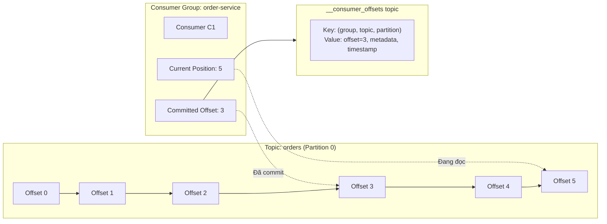

# Consumer offset commit hoạt động thế nào?

## ⚡ Tóm tắt ngắn (30s)
* **Offset** là con số đánh dấu vị trí message cuối cùng mà consumer đã đọc trong mỗi partition
* Consumer commit offset vào **internal topic `__consumer_offsets`** (50 partitions, compacted) — không phải ZooKeeper nữa
* Có 2 cách commit: **auto commit** (định kỳ, dễ mất/duplicate) và **manual commit** (kiểm soát chính xác)
* Offset commit quyết định **delivery semantics**: commit trước xử lý = at-most-once, commit sau = at-least-once
* Khi consumer restart hoặc rebalance, nó đọc offset từ `__consumer_offsets` để biết bắt đầu từ đâu

---

## 🔍 Chi tiết bản chất thực chiến

### Offset là gì và lưu ở đâu?



### Luồng hoạt động chi tiết

1. **Consumer join group** → Group Coordinator assign partitions
2. **Fetch committed offset** từ `__consumer_offsets` → biết đọc từ đâu
3. **Poll messages** → consumer đọc batch messages từ broker
4. **Xử lý messages** → business logic
5. **Commit offset** → ghi vào `__consumer_offsets` (auto hoặc manual)
6. **Nếu crash/rebalance** → consumer mới đọc committed offset → tiếp tục từ đó

### Cấu trúc __consumer_offsets topic

```
Key:   [consumer_group, topic, partition]
Value: [offset, metadata, commit_timestamp, expire_timestamp]
```

- Topic này có **50 partitions** (configurable: `offsets.topic.num.partitions`)
- **Log compaction** enabled → chỉ giữ latest offset cho mỗi key
- Partition được chọn bằng: `hash(consumer_group) % 50`
- Broker quản lý partition đó = **Group Coordinator** cho group đó

### 3 loại offset quan trọng

| Loại | Ý nghĩa |
| :--- | :--- |
| **Committed offset** | Offset cuối cùng đã commit vào `__consumer_offsets` |
| **Current position** | Offset hiện tại consumer đang đọc (trong memory) |
| **Log-end offset (LEO)** | Offset message mới nhất trong partition |
| **Consumer lag** | = LEO - Committed offset (cần monitor!) |

---

## 💻 Code thực chiến: BAD vs GOOD

### ❌ BAD: Không hiểu offset commit timing → mất message
```java
@KafkaListener(topics = "orders")
public void processOrder(List<ConsumerRecord<String, String>> records) {
    // ❌ auto.commit=true (default) → offset commit mỗi 5s
    // Nếu poll 100 records, xử lý được 50 rồi crash
    // → offset đã auto-commit cho cả 100 → 50 records còn lại MẤT

    for (ConsumerRecord<String, String> record : records) {
        orderService.process(parseOrder(record.value()));
        // ❌ Nếu crash ở record thứ 51, records 52-100 mất vĩnh viễn
    }
}

// ❌ Hoặc commit sai offset
public void badManualCommit(Consumer<String, String> consumer) {
    ConsumerRecords<String, String> records = consumer.poll(Duration.ofMillis(1000));
    // ❌ Commit TRƯỚC khi xử lý → at-most-once
    consumer.commitSync();
    processRecords(records);  // Crash ở đây = mất data
}
```

---

### ✅ GOOD: Manual commit với kiểm soát chính xác
```java
@Configuration
public class KafkaConsumerConfig {
    @Bean
    public ConcurrentKafkaListenerContainerFactory<String, String> kafkaListenerContainerFactory() {
        var factory = new ConcurrentKafkaListenerContainerFactory<String, String>();
        factory.setConsumerFactory(consumerFactory());
        // ✅ Tắt auto commit, dùng manual
        factory.getContainerProperties().setAckMode(ContainerProperties.AckMode.MANUAL_IMMEDIATE);
        // ✅ Batch listener để kiểm soát offset từng batch
        factory.setBatchListener(true);
        return factory;
    }

    @Bean
    public ConsumerFactory<String, String> consumerFactory() {
        Map<String, Object> props = new HashMap<>();
        props.put(ConsumerConfig.BOOTSTRAP_SERVERS_CONFIG, "localhost:9092");
        props.put(ConsumerConfig.GROUP_ID_CONFIG, "order-group");
        // ✅ Tắt auto commit
        props.put(ConsumerConfig.ENABLE_AUTO_COMMIT_CONFIG, false);
        // ✅ Bắt đầu từ earliest nếu chưa có committed offset
        props.put(ConsumerConfig.AUTO_OFFSET_RESET_CONFIG, "earliest");
        props.put(ConsumerConfig.MAX_POLL_RECORDS_CONFIG, 100);
        return new DefaultKafkaConsumerFactory<>(props);
    }
}

@Service
@Slf4j
public class OrderConsumer {

    // ✅ Pattern 1: Commit từng record (safe nhất, throughput thấp hơn)
    @KafkaListener(topics = "orders", groupId = "order-group")
    public void processOrder(ConsumerRecord<String, String> record, Acknowledgment ack) {
        try {
            Order order = parseOrder(record.value());
            orderService.process(order);

            // ✅ Chỉ commit SAU KHI xử lý thành công
            ack.acknowledge();
        } catch (Exception e) {
            log.error("Failed processing offset={}, partition={}",
                record.offset(), record.partition(), e);
            // ❌ KHÔNG ack → message sẽ được redelivery
            throw e;
        }
    }

    // ✅ Pattern 2: Commit theo batch (throughput cao hơn)
    @KafkaListener(topics = "orders", groupId = "order-batch-group")
    public void processBatch(List<ConsumerRecord<String, String>> records, Acknowledgment ack) {
        List<Order> orders = new ArrayList<>();
        try {
            for (ConsumerRecord<String, String> record : records) {
                orders.add(parseOrder(record.value()));
            }
            // ✅ Batch insert vào DB
            orderRepository.saveAll(orders);
            // ✅ Commit offset cho toàn bộ batch
            ack.acknowledge();
            log.info("Batch processed: {} orders", orders.size());
        } catch (Exception e) {
            log.error("Batch failed, will retry entire batch of {} records", records.size(), e);
            throw e;  // Toàn bộ batch sẽ được retry
        }
    }
}
```

---

### ✅ GOOD: Commit offset cho specific partition (advanced)
```java
// ✅ Pattern 3: Fine-grained offset commit per partition
@Service
public class AdvancedOffsetConsumer {

    @KafkaListener(topics = "events", groupId = "event-group")
    public void processWithPerPartitionCommit(
            ConsumerRecords<String, String> records,
            Consumer<String, String> consumer) {

        for (TopicPartition partition : records.partitions()) {
            List<ConsumerRecord<String, String>> partitionRecords = records.records(partition);

            for (ConsumerRecord<String, String> record : partitionRecords) {
                processRecord(record);
            }

            // ✅ Commit offset riêng cho từng partition
            long lastOffset = partitionRecords.get(partitionRecords.size() - 1).offset();
            consumer.commitSync(Map.of(
                partition, new OffsetAndMetadata(lastOffset + 1)  // +1 vì commit = next offset to read
            ));
        }
    }
}
```

---

## 📊 Bảng so sánh Commit strategies

| Tiêu chí | Auto Commit | Manual Per-Record | Manual Per-Batch | Manual Per-Partition |
| :--- | :--- | :--- | :--- | :--- |
| **Complexity** | Đơn giản | Trung bình | Trung bình | Cao |
| **Throughput** | Cao | Thấp nhất | Cao | Cao |
| **Data safety** | Thấp | Cao nhất | Trung bình | Cao |
| **Duplicate risk** | Cao | Thấp | Trung bình (cả batch retry) | Thấp |
| **Use case** | Dev/test, non-critical | Payment, critical | Log processing | Multi-partition optimization |

---

## ⚠️ Common Gotchas & Questions follow-up

### 1. Offset commit = lastOffset + 1, không phải lastOffset
* **Problem**: `commitSync(offset=5)` nghĩa là "đã xử lý đến 5, lần sau đọc từ 5" → **xử lý lại offset 5**
* **Solution**: Luôn commit `lastProcessedOffset + 1` — đây là offset **tiếp theo cần đọc**

### 2. commitSync() vs commitAsync()
* `commitSync()`: Block cho đến khi commit thành công hoặc lỗi, có retry tự động
* `commitAsync()`: Không block, nhưng không retry (vì offset cũ retry sẽ override offset mới)
* **Best practice**: Dùng `commitAsync()` trong loop, `commitSync()` trước khi close consumer

### 3. auto.offset.reset chỉ apply khi KHÔNG CÓ committed offset
* `earliest`: Đọc từ đầu partition — dùng khi không muốn mất message
* `latest`: Chỉ đọc message mới — dùng khi chỉ quan tâm real-time data
* `none`: Throw exception nếu không có committed offset
* **Gotcha**: Nếu đã có committed offset, `auto.offset.reset` **không có tác dụng**

### 4. Consumer lag monitoring
* **Consumer lag = LEO - committed offset** — metric quan trọng nhất cần monitor
* Tools: Kafka Consumer Group CLI, Burrow, Prometheus + kafka_consumer_lag metric
* Lag tăng liên tục → consumer không xử lý kịp → cần scale hoặc tối ưu

### 5. Offset retention
* Default `offsets.retention.minutes=10080` (7 ngày)
* Nếu consumer group inactive quá 7 ngày → offset bị xóa → đọc lại từ `auto.offset.reset`
* **Production tip**: Monitor inactive consumer groups, alert khi group sắp hết retention
