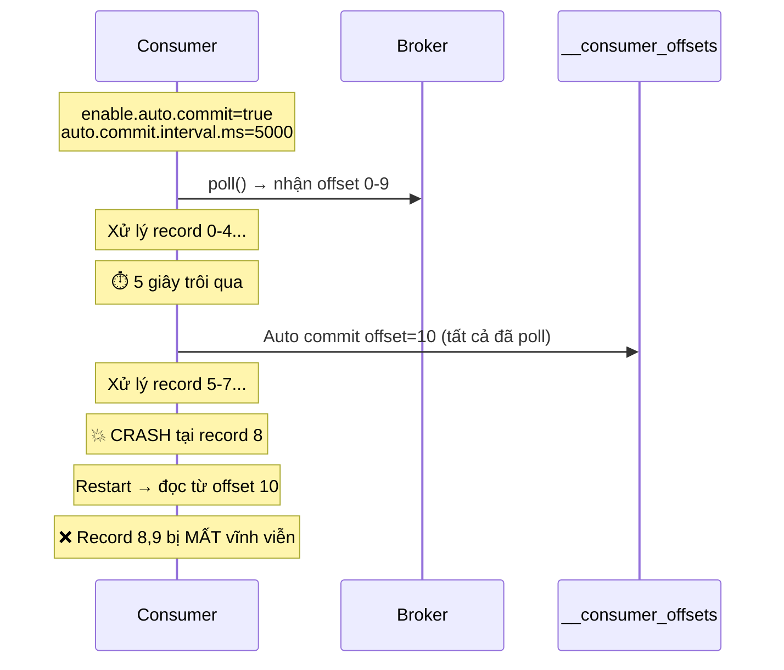
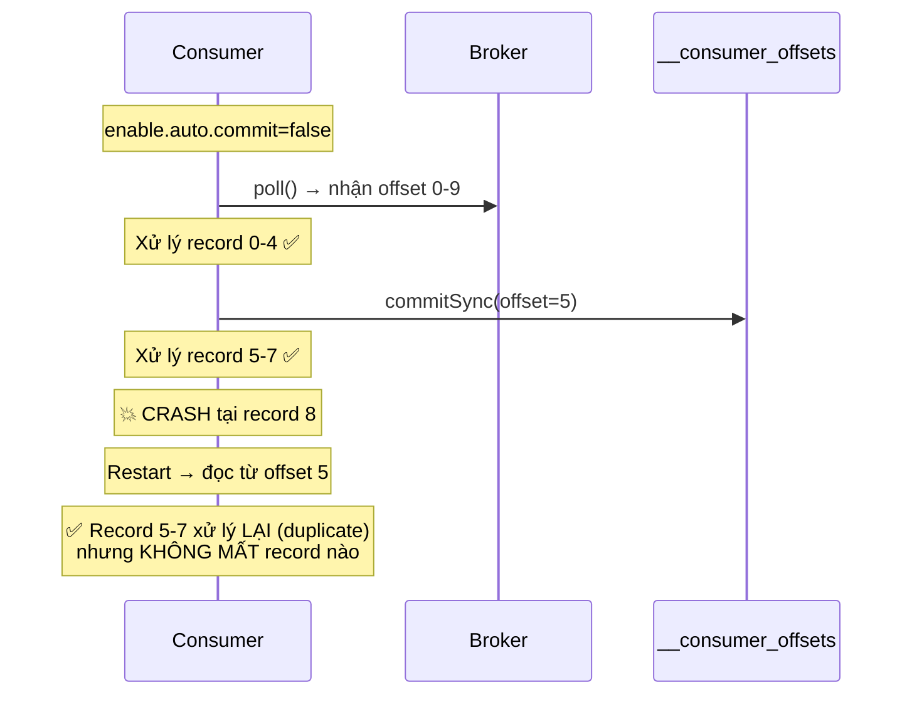

# Auto commit và manual commit khác nhau thế nào?

## ⚡ Tóm tắt ngắn (30s)
* **Auto commit**: Kafka tự động commit offset mỗi `auto.commit.interval.ms` (default 5s) — đơn giản nhưng **không kiểm soát được thời điểm commit** → dễ mất hoặc duplicate message
* **Manual commit**: Developer tự quyết định **khi nào** commit offset — kiểm soát hoàn toàn delivery semantics nhưng code phức tạp hơn
* **Rule of thumb**: Auto commit chỉ nên dùng cho non-critical data. **Production systems nên dùng manual commit**
* Spring Kafka cung cấp nhiều `AckMode` (RECORD, BATCH, MANUAL, MANUAL_IMMEDIATE) để linh hoạt chọn strategy

---

## 🔍 Chi tiết bản chất thực chiến

### Auto Commit hoạt động thế nào?



### Manual Commit hoạt động thế nào?



### Spring Kafka AckMode chi tiết

| AckMode | Mô tả | Khi nào commit? |
| :--- | :--- | :--- |
| `RECORD` | Commit sau mỗi record | Listener method return thành công |
| `BATCH` | Commit sau mỗi batch poll() | Tất cả records trong batch xử lý xong |
| `TIME` | Commit sau khoảng thời gian | Dựa trên `ackTime` config |
| `COUNT` | Commit sau N records | Dựa trên `ackCount` config |
| `COUNT_TIME` | Commit theo count HOẶC time (cái nào đến trước) | Kết hợp TIME và COUNT |
| `MANUAL` | Developer gọi `ack.acknowledge()` | Khi developer muốn, commit theo batch sau đó |
| `MANUAL_IMMEDIATE` | Developer gọi `ack.acknowledge()` | Commit **ngay lập tức** khi gọi |

---

## 💻 Code thực chiến: BAD vs GOOD

### ❌ BAD: Auto commit mặc định → mất message không biết
```java
// ❌ application.yml - sử dụng default auto commit
spring:
  kafka:
    consumer:
      group-id: payment-group
      # enable-auto-commit mặc định = true
      # auto-commit-interval = 5000ms
      auto-offset-reset: latest

@Service
public class PaymentConsumer {

    @KafkaListener(topics = "payments")
    public void process(ConsumerRecord<String, String> record) {
        // ❌ Auto commit đã chạy ngầm, offset có thể đã commit
        // trước khi method này hoàn thành

        Payment payment = parsePayment(record.value());
        paymentGateway.charge(payment);     // Gọi API external, có thể mất 2-3s
        orderService.updateStatus(payment); // ❌ Crash ở đây → payment đã charge
                                            // nhưng order chưa update, offset đã commit
                                            // → inconsistent state, KHÔNG retry
    }
}
```

---

### ✅ GOOD: Manual commit với error handling đầy đủ
```java
// ✅ application.yml
spring:
  kafka:
    consumer:
      group-id: payment-group
      enable-auto-commit: false
      auto-offset-reset: earliest
      max-poll-records: 50
      properties:
        max.poll.interval.ms: 300000  # 5 phút cho xử lý
    listener:
      ack-mode: manual_immediate

@Configuration
public class KafkaConfig {
    @Bean
    public ConcurrentKafkaListenerContainerFactory<String, String> kafkaListenerContainerFactory(
            ConsumerFactory<String, String> consumerFactory,
            KafkaTemplate<String, String> kafkaTemplate) {

        var factory = new ConcurrentKafkaListenerContainerFactory<String, String>();
        factory.setConsumerFactory(consumerFactory);
        factory.getContainerProperties().setAckMode(ContainerProperties.AckMode.MANUAL_IMMEDIATE);

        // ✅ Error handler: retry 3 lần, rồi gửi vào DLQ
        factory.setCommonErrorHandler(new DefaultErrorHandler(
            new DeadLetterPublishingRecoverer(kafkaTemplate,
                (record, ex) -> new TopicPartition(record.topic() + ".DLT", record.partition())),
            new FixedBackOff(2000L, 3)  // 2s backoff, max 3 retries
        ));

        return factory;
    }
}

@Service
@Slf4j
public class PaymentConsumer {

    @Autowired
    private PaymentRepository paymentRepository;

    @KafkaListener(topics = "payments", groupId = "payment-group")
    public void process(ConsumerRecord<String, String> record, Acknowledgment ack) {
        String paymentId = record.key();
        log.info("Processing payment: id={}, partition={}, offset={}",
                paymentId, record.partition(), record.offset());

        try {
            // ✅ Idempotent check trước
            if (paymentRepository.isProcessed(paymentId)) {
                log.warn("Payment already processed: {}", paymentId);
                ack.acknowledge();  // ✅ Skip nhưng vẫn commit offset
                return;
            }

            Payment payment = parsePayment(record.value());

            // ✅ Xử lý business logic trong DB transaction
            paymentService.processPayment(payment);

            // ✅ CHỈ commit offset sau khi MỌI THỨ thành công
            ack.acknowledge();
            log.info("Payment committed: id={}, offset={}", paymentId, record.offset());

        } catch (RetryableException e) {
            // ✅ Không ack → DefaultErrorHandler sẽ retry
            log.warn("Retryable error for payment {}: {}", paymentId, e.getMessage());
            throw e;
        } catch (Exception e) {
            // ✅ Non-retryable → sẽ vào DLQ sau max retries
            log.error("Fatal error processing payment: {}", paymentId, e);
            throw e;
        }
    }
}
```

---

### ✅ GOOD: Hybrid approach - Manual batch commit cho high throughput
```java
@Service
@Slf4j
public class EventConsumer {

    // ✅ AckMode.BATCH: Spring tự commit sau khi toàn bộ batch xử lý xong
    // Cân bằng giữa throughput và safety
    @KafkaListener(
        topics = "events",
        groupId = "event-group",
        containerFactory = "batchListenerFactory"
    )
    public void processBatch(List<ConsumerRecord<String, String>> records) {
        log.info("Received batch of {} records", records.size());

        // ✅ Batch processing: collect → bulk write → auto commit khi method return
        List<Event> events = records.stream()
                .map(r -> parseEvent(r.value()))
                .collect(Collectors.toList());

        // ✅ Bulk insert hiệu quả hơn insert từng record
        eventRepository.batchInsert(events);

        // ✅ AckMode.BATCH: offset tự commit khi method return thành công
        // Nếu throw exception → KHÔNG commit → retry toàn bộ batch
        log.info("Batch committed: {} events", events.size());
    }

    @Bean
    public ConcurrentKafkaListenerContainerFactory<String, String> batchListenerFactory(
            ConsumerFactory<String, String> cf) {
        var factory = new ConcurrentKafkaListenerContainerFactory<String, String>();
        factory.setConsumerFactory(cf);
        factory.setBatchListener(true);
        // ✅ BATCH mode: commit khi listener method hoàn thành batch
        factory.getContainerProperties().setAckMode(ContainerProperties.AckMode.BATCH);
        return factory;
    }
}
```

---

## 📊 Bảng so sánh Auto vs Manual Commit

| Tiêu chí | Auto Commit | Manual Commit (MANUAL_IMMEDIATE) | Manual Commit (BATCH) |
| :--- | :--- | :--- | :--- |
| **Config** | `enable.auto.commit=true` | `ack-mode: manual_immediate` | `ack-mode: batch` |
| **Khi nào commit** | Mỗi 5s (configurable) | Khi gọi `ack.acknowledge()` | Khi listener method return |
| **Delivery semantic** | At-most-once | At-least-once | At-least-once |
| **Mất message risk** | Cao | Rất thấp | Thấp |
| **Duplicate risk** | Thấp (vì commit trước) | Trung bình | Trung bình (batch retry) |
| **Throughput** | Cao | Thấp hơn | Cao |
| **Code complexity** | Đơn giản | Cao | Trung bình |
| **Error handling** | Khó kiểm soát | Hoàn toàn kiểm soát | Batch-level control |
| **Production suitability** | Non-critical only | Critical systems | High-throughput systems |

---

## ⚠️ Common Gotchas & Questions follow-up

### 1. Auto commit thực ra commit ở đâu trong poll() loop?
* Auto commit xảy ra **trong lần poll() tiếp theo**, không phải background thread
* Nếu consumer không gọi poll() trong `max.poll.interval.ms` → **rebalance** xảy ra
* **Gotcha**: Processing chậm → poll() lâu không gọi → auto commit không chạy → rebalance

### 2. MANUAL vs MANUAL_IMMEDIATE
* `MANUAL`: Gọi `ack.acknowledge()` chỉ **đánh dấu** offset, commit thực sự xảy ra sau khi **toàn bộ batch poll() được xử lý xong**
* `MANUAL_IMMEDIATE`: Commit **ngay lập tức** khi gọi `ack.acknowledge()`
* **Choose**: MANUAL_IMMEDIATE khi cần chính xác, MANUAL khi muốn giảm commit overhead

### 3. Tắt auto commit trong Spring Kafka
* Khi dùng `@KafkaListener`, Spring Kafka **tự động tắt** auto commit nếu set `AckMode != RECORD`
* Nhưng nên **explicit set** `enable.auto.commit=false` trong config để tránh nhầm lẫn

### 4. commitSync() bị block bao lâu?
* Default timeout: `default.api.timeout.ms=60000` (60s)
* Nếu broker chậm/down → consumer bị block 60s → có thể trigger rebalance
* **Solution**: Dùng `commitAsync()` cho performance, `commitSync()` chỉ khi close consumer

### 5. Follow-up: "Nếu manual commit mà quên gọi ack.acknowledge()?"
* Offset **không bao giờ commit** → message sẽ bị **đọc lại mãi mãi** sau mỗi rebalance/restart
* Spring Kafka sẽ log warning nếu pending ack quá nhiều
* **Detection**: Monitor consumer lag — lag không giảm dù consumer đang chạy = dấu hiệu quên commit
