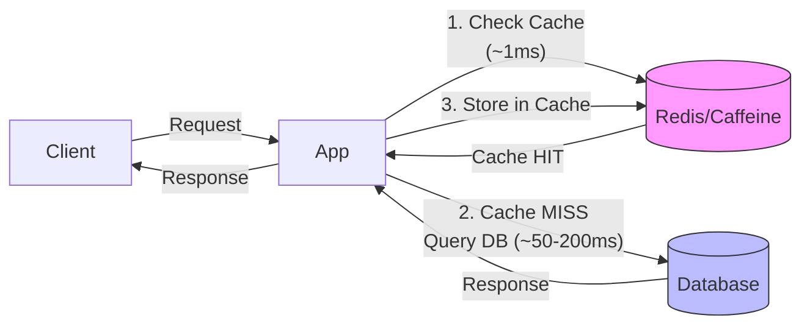

# Cache dùng để giải quyết vấn đề gì?

## ⚡ Tóm tắt ngắn (30s)
* Cache giải quyết **latency** (giảm thời gian response) và **throughput** (giảm tải cho DB/downstream service)
* Bản chất là trade **memory** lấy **speed** — lưu kết quả đã tính toán/truy vấn vào bộ nhớ nhanh hơn
* Ứng dụng thực tế: giảm DB queries lặp lại, cache API response, session storage, rate limiting counter
* Hai loại chính: **local cache** (in-process, ConcurrentHashMap, Caffeine) và **distributed cache** (Redis, Memcached)
* Cache không phải silver bullet — chỉ hiệu quả khi data có **temporal locality** (được đọc lại nhiều lần) và **chấp nhận stale data** trong khoảng thời gian nhất định

---

## 🔍 Chi tiết bản chất thực chiến

### Vấn đề cốt lõi mà Cache giải quyết

Trong production, có 3 bottleneck chính mà cache xử lý:

1. **Database Overload**: Một product page được 10K user xem cùng lúc → 10K identical SQL queries → DB chết
2. **Expensive Computation**: Tính recommendation, aggregate report mất 5s → không thể tính mỗi request
3. **Network Latency**: Gọi external API (payment gateway, 3rd party) tốn 200-500ms → cache kết quả



### Phân loại Cache theo vị trí

| Tầng | Công nghệ | Latency | Use case |
|:---|:---|:---|:---|
| Browser Cache | HTTP Cache-Control headers | 0ms | Static assets, API responses |
| CDN Cache | CloudFront, Cloudflare | 5-20ms | Images, CSS, JS, HTML pages |
| Application Cache (Local) | Caffeine, Guava, ConcurrentHashMap | < 1ms | Hot config, lookup tables |
| Distributed Cache | Redis, Memcached | 1-5ms | Session, shared state, rate limit |
| Database Cache | Query Cache, Buffer Pool | Varies | Implicit, managed by DB engine |

### Khi nào KHÔNG nên cache?

* Data thay đổi **mỗi request** (real-time stock price, live score) — cache hit rate ≈ 0%
* Data **write-heavy** hơn read — invalidation overhead > benefit
* Data có yêu cầu **strong consistency** tuyệt đối (bank balance) — stale data = bug nghiêm trọng
* Dataset quá nhỏ và DB đã đủ nhanh — thêm cache = thêm complexity vô nghĩa

---

## 💻 Code thực chiến: BAD vs GOOD

### ❌ BAD: Query DB mỗi request, không cache

```java
@Service
public class ProductService {

    @Autowired
    private ProductRepository productRepository;

    // ❌ Mỗi request đều hit DB
    // 10K concurrent users = 10K identical queries
    // DB CPU spike → slow response → cascading failure
    public Product getProduct(Long id) {
        return productRepository.findById(id)
                .orElseThrow(() -> new ProductNotFoundException(id));
    }

    // ❌ Expensive aggregation chạy mỗi lần gọi
    // Report tổng hợp mất 3-5s mỗi lần tính
    public DashboardStats getDashboardStats() {
        long totalOrders = orderRepository.countByStatus(Status.COMPLETED);
        BigDecimal totalRevenue = orderRepository.sumRevenue();
        List<TopProduct> topProducts = orderRepository.findTop10Products();
        return new DashboardStats(totalOrders, totalRevenue, topProducts);
    }
}
```

---

### ✅ GOOD: Multi-layer caching strategy với Spring Boot + Redis

```java
@Service
@Slf4j
public class ProductService {

    @Autowired
    private ProductRepository productRepository;

    @Autowired
    private RedisTemplate<String, Product> redisTemplate;

    // Caffeine local cache cho ultra-hot data (< 1ms)
    private final Cache<Long, Product> localCache = Caffeine.newBuilder()
            .maximumSize(1_000)
            .expireAfterWrite(Duration.ofSeconds(30))  // Short TTL, local chỉ để giảm Redis calls
            .recordStats()                              // Monitor hit rate
            .build();

    // ✅ Two-level cache: Local → Redis → DB
    public Product getProduct(Long id) {
        // Level 1: Local cache (sub-millisecond)
        Product product = localCache.getIfPresent(id);
        if (product != null) {
            log.debug("L1 cache hit for product {}", id);
            return product;
        }

        // Level 2: Redis (1-5ms, shared across instances)
        String cacheKey = "product:" + id;
        product = redisTemplate.opsForValue().get(cacheKey);
        if (product != null) {
            log.debug("L2 cache hit for product {}", id);
            localCache.put(id, product);  // Backfill L1
            return product;
        }

        // Level 3: Database (50-200ms)
        log.debug("Cache miss for product {}, querying DB", id);
        product = productRepository.findById(id)
                .orElseThrow(() -> new ProductNotFoundException(id));

        // Populate both cache levels
        redisTemplate.opsForValue().set(cacheKey, product, Duration.ofMinutes(10));
        localCache.put(id, product);

        return product;
    }

    // ✅ Cache expensive computation với Spring @Cacheable
    @Cacheable(value = "dashboard-stats", key = "'daily'",
               unless = "#result == null")
    public DashboardStats getDashboardStats() {
        log.info("Computing dashboard stats (expensive operation)");
        long totalOrders = orderRepository.countByStatus(Status.COMPLETED);
        BigDecimal totalRevenue = orderRepository.sumRevenue();
        List<TopProduct> topProducts = orderRepository.findTop10Products();
        return new DashboardStats(totalOrders, totalRevenue, topProducts);
    }

    // ✅ Invalidate khi data thay đổi
    @CacheEvict(value = "dashboard-stats", allEntries = true)
    @Transactional
    public Product updateProduct(Long id, ProductUpdateRequest request) {
        Product product = productRepository.findById(id)
                .orElseThrow(() -> new ProductNotFoundException(id));
        product.update(request);
        Product saved = productRepository.save(product);

        // Invalidate cả 2 tầng cache
        String cacheKey = "product:" + id;
        redisTemplate.delete(cacheKey);
        localCache.invalidate(id);

        return saved;
    }
}
```

---

## 📊 Bảng so sánh Local Cache vs Distributed Cache

| Tiêu chí | Local Cache (Caffeine) | Distributed Cache (Redis) |
|:---|:---|:---|
| **Latency** | < 1ms (in-process) | 1-5ms (network hop) |
| **Capacity** | Giới hạn bởi JVM heap | Scale independently (TB+) |
| **Consistency** | Mỗi instance có bản riêng | Shared, single source of truth |
| **Failure impact** | Mất khi restart, nhưng isolated | Single point of failure nếu không HA |
| **Use case** | Hot config, lookup table, L1 cache | Session, shared state, cross-instance |
| **Serialization** | Không cần (object reference) | Cần serialize/deserialize (overhead) |
| **Eviction** | LRU/LFU in-process | LRU + TTL, configurable policies |
| **Monitoring** | Micrometer + Caffeine stats | Redis INFO, Grafana dashboards |

---

## ⚠️ Common Gotchas & Questions follow-up

### 1. Cache Stampede (Thundering Herd)
* **Problem**: TTL hết hạn → 1000 requests cùng lúc miss cache → 1000 DB queries đồng thời
* **Hậu quả**: DB bị spike load, có thể crash
* **Solution**: Sử dụng **lock/singleflight pattern** — chỉ 1 request query DB, các request khác đợi kết quả

### 2. Cache Warming
* **Problem**: Deploy instance mới, cache trống → tất cả request đều miss → DB overload
* **Solution**: Pre-warm cache khi startup bằng cách load hot data từ DB hoặc từ instance khác

### 3. Memory Pressure
* **Problem**: Cache quá nhiều data → OOM (local cache) hoặc tốn tiền (Redis)
* **Solution**: Set `maximumSize` cho local cache, `maxmemory-policy` cho Redis (recommend `allkeys-lfu`)

### 4. Serialization Overhead
* **Problem**: Object phức tạp serialize/deserialize tốn CPU, đặc biệt với Java default serialization
* **Solution**: Dùng Jackson JSON hoặc Protobuf/Kryo cho Redis serializer — nhanh hơn 5-10x so với JDK serialization

### 5. "Cache giải quyết được bao nhiêu % performance issue?"
* Phụ thuộc vào **cache hit rate** — target tối thiểu 80%, ideal > 95%
* Công thức: `Effective Latency = (Hit Rate × Cache Latency) + (Miss Rate × DB Latency)`
* Ví dụ: 95% hit rate, cache 2ms, DB 100ms → Effective = 0.95 × 2 + 0.05 × 100 = **6.9ms** (thay vì 100ms)
