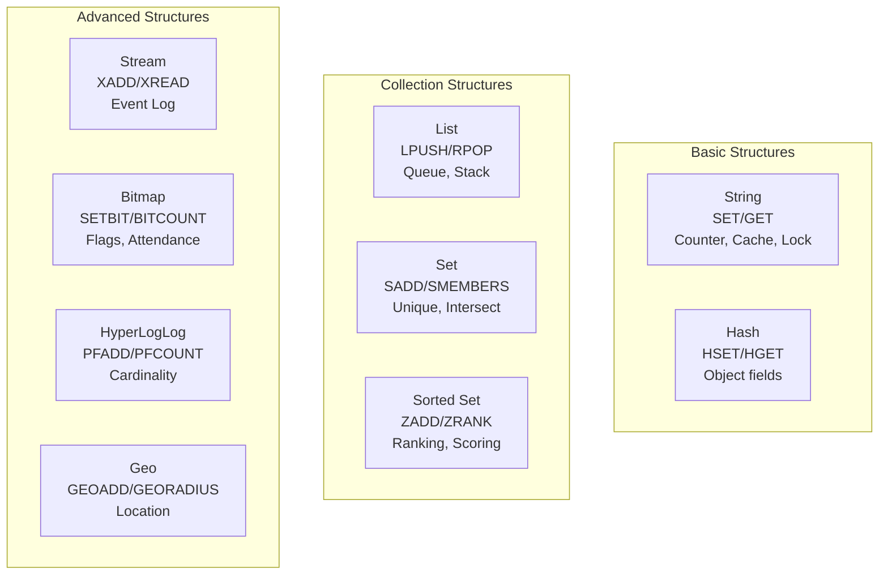

# Redis data structures phổ biến

## ⚡ Tóm tắt ngắn (30s)
* Redis có **10+ data structures**, nhưng 6 cái core cần nắm: **String, Hash, List, Set, Sorted Set, Stream**.
* **String**: Cache đơn giản, counter, distributed lock. Key-value cơ bản nhất.
* **Hash**: Object caching (user profile), partial update fields mà không cần serialize/deserialize toàn bộ object.
* **List**: Message queue (LPUSH/BRPOP), recent activity feed, task queue.
* **Set**: Unique collection, intersection/union operations — mutual friends, tags.
* **Sorted Set (ZSet)**: Leaderboard, rate limiting sliding window, delayed queue.
* **Stream**: Event sourcing, consumer groups — lightweight alternative cho Kafka.
* Senior cần biết **khi nào dùng structure nào** và **internal encoding** ảnh hưởng performance.

---

## 🔍 Chi tiết bản chất thực chiến

### Kiến trúc tổng quan



### Internal Encoding — Tại sao quan trọng?

Redis tự động chọn encoding tối ưu dựa trên kích thước data:

| Structure | Small Data Encoding | Large Data Encoding | Ngưỡng chuyển |
| :--- | :--- | :--- | :--- |
| String | `int` / `embstr` | `raw` | 44 bytes |
| Hash | `listpack` | `hashtable` | 128 fields hoặc 64B/field |
| List | `listpack` | `quicklist` | 128 elements hoặc 64B/elem |
| Set | `listpack` | `hashtable` | 128 elements |
| Sorted Set | `listpack` | `skiplist + hashtable` | 128 elements hoặc 64B/elem |

→ Khi data nhỏ, Redis dùng encoding compact hơn → tiết kiệm memory đáng kể.

---

## 💻 Code thực chiến: BAD vs GOOD

### ❌ BAD: Dùng String cho mọi thứ — serialize cả object

```java
@Service
public class UserCacheService {
    @Autowired private StringRedisTemplate redis;

    // ❌ Serialize toàn bộ object thành JSON string
    public void cacheUser(User user) {
        String key = "user:" + user.getId();
        redis.opsForValue().set(key, objectMapper.writeValueAsString(user),
            1, TimeUnit.HOURS);
    }

    // ❌ Khi chỉ cần update 1 field (email), phải:
    // 1. GET toàn bộ JSON
    // 2. Deserialize
    // 3. Update field
    // 4. Serialize lại
    // 5. SET lại toàn bộ
    // → Bandwidth waste + race condition khi concurrent update
    public void updateEmail(Long userId, String newEmail) {
        String key = "user:" + userId;
        String json = redis.opsForValue().get(key);
        User user = objectMapper.readValue(json, User.class);
        user.setEmail(newEmail);
        redis.opsForValue().set(key, objectMapper.writeValueAsString(user),
            1, TimeUnit.HOURS);
    }
}
```

---

### ✅ GOOD: Dùng Hash cho object — partial update, tiết kiệm bandwidth

```java
@Service
public class UserCacheService {
    @Autowired private HashOperations<String, String, String> hashOps;
    @Autowired private StringRedisTemplate redis;

    // ✅ Hash: mỗi field của object = 1 hash field
    public void cacheUser(User user) {
        String key = "user:" + user.getId();
        Map<String, String> fields = Map.of(
            "name", user.getName(),
            "email", user.getEmail(),
            "role", user.getRole().name(),
            "lastLogin", user.getLastLogin().toString()
        );
        hashOps.putAll(key, fields);
        redis.expire(key, 1, TimeUnit.HOURS);
    }

    // ✅ Chỉ update 1 field — O(1), không cần đọc toàn bộ object
    public void updateEmail(Long userId, String newEmail) {
        hashOps.put("user:" + userId, "email", newEmail);
    }

    // ✅ Chỉ đọc fields cần thiết
    public String getUserEmail(Long userId) {
        return hashOps.get("user:" + userId, "email");
    }

    // ✅ Đọc toàn bộ object khi cần
    public User getUser(Long userId) {
        Map<String, String> fields = hashOps.entries("user:" + userId);
        if (fields.isEmpty()) return null;
        return mapToUser(fields);
    }
}
```

---

### ✅ GOOD: List cho Task Queue + Set cho Unique Tags + ZSet cho Ranking

```java
@Service
@Slf4j
public class RedisDataStructureExamples {
    @Autowired private StringRedisTemplate redis;

    // ═══════════════════════════════════════════
    // ✅ LIST: Simple task queue (producer-consumer)
    // ═══════════════════════════════════════════
    public void enqueueTask(String task) {
        redis.opsForList().leftPush("queue:tasks", task);  // LPUSH
    }

    public String dequeueTask() {
        // BRPOP: blocking pop — consumer chờ cho đến khi có task
        return redis.opsForList().rightPop("queue:tasks",
            30, TimeUnit.SECONDS);
    }

    // Lấy recent N items (activity feed)
    public List<String> getRecentActivities(int n) {
        return redis.opsForList().range("feed:activities", 0, n - 1);
    }

    // ═══════════════════════════════════════════
    // ✅ SET: Unique tags + intersection operations
    // ═══════════════════════════════════════════
    public void addUserInterests(Long userId, String... interests) {
        redis.opsForSet().add("interests:" + userId, interests);
    }

    // Mutual interests giữa 2 users — SINTER O(N*M)
    public Set<String> getMutualInterests(Long user1, Long user2) {
        return redis.opsForSet().intersect(
            "interests:" + user1, "interests:" + user2);
    }

    // Kiểm tra đã like chưa — SISMEMBER O(1)
    public boolean hasLiked(Long userId, Long postId) {
        return Boolean.TRUE.equals(
            redis.opsForSet().isMember("likes:" + postId,
                userId.toString()));
    }

    // ═══════════════════════════════════════════
    // ✅ SORTED SET: Leaderboard + Delayed Queue
    // ═══════════════════════════════════════════
    public void addToLeaderboard(String player, double score) {
        redis.opsForZSet().add("leaderboard", player, score);
    }

    public Set<String> getTopPlayers(int n) {
        return redis.opsForZSet().reverseRange("leaderboard", 0, n - 1);
    }

    // ✅ Delayed queue — schedule task at future timestamp
    public void scheduleTask(String taskId, Instant executeAt) {
        redis.opsForZSet().add("delayed:tasks",
            taskId, executeAt.toEpochMilli());
    }

    public List<String> pollDueTasks() {
        long now = System.currentTimeMillis();
        Set<String> dueTasks = redis.opsForZSet()
            .rangeByScore("delayed:tasks", 0, now);
        if (dueTasks != null && !dueTasks.isEmpty()) {
            redis.opsForZSet().removeRangeByScore("delayed:tasks", 0, now);
        }
        return dueTasks != null ? new ArrayList<>(dueTasks) : List.of();
    }

    // ═══════════════════════════════════════════
    // ✅ BITMAP: Daily check-in / Feature flags
    // ═══════════════════════════════════════════
    public void checkIn(Long userId, int dayOfYear) {
        redis.opsForValue().setBit("checkin:" + userId, dayOfYear, true);
    }

    public long getCheckInCount(Long userId) {
        // BITCOUNT — đếm số ngày đã check-in trong năm
        return redis.execute((RedisCallback<Long>) conn ->
            conn.stringCommands().bitCount(
                ("checkin:" + userId).getBytes()));
    }

    // ═══════════════════════════════════════════
    // ✅ HYPERLOGLOG: Approximate unique count
    // ═══════════════════════════════════════════
    public void trackPageView(String pageId, String visitorId) {
        // PFADD — thêm vào HyperLogLog (12KB fixed memory)
        redis.opsForHyperLogLog().add("pageviews:" + pageId, visitorId);
    }

    public long getUniqueVisitors(String pageId) {
        // PFCOUNT — ước tính số unique visitors (sai số ~0.81%)
        return redis.opsForHyperLogLog().size("pageviews:" + pageId);
    }
}
```

---

## 📊 Bảng chọn Data Structure theo Use Case

| Use Case | Data Structure | Tại sao? | Operations |
| :--- | :--- | :--- | :--- |
| Cache object | Hash | Partial read/update fields | HSET, HGET, HDEL |
| Simple cache | String | Key-value đơn giản | SET, GET, EXPIRE |
| Counter | String | Atomic increment | INCR, INCRBY |
| Distributed lock | String | SETNX atomic | SET NX EX |
| Task queue | List | FIFO with blocking pop | LPUSH, BRPOP |
| Activity feed | List | Ordered by time, capped | LPUSH, LTRIM, LRANGE |
| Tags / Likes | Set | Unique + set operations | SADD, SISMEMBER, SINTER |
| Leaderboard | Sorted Set | Scored + ranked | ZADD, ZRANK, ZRANGE |
| Rate limiting | Sorted Set | Sliding window by score | ZADD, ZREMRANGEBYSCORE |
| Event log | Stream | Persistent + consumer groups | XADD, XREADGROUP |
| Attendance | Bitmap | 1 bit per day per user | SETBIT, BITCOUNT |
| Unique visitors | HyperLogLog | Approximate count, 12KB | PFADD, PFCOUNT |
| Nearby search | Geo | Geospatial index | GEOADD, GEORADIUS |

---

## ⚠️ Common Gotchas & Questions follow-up

### 1. Hash vs String cho object caching?
* **Hash** tốt khi cần partial read/update (user profile: chỉ GET email)
* **String** tốt khi luôn read/write toàn bộ object và object nhỏ (< 200 bytes)
* **Memory**: Nhiều small Hash keys dùng `listpack` encoding → compact hơn nhiều String keys

### 2. List không phải reliable queue
* `RPOP` không guarantee delivery — nếu consumer crash sau pop, message mất
* **Giải pháp**: Dùng `RPOPLPUSH` (move to processing list) hoặc Redis Stream với ACK

### 3. Sorted Set memory khi scale
* Mỗi member trong ZSet chiếm ~80 bytes overhead (skiplist node + hashtable entry)
* 10 triệu members ≈ 800MB → cân nhắc partition (daily/weekly leaderboard)

### 4. HyperLogLog không thể list elements
* PFCOUNT chỉ trả **số lượng ước tính**, không thể biết cụ thể elements nào
* Nếu cần list unique visitors → dùng Set (nhưng memory nhiều hơn rất nhiều)

### 5. Key naming convention best practice
* Format: `<service>:<entity>:<id>:<field>` → VD: `order-svc:user:123:cart`
* Dùng `:` separator (Redis convention), tránh key quá dài (> 1KB)
* Luôn set TTL — tránh memory leak từ orphaned keys
