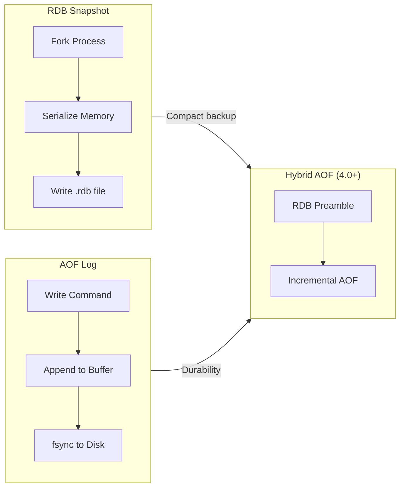

# Redis persistence RDB và AOF khác nhau thế nào?

## ⚡ Tóm tắt ngắn (30s)
* **RDB (Redis Database)**: snapshot toàn bộ dataset tại một thời điểm, ghi ra file `.rdb` — compact, khởi động nhanh nhưng có thể **mất dữ liệu** giữa 2 lần snapshot
* **AOF (Append Only File)**: ghi log mọi write command — durability cao hơn nhưng file **lớn hơn** và recovery chậm hơn
* Production thường **bật cả hai**: AOF cho durability, RDB cho backup/disaster recovery
* Từ Redis 7+, AOF hỗ trợ **Multi-Part AOF** giúp rewrite an toàn hơn

---

## 🔍 Chi tiết bản chất thực chiến

### Cơ chế RDB (Snapshotting)
- Redis fork child process để serialize toàn bộ in-memory dataset ra file binary `.rdb`
- Trigger bằng config `save <seconds> <changes>` hoặc command `BGSAVE`
- File RDB rất **compact**, phù hợp backup định kỳ, transfer sang replica
- Nhược điểm: nếu Redis crash giữa 2 snapshot → **mất toàn bộ write** trong khoảng đó (có thể vài phút)

### Cơ chế AOF (Append Only File)
- Mỗi write command được append vào file log
- 3 mức `fsync`: `always` (mỗi command), `everysec` (mỗi giây — **recommended**), `no` (OS quyết định)
- File AOF lớn dần → Redis tự động **rewrite** (nén lại thành tập command tối thiểu để tái tạo dataset)
- Recovery: Redis replay lại toàn bộ AOF file khi restart

### Hybrid Persistence (Redis 4.0+)
- Config `aof-use-rdb-preamble yes` → AOF file bắt đầu bằng RDB snapshot, sau đó append incremental commands
- Kết hợp **ưu điểm cả hai**: startup nhanh (RDB) + durability cao (AOF)



---

## 💻 Code thực chiến: BAD vs GOOD

### ❌ BAD: Chỉ dùng RDB với interval quá dài, không monitor
```java
// application.yml — chỉ dùng RDB, mất data khi crash
// spring.data.redis.host=localhost
// Redis config: save 900 1 (15 phút mới snapshot 1 lần!)

@Service
public class OrderCacheService {

    @Autowired
    private StringRedisTemplate redisTemplate;

    // Ghi order vào Redis mà KHÔNG có fallback persistence
    public void cacheOrder(String orderId, String orderJson) {
        redisTemplate.opsForValue().set("order:" + orderId, orderJson);
        // Nếu Redis crash → mất toàn bộ order trong 15 phút gần nhất
        // Không có cơ chế recovery hay alert
    }
}
```

---

### ✅ GOOD: Bật Hybrid AOF + health check + fallback
```java
// Redis config (redis.conf):
// appendonly yes
// appendfsync everysec
// aof-use-rdb-preamble yes
// save 3600 1 (RDB backup mỗi giờ cho disaster recovery)

@Configuration
public class RedisHealthConfig {

    @Bean
    public HealthIndicator redisBackupHealthIndicator(
            StringRedisTemplate redisTemplate) {
        return () -> {
            try {
                // Kiểm tra last save time của RDB
                Properties info = redisTemplate.getRequiredConnectionFactory()
                    .getConnection().serverCommands().info("persistence");
                String lastSave = info.getProperty("rdb_last_save_time");
                long lastSaveEpoch = Long.parseLong(lastSave);
                long minutesSinceLastSave =
                    (System.currentTimeMillis() / 1000 - lastSaveEpoch) / 60;

                if (minutesSinceLastSave > 120) {
                    return Health.down()
                        .withDetail("minutesSinceLastRdbSave", minutesSinceLastSave)
                        .build();
                }

                // Kiểm tra AOF status
                String aofEnabled = info.getProperty("aof_enabled");
                if (!"1".equals(aofEnabled)) {
                    return Health.down()
                        .withDetail("reason", "AOF is disabled!")
                        .build();
                }

                return Health.up()
                    .withDetail("lastRdbSaveMinutesAgo", minutesSinceLastSave)
                    .withDetail("aofEnabled", true)
                    .build();
            } catch (Exception e) {
                return Health.down(e).build();
            }
        };
    }
}

@Service
@Slf4j
public class OrderCacheService {

    @Autowired
    private StringRedisTemplate redisTemplate;

    @Autowired
    private OrderRepository orderRepository; // DB fallback

    public void cacheOrder(String orderId, String orderJson) {
        // Write-through: ghi DB trước, cache sau
        orderRepository.save(parseOrder(orderJson));
        redisTemplate.opsForValue().set("order:" + orderId, orderJson,
            Duration.ofHours(24));
        log.info("Order {} cached with AOF+RDB persistence", orderId);
    }
}
```

---

## 📊 Bảng so sánh RDB vs AOF

| Tiêu chí | RDB | AOF | Hybrid (RDB + AOF) |
| :--- | :--- | :--- | :--- |
| **Durability** | Thấp (mất data giữa snapshots) | Cao (tối đa mất 1s với `everysec`) | Cao nhất |
| **File size** | Rất compact | Lớn hơn nhiều | Trung bình |
| **Startup speed** | Rất nhanh (binary load) | Chậm (replay commands) | Nhanh (RDB preamble) |
| **Write performance** | Không ảnh hưởng (fork riêng) | `always` giảm throughput | Như AOF everysec |
| **Fork overhead** | Có (copy-on-write memory) | Có khi rewrite | Có khi rewrite |
| **Backup friendly** | Rất tốt (single file) | Khó (file đang append) | Tốt |
| **Recovery precision** | Thấp | Cao | Cao |

---

## ⚠️ Common Gotchas & Questions follow-up

### 1. Fork bomb khi dataset quá lớn
* **Problem**: RDB/AOF rewrite đều fork child process → nếu dataset 20GB, fork có thể dùng thêm 20GB memory (copy-on-write worst case)
* **Consequence**: OOM killer terminate Redis
* **Solution**: Set `vm.overcommit_memory = 1`, monitor memory, dùng `maxmemory` config, tránh chạy RDB snapshot khi peak load

### 2. AOF rewrite loop
* **Problem**: Nếu write rate quá cao, AOF rewrite liên tục bị trigger nhưng không kịp hoàn thành
* **Consequence**: CPU/IO liên tục cao, latency tăng
* **Solution**: Tune `auto-aof-rewrite-percentage` và `auto-aof-rewrite-min-size`, monitor `aof_rewrite_in_progress`

### 3. RDB file corruption khi SIGKILL
* **Problem**: Nếu kill -9 Redis đúng lúc đang ghi RDB → file `.rdb` corrupt
* **Consequence**: Redis không start được
* **Solution**: Redis ghi ra temp file rồi atomic rename, nhưng nên có backup script copy `.rdb` file định kỳ sang remote storage

### 4. Interview follow-up: "Khi nào chỉ dùng RDB, không cần AOF?"
* Cache-only use case: data có thể rebuild từ DB, mất data chấp nhận được
* Analytics/reporting cache: data tính lại được
* Dev/staging environment

### 5. Interview follow-up: "Redis Cluster có gì khác về persistence?"
* Mỗi node trong cluster có persistence riêng (RDB + AOF)
* Khi node fail, cluster sẽ failover sang replica → replica cũng phải bật persistence
* Cần đảm bảo **tất cả nodes** config persistence giống nhau
