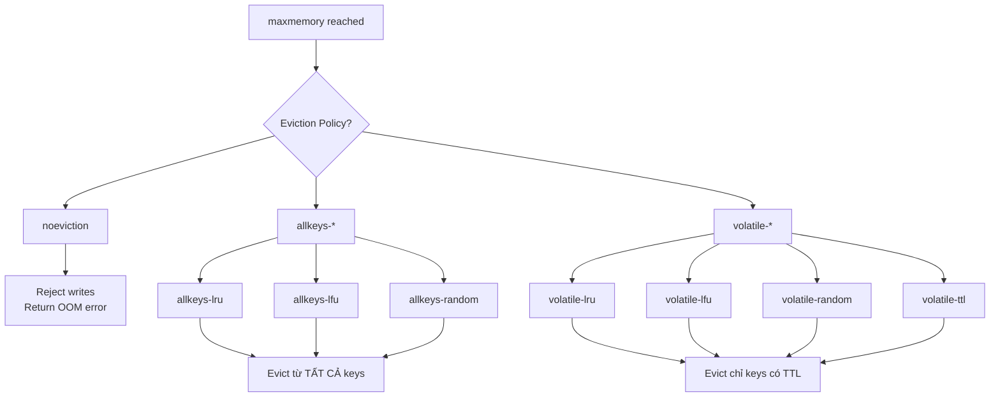

# Redis eviction policy là gì?

## ⚡ Tóm tắt ngắn (30s)
* Eviction policy quyết định Redis **xoá key nào** khi memory đạt `maxmemory` limit
* 8 policy chính: `noeviction`, `allkeys-lru`, `volatile-lru`, `allkeys-lfu`, `volatile-lfu`, `allkeys-random`, `volatile-random`, `volatile-ttl`
* Production phổ biến nhất: **`allkeys-lru`** (cache thuần) hoặc **`volatile-lfu`** (mix cache + persistent data)
* Từ Redis 4.0+, **LFU** (Least Frequently Used) chính xác hơn LRU cho nhiều workload thực tế
* Phải set `maxmemory` — nếu không Redis sẽ dùng hết RAM và bị OOM kill

---

## 🔍 Chi tiết bản chất thực chiến

### Tại sao cần Eviction Policy?
Redis là in-memory store → memory có hạn. Khi dataset vượt `maxmemory`, Redis phải chọn: **từ chối write mới** hoặc **xoá key cũ** để nhường chỗ.

### Phân loại Eviction Policy



### Chi tiết từng policy

| Policy | Scope | Thuật toán | Use case |
| :--- | :--- | :--- | :--- |
| `noeviction` | N/A | Không xoá, trả error | Message queue, data không được mất |
| `allkeys-lru` | Tất cả keys | Least Recently Used | **Cache thuần** — mọi key đều expendable |
| `allkeys-lfu` | Tất cả keys | Least Frequently Used | Cache với hot/cold data rõ ràng |
| `allkeys-random` | Tất cả keys | Random | Workload uniform access |
| `volatile-lru` | Keys có TTL | LRU | Mix persistent + cache data |
| `volatile-lfu` | Keys có TTL | LFU | Mix persistent + cache, hot data |
| `volatile-random` | Keys có TTL | Random | Mix persistent + cache, uniform |
| `volatile-ttl` | Keys có TTL | TTL ngắn nhất bị xoá trước | Expire sớm nhất đi trước |

### LRU vs LFU — Bản chất khác biệt
- **LRU**: key nào lâu nhất chưa được access → bị xoá. Approximated LRU (sample 5 keys, chọn oldest)
- **LFU**: key nào ít được access nhất → bị xoá. Dùng **Morris counter** (logarithmic counter) + **decay time**
- LFU tốt hơn khi có **scan pattern** (full scan qua nhiều key 1 lần → LRU giữ lại key scan, xoá hot key!)

---

## 💻 Code thực chiến: BAD vs GOOD

### ❌ BAD: Không set maxmemory, không chọn eviction policy
```java
// application.yml — KHÔNG config maxmemory
// spring:
//   data:
//     redis:
//       host: localhost
//       port: 6379

@Service
public class ProductCacheService {

    @Autowired
    private StringRedisTemplate redisTemplate;

    // Cứ cache vô tội vạ, không TTL, không maxmemory
    public void cacheProduct(String productId, String json) {
        redisTemplate.opsForValue().set("product:" + productId, json);
        // Hậu quả:
        // 1. Redis dùng hết RAM → OOM killer
        // 2. Hoặc swap → latency tăng 100x
        // 3. Tất cả service depend Redis đều chết theo
    }

    // Cache list không giới hạn size
    public void addToRecentViewed(String userId, String productId) {
        redisTemplate.opsForList().leftPush("recent:" + userId, productId);
        // List này grow vô hạn cho mỗi user!
    }
}
```

---

### ✅ GOOD: Config maxmemory + eviction + TTL strategy
```java
// Redis config (redis.conf hoặc CONFIG SET):
// maxmemory 2gb
// maxmemory-policy allkeys-lfu
// maxmemory-samples 10 (tăng accuracy cho LFU/LRU sampling)

// application.yml
// spring:
//   data:
//     redis:
//       host: localhost
//       port: 6379

@Configuration
public class RedisConfig {

    @Bean
    public RedisCacheManager cacheManager(
            RedisConnectionFactory connectionFactory) {
        // Cấu hình TTL mặc định cho tất cả cache
        RedisCacheConfiguration defaultConfig = RedisCacheConfiguration
            .defaultCacheConfig()
            .entryTtl(Duration.ofMinutes(30))
            .serializeValuesWith(
                SerializationPair.fromSerializer(
                    new GenericJackson2JsonRedisSerializer()));

        // TTL riêng cho từng cache theo tính chất data
        Map<String, RedisCacheConfiguration> cacheConfigs = Map.of(
            "products", defaultConfig.entryTtl(Duration.ofHours(2)),
            "user-sessions", defaultConfig.entryTtl(Duration.ofHours(24)),
            "hot-deals", defaultConfig.entryTtl(Duration.ofMinutes(5))
        );

        return RedisCacheManager.builder(connectionFactory)
            .cacheDefaults(defaultConfig)
            .withInitialCacheConfigurations(cacheConfigs)
            .build();
    }
}

@Service
@Slf4j
public class ProductCacheService {

    @Autowired
    private StringRedisTemplate redisTemplate;

    @Cacheable(value = "products", key = "#productId")
    public Product getProduct(String productId) {
        // Spring Cache tự quản lý TTL theo config ở trên
        return productRepository.findById(productId).orElseThrow();
    }

    public void addToRecentViewed(String userId, String productId) {
        String key = "recent:" + userId;
        redisTemplate.opsForList().leftPush(key, productId);
        redisTemplate.opsForList().trim(key, 0, 49); // Giới hạn 50 items
        redisTemplate.expire(key, Duration.ofDays(7)); // TTL 7 ngày
    }
}

// Monitor eviction metrics
@Component
@Slf4j
public class RedisEvictionMonitor {

    @Autowired
    private StringRedisTemplate redisTemplate;

    @Scheduled(fixedRate = 60_000) // mỗi phút
    public void checkEvictionStats() {
        Properties info = redisTemplate.getRequiredConnectionFactory()
            .getConnection().serverCommands().info("stats");
        String evictedKeys = info.getProperty("evicted_keys");
        log.info("Total evicted keys: {}", evictedKeys);

        Properties memory = redisTemplate.getRequiredConnectionFactory()
            .getConnection().serverCommands().info("memory");
        String usedMemory = memory.getProperty("used_memory_human");
        String maxMemory = memory.getProperty("maxmemory_human");
        log.info("Memory usage: {} / {}", usedMemory, maxMemory);
    }
}
```

---

## 📊 Bảng so sánh LRU vs LFU

| Tiêu chí | LRU (Least Recently Used) | LFU (Least Frequently Used) |
| :--- | :--- | :--- |
| **Metric** | Thời gian access gần nhất | Tần suất access |
| **Scan resistance** | ❌ Kém (scan đẩy hot key ra) | ✅ Tốt |
| **Memory overhead** | Thấp (24-bit clock) | Thấp (8-bit counter + 16-bit decay) |
| **New key** | Được ưu tiên (mới access) | Bất lợi (frequency = 5 ban đầu) |
| **Warm-up** | Nhanh | Cần thời gian tích luỹ frequency |
| **Config tune** | `maxmemory-samples` | `lfu-log-factor`, `lfu-decay-time` |
| **Best for** | General cache | Hot/cold phân biệt rõ |

---

## ⚠️ Common Gotchas & Questions follow-up

### 1. volatile-* policy nhưng không key nào có TTL
* **Problem**: Chọn `volatile-lru` nhưng tất cả key đều SET không có EXPIRE
* **Consequence**: Redis KHÔNG evict được gì → hoạt động như `noeviction` → OOM error
* **Solution**: Đảm bảo mọi cache key đều có TTL, hoặc dùng `allkeys-*`

### 2. LRU approximation không chính xác 100%
* **Problem**: Redis dùng sampling (mặc định 5 keys) để chọn LRU, không phải exact LRU
* **Consequence**: Đôi khi evict key không phải "cũ nhất thật sự"
* **Solution**: Tăng `maxmemory-samples` lên 10-15 (trade-off CPU), Redis 3.0+ đã cải thiện đáng kể

### 3. Thundering herd sau eviction
* **Problem**: Hot key bị evict → hàng trăm request đồng thời miss cache → stampede vào DB
* **Consequence**: DB quá tải, cascading failure
* **Solution**: Sử dụng cache locking (singleflight pattern), set TTL jitter, hoặc proactive refresh trước khi expire

### 4. Interview follow-up: "Làm sao biết nên chọn policy nào?"
* Phân tích access pattern: `redis-cli --hotkeys` (LFU mode)
* Monitor `evicted_keys` metric — nếu eviction rate cao → tăng memory hoặc giảm TTL
* Rule of thumb: cache thuần → `allkeys-lfu`, mix data → `volatile-lfu`
