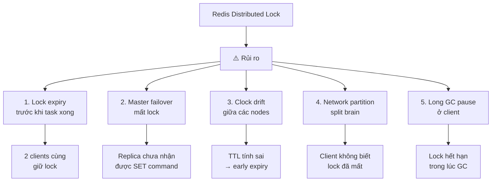

# Distributed lock bằng Redis có rủi ro gì?

## ⚡ Tóm tắt ngắn (30s)
* Redis distributed lock dùng `SET key value NX PX ttl` — đơn giản nhưng có **nhiều rủi ro nghiêm trọng**
* **Clock drift**: TTL hết trước khi task hoàn thành → 2 client cùng giữ lock
* **Single point of failure**: Redis master crash → lock bị mất khi failover sang replica
* **Split brain**: Network partition khiến nhiều client nghĩ mình giữ lock
* **Fencing token**: thiếu mechanism đảm bảo mutual exclusion tuyệt đối
* Giải pháp: dùng **Redlock** (multi-node), hoặc **ZooKeeper/etcd** khi cần strong consistency

---

## 🔍 Chi tiết bản chất thực chiến

### Cơ chế cơ bản của Redis Lock
```
SET resource_lock <unique_value> NX PX 30000
```
- `NX`: chỉ set nếu key chưa tồn tại (mutual exclusion)
- `PX 30000`: auto-expire sau 30s (tránh deadlock nếu holder crash)
- Unlock: dùng Lua script để đảm bảo chỉ owner mới xoá được lock

### Các rủi ro chính



### Rủi ro 1: Lock expiry trước khi task hoàn thành
- Client A acquire lock với TTL 30s → task chạy 35s → lock hết hạn
- Client B acquire lock thành công → **2 client cùng chạy critical section**
- Giải pháp: lock renewal (watchdog), nhưng thêm complexity

### Rủi ro 2: Master failover (quan trọng nhất)
- Client A `SET lock NX` trên master thành công
- Master crash **trước khi replicate** command sang replica
- Replica được promote → không có key lock
- Client B `SET lock NX` thành công → **2 client cùng giữ lock**

### Rủi ro 3: GC Pause (Java specific)
- Client A acquire lock → JVM vào Full GC 20s → lock hết hạn
- Client B acquire lock → Client A GC xong, tiếp tục chạy với lock đã mất
- Đặc biệt nguy hiểm với Java vì STW (Stop-The-World) GC không kiểm soát được

---

## 💻 Code thực chiến: BAD vs GOOD

### ❌ BAD: Naive Redis lock — đầy lỗ hổng
```java
@Service
public class NaiveDistributedLock {

    @Autowired
    private StringRedisTemplate redisTemplate;

    // BAD 1: Không dùng NX + PX atomic
    public boolean acquireLock(String key) {
        Boolean exists = redisTemplate.hasKey(key);
        if (Boolean.FALSE.equals(exists)) {
            redisTemplate.opsForValue().set(key, "locked");
            redisTemplate.expire(key, Duration.ofSeconds(30));
            return true;
            // Race condition: giữa hasKey và set, client khác có thể chen vào!
            // set + expire không atomic → crash giữa chừng → deadlock!
        }
        return false;
    }

    // BAD 2: Unlock không check owner
    public void releaseLock(String key) {
        redisTemplate.delete(key);
        // Ai cũng xoá được lock của người khác!
        // Scenario: A lock → A timeout → B lock → A delete (xoá lock của B!)
    }

    // BAD 3: Không handle lock expiry during processing
    public void processOrder(String orderId) {
        if (acquireLock("order-lock:" + orderId)) {
            try {
                // Xử lý 60s nhưng lock chỉ 30s
                processPayment(orderId);     // 20s
                updateInventory(orderId);     // 25s
                sendNotification(orderId);    // 15s
                // Lock đã hết từ giây thứ 30!
            } finally {
                releaseLock("order-lock:" + orderId);
            }
        }
    }
}
```

---

### ✅ GOOD: Proper Redis lock với Redisson + fencing
```java
// Dùng Redisson — production-grade Redis lock library
// pom.xml: org.redisson:redisson-spring-boot-starter:3.27.0

@Configuration
public class RedissonConfig {

    @Bean
    public RedissonClient redissonClient() {
        Config config = new Config();
        config.useSingleServer()
            .setAddress("redis://localhost:6379")
            .setConnectionPoolSize(10)
            .setRetryAttempts(3)
            .setRetryInterval(1500);
        return Redisson.create(config);
    }
}

@Service
@Slf4j
public class SafeDistributedLock {

    @Autowired
    private RedissonClient redissonClient;

    public void processOrderSafely(String orderId) {
        RLock lock = redissonClient.getLock("order-lock:" + orderId);

        try {
            // waitTime=10s (chờ acquire), leaseTime=30s (auto-release)
            // Redisson tự động renew lock (watchdog) mỗi leaseTime/3
            boolean acquired = lock.tryLock(10, 30, TimeUnit.SECONDS);

            if (!acquired) {
                log.warn("Could not acquire lock for order {}", orderId);
                throw new LockAcquisitionException(
                    "Order " + orderId + " is being processed");
            }

            try {
                processPayment(orderId);
                updateInventory(orderId);
                sendNotification(orderId);
                // Watchdog tự gia hạn lock nếu task chưa xong!
            } finally {
                // Chỉ unlock nếu current thread vẫn giữ lock
                if (lock.isHeldByCurrentThread()) {
                    lock.unlock();
                }
            }
        } catch (InterruptedException e) {
            Thread.currentThread().interrupt();
            throw new RuntimeException("Lock interrupted", e);
        }
    }

    // Fencing token pattern — bảo vệ thêm tầng storage
    public void processWithFencing(String orderId) {
        RLock lock = redissonClient.getLock("order-lock:" + orderId);
        try {
            if (lock.tryLock(10, TimeUnit.SECONDS)) {
                try {
                    // Fencing token = monotonically increasing value
                    Long fencingToken = redissonClient.getAtomicLong(
                        "fence:" + orderId).incrementAndGet();

                    // Truyền fencing token vào DB operation
                    // DB chỉ accept write nếu token >= last seen token
                    orderRepository.updateWithFencing(
                        orderId, newStatus, fencingToken);
                } finally {
                    if (lock.isHeldByCurrentThread()) {
                        lock.unlock();
                    }
                }
            }
        } catch (InterruptedException e) {
            Thread.currentThread().interrupt();
        }
    }
}
```

---

## 📊 Bảng so sánh các giải pháp Distributed Lock

| Tiêu chí | Redis (single) | Redlock (multi-node) | ZooKeeper | etcd |
| :--- | :--- | :--- | :--- | :--- |
| **Consistency** | Weak | Stronger | Strong (ZAB) | Strong (Raft) |
| **Performance** | Rất cao (~100K ops/s) | Cao (N/2+1 round trips) | Trung bình | Trung bình |
| **Availability** | Single point of failure | Tolerant N/2 failures | Tolerant N/2 failures | Tolerant N/2 failures |
| **Complexity** | Thấp | Trung bình | Cao (ops phức tạp) | Trung bình |
| **Lock renewal** | Manual (hoặc Redisson) | Manual (hoặc Redisson) | Ephemeral node + session | Lease renewal |
| **Use case** | Best-effort lock | Important business lock | Strong mutual exclusion | K8s native, strong lock |

---

## ⚠️ Common Gotchas & Questions follow-up

### 1. Watchdog renew nhưng task vẫn không kết thúc
* **Problem**: Redisson watchdog giữ lock mãi → nếu task bị stuck → lock không bao giờ release
* **Consequence**: Deadlock vĩnh viễn, các request khác bị block
* **Solution**: Set `leaseTime` cứng thay vì dùng watchdog vô thời hạn, kết hợp alert khi lock hold quá lâu

### 2. Reentrant lock gây confusion
* **Problem**: Thread A acquire lock 2 lần (reentrant) nhưng chỉ unlock 1 lần
* **Consequence**: Lock vẫn held, phải chờ expire
* **Solution**: Luôn dùng try-finally, hoặc dùng `RLock.forceUnlock()` trong admin tool

### 3. Redis Cluster mode và lock
* **Problem**: Key lock có thể hash vào bất kỳ shard nào, nếu shard đó fail → lock mất
* **Consequence**: Không đảm bảo mutual exclusion
* **Solution**: Dùng Redlock với N independent Redis instances (không phải cluster nodes)

### 4. Interview follow-up: "Khi nào KHÔNG nên dùng Redis lock?"
* Financial transactions cần ACID → dùng database lock hoặc ZooKeeper
* Distributed consensus → dùng etcd/ZooKeeper
* Cross-datacenter lock → latency quá cao, cần redesign architecture
* Khi correctness > performance → Redis lock là optimistic, không guarantee 100%

### 5. Interview follow-up: "Martin Kleppmann criticize Redlock như thế nào?"
* Kleppmann cho rằng Redlock **không an toàn** vì phụ thuộc timing assumptions
* GC pause, clock drift, network delay có thể phá vỡ safety guarantee
* Ông đề xuất dùng **fencing token** — nhưng Redlock không native support
* Salvatore Sanfilippo (Redis creator) phản biện rằng timing assumptions là reasonable
