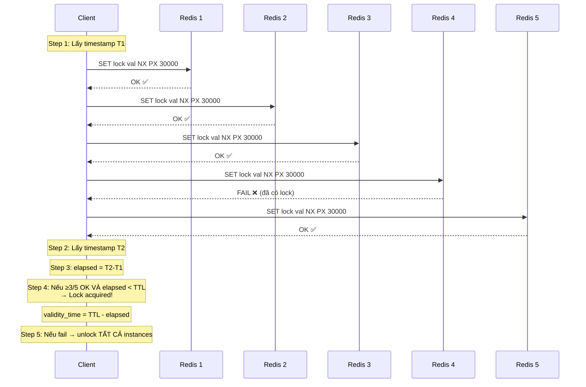

# Redlock là gì?

## ⚡ Tóm tắt ngắn (30s)
* **Redlock** là thuật toán distributed lock do Salvatore Sanfilippo (Redis creator) đề xuất, sử dụng **N independent Redis instances** (thường N=5)
* Client phải acquire lock trên **majority** (N/2+1 = 3/5) instances trong thời gian giới hạn → lock mới hợp lệ
* Giải quyết vấn đề **single point of failure** của Redis lock đơn lẻ
* Vẫn có **controversy**: Martin Kleppmann cho rằng Redlock không đủ an toàn cho correctness-critical systems
* Trong Java, **Redisson** cung cấp `RedissonRedLock` implementation sẵn

---

## 🔍 Chi tiết bản chất thực chiến

### Thuật toán Redlock — 5 bước



### Chi tiết từng bước

1. **Get current time** (T1) với độ chính xác cao
2. **Tuần tự acquire lock** trên N=5 Redis instances, mỗi instance dùng `SET key value NX PX ttl` với cùng unique value
3. **Tính elapsed time**: `elapsed = T2 - T1`
4. **Validate**: Lock hợp lệ khi:
   - Acquire thành công trên **≥ N/2+1** instances (≥ 3/5)
   - `elapsed < TTL` (lock chưa hết hạn trong quá trình acquire)
   - **Validity time** = `TTL - elapsed` (thời gian còn lại để dùng lock)
5. **Nếu fail**: Gửi unlock (DEL) tới **tất cả** instances (kể cả instance đã fail)

### Tại sao N independent instances?
- **KHÔNG dùng Redis Cluster** — vì cluster có replication, failover sẽ mất lock
- Mỗi instance là **standalone**, không replicate với nhau
- Nếu bất kỳ minority instances nào down → lock vẫn hoạt động

---

## 💻 Code thực chiến: BAD vs GOOD

### ❌ BAD: Tự implement Redlock — thiếu nhiều edge case
```java
@Service
public class NaiveRedlockService {

    // BAD: Dùng Redis Cluster thay vì independent instances
    private List<StringRedisTemplate> templates; // 5 cluster nodes

    public boolean acquireRedlock(String resource, String value, long ttlMs) {
        int acquired = 0;
        long start = System.currentTimeMillis();

        for (StringRedisTemplate template : templates) {
            try {
                Boolean result = template.opsForValue()
                    .setIfAbsent(resource, value, Duration.ofMillis(ttlMs));
                if (Boolean.TRUE.equals(result)) {
                    acquired++;
                }
            } catch (Exception e) {
                // BAD: Swallow exception, không track failure
            }
        }

        // BAD: Không check elapsed time!
        // BAD: Không tính validity time!
        return acquired >= 3;
    }

    public void releaseLock(String resource, String value) {
        for (StringRedisTemplate template : templates) {
            // BAD: Không dùng Lua script → race condition
            // BAD: Không verify owner
            template.delete(resource);
        }
    }
}
```

---

### ✅ GOOD: Sử dụng Redisson RedLock implementation
```java
@Configuration
public class RedlockConfig {

    // 5 independent Redis instances (KHÔNG phải cluster!)
    @Bean
    public RedissonClient redissonClient1() {
        Config config = new Config();
        config.useSingleServer().setAddress("redis://redis1:6379");
        return Redisson.create(config);
    }

    @Bean
    public RedissonClient redissonClient2() {
        Config config = new Config();
        config.useSingleServer().setAddress("redis://redis2:6379");
        return Redisson.create(config);
    }

    @Bean
    public RedissonClient redissonClient3() {
        Config config = new Config();
        config.useSingleServer().setAddress("redis://redis3:6379");
        return Redisson.create(config);
    }

    // ... redissonClient4, redissonClient5 tương tự
}

@Service
@Slf4j
public class RedlockService {

    @Autowired
    @Qualifier("redissonClient1")
    private RedissonClient client1;

    @Autowired
    @Qualifier("redissonClient2")
    private RedissonClient client2;

    @Autowired
    @Qualifier("redissonClient3")
    private RedissonClient client3;

    // Redisson RedLock (deprecated từ Redisson 3.x,
    // thay bằng MultiLock với separate instances)
    public void processWithRedlock(String orderId) {
        RLock lock1 = client1.getLock("order-lock:" + orderId);
        RLock lock2 = client2.getLock("order-lock:" + orderId);
        RLock lock3 = client3.getLock("order-lock:" + orderId);

        // RedissonMultiLock implements Redlock algorithm
        RLock multiLock = new RedissonMultiLock(lock1, lock2, lock3);

        try {
            // waitTime = 10s, leaseTime = 30s
            boolean acquired = multiLock.tryLock(10, 30, TimeUnit.SECONDS);

            if (!acquired) {
                log.warn("Failed to acquire Redlock for order {}", orderId);
                throw new LockAcquisitionException("Cannot lock order");
            }

            try {
                log.info("Redlock acquired for order {}", orderId);
                processPayment(orderId);
                updateInventory(orderId);
            } finally {
                multiLock.unlock();
                log.info("Redlock released for order {}", orderId);
            }

        } catch (InterruptedException e) {
            Thread.currentThread().interrupt();
            throw new RuntimeException("Lock interrupted", e);
        }
    }

    // Kết hợp Redlock + Fencing Token cho safety tối đa
    public void processWithFencing(String orderId) {
        RLock multiLock = new RedissonMultiLock(
            client1.getLock("lock:" + orderId),
            client2.getLock("lock:" + orderId),
            client3.getLock("lock:" + orderId)
        );

        try {
            if (multiLock.tryLock(10, 30, TimeUnit.SECONDS)) {
                try {
                    // Fencing token từ một atomic counter riêng
                    long fenceToken = client1.getAtomicLong(
                        "fence:" + orderId).incrementAndGet();

                    // DB layer check: chỉ accept nếu token > last_token
                    int updated = jdbcTemplate.update(
                        "UPDATE orders SET status=?, fence_token=? " +
                        "WHERE id=? AND fence_token < ?",
                        "PROCESSING", fenceToken, orderId, fenceToken);

                    if (updated == 0) {
                        log.warn("Stale lock detected via fencing for {}",
                            orderId);
                    }
                } finally {
                    multiLock.unlock();
                }
            }
        } catch (InterruptedException e) {
            Thread.currentThread().interrupt();
        }
    }
}
```

---

## 📊 Bảng so sánh Single Redis Lock vs Redlock

| Tiêu chí | Single Redis Lock | Redlock (N=5) |
| :--- | :--- | :--- |
| **Fault tolerance** | ❌ Single point of failure | ✅ Tolerant 2/5 node failures |
| **Consistency** | Weak | Stronger (majority quorum) |
| **Latency** | 1 round trip | N round trips (sequential) |
| **Infrastructure** | 1 Redis instance | 5 independent instances |
| **Ops complexity** | Thấp | Cao (5 instances riêng) |
| **Clock dependency** | Thấp | Cao (cần clock đồng bộ) |
| **Correctness guarantee** | ❌ Không | ⚠️ Controversial |
| **Availability** | Thấp | Cao hơn |

---

## ⚠️ Common Gotchas & Questions follow-up

### 1. Redlock cần clock đồng bộ giữa các instances
* **Problem**: Nếu clock trên 1 Redis instance chạy nhanh hơn → key expire sớm → majority quorum bị phá
* **Consequence**: 2 client cùng acquire lock thành công
* **Solution**: Dùng NTP, monitor clock drift, Redis dùng monotonic clock cho TTL nên risk thấp hơn

### 2. Redisson MultiLock deprecate RedissonRedLock
* **Problem**: Từ Redisson 3.x, `RedissonRedLock` class bị deprecated
* **Solution**: Dùng `RedissonMultiLock` với locks từ **separate** RedissonClient instances (không phải cùng 1 cluster)

### 3. Retry và acquire delay
* **Problem**: Nếu 2 client cùng try acquire Redlock đồng thời → cả hai có thể acquire 2/5 mỗi bên → cả hai fail
* **Consequence**: Livelock — không ai acquire được lock
* **Solution**: Random retry delay (jitter) giữa các lần retry, Redisson handle tự động

### 4. Interview follow-up: "Kleppmann's critique — Redlock có thực sự an toàn?"
* **Kleppmann**: Redlock dựa trên timing assumptions (bounded network delay, bounded process pause, bounded clock drift). Nếu bất kỳ assumption nào bị vi phạm → unsafe
* **Antirez (Redis creator)**: Những assumptions này reasonable trong thực tế, auto-release delay mechanism đủ safe
* **Consensus**: Nếu cần **correctness** (tài chính, y tế) → dùng ZooKeeper/etcd. Nếu cần **efficiency** (tránh duplicate work) → Redlock đủ tốt

### 5. Interview follow-up: "5 instances hay 3 instances?"
* **3 instances**: tolerant 1 failure, majority = 2
* **5 instances**: tolerant 2 failures, majority = 3
* **Trade-off**: Nhiều instance = resilient hơn nhưng latency cao hơn, ops cost cao hơn
* Production thường dùng **3 hoặc 5**, lẻ để tránh tie
