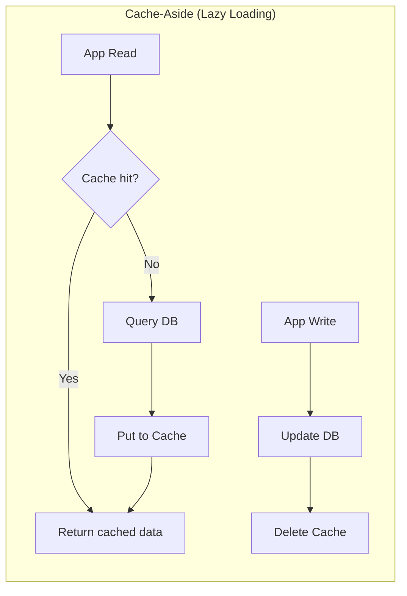
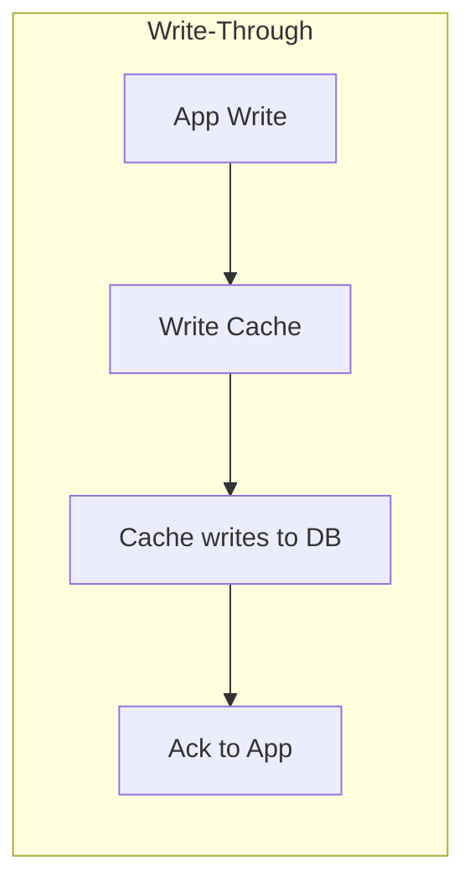
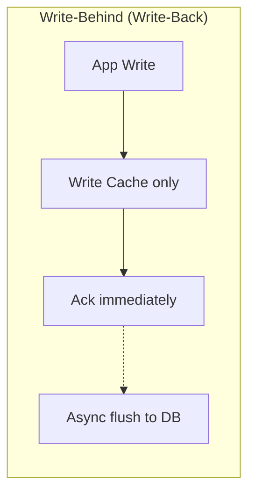
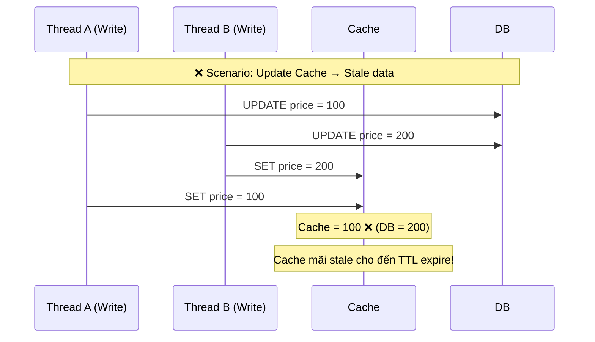
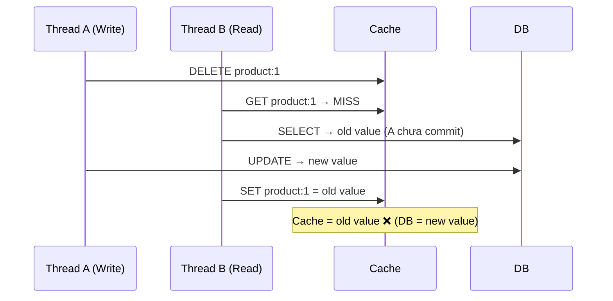

# Cache consistency với database xử lý thế nào?

## ⚡ Tóm tắt ngắn (30s)
* Cache consistency là bài toán đảm bảo **data trong cache đồng bộ với database** — một trong những hard problems của distributed systems
* 3 pattern chính: **Cache-Aside** (phổ biến nhất), **Write-Through**, **Write-Behind (Write-Back)**
* Vấn đề cốt lõi: **race condition** khi concurrent read/write → stale data trong cache
* Best practice: **Cache-Aside + delete cache** (không update cache) + **TTL** làm safety net
* Giải pháp nâng cao: **CDC (Change Data Capture)** với Debezium để sync cache từ DB binlog

---

## 🔍 Chi tiết bản chất thực chiến

### 3 Pattern chính







### Race condition kinh điển: Update Cache vs Delete Cache

**Tại sao DELETE cache chứ không UPDATE cache?**



**Delete cache** tránh vấn đề trên vì read tiếp theo sẽ fetch data mới nhất từ DB.

### Race condition: Delete Cache → Read → Write DB (Double Delete)



**Giải pháp**: Delayed Double Delete — xoá cache lần 2 sau một khoảng delay.

---

## 💻 Code thực chiến: BAD vs GOOD

### ❌ BAD: Update cache trực tiếp, không handle race condition
```java
@Service
public class ProductService {

    @Autowired
    private StringRedisTemplate redisTemplate;
    @Autowired
    private ProductRepository productRepository;

    // BAD: Update cache → race condition giữa concurrent writes
    public void updatePrice(String productId, BigDecimal newPrice) {
        productRepository.updatePrice(productId, newPrice);

        // Nếu 2 threads update đồng thời, cache có thể chứa giá cũ
        Product product = productRepository.findById(productId).orElseThrow();
        redisTemplate.opsForValue().set(
            "product:" + productId,
            objectMapper.writeValueAsString(product));
    }

    // BAD: Read without cache stampede protection
    public Product getProduct(String productId) {
        String cached = redisTemplate.opsForValue()
            .get("product:" + productId);
        if (cached != null) {
            return objectMapper.readValue(cached, Product.class);
        }
        // 1000 concurrent requests cùng miss cache
        // → 1000 queries đập vào DB cùng lúc!
        Product product = productRepository.findById(productId).orElseThrow();
        redisTemplate.opsForValue().set(
            "product:" + productId,
            objectMapper.writeValueAsString(product));
        return product;
    }
}
```

---

### ✅ GOOD: Cache-Aside + Delete + Stampede protection
```java
@Service
@Slf4j
public class ProductCacheService {

    @Autowired
    private StringRedisTemplate redisTemplate;
    @Autowired
    private ProductRepository productRepository;
    @Autowired
    private RedissonClient redissonClient;
    @Autowired
    private ObjectMapper objectMapper;

    private static final Duration CACHE_TTL = Duration.ofHours(2);
    private static final Duration NULL_TTL = Duration.ofMinutes(5);

    // Cache-Aside Read với stampede protection
    public Product getProduct(String productId) {
        String key = "product:" + productId;
        String cached = redisTemplate.opsForValue().get(key);

        if (cached != null) {
            if ("NULL".equals(cached)) return null; // Cache null value
            return deserialize(cached);
        }

        // Singleflight: chỉ 1 thread được query DB, còn lại chờ
        RLock lock = redissonClient.getLock("load-lock:" + productId);
        try {
            if (lock.tryLock(5, 10, TimeUnit.SECONDS)) {
                try {
                    // Double-check sau khi acquire lock
                    cached = redisTemplate.opsForValue().get(key);
                    if (cached != null) {
                        return "NULL".equals(cached) ? null
                            : deserialize(cached);
                    }

                    Product product = productRepository
                        .findById(productId).orElse(null);

                    if (product != null) {
                        // TTL + random jitter tránh cache avalanche
                        long jitter = ThreadLocalRandom.current()
                            .nextLong(0, 300);
                        redisTemplate.opsForValue().set(key,
                            serialize(product),
                            CACHE_TTL.plusSeconds(jitter));
                    } else {
                        // Cache null tránh cache penetration
                        redisTemplate.opsForValue().set(key,
                            "NULL", NULL_TTL);
                    }
                    return product;
                } finally {
                    lock.unlock();
                }
            }
            // Nếu không acquire được lock, query DB trực tiếp (fallback)
            return productRepository.findById(productId).orElse(null);
        } catch (InterruptedException e) {
            Thread.currentThread().interrupt();
            return productRepository.findById(productId).orElse(null);
        }
    }

    // Write: Update DB first → Delete cache (+ delayed double delete)
    @Transactional
    public Product updateProduct(String productId, UpdateProductDTO dto) {
        // Step 1: Update DB
        Product product = productRepository.findById(productId)
            .orElseThrow();
        product.setPrice(dto.getPrice());
        product.setName(dto.getName());
        productRepository.save(product);

        // Step 2: Delete cache ngay lập tức
        String key = "product:" + productId;
        redisTemplate.delete(key);
        log.info("Cache deleted for product {}", productId);

        // Step 3: Delayed double delete (500ms sau)
        CompletableFuture.delayedExecutor(500, TimeUnit.MILLISECONDS)
            .execute(() -> {
                redisTemplate.delete(key);
                log.info("Double delete cache for product {}", productId);
            });

        return product;
    }

    private String serialize(Product p) {
        try { return objectMapper.writeValueAsString(p); }
        catch (Exception e) { throw new RuntimeException(e); }
    }

    private Product deserialize(String json) {
        try { return objectMapper.readValue(json, Product.class); }
        catch (Exception e) { throw new RuntimeException(e); }
    }
}

// CDC approach — ultimate consistency via Debezium
// Không cần delete cache trong app code — Debezium tự detect DB changes
@Component
@Slf4j
public class ProductCdcConsumer {

    @Autowired
    private StringRedisTemplate redisTemplate;

    @KafkaListener(topics = "dbserver1.inventory.products")
    public void onProductChange(ConsumerRecord<String, String> record) {
        JsonNode payload = objectMapper.readTree(record.value())
            .get("payload");
        String op = payload.get("op").asText();
        String productId = payload.get("after") != null
            ? payload.get("after").get("id").asText()
            : payload.get("before").get("id").asText();

        switch (op) {
            case "c", "u": // create or update
                redisTemplate.delete("product:" + productId);
                log.info("CDC: cache invalidated for product {}", productId);
                break;
            case "d": // delete
                redisTemplate.delete("product:" + productId);
                break;
        }
    }
}
```

---

## 📊 Bảng so sánh các Cache Consistency Pattern

| Tiêu chí | Cache-Aside + Delete | Write-Through | Write-Behind | CDC (Debezium) |
| :--- | :--- | :--- | :--- | :--- |
| **Consistency** | Eventual (ms~s) | Strong | Weak | Eventual (ms) |
| **Write latency** | DB latency | DB + Cache | Rất thấp (cache only) | DB latency |
| **Complexity** | Thấp | Trung bình | Cao | Cao (infra) |
| **Data loss risk** | Không | Không | Có (cache crash) | Không |
| **Cache miss** | Cold start miss | Không miss | Không miss | Cold start miss |
| **Race condition** | Possible (double delete) | Thấp | Thấp | Không (event-driven) |
| **Best for** | General purpose | Read-heavy, consistency | Write-heavy | Microservices, event-driven |

---

## ⚠️ Common Gotchas & Questions follow-up

### 1. Cache Avalanche — hàng loạt key expire cùng lúc
* **Problem**: Set cùng TTL cho nhiều key → expire đồng loạt → DB bị flood
* **Consequence**: DB overload, cascading failure
* **Solution**: Random jitter trên TTL (`baseTTL + random(0, 300s)`), pre-warm cache trước peak hours

### 2. Cache Penetration — query key không tồn tại
* **Problem**: Request product ID không tồn tại → luôn miss cache → query DB → return null → không cache
* **Consequence**: Mỗi request đều đập DB, attacker có thể exploit
* **Solution**: Cache null value với TTL ngắn, hoặc dùng Bloom Filter để filter trước

### 3. Cache Stampede (Thundering Herd)
* **Problem**: Hot key expire → 10K requests đồng thời query DB
* **Consequence**: DB connection exhaustion
* **Solution**: Singleflight/mutex lock pattern (như code ở trên), hoặc logical expiry (cache không expire, background thread refresh)

### 4. Interview follow-up: "Tại sao delete cache thay vì update?"
* **Update cache**: race condition giữa concurrent writes → stale data
* **Delete cache**: next read sẽ fetch latest data từ DB → self-healing
* **Delete cache** đơn giản hơn, ít bug hơn, là industry best practice

### 5. Interview follow-up: "Write DB first hay delete cache first?"
* **Write DB first → Delete cache**: nếu delete cache fail → stale data nhưng DB đúng, TTL sẽ tự heal
* **Delete cache first → Write DB**: nếu write DB fail → cache đã bị xoá, next read sẽ load lại → OK, nhưng có window race condition (read cũ vào cache trước DB update)
* **Recommendation**: Write DB first → Delete cache + TTL safety net
