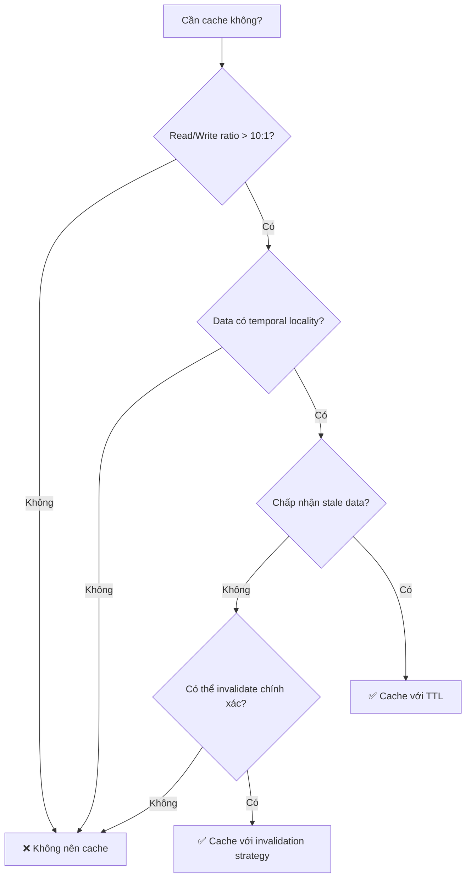

# Khi nào không nên cache?

## ⚡ Tóm tắt ngắn (30s)
* **Dữ liệu thay đổi liên tục** (real-time stock prices, live scores) → cache invalidation quá tốn kém, stale data gây hại
* **Dữ liệu hiếm khi được truy vấn lại** (one-off reports, unique search queries) → cache hit ratio cực thấp, lãng phí memory
* **Dữ liệu nhạy cảm yêu cầu consistency tuyệt đối** (bank balance, inventory count) → stale cache = lỗi nghiệp vụ nghiêm trọng
* **Dataset quá lớn hoặc quá nhỏ** → lớn thì tốn RAM vô ích, nhỏ thì DB đã đủ nhanh
* **Khi chi phí cache infrastructure > lợi ích performance** → over-engineering

---

## 🔍 Chi tiết bản chất thực chiến

### Nguyên tắc cốt lõi: Cache chỉ có giá trị khi READ >> WRITE và data có tính "temporal locality"

Cache sinh ra để giải quyết bài toán **đọc nhiều lần cùng một dữ liệu**. Nếu pattern truy cập không thỏa mãn điều này, cache trở thành overhead thay vì optimization.



### 6 trường hợp KHÔNG nên cache

#### 1. Dữ liệu real-time, thay đổi mỗi giây
- Stock prices, cryptocurrency rates, live game scores
- TTL phải cực ngắn → cache gần như vô dụng
- Invalidation overhead > latency saving

#### 2. Dữ liệu có cardinality cực cao + ít repeat
- Search queries với long-tail distribution (90% unique)
- User-specific reports, personalized recommendations chưa aggregate
- Cache hit ratio < 5% → lãng phí memory

#### 3. Dữ liệu yêu cầu strong consistency
- Account balance trong banking
- Inventory count trong flash sale
- Distributed lock state
- Một lần đọc stale = mất tiền hoặc oversell

#### 4. Write-heavy data paths
- Logging, audit trails, event sourcing
- Mỗi write phải invalidate cache → cache churn cực cao
- Net performance có thể âm do overhead invalidation

#### 5. Dữ liệu lớn, ít truy cập
- Historical reports, archived data
- Binary files (images, PDFs) nếu đã có CDN
- Chiếm RAM quý giá mà không tạo giá trị

#### 6. Khi hệ thống đủ nhanh không cần cache
- DB query < 5ms với proper indexing
- Dataset nhỏ (< 10K records) fit trong DB buffer pool
- Thêm cache = thêm complexity không cần thiết

---

## 💻 Code thực chiến: BAD vs GOOD

### ❌ BAD: Cache dữ liệu thay đổi liên tục — stale data gây lỗi nghiệp vụ
```java
@Service
public class InventoryService {
    
    // ❌ Cache inventory count — flash sale sẽ oversell!
    @Cacheable(value = "inventory", key = "#productId")
    public int getAvailableStock(Long productId) {
        return inventoryRepository.countAvailable(productId);
    }

    // ❌ Mỗi lần mua phải evict cache, nhưng giữa evict và read tiếp theo
    // có race condition → user khác đọc stale count → oversell
    @CacheEvict(value = "inventory", key = "#productId")
    public void decreaseStock(Long productId, int quantity) {
        inventoryRepository.decrease(productId, quantity);
    }
}
```

---

### ✅ GOOD: Dùng atomic operation trực tiếp, không cache
```java
@Service
public class InventoryService {

    private final RedisTemplate<String, Integer> redisTemplate;
    private final InventoryRepository inventoryRepository;

    // ✅ Dùng Redis atomic decrement thay vì cache read
    // Redis ở đây là "source of truth" cho hot stock, KHÔNG phải cache
    public boolean tryDecreaseStock(Long productId, int quantity) {
        String key = "stock:atomic:" + productId;
        Long remaining = redisTemplate.opsForValue().decrement(key, quantity);

        if (remaining != null && remaining >= 0) {
            // Async sync về DB
            asyncSyncToDatabase(productId, remaining.intValue());
            return true;
        }

        // Rollback nếu không đủ hàng
        redisTemplate.opsForValue().increment(key, quantity);
        return false;
    }

    // ✅ Query trực tiếp DB cho data cần consistency
    // Với proper index, query này < 5ms
    public int getAvailableStock(Long productId) {
        return inventoryRepository.countAvailable(productId);
    }

    @Async
    protected void asyncSyncToDatabase(Long productId, int newCount) {
        inventoryRepository.updateStock(productId, newCount);
    }
}
```

---

### ❌ BAD: Cache search results với cardinality cao
```java
@Service
public class SearchService {

    // ❌ Mỗi search query gần như unique → hit ratio ~2%
    // 1 triệu unique queries * 50KB mỗi result = 50GB RAM lãng phí
    @Cacheable(value = "search", key = "#query + '_' + #page")
    public SearchResult search(String query, int page) {
        return elasticSearchClient.search(query, page);
    }
}
```

---

### ✅ GOOD: Cache có chọn lọc — chỉ cache popular queries
```java
@Service
public class SearchService {

    private final LoadingCache<String, SearchResult> hotQueryCache;
    private final PopularQueryTracker queryTracker;

    public SearchService() {
        // ✅ Chỉ cache top 1000 popular queries
        this.hotQueryCache = Caffeine.newBuilder()
                .maximumSize(1_000)
                .expireAfterWrite(Duration.ofMinutes(5))
                .recordStats() // monitor hit ratio
                .build(this::executeSearch);
    }

    public SearchResult search(String query, int page) {
        String cacheKey = query.toLowerCase().trim() + ":" + page;

        // ✅ Chỉ cache nếu query nằm trong top popular
        if (queryTracker.isPopularQuery(query)) {
            return hotQueryCache.get(cacheKey);
        }

        // ✅ Long-tail queries → query trực tiếp, không cache
        return executeSearch(cacheKey);
    }

    private SearchResult executeSearch(String cacheKey) {
        String[] parts = cacheKey.split(":");
        return elasticSearchClient.search(parts[0], Integer.parseInt(parts[1]));
    }
}
```

---

## 📊 Bảng so sánh: Cache vs Không Cache theo trường hợp

| Tiêu chí | ✅ Nên Cache | ❌ Không nên Cache |
| :--- | :--- | :--- |
| **Read/Write ratio** | > 10:1 | < 3:1 |
| **Data freshness** | Chấp nhận stale 1-60s | Cần real-time chính xác |
| **Access pattern** | Hot keys, temporal locality | Long-tail, unique queries |
| **Consistency** | Eventual consistency OK | Strong consistency bắt buộc |
| **Dataset size** | Fit trong memory budget | Quá lớn cho RAM |
| **Query latency gốc** | > 50ms (DB chậm) | < 5ms (DB đã đủ nhanh) |
| **Business impact of stale** | Nhỏ (hiển thị cũ 1 chút) | Lớn (mất tiền, oversell) |
| **Ví dụ** | Product catalog, user profile | Bank balance, live bidding |

---

## ⚠️ Common Gotchas & Questions follow-up

### 1. "Cache luôn cho chắc" — Over-caching anti-pattern
* **Problem**: Dev cache mọi thứ "phòng trường hợp" → memory bloat, stale data bugs khó debug
* **Consequence**: Production incident khi cache serve data cũ 30 phút cho tính năng cần real-time
* **Solution**: Mỗi cache entry cần trả lời: "Nếu data stale 30s, business impact là gì?" — nếu nghiêm trọng → không cache

### 2. Cache invalidation cho data có foreign key relationships
* **Problem**: Cache `Order` nhưng khi `Product` price thay đổi, order cache vẫn hiện giá cũ
* **Consequence**: Inconsistent data across related entities
* **Solution**: Hoặc cache denormalized data với aggressive TTL, hoặc không cache entities có nhiều cross-references

### 3. "DB đã có query cache rồi, cần thêm application cache không?"
* **Problem**: MySQL query cache bị deprecated từ 8.0, PostgreSQL shared buffers có giới hạn
* **Solution**: DB buffer pool cache raw pages, application cache thường cache **processed/aggregated** data → hai tầng phục vụ mục đích khác nhau. Nhưng nếu query đã < 5ms thì application cache thêm complexity không đáng

### 4. Khi nào nên dùng cache dù data thay đổi thường xuyên?
* **Answer**: Khi hệ thống chấp nhận **bounded staleness** và read volume cực lớn
* Ví dụ: Social media feed — data thay đổi mỗi giây nhưng user không cần thấy post mới nhất ngay lập tức
* Dùng TTL ngắn (5-15s) + background refresh

### 5. Cache và GDPR/compliance
* **Problem**: Cache chứa PII (personal data) → phải xóa khi user request deletion
* **Consequence**: Vi phạm GDPR nếu cache serve deleted user data
* **Solution**: Implement cache-aware data deletion, hoặc không cache PII-containing data
