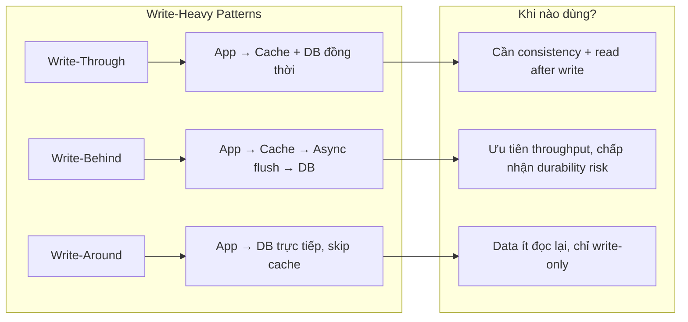
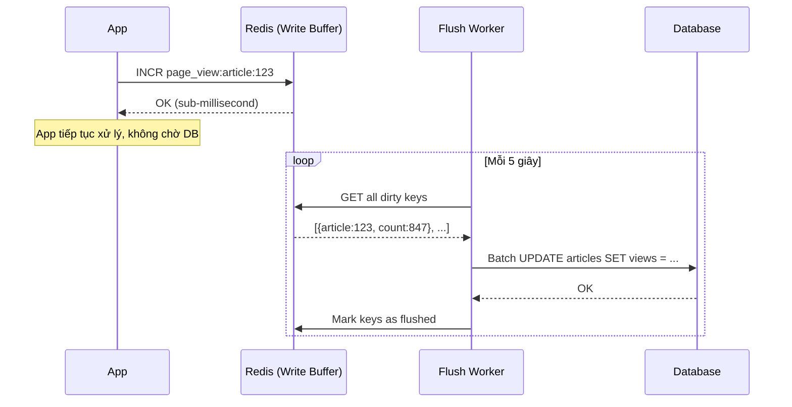

# Write-heavy system có nên dùng cache không?

## ⚡ Tóm tắt ngắn (30s)
* **Có, nhưng phải chọn đúng strategy** — không dùng cache-aside (read-focused) mà dùng **write-behind (write-back)** hoặc **write-through**
* Write-behind: gom writes vào buffer (Redis/Kafka), flush batch xuống DB → giảm DB load 10-50x
* Write-through: write cả cache + DB đồng bộ → đảm bảo consistency nhưng latency không giảm ở write path
* **Quan trọng nhất**: cache trong write-heavy system đóng vai trò **write buffer/absorber**, không phải read accelerator
* Ví dụ thực tế: metrics collection, IoT sensor data, click tracking, real-time bidding

---

## 🔍 Chi tiết bản chất thực chiến

### Tư duy đúng: Cache không chỉ là "read cache"

Nhiều developer nghĩ cache = đọc nhanh hơn. Nhưng trong write-heavy system, cache đóng vai trò **write absorber** — hấp thụ spike writes, aggregate/batch rồi mới flush xuống persistent storage.



### Pattern 1: Write-Behind (Write-Back) — Dùng nhiều nhất cho write-heavy



**Ưu điểm**: Write latency cực thấp (sub-ms), DB load giảm mạnh nhờ batching
**Rủi ro**: Mất data nếu Redis crash trước khi flush → cần Redis persistence (AOF) hoặc replication

### Pattern 2: Write-Through — Consistency cao hơn

Ghi đồng bộ vào cả cache và DB. Write latency không giảm, nhưng read sau đó luôn có data mới nhất trong cache.

### Pattern 3: Aggregate in Cache — Giảm write amplification

Thay vì write 1000 rows/s vào DB, aggregate trong Redis (counter, sorted set) rồi flush kết quả tổng hợp.

---

## 💻 Code thực chiến: BAD vs GOOD

### ❌ BAD: Dùng cache-aside cho write-heavy tracking system
```java
@Service
public class PageViewService {

    private final PageViewRepository repository;

    // ❌ Mỗi page view = 1 DB insert = DB chết khi 10K req/s
    public void trackPageView(Long articleId, String userId) {
        PageView view = new PageView();
        view.setArticleId(articleId);
        view.setUserId(userId);
        view.setTimestamp(Instant.now());
        repository.save(view); // DB insert mỗi request!
    }

    // ❌ Cache-aside cho read, nhưng write vẫn đập thẳng DB
    @Cacheable(value = "pageViews", key = "#articleId")
    public long getPageViewCount(Long articleId) {
        return repository.countByArticleId(articleId);
    }

    // ❌ Mỗi write phải evict cache → cache churn cực cao
    @CacheEvict(value = "pageViews", key = "#articleId")
    public void evictAfterTrack(Long articleId) {
        // evict triggered after each write — useless churn
    }
}
```

---

### ✅ GOOD: Write-behind pattern — Redis absorb writes, batch flush to DB
```java
@Service
public class PageViewService {

    private final StringRedisTemplate redisTemplate;
    private final PageViewRepository repository;

    // ✅ Write vào Redis atomic counter — sub-millisecond
    public void trackPageView(Long articleId, String userId) {
        String countKey = "pv:count:" + articleId;
        String detailKey = "pv:detail:" + articleId;

        // Atomic increment — không cần lock, O(1)
        redisTemplate.opsForValue().increment(countKey);

        // Lưu chi tiết vào sorted set (score = timestamp)
        redisTemplate.opsForZSet().add(detailKey,
                userId + ":" + Instant.now().toEpochMilli(),
                System.currentTimeMillis());

        // Track dirty keys để flush worker biết
        redisTemplate.opsForSet().add("pv:dirty", articleId.toString());
    }

    // ✅ Read trực tiếp từ Redis — luôn có data mới nhất
    public long getPageViewCount(Long articleId) {
        String val = redisTemplate.opsForValue().get("pv:count:" + articleId);
        return val != null ? Long.parseLong(val) : 0;
    }
}

@Component
public class PageViewFlushWorker {

    private final StringRedisTemplate redisTemplate;
    private final JdbcTemplate jdbcTemplate;

    // ✅ Scheduled batch flush — giảm DB writes 100x
    @Scheduled(fixedDelay = 5000) // Mỗi 5 giây
    public void flushToDB() {
        Set<String> dirtyKeys = redisTemplate.opsForSet()
                .members("pv:dirty");
        if (dirtyKeys == null || dirtyKeys.isEmpty()) return;

        // Batch update thay vì từng row
        List<Object[]> batchArgs = new ArrayList<>();
        for (String articleId : dirtyKeys) {
            String countKey = "pv:count:" + articleId;
            String val = redisTemplate.opsForValue().get(countKey);
            if (val != null) {
                batchArgs.add(new Object[]{Long.parseLong(val),
                        Long.parseLong(articleId)});
            }
        }

        // ✅ 1 batch update thay vì 10K individual inserts
        jdbcTemplate.batchUpdate(
                "UPDATE articles SET view_count = ? WHERE id = ?",
                batchArgs
        );

        // Xóa dirty flags
        redisTemplate.delete("pv:dirty");
    }
}
```

---

### ✅ GOOD: Write-through cho trường hợp cần consistency
```java
@Service
public class UserPreferenceService {

    private final UserPreferenceRepository repository;
    private final StringRedisTemplate redisTemplate;
    private final ObjectMapper objectMapper;

    // ✅ Write-through: ghi cả DB + cache trong 1 transaction
    @Transactional
    public UserPreference updatePreference(Long userId, UserPreference pref) {
        // 1. Ghi DB trước (source of truth)
        UserPreference saved = repository.save(pref);

        // 2. Update cache ngay sau DB commit
        String cacheKey = "user:pref:" + userId;
        redisTemplate.opsForValue().set(cacheKey,
                objectMapper.writeValueAsString(saved),
                Duration.ofHours(1));

        return saved;
    }

    // ✅ Read luôn hit cache (đã được update ở write path)
    public UserPreference getPreference(Long userId) {
        String cacheKey = "user:pref:" + userId;
        String cached = redisTemplate.opsForValue().get(cacheKey);

        if (cached != null) {
            return objectMapper.readValue(cached, UserPreference.class);
        }

        // Cache miss: load từ DB, populate cache
        UserPreference pref = repository.findByUserId(userId);
        if (pref != null) {
            redisTemplate.opsForValue().set(cacheKey,
                    objectMapper.writeValueAsString(pref),
                    Duration.ofHours(1));
        }
        return pref;
    }
}
```

---

## 📊 Bảng so sánh Write Caching Strategies

| Tiêu chí | Write-Behind | Write-Through | Write-Around |
| :--- | :--- | :--- | :--- |
| **Write latency** | ⚡ Cực thấp (sub-ms) | 🔶 Bằng DB latency | 🔶 Bằng DB latency |
| **Read after write** | ✅ Có data mới từ cache | ✅ Có data mới từ cache | ❌ Cache miss cho data mới |
| **Consistency** | ⚠️ Eventual (có window mất data) | ✅ Strong | ✅ Strong |
| **DB load** | ⬇️ Giảm mạnh nhờ batching | ➡️ Không giảm | ➡️ Không giảm |
| **Durability risk** | ⚠️ Mất data nếu cache crash | ✅ Không mất | ✅ Không mất |
| **Complexity** | 🔴 Cao (flush worker, error handling) | 🟢 Thấp | 🟢 Thấp |
| **Use case** | Metrics, analytics, counters | User profile, settings | Audit log, write-only data |

---

## ⚠️ Common Gotchas & Questions follow-up

### 1. Write-behind data loss khi Redis crash
* **Problem**: 5 giây data chưa flush sẽ mất nếu Redis node die
* **Consequence**: Mất page views, metrics — có thể chấp nhận; mất orders, payments — không thể
* **Solution**: Redis AOF persistence (appendfsync everysec), Redis Sentinel/Cluster cho HA, hoặc dùng Kafka thay Redis làm write buffer

### 2. Race condition giữa flush worker và ongoing writes
* **Problem**: Flush worker đọc counter = 100, trong lúc flush thì app ghi thêm 5 → flush xong reset counter = 0 → mất 5 views
* **Solution**: Dùng `GETSET` hoặc `GETDEL` atomic operation — đọc giá trị hiện tại và reset về 0 trong 1 atomic operation
```java
// ✅ Atomic read-and-reset
String currentVal = redisTemplate.opsForValue().getAndSet(countKey, "0");
```

### 3. "Tại sao không dùng Kafka thay Redis cho write buffer?"
* **Answer**: Kafka tốt hơn khi cần **durability guarantee** và **replay capability**. Redis tốt hơn khi cần **aggregation in-place** (atomic increment, sorted sets). Thực tế production hay dùng kết hợp: Redis cho real-time counters + Kafka cho event sourcing

### 4. Write amplification khi cache invalidation lan truyền
* **Problem**: Update 1 product → invalidate product cache, category cache, search index cache, recommendation cache
* **Solution**: Event-driven invalidation (publish CacheInvalidationEvent), hoặc dùng TTL-based expiry thay vì explicit invalidation

### 5. Monitoring write-heavy cache
* **Metrics cần theo dõi**: Write throughput (ops/sec), flush lag (thời gian data chưa persist), memory usage growth rate, eviction rate
* Nếu flush lag > 30s → scale flush workers hoặc tăng batch size
