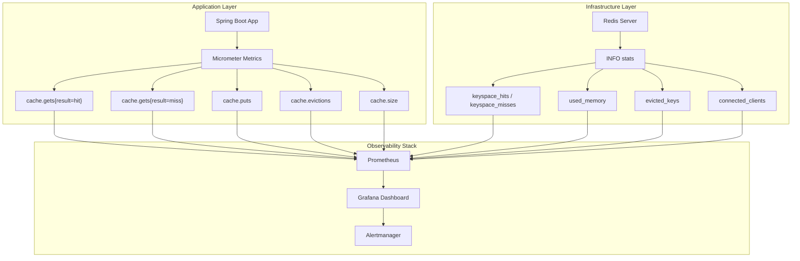

# Làm sao monitor cache hit ratio?

## ⚡ Tóm tắt ngắn (30s)
* **Hit ratio = hits / (hits + misses)** — metric quan trọng nhất đánh giá hiệu quả cache
* Dùng **Micrometer + Spring Boot Actuator** để tự động expose cache metrics cho Caffeine/Redis
* Redis: dùng `INFO stats` lấy `keyspace_hits` / `keyspace_misses` ở server level
* Application-level metrics chính xác hơn — track per-cache-name, per-endpoint
* Dashboard Grafana: hit ratio, latency percentiles, eviction rate, memory usage
* **Alert rule**: hit ratio < 80% sustained 5 phút → cần investigate

---

## 🔍 Chi tiết bản chất thực chiến

### Tầng monitoring cache



### Hai tầng metrics cần theo dõi

**1. Application-level metrics** (Micrometer):
- Chính xác per cache name, per operation
- Biết được cache nào hiệu quả, cache nào lãng phí
- Tính được hit ratio per endpoint/use case

**2. Infrastructure-level metrics** (Redis INFO):
- Tổng quan server health
- Memory pressure, connection count
- Aggregate hit/miss across tất cả applications

---

## 💻 Code thực chiến: BAD vs GOOD

### ❌ BAD: Không monitor cache — "cứ cache thì nhanh hơn"
```java
@Configuration
@EnableCaching
public class CacheConfig {

    @Bean
    public CacheManager cacheManager() {
        // ❌ Dùng SimpleCacheManager — KHÔNG có metrics nào
        SimpleCacheManager manager = new SimpleCacheManager();
        manager.setCaches(List.of(
                new ConcurrentMapCache("products"),
                new ConcurrentMapCache("users")
        ));
        return manager;
        // ❌ Không biết hit ratio bao nhiêu
        // ❌ Không biết cache có đang hoạt động không
        // ❌ Không biết cache chiếm bao nhiêu memory
    }
}

@Service
public class ProductService {
    // ❌ Cache hoạt động như black box — no visibility
    @Cacheable("products")
    public Product getProduct(Long id) {
        return productRepository.findById(id).orElseThrow();
    }
}
```

---

### ✅ GOOD: Full monitoring setup với Caffeine + Micrometer
```java
@Configuration
@EnableCaching
public class CacheConfig {

    @Bean
    public CacheManager cacheManager() {
        CaffeineCacheManager manager = new CaffeineCacheManager();
        manager.setCaffeine(Caffeine.newBuilder()
                .maximumSize(10_000)
                .expireAfterWrite(Duration.ofMinutes(10))
                .recordStats()); // ✅ BẬT statistics recording

        manager.setCacheNames(List.of("products", "users", "categories"));
        return manager;
    }

    // ✅ Đăng ký custom metrics cho business-level monitoring
    @Bean
    public MeterRegistryCustomizer<MeterRegistry> cacheMetricsCustomizer() {
        return registry -> {
            // Custom gauge cho cache effectiveness
            Gauge.builder("cache.effectiveness.score",
                    this::calculateOverallEffectiveness)
                    .description("Overall cache effectiveness 0-100")
                    .register(registry);
        };
    }

    private double calculateOverallEffectiveness() {
        // Business logic tính điểm hiệu quả tổng hợp
        return 0.0; // placeholder
    }
}
```

---

### ✅ GOOD: Custom cache metrics interceptor cho chi tiết per-method
```java
@Aspect
@Component
public class CacheMetricsAspect {

    private final MeterRegistry meterRegistry;

    public CacheMetricsAspect(MeterRegistry meterRegistry) {
        this.meterRegistry = meterRegistry;
    }

    @Around("@annotation(cacheable)")
    public Object trackCacheMetrics(ProceedingJoinPoint joinPoint,
                                     Cacheable cacheable) throws Throwable {
        String cacheName = cacheable.value().length > 0
                ? cacheable.value()[0] : "default";
        String methodName = joinPoint.getSignature().getName();

        Timer.Sample sample = Timer.start(meterRegistry);

        try {
            Object result = joinPoint.proceed();

            // ✅ Track latency per cache + method
            sample.stop(Timer.builder("cache.operation.duration")
                    .tag("cache", cacheName)
                    .tag("method", methodName)
                    .tag("result", "success")
                    .register(meterRegistry));

            return result;
        } catch (Exception e) {
            sample.stop(Timer.builder("cache.operation.duration")
                    .tag("cache", cacheName)
                    .tag("method", methodName)
                    .tag("result", "error")
                    .register(meterRegistry));
            throw e;
        }
    }
}
```

---

### ✅ GOOD: Redis-level monitoring endpoint
```java
@RestController
@RequestMapping("/admin/cache")
public class CacheMonitorController {

    private final CacheManager cacheManager;
    private final StringRedisTemplate redisTemplate;

    @GetMapping("/stats")
    public Map<String, CacheStats> getAllCacheStats() {
        Map<String, CacheStats> stats = new LinkedHashMap<>();

        cacheManager.getCacheNames().forEach(name -> {
            Cache cache = cacheManager.getCache(name);
            if (cache != null) {
                Object nativeCache = cache.getNativeCache();
                if (nativeCache instanceof com.github.benmanes.caffeine.cache.Cache<?, ?> caffeineCache) {
                    var s = caffeineCache.stats();
                    stats.put(name, new CacheStats(
                            s.hitRate(),
                            s.hitCount(),
                            s.missCount(),
                            s.evictionCount(),
                            caffeineCache.estimatedSize(),
                            s.averageLoadPenalty() / 1_000_000 // convert to ms
                    ));
                }
            }
        });

        return stats;
    }

    @GetMapping("/redis-info")
    public Map<String, String> getRedisInfo() {
        // ✅ Lấy Redis server stats
        Properties info = redisTemplate.getConnectionFactory()
                .getConnection().serverCommands().info("stats");

        Map<String, String> relevant = new LinkedHashMap<>();
        relevant.put("keyspace_hits", info.getProperty("keyspace_hits"));
        relevant.put("keyspace_misses", info.getProperty("keyspace_misses"));

        long hits = Long.parseLong(info.getProperty("keyspace_hits", "0"));
        long misses = Long.parseLong(info.getProperty("keyspace_misses", "0"));
        double hitRatio = (hits + misses) > 0
                ? (double) hits / (hits + misses) * 100 : 0;
        relevant.put("hit_ratio_percent", String.format("%.2f", hitRatio));
        relevant.put("evicted_keys", info.getProperty("evicted_keys"));
        relevant.put("used_memory_human",
                info.getProperty("used_memory_human"));

        return relevant;
    }

    record CacheStats(double hitRate, long hitCount, long missCount,
                       long evictionCount, long estimatedSize,
                       double avgLoadPenaltyMs) {}
}
```

---

## 📊 Bảng so sánh: Cache Metrics quan trọng

| Metric | Ý nghĩa | Ngưỡng khỏe mạnh | Alert khi |
| :--- | :--- | :--- | :--- |
| **Hit Ratio** | % requests served từ cache | > 85% | < 70% sustained 5m |
| **Miss Rate** | Số cache misses/sec | Thấp, ổn định | Spike đột ngột > 3x baseline |
| **Eviction Rate** | Số entries bị đuổi/sec | Gần 0 | > 100/sec (memory pressure) |
| **Latency P99** | Thời gian cache operation | < 5ms (local), < 10ms (Redis) | > 50ms |
| **Memory Usage** | RAM cache đang chiếm | < 80% maxSize | > 90% allocated |
| **Load Penalty** | Thời gian load data khi miss | Tùy backend | Tăng > 2x baseline |
| **Size/Count** | Số entries trong cache | Ổn định | Giảm đột ngột (mass eviction) |

---

## ⚠️ Common Gotchas & Questions follow-up

### 1. Hit ratio cao nhưng performance không cải thiện
* **Problem**: Cache hit ratio 95% nhưng P99 latency vẫn cao
* **Root cause**: 5% misses tập trung vào hot path, hoặc cache serialization overhead lớn
* **Solution**: Track hit ratio **per endpoint**, không chỉ aggregate. Kiểm tra cache value size — object quá lớn thì serialize/deserialize chậm

### 2. Redis `keyspace_hits` vs Application `cache.gets{result=hit}`
* **Problem**: Redis hit/miss counts khác với application metrics
* **Root cause**: Redis counts bao gồm cả internal operations (replication, Lua scripts), application metrics chỉ count business operations
* **Solution**: Dùng application-level metrics cho decision making, Redis metrics cho capacity planning

### 3. Cache stampede gây miss rate spike
* **Problem**: Popular key expire → 1000 concurrent requests cùng miss → DB bị đập
* **Kết hợp monitor**: Miss rate spike + DB latency spike đồng thời = dấu hiệu stampede
* **Solution**: Sử dụng lock-based loading hoặc early refresh trước TTL

### 4. Prometheus cardinality explosion
* **Problem**: Tag cache key vào metric → hàng triệu time series
* **Solution**: Chỉ tag cache name + method name, KHÔNG tag cache key. Dùng sampling cho detailed analysis

### 5. Grafana dashboard essentials cho cache
* **Panel 1**: Hit ratio per cache name (line chart, 5m window)
* **Panel 2**: Operations/sec breakdown: hits, misses, puts, evictions (stacked area)
* **Panel 3**: Latency percentiles P50/P95/P99 (heatmap)
* **Panel 4**: Memory usage vs max (gauge)
* **Alert**: Hit ratio < 70% cho 5 phút liên tục → PagerDuty
