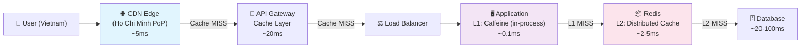

# CDN và application cache khác nhau thế nào?

## ⚡ Tóm tắt ngắn (30s)
* **CDN cache**: hoạt động ở **network edge**, gần user nhất, cache **static content** (images, CSS, JS) và cả API responses — giảm latency bằng cách giảm khoảng cách vật lý
* **Application cache**: hoạt động ở **application layer** (in-process hoặc distributed), cache **business data** đã xử lý (query results, computed aggregations) — giảm load cho DB/backend
* CDN là **infrastructure-level caching** (do ops/DevOps quản lý), application cache là **code-level caching** (do developer control)
* Trong production, dùng **cả hai** theo tầng: CDN → API Gateway cache → Application cache (L1 local + L2 Redis) → DB

---

## 🔍 Chi tiết bản chất thực chiến

### Kiến trúc multi-layer caching



### CDN — Network Edge Cache

**Bản chất**: Mạng lưới servers phân tán toàn cầu (PoPs - Points of Presence), serve content từ server gần user nhất.

**Cách hoạt động**:
- User request → DNS resolve đến CDN PoP gần nhất
- CDN kiểm tra cache → HIT: trả về ngay, MISS: fetch từ origin server
- Cache dựa vào HTTP headers: `Cache-Control`, `ETag`, `Vary`
- Invalidation qua **purge API** hoặc **versioned URLs** (`app.v2.3.js`)

**Cache gì**: Static assets, public API responses, HTML pages (SSR), video/media streaming

### Application Cache — Business Logic Cache

**Bản chất**: Cache trong application process hoặc distributed cache server, lưu trữ **kết quả business logic**.

**Cách hoạt động**:
- Developer quyết định cache gì, TTL bao lâu, invalidation strategy
- Có thể cache partial results, computed aggregations, DB query results
- Invalidation qua code logic: event-driven, TTL, manual eviction

**Cache gì**: DB query results, API aggregation results, session data, feature flags, config

---

## 💻 Code thực chiến: BAD vs GOOD

### ❌ BAD: Dùng CDN cache cho dynamic personalized content
```java
@RestController
public class FeedController {

    // ❌ Personalized feed khác nhau mỗi user
    // CDN cache sẽ serve feed của user A cho user B!
    @GetMapping("/api/feed")
    public ResponseEntity<List<Post>> getUserFeed(
            @RequestHeader("Authorization") String token) {

        User user = authService.getUser(token);
        List<Post> feed = feedService.getPersonalizedFeed(user.getId());

        return ResponseEntity.ok()
                // ❌ Public cache = CDN cache chung cho tất cả users
                .cacheControl(CacheControl.maxAge(60, TimeUnit.SECONDS)
                        .cachePublic())
                .body(feed);
    }
}
```

---

### ✅ GOOD: Phân tách đúng CDN vs Application cache
```java
@RestController
public class ProductController {

    private final ProductService productService;

    // ✅ Public product data → CDN cacheable
    @GetMapping("/api/products/{id}")
    public ResponseEntity<ProductDTO> getProduct(@PathVariable Long id) {
        ProductDTO product = productService.getProduct(id);

        return ResponseEntity.ok()
                // ✅ CDN cache 60s, browser cache 30s
                // stale-while-revalidate: serve stale trong khi fetch mới
                .cacheControl(CacheControl.maxAge(30, TimeUnit.SECONDS)
                        .cachePublic()
                        .staleWhileRevalidate(30, TimeUnit.SECONDS))
                // ✅ ETag cho conditional requests
                .eTag(product.getVersionHash())
                .body(product);
    }

    // ✅ User-specific data → KHÔNG CDN, chỉ application cache
    @GetMapping("/api/users/me/recommendations")
    public ResponseEntity<List<ProductDTO>> getRecommendations(
            @AuthenticationPrincipal UserDetails user) {

        List<ProductDTO> recs = productService
                .getRecommendations(user.getUsername());

        return ResponseEntity.ok()
                // ✅ private = chỉ browser cache, CDN KHÔNG cache
                .cacheControl(CacheControl.maxAge(300, TimeUnit.SECONDS)
                        .cachePrivate())
                .body(recs);
    }
}

@Service
public class ProductService {

    private final ProductRepository productRepository;

    // ✅ Application-level cache cho DB query results
    // CDN không biết data model, chỉ app mới cache được đúng
    @Cacheable(value = "products", key = "#id",
               unless = "#result == null")
    public ProductDTO getProduct(Long id) {
        Product product = productRepository.findById(id)
                .orElseThrow(() -> new NotFoundException("Product " + id));

        // Transform entity → DTO (business logic CDN không làm được)
        return ProductDTO.fromEntity(product);
    }

    // ✅ Heavy computation result → application cache
    @Cacheable(value = "recommendations",
               key = "#userId",
               cacheManager = "redisCacheManager")
    public List<ProductDTO> getRecommendations(String userId) {
        // ML model inference + DB queries = expensive
        // Cache kết quả 5 phút, CDN không thể cache vì per-user
        return recommendationEngine.computeFor(userId);
    }
}
```

---

### ✅ GOOD: CDN cache invalidation khi data thay đổi
```java
@Service
public class ProductUpdateService {

    private final CloudFrontClient cloudFrontClient;
    private final CacheManager cacheManager;
    private final String distributionId;

    @Transactional
    public void updateProduct(Long id, ProductUpdateRequest request) {
        // 1. Update DB
        productRepository.save(request.toEntity());

        // 2. ✅ Invalidate application cache
        Cache productCache = cacheManager.getCache("products");
        if (productCache != null) {
            productCache.evict(id);
        }

        // 3. ✅ Invalidate CDN cache (async — CDN invalidation chậm 5-15s)
        invalidateCdnAsync(id);
    }

    @Async
    public void invalidateCdnAsync(Long productId) {
        // AWS CloudFront invalidation
        cloudFrontClient.createInvalidation(req -> req
                .distributionId(distributionId)
                .invalidationBatch(batch -> batch
                        .callerReference(UUID.randomUUID().toString())
                        .paths(paths -> paths
                                .quantity(1)
                                .items("/api/products/" + productId)
                        )
                )
        );
        // ⚠️ CDN invalidation mất 5-60 giây lan truyền tới tất cả PoPs
        // Trong thời gian đó, một số users vẫn nhận stale data
    }
}
```

---

## 📊 Bảng so sánh CDN Cache vs Application Cache

| Tiêu chí | CDN Cache | Application Cache |
| :--- | :--- | :--- |
| **Vị trí** | Network edge (gần user) | Application server / Redis cluster |
| **Quản lý bởi** | Ops/DevOps, HTTP headers | Developer, code annotations |
| **Cache gì** | Static files, public API responses | Business data, query results, sessions |
| **Cache key** | URL + Vary headers | Custom keys (entity ID, query params) |
| **Invalidation** | Purge API, TTL, versioned URLs | Code-driven evict, TTL, event-based |
| **Invalidation speed** | 5-60 giây (propagate to all PoPs) | Instant (local), ~ms (Redis) |
| **Personalization** | ❌ Chỉ public/shared content | ✅ Per-user, per-context |
| **Latency saving** | Network latency (100-300ms → 5ms) | Compute/DB latency (50-200ms → 1ms) |
| **Cost model** | Pay per GB transferred + requests | RAM/Redis instance cost |
| **Granularity** | Coarse (full HTTP response) | Fine (individual objects, partial data) |
| **Protocol** | HTTP/HTTPS only | Any (in-memory, Redis protocol) |
| **Ví dụ providers** | CloudFront, Cloudflare, Akamai | Caffeine, Redis, Hazelcast, EhCache |

---

## ⚠️ Common Gotchas & Questions follow-up

### 1. CDN cache key collision với Vary header
* **Problem**: Same URL nhưng response khác nhau theo `Accept-Language`, `Accept-Encoding`
* **Consequence**: User ở VN nhận trang tiếng Anh vì CDN cache response đầu tiên
* **Solution**: Dùng `Vary: Accept-Language, Accept-Encoding` header — CDN sẽ cache riêng mỗi variant. Nhưng quá nhiều Vary values = cache fragmentation = hit ratio giảm

### 2. CDN + Authentication — cache response có sensitive data
* **Problem**: API trả về `Cache-Control: public` cho authenticated endpoint → CDN cache và serve cho anonymous users
* **Solution**: Luôn dùng `Cache-Control: private, no-store` cho authenticated responses. CDN chỉ cache responses có `Cache-Control: public`

### 3. Multi-layer cache stampede
* **Problem**: CDN TTL và Application cache TTL expire cùng lúc → tất cả layers miss đồng thời → DB bị stampede
* **Solution**: Stagger TTL — CDN TTL = 60s, App cache TTL = 90s. Dùng `stale-while-revalidate` ở CDN layer

### 4. "Sao không dùng CDN cho mọi API?"
* **Answer**: CDN cache dựa trên URL — nếu API response khác nhau theo auth token, session, hoặc request body (POST), CDN không phân biệt được. Application cache có full context (user ID, business logic) nên cache chính xác hơn

### 5. CDN cost surprise
* **Problem**: Cache invalidation quá thường xuyên → CDN phải fetch lại từ origin → bandwidth cost tăng + origin load không giảm
* **Solution**: Thiết kế content cho immutable URLs (hashed filenames: `app.a1b2c3.js`), chỉ invalidate khi thật sự cần thiết. CDN hiệu quả nhất khi content ít thay đổi
