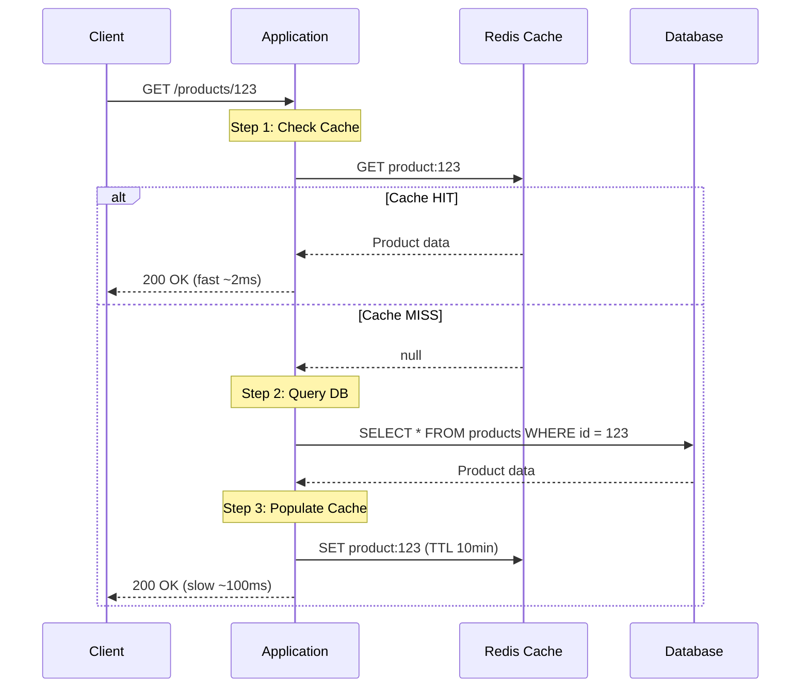
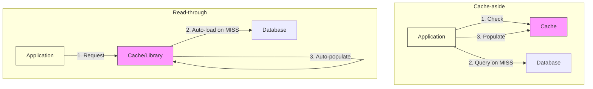

# Cache-aside pattern là gì?

## ⚡ Tóm tắt ngắn (30s)
* Cache-aside (hay **Lazy Loading**) là pattern phổ biến nhất: application tự quản lý cache — check cache trước, nếu miss thì query DB rồi tự populate cache
* Ưu điểm: **đơn giản**, chỉ cache data thực sự được đọc (demand-driven), cache failure không block request
* Nhược điểm: request đầu tiên luôn chậm (cold start), có thể bị **stale data** nếu DB update mà không invalidate cache
* So với Read-through: Cache-aside thì **application code** chịu trách nhiệm, Read-through thì **cache library/infrastructure** tự xử lý
* Production tip: Luôn kết hợp với TTL + explicit invalidation on write để giảm stale window

---

## 🔍 Chi tiết bản chất thực chiến

### Flow hoạt động của Cache-aside



### Tại sao Cache-aside là default choice?

1. **Application giữ toàn quyền kiểm soát**: Quyết định cache gì, TTL bao lâu, invalidate khi nào
2. **Resilient**: Nếu Redis chết, application vẫn hoạt động bằng cách fallback về DB
3. **Không cache data không cần thiết**: Chỉ populate khi có request thực tế (lazy)
4. **Dễ implement**: Không cần special cache infrastructure, chỉ cần Redis client

### Cache-aside vs Read-through — Bản chất khác biệt



**Cache-aside**: Application viết logic check → query → populate  
**Read-through**: Cache layer tự xử lý, application chỉ gọi `cache.get(key)`, nếu miss thì cache tự load

---

## 💻 Code thực chiến: BAD vs GOOD

### ❌ BAD: Cache-aside naive — nhiều lỗi production

```java
@Service
public class ProductService {

    @Autowired
    private RedisTemplate<String, Object> redisTemplate;

    @Autowired
    private ProductRepository productRepository;

    public Product getProduct(Long id) {
        String key = "product:" + id;

        // ❌ Lỗi 1: Không handle Redis exception → Redis chết = service chết
        Product product = (Product) redisTemplate.opsForValue().get(key);

        if (product == null) {
            product = productRepository.findById(id).orElse(null);

            // ❌ Lỗi 2: Cache null value → mỗi request với invalid ID đều hit DB
            // Kẻ tấn công gửi random IDs → DB overload (Cache Penetration)
            if (product != null) {
                // ❌ Lỗi 3: Không set TTL → data sống mãi trong cache, stale vĩnh viễn
                redisTemplate.opsForValue().set(key, product);
            }
        }

        // ❌ Lỗi 4: Không có invalidation strategy khi product update
        // Cache và DB sẽ bị out-of-sync

        return product;
    }

    // ❌ Lỗi 5: Update DB nhưng quên invalidate cache
    public Product updateProduct(Long id, ProductUpdateRequest req) {
        Product product = productRepository.findById(id)
                .orElseThrow(() -> new ProductNotFoundException(id));
        product.setName(req.getName());
        product.setPrice(req.getPrice());
        return productRepository.save(product);
        // Cache vẫn giữ data cũ! → User thấy stale data
    }
}
```

---

### ✅ GOOD: Cache-aside production-ready với đầy đủ edge cases

```java
@Service
@Slf4j
public class ProductService {

    private static final String CACHE_PREFIX = "product:";
    private static final Duration CACHE_TTL = Duration.ofMinutes(10);
    private static final Duration NULL_CACHE_TTL = Duration.ofMinutes(2); // Cache null ngắn hơn

    @Autowired
    private StringRedisTemplate redisTemplate;

    @Autowired
    private ProductRepository productRepository;

    @Autowired
    private ObjectMapper objectMapper;

    // ✅ Cache-aside pattern production-ready
    public Product getProduct(Long id) {
        String key = CACHE_PREFIX + id;

        // Step 1: Check cache (graceful degradation nếu Redis chết)
        try {
            String cached = redisTemplate.opsForValue().get(key);
            if (cached != null) {
                if ("NULL".equals(cached)) {
                    // ✅ Cache null marker để chống Cache Penetration
                    log.debug("Null marker hit for product {}", id);
                    return null;
                }
                log.debug("Cache hit for product {}", id);
                return objectMapper.readValue(cached, Product.class);
            }
        } catch (Exception e) {
            // ✅ Redis chết → fallback về DB, không crash
            log.warn("Redis error, falling back to DB: {}", e.getMessage());
        }

        // Step 2: Query DB
        log.debug("Cache miss for product {}, querying DB", id);
        Optional<Product> productOpt = productRepository.findById(id);

        // Step 3: Populate cache
        try {
            if (productOpt.isPresent()) {
                Product product = productOpt.get();
                String json = objectMapper.writeValueAsString(product);
                redisTemplate.opsForValue().set(key, json, CACHE_TTL);
                return product;
            } else {
                // ✅ Cache null để tránh repeated DB miss cho invalid IDs
                redisTemplate.opsForValue().set(key, "NULL", NULL_CACHE_TTL);
                return null;
            }
        } catch (Exception e) {
            log.warn("Failed to populate cache: {}", e.getMessage());
            return productOpt.orElse(null);
        }
    }

    // ✅ Invalidate cache khi data thay đổi
    @Transactional
    public Product updateProduct(Long id, ProductUpdateRequest req) {
        Product product = productRepository.findById(id)
                .orElseThrow(() -> new ProductNotFoundException(id));
        product.setName(req.getName());
        product.setPrice(req.getPrice());
        Product saved = productRepository.save(product);

        // ✅ Invalidate (delete) thay vì update cache
        // Lý do: Delete an toàn hơn — nếu cache update fail, data stale
        // Delete fail thì worst case = cache miss = query DB = data đúng
        evictCache(id);

        return saved;
    }

    @Transactional
    public void deleteProduct(Long id) {
        productRepository.deleteById(id);
        evictCache(id);
    }

    private void evictCache(Long id) {
        try {
            String key = CACHE_PREFIX + id;
            redisTemplate.delete(key);
            log.debug("Cache evicted for product {}", id);
        } catch (Exception e) {
            // ✅ Cache eviction fail → log nhưng không throw
            // Data sẽ tự expire theo TTL
            log.error("Failed to evict cache for product {}: {}", id, e.getMessage());
        }
    }
}
```

---

### ✅ BONUS: Spring @Cacheable — declarative Cache-aside

```java
@Configuration
@EnableCaching
public class CacheConfig {

    @Bean
    public RedisCacheManager cacheManager(RedisConnectionFactory factory) {
        RedisCacheConfiguration config = RedisCacheConfiguration.defaultCacheConfig()
                .entryTtl(Duration.ofMinutes(10))
                .serializeValuesWith(
                    SerializationPair.fromSerializer(new GenericJackson2JsonRedisSerializer()))
                .disableCachingNullValues();

        return RedisCacheManager.builder(factory)
                .cacheDefaults(config)
                // Custom TTL cho từng cache
                .withCacheConfiguration("products",
                    config.entryTtl(Duration.ofMinutes(15)))
                .withCacheConfiguration("categories",
                    config.entryTtl(Duration.ofHours(1)))
                .build();
    }
}

@Service
public class ProductService {

    // ✅ Spring tự xử lý Cache-aside pattern
    @Cacheable(value = "products", key = "#id",
               unless = "#result == null")
    public Product getProduct(Long id) {
        return productRepository.findById(id).orElse(null);
    }

    // ✅ Invalidate on update
    @CachePut(value = "products", key = "#id")
    public Product updateProduct(Long id, ProductUpdateRequest req) {
        Product product = productRepository.findById(id)
                .orElseThrow(() -> new ProductNotFoundException(id));
        product.update(req);
        return productRepository.save(product);
    }

    // ✅ Invalidate on delete
    @CacheEvict(value = "products", key = "#id")
    public void deleteProduct(Long id) {
        productRepository.deleteById(id);
    }
}
```

---

## 📊 Bảng so sánh Cache-aside vs các pattern khác

| Tiêu chí | Cache-aside | Read-through | Write-through |
|:---|:---|:---|:---|
| **Ai quản lý cache?** | Application code | Cache infrastructure | Cache infrastructure |
| **First request** | Chậm (cold miss) | Chậm (cold miss) | Nhanh (đã write vào cache) |
| **Complexity** | Thấp (dễ implement) | Trung bình (cần CacheLoader) | Trung bình |
| **Resilience** | Cao (fallback DB) | Phụ thuộc cache layer | Phụ thuộc cache layer |
| **Stale data risk** | Có (cần TTL + invalidation) | Có (cần TTL) | Thấp (write cập nhật cache) |
| **Phổ biến trong Java** | Rất phổ biến | Caffeine, Ehcache | Ít dùng standalone |

---

## ⚠️ Common Gotchas & Questions follow-up

### 1. Cache Penetration (query data không tồn tại)
* **Problem**: User query product_id = 999999 (không tồn tại) → cache miss → DB query → không có → không cache → lặp lại mãi
* **Hậu quả**: Kẻ tấn công spam random IDs → DB overload
* **Solution**: Cache null value với short TTL, hoặc dùng Bloom Filter trước cache

### 2. Delete cache trước hay sau DB update?
* **Trước**: Nếu DB update fail → cache đã bị xóa → miss → query DB lấy data cũ → OK, nhưng lãng phí
* **Sau (recommend)**: DB update thành công → xóa cache → request tiếp theo sẽ load data mới
* **Cả hai đều có race condition** — trong distributed system, dùng thêm **delayed double deletion** nếu cần consistency cao

### 3. Tại sao delete thay vì update cache?
* **Delete an toàn hơn**: Worst case là cache miss → query DB → data luôn đúng
* **Update có thể gây race condition**: Thread A update giá 100, Thread B update giá 200, nhưng cache cuối cùng lưu 100 (out of order)

### 4. @Cacheable có thread-safe không?
* **Có**, nhưng mặc định không có **sync** → nhiều thread cùng miss → nhiều DB queries
* Dùng `@Cacheable(sync = true)` để chỉ 1 thread load, các thread khác đợi — tránh cache stampede

### 5. Cache-aside có phù hợp cho write-heavy workload?
* **Không lý tưởng**: Mỗi write phải invalidate cache → cache hit rate thấp
* Alternative: **Write-behind** pattern cho write-heavy, hoặc skip cache nếu read/write ratio < 3:1
