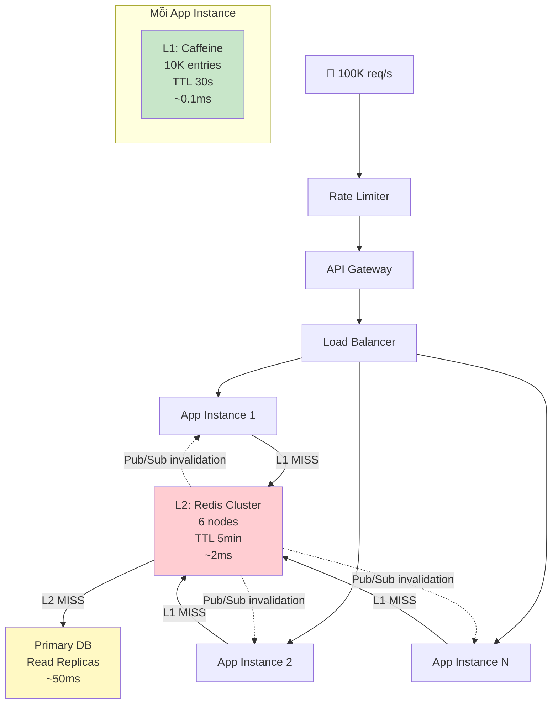

# Thiết kế cache cho API có traffic cao

## ⚡ Tóm tắt ngắn (30s)
* Dùng **multi-layer cache**: L1 (Caffeine in-process, ~0.1ms) → L2 (Redis cluster, ~2ms) → DB — giảm 95%+ DB load
* Giải quyết **3 vấn đề chết người**: cache stampede (dùng distributed lock), hot key (local cache + sharding), cache avalanche (stagger TTL)
* **Serialization**: dùng Protobuf/Kryo thay vì JSON cho cache values — giảm 50-70% memory + latency
* **Capacity planning**: tính memory = (avg_value_size × num_keys × 1.5 overhead_factor), Redis cluster cho horizontal scaling
* Target metrics: **hit ratio > 95%**, P99 latency < 10ms, zero cache-related downtime

---

## 🔍 Chi tiết bản chất thực chiến

### Kiến trúc tổng quan cho API 100K+ req/s



### 3 vấn đề chết người và cách giải quyết

#### 1. Cache Stampede (Thundering Herd)
- Popular key expire → 10K requests đồng thời miss → tất cả query DB → DB crash
- Giải pháp: **Distributed lock** — chỉ 1 request load, còn lại chờ

#### 2. Hot Key
- 1 key bị truy cập 50K req/s → single Redis node quá tải
- Giải pháp: **L1 local cache** + **key replication** across multiple shards

#### 3. Cache Avalanche
- Nhiều keys expire cùng lúc → mass miss → DB bị đập
- Giải pháp: **Jittered TTL** — thêm random offset vào TTL

---

## 💻 Code thực chiến: BAD vs GOOD

### ❌ BAD: Single-layer cache, không xử lý stampede
```java
@Service
public class ProductService {

    // ❌ Chỉ có 1 layer Redis cache
    // ❌ Không có stampede protection
    // ❌ Không có local cache → mỗi request đều network call tới Redis
    @Cacheable(value = "products", key = "#id")
    public ProductDTO getProduct(Long id) {
        // Khi key expire, 10K concurrent requests sẽ
        // đồng thời query DB → DB timeout → cascading failure
        return productRepository.findById(id)
                .map(ProductDTO::fromEntity)
                .orElseThrow();
    }
}
```

---

### ✅ GOOD: Multi-layer cache với stampede protection
```java
@Configuration
public class MultiLayerCacheConfig {

    // ✅ L1: In-process cache — zero network latency
    @Bean("l1CacheManager")
    public CacheManager l1CacheManager() {
        CaffeineCacheManager manager = new CaffeineCacheManager();
        manager.setCaffeine(Caffeine.newBuilder()
                .maximumSize(10_000)
                .expireAfterWrite(Duration.ofSeconds(30)) // Short TTL
                .recordStats());
        return manager;
    }

    // ✅ L2: Redis cache — shared across instances
    @Bean("l2CacheManager")
    public RedisCacheManager l2CacheManager(
            RedisConnectionFactory connectionFactory) {
        RedisCacheConfiguration config = RedisCacheConfiguration
                .defaultCacheConfig()
                .entryTtl(Duration.ofMinutes(5))
                .serializeValuesWith(
                        SerializationPair.fromSerializer(
                                new GenericJackson2JsonRedisSerializer()))
                .disableCachingNullValues();

        return RedisCacheManager.builder(connectionFactory)
                .cacheDefaults(config)
                .withCacheConfiguration("products",
                        config.entryTtl(Duration.ofMinutes(10)))
                .withCacheConfiguration("hot-products",
                        config.entryTtl(Duration.ofMinutes(30)))
                .build();
    }
}

@Service
@Slf4j
public class ProductService {

    private final Cache<Long, ProductDTO> l1Cache;
    private final StringRedisTemplate redisTemplate;
    private final RedissonClient redissonClient;
    private final ProductRepository productRepository;
    private final ObjectMapper objectMapper;

    private static final Duration L1_TTL = Duration.ofSeconds(30);
    private static final Duration L2_TTL = Duration.ofMinutes(5);
    private static final Duration LOCK_WAIT = Duration.ofSeconds(3);
    private static final Duration LOCK_LEASE = Duration.ofSeconds(10);

    public ProductService(StringRedisTemplate redisTemplate,
                          RedissonClient redissonClient,
                          ProductRepository productRepository,
                          ObjectMapper objectMapper) {
        this.redisTemplate = redisTemplate;
        this.redissonClient = redissonClient;
        this.productRepository = productRepository;
        this.objectMapper = objectMapper;

        // ✅ L1: Caffeine with jittered TTL
        this.l1Cache = Caffeine.newBuilder()
                .maximumSize(10_000)
                .expireAfterWrite(L1_TTL)
                .recordStats()
                .build();
    }

    public ProductDTO getProduct(Long id) {
        // ✅ Layer 1: Check local cache (0.1ms)
        ProductDTO cached = l1Cache.getIfPresent(id);
        if (cached != null) {
            return cached;
        }

        // ✅ Layer 2: Check Redis (2-5ms)
        cached = getFromRedis(id);
        if (cached != null) {
            l1Cache.put(id, cached); // Populate L1
            return cached;
        }

        // ✅ Layer 3: Load from DB with stampede protection
        return loadWithStampedeProtection(id);
    }

    private ProductDTO loadWithStampedeProtection(Long id) {
        String lockKey = "lock:product:" + id;
        RLock lock = redissonClient.getLock(lockKey);

        try {
            // ✅ Distributed lock — chỉ 1 instance load từ DB
            boolean acquired = lock.tryLock(
                    LOCK_WAIT.toMillis(),
                    LOCK_LEASE.toMillis(),
                    TimeUnit.MILLISECONDS);

            if (acquired) {
                try {
                    // Double-check: có thể instance khác đã load rồi
                    ProductDTO existing = getFromRedis(id);
                    if (existing != null) {
                        l1Cache.put(id, existing);
                        return existing;
                    }

                    // Load from DB
                    ProductDTO product = productRepository.findById(id)
                            .map(ProductDTO::fromEntity)
                            .orElseThrow(() -> new NotFoundException(
                                    "Product " + id));

                    // ✅ Jittered TTL — tránh cache avalanche
                    Duration jitteredTTL = L2_TTL.plusSeconds(
                            ThreadLocalRandom.current().nextInt(0, 60));
                    putToRedis(id, product, jitteredTTL);
                    l1Cache.put(id, product);

                    return product;
                } finally {
                    lock.unlock();
                }
            } else {
                // ✅ Không lấy được lock → instance khác đang load
                // Retry lấy từ Redis sau short wait
                Thread.sleep(100);
                ProductDTO result = getFromRedis(id);
                if (result != null) {
                    l1Cache.put(id, result);
                    return result;
                }
                // Fallback: query DB trực tiếp (hiếm khi xảy ra)
                return productRepository.findById(id)
                        .map(ProductDTO::fromEntity)
                        .orElseThrow();
            }
        } catch (InterruptedException e) {
            Thread.currentThread().interrupt();
            throw new RuntimeException("Cache load interrupted", e);
        }
    }

    private ProductDTO getFromRedis(Long id) {
        try {
            String json = redisTemplate.opsForValue()
                    .get("product:" + id);
            return json != null
                    ? objectMapper.readValue(json, ProductDTO.class)
                    : null;
        } catch (Exception e) {
            log.warn("Redis read failed for product:{}", id, e);
            return null; // ✅ Redis failure → graceful fallback to DB
        }
    }

    private void putToRedis(Long id, ProductDTO product, Duration ttl) {
        try {
            String json = objectMapper.writeValueAsString(product);
            redisTemplate.opsForValue()
                    .set("product:" + id, json, ttl);
        } catch (Exception e) {
            log.warn("Redis write failed for product:{}", id, e);
            // ✅ Redis write failure = non-fatal, L1 cache vẫn hoạt động
        }
    }
}
```

---

### ✅ GOOD: Cross-instance cache invalidation với Redis Pub/Sub
```java
@Component
@Slf4j
public class CacheInvalidationListener {

    private final Cache<Long, ProductDTO> l1Cache;
    private final StringRedisTemplate redisTemplate;

    @PostConstruct
    public void subscribeToInvalidation() {
        // ✅ Lắng nghe invalidation events từ các instance khác
        redisTemplate.getConnectionFactory().getConnection()
                .subscribe((message, pattern) -> {
                    String productId = new String(message.getBody());
                    l1Cache.invalidate(Long.parseLong(productId));
                    log.debug("L1 cache invalidated for product:{}",
                            productId);
                }, "cache:invalidate:product".getBytes());
    }

    // ✅ Khi update product, broadcast invalidation
    public void broadcastInvalidation(Long productId) {
        // Invalidate L1 local
        l1Cache.invalidate(productId);
        // Invalidate L2 Redis
        redisTemplate.delete("product:" + productId);
        // ✅ Notify tất cả instances invalidate L1
        redisTemplate.convertAndSend("cache:invalidate:product",
                productId.toString());
    }
}
```

---

## 📊 Bảng so sánh: Capacity Planning cho Cache Layers

| Tiêu chí | L1 (Caffeine) | L2 (Redis Cluster) |
| :--- | :--- | :--- |
| **Latency** | ~0.1ms | ~2-5ms |
| **Capacity** | 10K-100K entries/instance | Millions of entries |
| **TTL** | 15-60s (short) | 5-30 min (longer) |
| **Consistency** | Per-instance (stale across instances) | Shared, consistent |
| **Memory cost** | JVM heap (careful with GC) | Dedicated Redis nodes |
| **Failure impact** | Chỉ instance đó miss | Tất cả instances miss |
| **Scaling** | Scale với app instances | Scale với Redis shards |
| **Invalidation** | Pub/Sub listener | Direct delete |

---

## ⚠️ Common Gotchas & Questions follow-up

### 1. L1 cache inconsistency giữa các instances
* **Problem**: Instance A invalidate L1, Instance B vẫn serve stale data 30s
* **Consequence**: User thấy data khác nhau tùy request đến instance nào
* **Solution**: Redis Pub/Sub broadcast invalidation (đã implement ở trên) + giữ L1 TTL ngắn (15-30s)

### 2. Redis Cluster failover gây cache miss storm
* **Problem**: Redis master node fail → failover 10-30s → tất cả requests trong window đó miss → DB bị overwhelm
* **Solution**: L1 cache vẫn serve trong failover window + Circuit breaker cho Redis calls + DB connection pool đủ lớn cho burst

### 3. Cache warm-up khi deploy
* **Problem**: Deploy new instances → L1 cache trống → L2 hit ratio tạm giảm → cold start latency spike
* **Solution**: Implement cache warming — load top 1000 popular products vào L1 khi startup
```java
@EventListener(ApplicationReadyEvent.class)
public void warmUpCache() {
    List<Long> popularIds = analyticsService.getTopProductIds(1000);
    popularIds.forEach(id -> {
        try { getProduct(id); } catch (Exception ignored) {}
    });
    log.info("Cache warmed up with {} products", popularIds.size());
}
```

### 4. Memory sizing cho Redis
* **Formula**: `total_memory = num_keys × (key_size + value_size + 100 bytes overhead) × 1.5`
* Ví dụ: 1M products × (50B key + 2KB value + 100B) × 1.5 = ~3.2GB
* Luôn dự phòng 30-50% cho fragmentation + replication

### 5. Serialization optimization cho high-traffic
* JSON (default): dễ debug nhưng chậm + tốn memory
* Protobuf/MessagePack: nhanh 3-5x, nhỏ 50-70% so với JSON
* Cho API 100K+ req/s, serialization overhead có thể chiếm 10-20% total latency → optimize đáng kể
