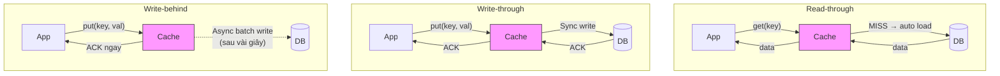

# Read-through, write-through, write-behind khác nhau thế nào?

## ⚡ Tóm tắt ngắn (30s)
* **Read-through**: Cache tự động load data từ DB khi miss — application chỉ gọi `cache.get()`, không cần biết DB
* **Write-through**: Mỗi write đi qua cache → cache ghi đồng bộ vào DB → đảm bảo consistency nhưng **write chậm hơn**
* **Write-behind (Write-back)**: Write vào cache trước, cache ghi **bất đồng bộ** vào DB sau → write cực nhanh nhưng **risk mất data**
* Trong thực tế Java: Caffeine + CacheLoader = Read-through; Spring `@CachePut` ≈ Write-through; Write-behind cần custom implementation hoặc Redisson
* **Rule of thumb**: Read-heavy → Read-through/Cache-aside; Write-heavy + chấp nhận eventual consistency → Write-behind; Cần strong consistency → Write-through

---

## 🔍 Chi tiết bản chất thực chiến

### So sánh flow 3 patterns



### Read-through — Cache tự load

Khác với Cache-aside ở chỗ **application không biết DB tồn tại**. Cache được configure với một `CacheLoader` — khi miss, cache tự gọi loader để fetch data.

**Ưu điểm**:
- Code application sạch, chỉ interact với cache
- Cache layer quản lý concurrency (chống stampede)
- Dễ swap implementation (đổi data source mà không đổi business code)

**Nhược điểm**:
- Cache layer phức tạp hơn
- Khó customize logic load cho từng use case

### Write-through — Đồng bộ cache + DB

Mỗi operation write đều **đồng thời** ghi vào cache VÀ DB. Request chỉ trả về khi cả hai đã ghi xong.

**Ưu điểm**: Cache và DB luôn consistent
**Nhược điểm**: Write latency tăng gấp đôi (cache + DB), không phù hợp write-heavy

### Write-behind — Ghi bất đồng bộ

Write chỉ ghi vào cache, trả về ngay cho client. Cache accumulate writes rồi **batch flush** vào DB sau khoảng thời gian hoặc khi đủ batch size.

**Ưu điểm**: Write cực nhanh, batching giảm DB load
**Nhược điểm**: **Nếu cache crash trước khi flush → mất data!** Chỉ dùng khi chấp nhận data loss risk

---

## 💻 Code thực chiến: BAD vs GOOD

### ❌ BAD: Nhầm lẫn patterns, implementation sai

```java
@Service
public class OrderService {

    // ❌ Tưởng là write-through nhưng thực ra là race condition
    public Order createOrder(OrderRequest req) {
        Order order = new Order(req);

        // ❌ Write cache trước DB → nếu DB fail, cache có data sai
        redisTemplate.opsForValue().set("order:" + order.getId(),
                objectMapper.writeValueAsString(order));

        // DB có thể fail ở đây → cache đã có data nhưng DB không có!
        orderRepository.save(order);

        return order;
    }

    // ❌ Tưởng là write-behind nhưng thực ra mất data
    public void updateInventory(Long productId, int quantity) {
        // Chỉ ghi vào cache, quên schedule ghi DB
        redisTemplate.opsForValue().set(
                "inventory:" + productId, String.valueOf(quantity));
        // Redis restart → inventory data mất hoàn toàn!
    }
}
```

---

### ✅ GOOD: Read-through với Caffeine CacheLoader

```java
@Configuration
public class ReadThroughCacheConfig {

    @Bean
    public LoadingCache<Long, Product> productCache(ProductRepository repo) {
        return Caffeine.newBuilder()
                .maximumSize(10_000)
                .expireAfterWrite(Duration.ofMinutes(10))
                .refreshAfterWrite(Duration.ofMinutes(5)) // Background refresh
                .recordStats()
                // ✅ Read-through: Cache tự load khi miss
                .build(new CacheLoader<>() {
                    @Override
                    public Product load(@NonNull Long id) {
                        log.info("Read-through: loading product {} from DB", id);
                        return repo.findById(id).orElse(null);
                    }

                    // ✅ Batch loading cho hiệu quả hơn
                    @Override
                    public @NonNull Map<Long, Product> loadAll(
                            @NonNull Set<? extends Long> ids) {
                        log.info("Read-through: batch loading {} products", ids.size());
                        List<Product> products = repo.findAllById(ids);
                        return products.stream()
                                .collect(Collectors.toMap(Product::getId, p -> p));
                    }
                });
    }
}

@Service
@Slf4j
public class ProductService {

    @Autowired
    private LoadingCache<Long, Product> productCache;

    // ✅ Application code cực sạch — không biết DB tồn tại
    public Product getProduct(Long id) {
        return productCache.get(id); // Tự load nếu miss
    }

    // ✅ Batch get — cache tự batch load những key chưa có
    public Map<Long, Product> getProducts(Set<Long> ids) {
        return productCache.getAll(ids);
    }
}
```

---

### ✅ GOOD: Write-through pattern

```java
@Service
@Slf4j
public class ProductWriteThroughService {

    @Autowired
    private ProductRepository productRepository;

    @Autowired
    private StringRedisTemplate redisTemplate;

    @Autowired
    private ObjectMapper objectMapper;

    // ✅ Write-through: DB first → cache update → return
    @Transactional
    public Product updateProduct(Long id, ProductUpdateRequest req) {
        // Step 1: Update DB (source of truth)
        Product product = productRepository.findById(id)
                .orElseThrow(() -> new ProductNotFoundException(id));
        product.setName(req.getName());
        product.setPrice(req.getPrice());
        Product saved = productRepository.save(product);

        // Step 2: Update cache đồng bộ
        try {
            String key = "product:" + id;
            String json = objectMapper.writeValueAsString(saved);
            redisTemplate.opsForValue().set(key, json, Duration.ofMinutes(10));
            log.debug("Write-through: cache updated for product {}", id);
        } catch (Exception e) {
            // Cache update fail → log warning, data vẫn đúng trong DB
            // Next read sẽ cache miss → load lại từ DB
            log.warn("Write-through cache update failed: {}", e.getMessage());
        }

        return saved;
    }
}
```

---

### ✅ GOOD: Write-behind pattern với async queue

```java
@Service
@Slf4j
public class InventoryWriteBehindService {

    @Autowired
    private StringRedisTemplate redisTemplate;

    private final BlockingQueue<InventoryUpdate> writeQueue =
            new LinkedBlockingQueue<>(10_000);

    // ✅ Write-behind: ghi cache ngay, trả về nhanh
    public void updateStock(Long productId, int newQuantity) {
        String key = "inventory:" + productId;

        // Step 1: Write to cache immediately (fast response)
        redisTemplate.opsForValue().set(key, String.valueOf(newQuantity));

        // Step 2: Queue DB write cho background processing
        writeQueue.offer(new InventoryUpdate(productId, newQuantity, Instant.now()));
        log.debug("Write-behind: queued DB write for product {}", productId);
    }

    // ✅ Background thread batch flush vào DB
    @Scheduled(fixedDelay = 5000) // Flush mỗi 5 giây
    public void flushToDatabase() {
        List<InventoryUpdate> batch = new ArrayList<>();
        writeQueue.drainTo(batch, 500); // Max 500 items per batch

        if (batch.isEmpty()) return;

        log.info("Write-behind: flushing {} inventory updates to DB", batch.size());

        try {
            // ✅ Batch update — hiệu quả hơn nhiều so với individual updates
            // Deduplicate: chỉ giữ update cuối cùng cho mỗi productId
            Map<Long, InventoryUpdate> deduped = new LinkedHashMap<>();
            batch.forEach(u -> deduped.put(u.getProductId(), u));

            inventoryRepository.batchUpdateStock(deduped.values());
            log.info("Write-behind: flushed {} unique updates", deduped.size());
        } catch (Exception e) {
            // ❗ Critical: DB write fail → re-queue hoặc dead letter
            log.error("Write-behind flush failed, re-queueing {} items", batch.size(), e);
            batch.forEach(writeQueue::offer); // Re-queue for retry
        }
    }

    // ✅ Graceful shutdown: flush remaining data trước khi shutdown
    @PreDestroy
    public void onShutdown() {
        log.info("Shutting down, flushing remaining {} writes", writeQueue.size());
        flushToDatabase();
    }
}
```

---

## 📊 Bảng so sánh 3 patterns + Cache-aside

| Tiêu chí | Cache-aside | Read-through | Write-through | Write-behind |
|:---|:---|:---|:---|:---|
| **Read performance** | Miss → chậm | Miss → chậm (auto load) | N/A | N/A |
| **Write performance** | N/A (delete cache) | N/A | Chậm (sync cả 2) | ⚡ Nhanh nhất |
| **Consistency** | Eventual (TTL) | Eventual (TTL) | Strong | Eventual |
| **Data loss risk** | Không | Không | Không | **Có** (cache crash) |
| **Code complexity** | Thấp | Trung bình | Trung bình | Cao |
| **DB load** | Giảm read | Giảm read | Không giảm write | **Giảm mạnh write** |
| **Use case** | General purpose | Read-heavy, clean code | Cần consistency | Write-heavy, logging |
| **Java impl** | RedisTemplate manual | Caffeine CacheLoader | @CachePut + DB write | Custom queue + @Scheduled |

---

## ⚠️ Common Gotchas & Questions follow-up

### 1. Write-behind mất data thì sao?
* **Problem**: Redis crash khi queue chưa flush → data mất vĩnh viễn
* **Solution**: Dùng Redis Streams hoặc Kafka thay vì in-memory queue, hoặc Redis AOF persistence
* **Reality**: Write-behind thường chỉ dùng cho data **có thể reconstruct** (analytics, view count, cache warm)

### 2. Có thể combine patterns không?
* **Hoàn toàn có**: Read-through cho read + Write-behind cho write là combo phổ biến
* Ví dụ: View count — Read-through load từ DB, Write-behind batch update count mỗi 30s
* E-commerce product: Read-through cho product info, Write-through cho price update (cần accuracy)

### 3. Trong microservices, pattern nào phù hợp?
* **Cache-aside** vẫn là default vì đơn giản, dễ debug, mỗi service tự quản lý
* **Write-behind** dùng cho event-driven architecture — service emit event, consumer update cache
* **Read-through** dùng khi muốn abstract data source (switch giữa DB, API, file)

### 4. Spring Cache abstraction support pattern nào?
* `@Cacheable` = Cache-aside (lazy load)
* `@CachePut` = Write-through (update cache after method execution)
* `@CacheEvict` = Cache invalidation
* Write-behind: **Không hỗ trợ built-in** — cần custom implementation

### 5. Performance benchmark thực tế?
* Write-through: latency tăng 50-100% so với write trực tiếp DB (thêm cache write)
* Write-behind: latency giảm 80-90% (chỉ write cache, ~1ms vs ~50ms DB)
* Read-through: cache hit ≈ 1ms, miss ≈ DB latency + cache populate time
