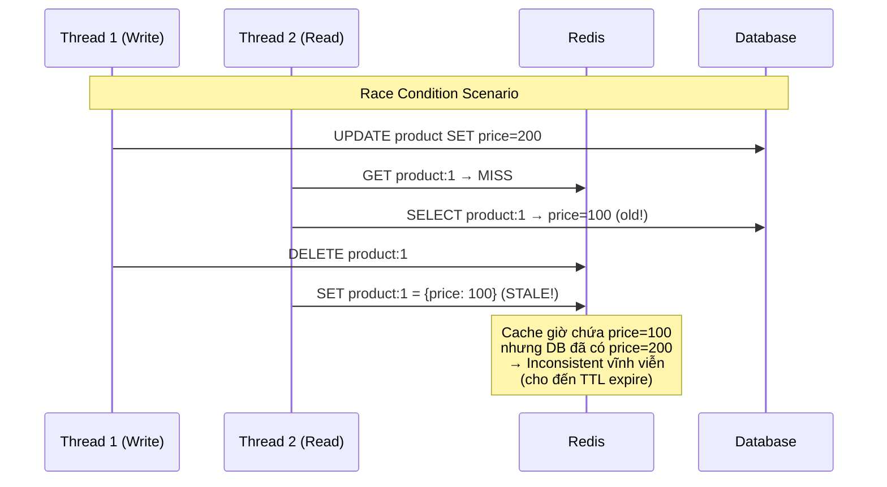

# Cache invalidation khó ở điểm nào?

## ⚡ Tóm tắt ngắn (30s)
* Phil Karlton: *"There are only two hard things in CS: cache invalidation and naming things"* — không phải nói đùa
* Khó vì **distributed state coordination**: cache và DB là 2 hệ thống riêng biệt, không có distributed transaction giữa chúng
* 3 vấn đề chính: **Race condition** (concurrent read/write), **Partial failure** (cache update thành công, DB fail hoặc ngược lại), **Multi-node consistency** (local cache trên nhiều instances)
* Không có perfect solution — chỉ có **trade-off**: TTL-based (eventual consistency), event-driven (near real-time), dual-write (complex error handling)
* Production mindset: Chấp nhận stale window, thiết kế hệ thống **tolerant** với stale data thay vì cố gắng achieve perfect consistency

---

## 🔍 Chi tiết bản chất thực chiến

### Tại sao Cache Invalidation cực khó?

Bản chất vấn đề: **Cache và DB không share transaction boundary**. Không có cách nào atomic update cả hai cùng lúc.



### 5 vấn đề cốt lõi

#### 1. Race Condition giữa Read và Write
Như diagram trên — thứ tự thực thi không đảm bảo trong concurrent environment. Delete cache trước hay sau DB update đều có race condition.

#### 2. Partial Failure
```
DB update ✅ → Cache delete ❌ (Redis timeout) → Stale data
DB update ❌ → Cache delete ✅ → Cache miss → Load old data → OK (may mắn)
```
Không có 2-phase commit giữa Redis và MySQL.

#### 3. Multi-instance Local Cache
Khi chạy 5 instances, mỗi instance có local cache riêng. Update 1 instance không tự động invalidate 4 instances còn lại.

#### 4. Dependent/Derived Cache
Product thay đổi → phải invalidate: product cache, category listing, search index, recommendation, cart display... Biết hết dependencies là nightmare.

#### 5. Timing — "Khi nào data thực sự consistent?"
Từ lúc DB update đến khi ALL cache layers reflect data mới → khoảng thời gian này là **stale window**. Giảm stale window = tăng complexity.

---

## 💻 Code thực chiến: BAD vs GOOD

### ❌ BAD: Các cách invalidation sai phổ biến

```java
@Service
public class ProductService {

    // ❌ Pattern 1: Delete cache TRƯỚC update DB
    public Product updateProduct(Long id, ProductUpdateRequest req) {
        // Xóa cache trước
        redisTemplate.delete("product:" + id);

        // Nếu DB update fail → cache đã xóa
        // Nhưng thread khác có thể đọc DB (data cũ) và populate cache
        // → Race condition: cache lại chứa data cũ!
        Product product = productRepository.findById(id).orElseThrow();
        product.update(req);
        return productRepository.save(product);
    }

    // ❌ Pattern 2: Update cache thay vì delete
    public Product updateProductV2(Long id, ProductUpdateRequest req) {
        Product product = productRepository.findById(id).orElseThrow();
        product.update(req);
        Product saved = productRepository.save(product);

        // Thread A: price = 100, Thread B: price = 200
        // DB order: A → B (DB has 200)
        // Cache order: B → A (Cache has 100) ← INCONSISTENT!
        redisTemplate.opsForValue().set("product:" + id,
                objectMapper.writeValueAsString(saved), Duration.ofMinutes(10));

        return saved;
    }

    // ❌ Pattern 3: Quên invalidate dependent caches
    @CacheEvict(value = "products", key = "#id")
    public Product updateProductV3(Long id, ProductUpdateRequest req) {
        Product saved = doUpdate(id, req);
        // Quên invalidate: category-products, search-results,
        // product-recommendations, cart-items...
        // → Các cache khác vẫn hiển thị data cũ
        return saved;
    }
}
```

---

### ✅ GOOD: Production-grade invalidation strategies

```java
@Service
@Slf4j
public class ProductService {

    // ✅ Strategy 1: Delete after write + Delayed double deletion
    @Transactional
    public Product updateProduct(Long id, ProductUpdateRequest req) {
        Product product = productRepository.findById(id).orElseThrow();
        product.update(req);
        Product saved = productRepository.save(product);

        // Step 1: Delete cache ngay sau DB update
        invalidateProductCache(id);

        // Step 2: Delayed second deletion (chống race condition)
        // Sau 500ms, xóa lần nữa để catch any stale data
        // populated bởi concurrent read giữa DB write và first delete
        scheduledExecutor.schedule(
                () -> invalidateProductCache(id),
                500, TimeUnit.MILLISECONDS
        );

        return saved;
    }

    private void invalidateProductCache(Long id) {
        try {
            // ✅ Invalidate tất cả related caches
            Set<String> keysToDelete = Set.of(
                    "product:" + id,
                    "product-detail:" + id,
                    "product-listing:*"  // Pattern delete cho listing pages
            );
            redisTemplate.delete(keysToDelete);

            // ✅ Publish invalidation event cho các service khác
            redisTemplate.convertAndSend("cache-invalidation",
                    new CacheInvalidationEvent("product", id));

            log.debug("Invalidated caches for product {}", id);
        } catch (Exception e) {
            log.error("Cache invalidation failed for product {}", id, e);
            // TTL sẽ tự expire — eventual consistency
        }
    }
}

// ✅ Strategy 2: Event-driven invalidation (recommended cho microservices)
@Component
@Slf4j
public class CacheInvalidationListener {

    @Autowired
    private StringRedisTemplate redisTemplate;

    @Autowired
    private Cache<Long, Product> localCache;

    // ✅ Listen DB change events (CDC via Debezium hoặc application events)
    @KafkaListener(topics = "product-changes", groupId = "cache-invalidation")
    public void onProductChanged(ProductChangedEvent event) {
        log.info("Received product change event: {} for id {}",
                event.getOperation(), event.getProductId());

        Long productId = event.getProductId();

        // Invalidate distributed cache
        redisTemplate.delete("product:" + productId);

        // Invalidate local cache
        localCache.invalidate(productId);

        // Invalidate dependent caches
        invalidateDependentCaches(productId, event);
    }

    private void invalidateDependentCaches(Long productId,
                                           ProductChangedEvent event) {
        // ✅ Cascade invalidation cho related data
        if (event.isPriceChanged()) {
            redisTemplate.delete("cart-totals:*");   // Recalculate cart
        }
        if (event.isCategoryChanged()) {
            Long oldCatId = event.getOldCategoryId();
            Long newCatId = event.getNewCategoryId();
            redisTemplate.delete("category-products:" + oldCatId);
            redisTemplate.delete("category-products:" + newCatId);
        }
        // Invalidate search index (async)
        searchIndexService.reindex(productId);
    }
}

// ✅ Strategy 3: Version-based invalidation (chống stale write)
@Service
public class VersionedCacheService {

    // Cache key bao gồm version → tự động invalidate khi version thay đổi
    public Product getProduct(Long id) {
        // Lấy current version từ Redis (atomic counter, rất nhanh)
        Long version = redisTemplate.opsForValue()
                .increment("product-version:" + id, 0); // Read without increment

        String cacheKey = "product:" + id + ":v" + version;
        String cached = redisTemplate.opsForValue().get(cacheKey);

        if (cached != null) {
            return objectMapper.readValue(cached, Product.class);
        }

        Product product = productRepository.findById(id).orElseThrow();
        redisTemplate.opsForValue().set(cacheKey, 
                objectMapper.writeValueAsString(product), Duration.ofMinutes(30));
        return product;
    }

    // ✅ Invalidate = chỉ cần tăng version
    // Old cache entries tự expire theo TTL, không cần delete
    public void invalidateProduct(Long id) {
        redisTemplate.opsForValue().increment("product-version:" + id);
    }
}
```

---

### ✅ GOOD: Multi-instance local cache invalidation với Redis Pub/Sub

```java
@Component
@Slf4j
public class LocalCacheInvalidationSync {

    private static final String INVALIDATION_CHANNEL = "local-cache-sync";

    @Autowired
    private Cache<Long, Product> localCache;

    @Autowired
    private StringRedisTemplate redisTemplate;

    // ✅ Khi local cache invalidate, broadcast cho tất cả instances
    public void invalidateAndBroadcast(Long productId) {
        localCache.invalidate(productId);

        // Publish event → tất cả instances khác sẽ nhận và invalidate
        redisTemplate.convertAndSend(INVALIDATION_CHANNEL,
                String.valueOf(productId));
    }

    // ✅ Listener nhận events từ instances khác
    @Bean
    public RedisMessageListenerContainer listenerContainer(
            RedisConnectionFactory factory) {
        RedisMessageListenerContainer container = new RedisMessageListenerContainer();
        container.setConnectionFactory(factory);
        container.addMessageListener((message, pattern) -> {
            Long productId = Long.parseLong(new String(message.getBody()));
            localCache.invalidate(productId);
            log.debug("Local cache invalidated for product {} via pub/sub", productId);
        }, new ChannelTopic(INVALIDATION_CHANNEL));
        return container;
    }
}
```

---

## 📊 Bảng so sánh các Invalidation Strategies

| Strategy | Stale Window | Complexity | Data Loss Risk | Use Case |
|:---|:---|:---|:---|:---|
| **TTL-only** | Seconds~Minutes | Thấp | Không | Non-critical data (avatar, bio) |
| **Delete on write** | Milliseconds (race) | Trung bình | Không | General CRUD operations |
| **Double deletion** | ~0 (nearly none) | Trung bình | Không | Write-heavy + consistency need |
| **Event-driven (CDC)** | Seconds (Kafka lag) | Cao | Có (event loss) | Microservices, cross-service |
| **Version-based** | ~0 | Trung bình | Không | High-concurrency writes |
| **Pub/Sub broadcast** | Milliseconds | Trung bình | Có (message loss) | Multi-instance local cache |

---

## ⚠️ Common Gotchas & Questions follow-up

### 1. "Có thể dùng distributed transaction (2PC) cho cache + DB?"
* **Không nên**: Redis không support XA transactions, latency cực cao, single point of failure
* **Thay vào đó**: Chấp nhận eventual consistency + TTL safety net

### 2. Cache key phụ thuộc vào nhiều entity thì invalidate thế nào?
* **Problem**: Cache key `search:category=electronics&sort=price&page=1` — product thay đổi → phải invalidate TẤT CẢ search result pages
* **Solution**: Dùng **tag-based invalidation** — mỗi cache entry tag với entity IDs, invalidate by tag. Hoặc dùng TTL ngắn cho complex queries

### 3. Thundering herd sau khi invalidate?
* Cache entry bị delete → 1000 concurrent requests cùng miss → 1000 DB queries
* **Solution**: Sử dụng mutex/lock — chỉ 1 request rebuild cache, các request khác đợi hoặc trả về stale data tạm thời

### 4. CDC (Change Data Capture) invalidation hoạt động thế nào?
* Debezium đọc MySQL binlog → publish event lên Kafka → consumer invalidate cache
* **Ưu**: Không cần modify application code, catch mọi DB change (kể cả direct SQL update)
* **Nhược**: Thêm infrastructure (Debezium + Kafka), latency vài giây

### 5. Có nên invalidate hay update cache?
* **Invalidate (delete) được ưu tiên** vì an toàn hơn — worst case = cache miss = load fresh data
* **Update cache** chỉ khi write latency cực quan trọng VÀ data transformation đơn giản (1:1 mapping)
