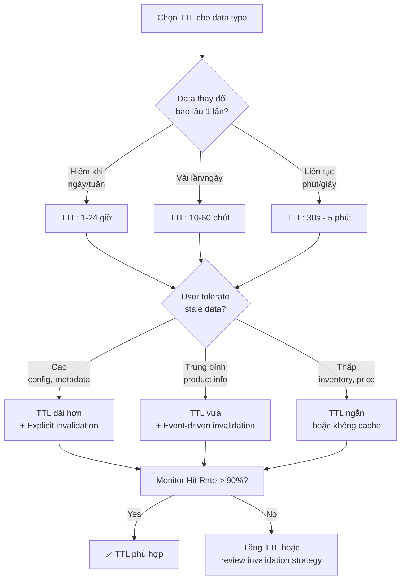

# TTL nên chọn như thế nào?

## ⚡ Tóm tắt ngắn (30s)
* TTL (Time-To-Live) không có magic number — phụ thuộc vào **data change frequency**, **tolerance cho stale data**, và **cache hit rate target**
* Rule of thumb: `TTL ≈ acceptable stale window` — nếu user chấp nhận data cũ 5 phút → TTL = 5 phút
* TTL quá ngắn → cache hit rate thấp, DB vẫn bị tải. TTL quá dài → stale data, user experience tệ
* Production practice: Bắt đầu conservative (ngắn), monitor hit rate, rồi tăng dần. Target hit rate > 90%
* Kỹ thuật quan trọng: **TTL jitter** (random ±20%) để tránh thundering herd khi nhiều keys expire cùng lúc

---

## 🔍 Chi tiết bản chất thực chiến

### Framework quyết định TTL



### TTL Guidelines theo loại data

| Data Type | Ví dụ | TTL đề xuất | Lý do |
|:---|:---|:---|:---|
| **Static config** | Feature flags, system settings | 1-6 giờ | Hiếm thay đổi, invalidate manually |
| **Reference data** | Country list, categories | 1-24 giờ | Gần như không đổi |
| **Product info** | Name, description, images | 10-30 phút | Đổi vài lần/ngày |
| **Product price** | Giá bán, khuyến mãi | 1-5 phút | Đổi thường xuyên, stale = mất tiền |
| **Inventory/Stock** | Số lượng tồn kho | 30s - 2 phút | Real-time critical |
| **User session** | Login session | 30 phút (sliding) | Security requirement |
| **Search results** | Search page, listing | 5-15 phút | Acceptable freshness |
| **Dashboard/Report** | Analytics, aggregation | 5-30 phút | Expensive computation |
| **Rate limit counter** | API rate limit | Window size (1 phút) | Functional requirement |
| **Null/Not-found** | Cache penetration guard | 1-2 phút | Ngắn vì data có thể được tạo |

### 3 Yếu tố quyết định TTL

**1. Data Change Frequency**
- Data đổi mỗi giây (stock price) → TTL cực ngắn hoặc không cache
- Data đổi mỗi ngày (user profile) → TTL giờ

**2. Business Impact of Stale Data**
- Stale price → user mua giá sai → claim/refund → $$$ loss
- Stale avatar → user thấy ảnh cũ → minor inconvenience

**3. Cache Hit Rate Economics**
- TTL 10s, data được request 1 lần/phút → hit rate ≈ 0% → vô nghĩa
- TTL 10 phút, data được request 100 lần/phút → hit rate ≈ 99.9% → excellent

---

## 💻 Code thực chiến: BAD vs GOOD

### ❌ BAD: TTL cứng, không jitter, không monitoring

```java
@Configuration
public class CacheConfig {

    @Bean
    public RedisCacheManager cacheManager(RedisConnectionFactory factory) {
        // ❌ Cùng 1 TTL cho tất cả data types
        // Product info và inventory đều 30 phút — inventory stale quá lâu!
        RedisCacheConfiguration config = RedisCacheConfiguration.defaultCacheConfig()
                .entryTtl(Duration.ofMinutes(30));

        return RedisCacheManager.builder(factory)
                .cacheDefaults(config)
                .build();
    }
}

@Service
public class ProductService {

    // ❌ Hard-coded TTL, không jitter
    public void cacheProduct(Product product) {
        // 1000 products được cache cùng lúc, cùng TTL = 600s
        // → Sau 600s, 1000 keys expire ĐỒNG THỜI
        // → 1000 cache miss → 1000 DB queries → DB spike!
        redisTemplate.opsForValue().set(
                "product:" + product.getId(),
                objectMapper.writeValueAsString(product),
                Duration.ofSeconds(600)  // ❌ Exact same TTL
        );
    }

    // ❌ TTL quá dài cho volatile data
    @Cacheable(value = "inventory", key = "#productId")
    public int getStock(Long productId) {
        return inventoryRepository.getStock(productId);
        // Default TTL 30 phút cho inventory → user thấy "còn hàng"
        // nhưng thực tế đã hết → đặt hàng → fail → bad UX
    }
}
```

---

### ✅ GOOD: Dynamic TTL với jitter và per-type configuration

```java
@Configuration
@EnableCaching
public class CacheConfig {

    @Bean
    public RedisCacheManager cacheManager(RedisConnectionFactory factory) {
        RedisCacheConfiguration defaultConfig = RedisCacheConfiguration.defaultCacheConfig()
                .serializeValuesWith(SerializationPair.fromSerializer(
                        new GenericJackson2JsonRedisSerializer()));

        // ✅ TTL khác nhau cho từng cache name dựa trên data characteristics
        Map<String, RedisCacheConfiguration> cacheConfigs = Map.of(
                "products",       defaultConfig.entryTtl(Duration.ofMinutes(15)),
                "categories",     defaultConfig.entryTtl(Duration.ofHours(2)),
                "inventory",      defaultConfig.entryTtl(Duration.ofSeconds(60)),
                "user-profiles",  defaultConfig.entryTtl(Duration.ofMinutes(30)),
                "search-results", defaultConfig.entryTtl(Duration.ofMinutes(5)),
                "dashboard",      defaultConfig.entryTtl(Duration.ofMinutes(10)),
                "null-guard",     defaultConfig.entryTtl(Duration.ofMinutes(2))
        );

        return RedisCacheManager.builder(factory)
                .cacheDefaults(defaultConfig.entryTtl(Duration.ofMinutes(10)))
                .withInitialCacheConfigurations(cacheConfigs)
                .build();
    }
}

// ✅ TTL Jitter utility — tránh thundering herd
@Component
public class TtlStrategy {

    private static final ThreadLocalRandom RANDOM = ThreadLocalRandom.current();

    /**
     * Thêm jitter ±20% vào TTL base
     * Base 600s → actual TTL random trong [480s, 720s]
     * → Các keys expire phân tán, không đồng loạt
     */
    public Duration withJitter(Duration baseTtl) {
        long baseSeconds = baseTtl.getSeconds();
        long jitter = (long) (baseSeconds * 0.2);  // ±20%
        long actualTtl = baseSeconds - jitter + RANDOM.nextLong(2 * jitter + 1);
        return Duration.ofSeconds(actualTtl);
    }

    /**
     * TTL based on data type characteristics
     */
    public Duration forDataType(CacheDataType type) {
        Duration baseTtl = switch (type) {
            case STATIC_CONFIG    -> Duration.ofHours(4);
            case REFERENCE_DATA   -> Duration.ofHours(1);
            case PRODUCT_INFO     -> Duration.ofMinutes(15);
            case PRODUCT_PRICE    -> Duration.ofMinutes(3);
            case INVENTORY        -> Duration.ofSeconds(45);
            case USER_SESSION     -> Duration.ofMinutes(30);
            case SEARCH_RESULT    -> Duration.ofMinutes(10);
            case COMPUTED_REPORT  -> Duration.ofMinutes(20);
            case NULL_MARKER      -> Duration.ofMinutes(2);
        };
        return withJitter(baseTtl);
    }
}
```

---

### ✅ GOOD: Adaptive TTL và cache monitoring

```java
@Service
@Slf4j
public class SmartCacheService {

    @Autowired
    private StringRedisTemplate redisTemplate;

    @Autowired
    private TtlStrategy ttlStrategy;

    @Autowired
    private MeterRegistry meterRegistry;  // Micrometer for monitoring

    // ✅ Cache với TTL jitter + monitoring
    public Product getProduct(Long id) {
        String key = "product:" + id;
        Timer.Sample sample = Timer.start(meterRegistry);

        try {
            String cached = redisTemplate.opsForValue().get(key);
            if (cached != null) {
                meterRegistry.counter("cache.hits", "type", "product").increment();
                sample.stop(meterRegistry.timer("cache.latency", "result", "hit"));
                return objectMapper.readValue(cached, Product.class);
            }
        } catch (Exception e) {
            meterRegistry.counter("cache.errors", "type", "product").increment();
            log.warn("Cache read failed: {}", e.getMessage());
        }

        meterRegistry.counter("cache.misses", "type", "product").increment();

        Product product = productRepository.findById(id).orElse(null);

        if (product != null) {
            try {
                // ✅ TTL với jitter
                Duration ttl = ttlStrategy.forDataType(CacheDataType.PRODUCT_INFO);
                redisTemplate.opsForValue().set(key,
                        objectMapper.writeValueAsString(product), ttl);
            } catch (Exception e) {
                log.warn("Cache write failed: {}", e.getMessage());
            }
        }

        sample.stop(meterRegistry.timer("cache.latency", "result", "miss"));
        return product;
    }

    // ✅ Sliding TTL cho session — reset TTL mỗi lần access
    public UserSession getSession(String sessionId) {
        String key = "session:" + sessionId;
        String cached = redisTemplate.opsForValue().get(key);

        if (cached != null) {
            // ✅ Refresh TTL mỗi lần access (sliding expiration)
            // User active → session sống mãi
            // User inactive 30 phút → session expire
            redisTemplate.expire(key, Duration.ofMinutes(30));
            return objectMapper.readValue(cached, UserSession.class);
        }
        return null;
    }
}

// ✅ Grafana dashboard queries for cache monitoring
// Cache hit rate: cache.hits / (cache.hits + cache.misses) * 100
// Alert: hit rate < 80% → TTL quá ngắn hoặc cache size quá nhỏ
// Alert: hit rate > 99.5% + TTL > 1 hour → có thể stale data risk
```

---

### ✅ GOOD: Early refresh pattern — tránh TTL expire gây miss

```java
@Service
public class EarlyRefreshCacheService {

    // ✅ Refresh cache TRƯỚC khi TTL hết hạn
    // Tránh cache miss hoàn toàn cho hot keys
    public Product getProductWithEarlyRefresh(Long id) {
        String key = "product:" + id;
        String cached = redisTemplate.opsForValue().get(key);

        if (cached != null) {
            // Check remaining TTL
            Long remainingTtl = redisTemplate.getExpire(key, TimeUnit.SECONDS);

            // ✅ Nếu TTL còn < 20% thời gian ban đầu → trigger background refresh
            // TTL 600s, còn < 120s → refresh
            if (remainingTtl != null && remainingTtl < 120) {
                // Async refresh, không block current request
                CompletableFuture.runAsync(() -> refreshCache(id));
            }

            return objectMapper.readValue(cached, Product.class);
        }

        // Cache miss → load sync
        return loadAndCache(id);
    }

    private void refreshCache(Long id) {
        try {
            Product product = productRepository.findById(id).orElse(null);
            if (product != null) {
                Duration ttl = ttlStrategy.withJitter(Duration.ofMinutes(10));
                redisTemplate.opsForValue().set("product:" + id,
                        objectMapper.writeValueAsString(product), ttl);
                log.debug("Early-refreshed cache for product {}", id);
            }
        } catch (Exception e) {
            log.warn("Early refresh failed for product {}: {}", id, e.getMessage());
        }
    }
}
```

---

## 📊 Bảng so sánh TTL Strategies

| Strategy | Mô tả | Ưu điểm | Nhược điểm |
|:---|:---|:---|:---|
| **Fixed TTL** | Cùng 1 TTL cho mọi key | Đơn giản | Thundering herd, không flexible |
| **TTL + Jitter** | TTL ± random% | Tránh mass expiry | Slightly complex |
| **Sliding TTL** | Reset TTL mỗi lần access | Hot data sống lâu | Data rất hot → không bao giờ expire → stale |
| **Early refresh** | Refresh trước khi expire | Zero miss cho hot keys | Background thread overhead |
| **Adaptive TTL** | TTL dựa trên access pattern | Optimal hit rate | Complex implementation |
| **No TTL + Event** | Chỉ invalidate bằng event | Fresh data luôn | Nếu event miss → stale vĩnh viễn |

---

## ⚠️ Common Gotchas & Questions follow-up

### 1. TTL = 0 hoặc TTL = -1 nghĩa là gì trong Redis?
* **TTL = -1**: Key tồn tại nhưng không có expiry (sống vĩnh viễn cho đến khi bị delete hoặc evict bởi maxmemory policy)
* **TTL = -2**: Key không tồn tại
* **TTL = 0**: Thường có nghĩa expire ngay lập tức (implementation-dependent)
* Production: **Luôn set TTL** — key không có TTL là memory leak tiềm tàng

### 2. Thundering Herd khi TTL expire?
* **Problem**: 1000 keys cùng TTL → expire cùng lúc → 1000 DB queries
* **Solution 1**: TTL jitter (±20%) — keys expire phân tán
* **Solution 2**: Early refresh — refresh trước khi expire, không bao giờ có mass miss
* **Solution 3**: Mutex/lock — chỉ 1 thread rebuild, các thread khác đợi hoặc dùng stale data

### 3. Sliding TTL có phù hợp không?
* **Phù hợp cho session**: User active → session extend → good UX
* **Không phù hợp cho data cache**: Hot product được đọc liên tục → TTL reset mãi → cache stale vĩnh viễn
* **Fix**: Dùng sliding TTL với maximum lifetime (cap): `min(slidingTTL, maxLifetime)`

### 4. Làm sao biết TTL hiện tại đã tối ưu?
* Monitor 3 metrics: **hit rate**, **miss rate**, **eviction rate**
* Hit rate < 80% → TTL quá ngắn hoặc cache size quá nhỏ
* Eviction rate cao + hit rate thấp → cache size quá nhỏ (tăng maxmemory)
* Hit rate > 99% + data change frequent → kiểm tra stale data risk

### 5. Nên chọn `EXPIRE` hay `EXPIREAT` trong Redis?
* `EXPIRE key 600`: Expire sau 600 giây từ bây giờ (relative) — dùng cho cache TTL
* `EXPIREAT key timestamp`: Expire tại thời điểm cụ thể (absolute) — dùng cho business logic (khuyến mãi hết lúc 23:59)
* Spring RedisTemplate `set(key, value, Duration)` dùng `EXPIRE` internally
