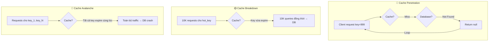

# Cache penetration, cache breakdown, cache avalanche là gì?

## ⚡ Tóm tắt ngắn (30s)
* **Cache Penetration**: Request với key không tồn tại cả trong cache lẫn DB, bypass cache hoàn toàn → DB bị đánh liên tục. Giải pháp: Bloom Filter hoặc cache null value.
* **Cache Breakdown**: Một hot key hết TTL đúng lúc có spike traffic → hàng ngàn request đồng thời đập thẳng DB. Giải pháp: Mutex lock hoặc logical expiration.
* **Cache Avalanche**: Hàng loạt key expire cùng lúc hoặc Redis node down → toàn bộ traffic dồn về DB. Giải pháp: Random TTL, multi-layer cache, circuit breaker.
* Ba vấn đề này là "bộ ba tử thần" của caching — senior phải biết phân biệt và có chiến lược phòng ngừa cho từng loại.

---

## 🔍 Chi tiết bản chất thực chiến

### 1. Cache Penetration (Xuyên thủng cache)

Xảy ra khi client request data **không tồn tại** trong cả cache và database. Kẻ tấn công có thể cố tình gửi request với ID âm hoặc UUID random để bypass cache, mỗi request đều hit DB.

**Kịch bản thực tế**: API `GET /users/{id}` bị bot gọi với `id = -1, -2, -3...` → cache miss liên tục → DB bị flood.

### 2. Cache Breakdown (Phá vỡ cache)

Một **hot key** (key được truy cập cực nhiều) hết hạn TTL. Tại thời điểm đó, hàng trăm/ngàn concurrent request cùng phát hiện cache miss và đồng loạt query DB để rebuild cache.

**Kịch bản thực tế**: Flash sale product có 10K request/s, key expire → 10K request cùng lúc SELECT từ DB.

### 3. Cache Avalanche (Tuyết lở cache)

Xảy ra khi **nhiều key expire đồng thời** hoặc toàn bộ Redis cluster bị down. Khác với breakdown (1 key), avalanche ảnh hưởng **hàng loạt key** cùng lúc.

**Kịch bản thực tế**: Khi khởi tạo cache, tất cả key đều set TTL = 1 hour → sau đúng 1 hour, tất cả expire cùng lúc.



---

## 💻 Code thực chiến: BAD vs GOOD

### ❌ BAD: Không xử lý penetration — mỗi request miss đều hit DB

```java
@Service
public class ProductService {
    @Autowired private RedisTemplate<String, Object> redisTemplate;
    @Autowired private ProductRepository productRepository;

    public Product getProduct(Long id) {
        String key = "product:" + id;
        Product product = (Product) redisTemplate.opsForValue().get(key);
        if (product == null) {
            // ❌ Không validate id, không cache null
            // Attacker gửi id = -1, -999 liên tục → DB bị đánh
            product = productRepository.findById(id).orElse(null);
            if (product != null) {
                redisTemplate.opsForValue().set(key, product, 1, TimeUnit.HOURS);
            }
            // ❌ Nếu product == null, không cache gì → lần sau lại hit DB
        }
        return product;
    }
}
```

---

### ✅ GOOD: Xử lý cả 3 vấn đề với Bloom Filter + Mutex Lock + Random TTL

```java
@Service
@Slf4j
public class ProductService {
    @Autowired private StringRedisTemplate redisTemplate;
    @Autowired private ProductRepository productRepository;

    // ✅ Bloom Filter ngăn penetration
    private final BloomFilter<Long> productBloomFilter;
    private static final String NULL_PLACEHOLDER = "NULL";
    private static final long BASE_TTL = 3600; // 1 hour

    public ProductService(ProductRepository repo) {
        this.productBloomFilter = BloomFilter.create(
            Funnels.longFunnel(), 1_000_000, 0.01); // 1% false positive
        // Warm up bloom filter khi startup
        repo.findAllIds().forEach(productBloomFilter::put);
    }

    public Product getProduct(Long id) {
        // ✅ [Penetration] Bloom Filter check đầu tiên
        if (!productBloomFilter.mightContain(id)) {
            log.debug("Bloom filter rejected id={}", id);
            return null; // Chắc chắn không tồn tại
        }

        String key = "product:" + id;
        String cached = redisTemplate.opsForValue().get(key);

        // ✅ [Penetration] Cache null value
        if (NULL_PLACEHOLDER.equals(cached)) {
            return null;
        }
        if (cached != null) {
            return deserialize(cached);
        }

        // ✅ [Breakdown] Mutex lock - chỉ 1 thread rebuild cache
        String lockKey = "lock:product:" + id;
        Boolean acquired = redisTemplate.opsForValue()
            .setIfAbsent(lockKey, "1", 10, TimeUnit.SECONDS);

        if (Boolean.TRUE.equals(acquired)) {
            try {
                // Double check sau khi acquire lock
                cached = redisTemplate.opsForValue().get(key);
                if (cached != null) return deserialize(cached);

                Product product = productRepository.findById(id).orElse(null);
                if (product != null) {
                    // ✅ [Avalanche] Random TTL tránh expire đồng thời
                    long ttl = BASE_TTL + ThreadLocalRandom.current().nextLong(300);
                    redisTemplate.opsForValue().set(key, serialize(product),
                        ttl, TimeUnit.SECONDS);
                } else {
                    // ✅ Cache null với TTL ngắn
                    redisTemplate.opsForValue().set(key, NULL_PLACEHOLDER,
                        60, TimeUnit.SECONDS);
                }
                return product;
            } finally {
                redisTemplate.delete(lockKey);
            }
        } else {
            // Thread không acquire được lock → retry sau 50ms
            try { Thread.sleep(50); } catch (InterruptedException ignored) {}
            return getProduct(id); // Retry - lúc này cache đã được rebuild
        }
    }
}
```

---

### ✅ GOOD: Logical Expiration cho hot key (tránh breakdown không cần lock)

```java
@Data
public class CacheWrapper<T> {
    private T data;
    private long logicalExpire; // Unix timestamp
}

@Service
public class HotKeyService {
    private static final ExecutorService REBUILD_EXECUTOR =
        Executors.newFixedThreadPool(4);

    public Product getHotProduct(Long id) {
        String key = "hot:product:" + id;
        String json = redisTemplate.opsForValue().get(key);
        if (json == null) return null;

        CacheWrapper<Product> wrapper = deserialize(json);

        // ✅ Chưa hết hạn logical → trả về luôn
        if (wrapper.getLogicalExpire() > System.currentTimeMillis()) {
            return wrapper.getData();
        }

        // ✅ Đã hết hạn → trả stale data + async rebuild
        String lockKey = "lock:rebuild:" + key;
        Boolean acquired = redisTemplate.opsForValue()
            .setIfAbsent(lockKey, "1", 10, TimeUnit.SECONDS);

        if (Boolean.TRUE.equals(acquired)) {
            REBUILD_EXECUTOR.submit(() -> {
                try {
                    Product fresh = productRepository.findById(id).orElse(null);
                    CacheWrapper<Product> newWrapper = new CacheWrapper<>();
                    newWrapper.setData(fresh);
                    newWrapper.setLogicalExpire(
                        System.currentTimeMillis() + 30 * 60 * 1000); // 30 min
                    redisTemplate.opsForValue().set(key, serialize(newWrapper));
                } finally {
                    redisTemplate.delete(lockKey);
                }
            });
        }
        // ✅ Luôn trả stale data → không bao giờ block user
        return wrapper.getData();
    }
}
```

---

## 📊 Bảng so sánh Cache Penetration vs Breakdown vs Avalanche

| Tiêu chí | Penetration | Breakdown | Avalanche |
| :--- | :--- | :--- | :--- |
| **Nguyên nhân** | Key không tồn tại | Hot key expire | Nhiều key expire cùng lúc |
| **Scope** | Từng request riêng lẻ | 1 hot key cụ thể | Hàng loạt key |
| **Tần suất** | Liên tục (nếu bị tấn công) | Tại thời điểm expire | Đột ngột, hàng loạt |
| **Mức độ nguy hiểm** | Trung bình → Cao | Cao | Rất cao (DB crash) |
| **Giải pháp chính** | Bloom Filter + Cache null | Mutex lock / Logical expire | Random TTL + Multi-layer |
| **Phòng ngừa** | Input validation | Never expire hot key | Stagger TTL values |

---

## ⚠️ Common Gotchas & Questions follow-up

### 1. Bloom Filter có false positive
* **Vấn đề**: Bloom Filter nói "có thể tồn tại" nhưng thực tế không → vẫn có 1% penetration lọt qua
* **Hậu quả**: Không nghiêm trọng vì cache null value sẽ chặn lần tiếp theo
* **Giải pháp**: Kết hợp Bloom Filter + cache null value = phòng thủ 2 lớp

### 2. Mutex lock bị deadlock nếu app crash
* **Vấn đề**: Thread acquire lock rồi crash → lock không bao giờ được release
* **Hậu quả**: Tất cả thread khác bị block vĩnh viễn
* **Giải pháp**: Luôn set TTL cho lock key (10-30s), dùng Redisson `RLock` với watchdog

### 3. Random TTL range phải đủ lớn
* **Vấn đề**: Nếu random chỉ trong vài giây, hàng triệu key vẫn có thể expire gần nhau
* **Giải pháp**: Random range nên từ 10-20% của base TTL (VD: base 1h → random thêm 6-12 phút)

### 4. Cache warming sau khi Redis restart
* **Vấn đề**: Redis restart = avalanche scenario → toàn bộ cache trống
* **Giải pháp**: Bật Redis persistence (RDB/AOF), cache warming script, circuit breaker ở application layer

### 5. Logical expiration trade-off
* **Vấn đề**: User có thể nhận stale data trong vài giây khi cache đang được rebuild
* **Giải pháp**: Chỉ dùng cho data có thể chấp nhận eventual consistency (product info, không dùng cho balance/inventory)
