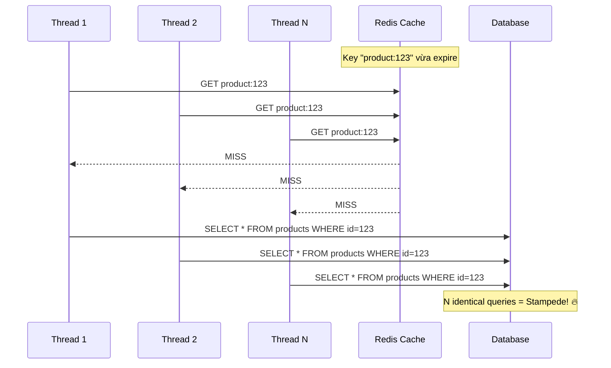

# Cách xử lý cache stampede

## ⚡ Tóm tắt ngắn (30s)
* **Cache stampede** (hay thundering herd) xảy ra khi cache entry expire → hàng trăm/ngàn concurrent request đồng thời query DB để rebuild cache, gây quá tải DB.
* Khác với cache breakdown ở chỗ stampede nhấn mạnh **hiệu ứng bầy đàn** — không chỉ 1 hot key mà bất kỳ key nào dưới high concurrency.
* **4 chiến lược chính**: Locking (mutex), Probabilistic Early Expiration, Logical Expiration, và Request Coalescing.
* Production thường dùng **Redisson distributed lock** hoặc **Caffeine + Redis dual-layer** để giải quyết triệt để.

---

## 🔍 Chi tiết bản chất thực chiến

### Bản chất vấn đề

Khi cache miss xảy ra dưới high concurrency, N threads cùng phát hiện cache trống và cùng thực hiện **expensive query** giống hệt nhau. Đây là **duplicate work** lãng phí resource và có thể crash DB.



### 4 Chiến lược xử lý

| Chiến lược | Ý tưởng | Trade-off |
| :--- | :--- | :--- |
| **Mutex Lock** | Chỉ 1 thread rebuild, còn lại chờ | Tăng latency cho waiting threads |
| **Probabilistic Early Refresh** | Refresh trước khi expire theo xác suất | Có thể dư thừa refresh không cần thiết |
| **Logical Expiration** | Không dùng Redis TTL, check logical time | Trả stale data trong window rebuild |
| **Request Coalescing** | Gom nhiều request thành 1 | Cần infrastructure hỗ trợ (Nginx, Singleflight) |

---

## 💻 Code thực chiến: BAD vs GOOD

### ❌ BAD: Cache-aside pattern không có stampede protection

```java
@Service
public class ReportService {
    @Autowired private StringRedisTemplate redis;
    @Autowired private ReportRepository reportRepo;

    // ❌ Mỗi cache miss = 1 expensive DB query
    // 500 concurrent requests = 500 identical queries
    public Report getDailyReport(String date) {
        String key = "report:" + date;
        String cached = redis.opsForValue().get(key);
        if (cached != null) {
            return deserialize(cached);
        }

        // ❌ Expensive aggregation query chạy 500 lần
        Report report = reportRepo.generateDailyReport(date); // ~2 seconds
        redis.opsForValue().set(key, serialize(report), 1, TimeUnit.HOURS);
        return report;
    }
}
```

---

### ✅ GOOD (Strategy 1): Distributed Mutex Lock với Redisson

```java
@Service
@Slf4j
public class ReportService {
    @Autowired private StringRedisTemplate redis;
    @Autowired private ReportRepository reportRepo;
    @Autowired private RedissonClient redisson;

    private static final long CACHE_TTL = 3600;

    public Report getDailyReport(String date) {
        String key = "report:" + date;
        String cached = redis.opsForValue().get(key);
        if (cached != null) {
            return deserialize(cached);
        }

        // ✅ Distributed lock — chỉ 1 thread rebuild
        RLock lock = redisson.getLock("lock:" + key);
        try {
            // waitTime=5s, leaseTime=30s (auto-release nếu crash)
            boolean acquired = lock.tryLock(5, 30, TimeUnit.SECONDS);
            if (acquired) {
                try {
                    // ✅ Double-check pattern
                    cached = redis.opsForValue().get(key);
                    if (cached != null) return deserialize(cached);

                    Report report = reportRepo.generateDailyReport(date);
                    long randomTtl = CACHE_TTL + ThreadLocalRandom.current()
                        .nextLong(600);
                    redis.opsForValue().set(key, serialize(report),
                        randomTtl, TimeUnit.SECONDS);
                    return report;
                } finally {
                    lock.unlock();
                }
            } else {
                // ✅ Không acquire được → retry, cache đã được thread khác rebuild
                Thread.sleep(100);
                return getDailyReport(date);
            }
        } catch (InterruptedException e) {
            Thread.currentThread().interrupt();
            throw new CacheException("Lock interrupted", e);
        }
    }
}
```

---

### ✅ GOOD (Strategy 2): Probabilistic Early Expiration (XFetch Algorithm)

```java
@Service
@Slf4j
public class ProbabilisticCacheService {

    @Autowired private StringRedisTemplate redis;

    /**
     * XFetch algorithm — refresh cache SỚM HƠN TTL theo xác suất.
     * Khi càng gần thời điểm expire, xác suất refresh càng cao.
     * → Giảm nguy cơ stampede vì cache được refresh trước khi expire.
     */
    public <T> T getWithEarlyRefresh(String key, long ttlSeconds,
            double beta, Supplier<T> dbFetcher, Class<T> type) {

        String cached = redis.opsForValue().get(key);
        Long currentTtl = redis.getExpire(key, TimeUnit.SECONDS);

        if (cached != null && currentTtl != null && currentTtl > 0) {
            // ✅ XFetch: tính xác suất refresh sớm
            // delta = thời gian để compute value (ước tính)
            double delta = 1.0; // seconds
            double randomValue = -delta * beta * Math.log(Math.random());

            if (randomValue < currentTtl) {
                // TTL còn đủ lớn → trả cache bình thường
                return deserialize(cached, type);
            }
            // TTL gần hết → probabilistic refresh (không đợi expire)
            log.info("Early refresh triggered for key={}, ttl={}s", key, currentTtl);
        }

        // Fetch from DB và cache lại
        T value = dbFetcher.get();
        if (value != null) {
            redis.opsForValue().set(key, serialize(value),
                ttlSeconds, TimeUnit.SECONDS);
        }
        return value;
    }
}

// Sử dụng:
// Product p = cacheService.getWithEarlyRefresh(
//     "product:123", 3600, 1.0,
//     () -> productRepo.findById(123L).orElse(null),
//     Product.class);
```

---

### ✅ GOOD (Strategy 3): Dual-Layer Cache (Caffeine + Redis)

```java
@Configuration
public class CacheConfig {

    @Bean
    public Cache<String, Object> localCache() {
        return Caffeine.newBuilder()
            .maximumSize(10_000)
            .expireAfterWrite(5, TimeUnit.MINUTES)  // L1: ngắn hơn
            .recordStats()
            .build();
    }
}

@Service
@Slf4j
public class DualLayerCacheService {
    @Autowired private Cache<String, Object> localCache;   // L1: Caffeine
    @Autowired private StringRedisTemplate redis;           // L2: Redis
    @Autowired private ProductRepository productRepo;

    public Product getProduct(Long id) {
        String key = "product:" + id;

        // ✅ L1: Local cache (in-memory, siêu nhanh, no network)
        Product product = (Product) localCache.getIfPresent(key);
        if (product != null) return product;

        // ✅ L2: Redis
        String cached = redis.opsForValue().get(key);
        if (cached != null) {
            product = deserialize(cached);
            localCache.put(key, product); // Warm L1
            return product;
        }

        // ✅ L3: Database (chỉ khi cả L1 và L2 đều miss)
        // Caffeine's built-in stampede protection (chỉ 1 thread compute)
        product = (Product) localCache.get(key, k -> {
            Product p = productRepo.findById(id).orElse(null);
            if (p != null) {
                long ttl = 3600 + ThreadLocalRandom.current().nextLong(600);
                redis.opsForValue().set(key, serialize(p), ttl, TimeUnit.SECONDS);
            }
            return p;
        });
        return product;
    }
}
```

---

## 📊 Bảng so sánh các chiến lược xử lý Stampede

| Tiêu chí | Mutex Lock | Probabilistic Early | Logical Expiration | Dual-Layer Cache |
| :--- | :--- | :--- | :--- | :--- |
| **Độ phức tạp** | Trung bình | Cao | Trung bình | Cao |
| **Latency impact** | Waiting threads bị delay | Không | Không | Không |
| **Stale data** | Không | Có thể (rất ngắn) | Có (vài giây) | Có thể (L1 stale) |
| **DB protection** | Tốt nhất | Tốt | Tốt | Rất tốt |
| **Phù hợp cho** | Hot key cụ thể | General purpose | Read-heavy, tolerant stale | High-traffic systems |
| **Production phổ biến** | ⭐⭐⭐⭐ | ⭐⭐ | ⭐⭐⭐ | ⭐⭐⭐⭐⭐ |

---

## ⚠️ Common Gotchas & Questions follow-up

### 1. Mutex lock nên dùng Redis SETNX hay Redisson?
* **SETNX đơn giản** nhưng không có watchdog auto-renew → nếu rebuild mất lâu hơn lease time, lock bị release sớm → stampede lại xảy ra
* **Redisson RLock** có watchdog mặc định 30s, tự renew mỗi 10s → an toàn hơn nhiều cho production

### 2. Retry loop có thể gây stack overflow
* **Vấn đề**: Recursive retry `getDailyReport(date)` khi không acquire lock → nếu rebuild lâu quá, stack overflow
* **Giải pháp**: Dùng vòng lặp `while` với max retry count thay vì đệ quy, hoặc trả fallback/stale data

### 3. Caffeine `Cache.get(key, loader)` đã có stampede protection built-in
* Caffeine tự đảm bảo chỉ 1 thread gọi loader function cho cùng 1 key, các thread khác block chờ kết quả
* Đây là lý do Dual-Layer cache hiệu quả — L1 Caffeine chặn stampede ở application level

### 4. Khi nào KHÔNG cần xử lý stampede?
* Traffic thấp (< 100 QPS per key) → xác suất 2 thread cùng miss gần như bằng 0
* Data rebuild nhanh (< 10ms) → dù có stampede, DB vẫn chịu được
* Chỉ invest effort khi key có **high read rate + expensive rebuild**

### 5. Request Coalescing ở infrastructure level
* **Nginx `proxy_cache_lock`**: Chỉ 1 request upstream khi cache miss, còn lại chờ
* **Go's `singleflight`**: Gom duplicate requests — Java equivalent là `CompletableFuture` sharing
* Đây là chiến lược nặng về infra nhưng transparent với application code
