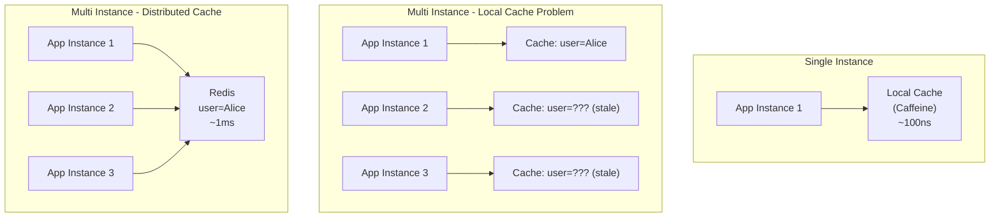

# Local cache và distributed cache khác nhau thế nào?

## ⚡ Tóm tắt ngắn (30s)
* **Local cache** (Caffeine, Guava, EhCache): Nằm trong heap/off-heap JVM của từng instance, tốc độ nanosecond, nhưng mỗi instance có bản copy riêng → **inconsistency giữa các node**.
* **Distributed cache** (Redis, Memcached, Hazelcast): Nằm ở server riêng, tất cả instance chia sẻ chung → **consistent view** nhưng có network latency (~1ms roundtrip).
* Production thường dùng **multi-layer**: L1 local (Caffeine) + L2 distributed (Redis) — tốc độ của local + consistency của distributed.
* Key decision: **Tần suất thay đổi data** và **mức độ chấp nhận stale data** quyết định chọn loại nào.

---

## 🔍 Chi tiết bản chất thực chiến

### Kiến trúc so sánh



### Local Cache — Khi nào dùng?

* **Static/semi-static data**: Config, feature flags, country list, category tree — ít thay đổi
* **Per-request computation cache**: Parsed JWT token, resolved permissions trong 1 request lifecycle
* **High-frequency hot data**: Data đọc hàng triệu lần/s mà latency Redis (~1ms) vẫn quá chậm
* **Không cần consistency**: Chấp nhận mỗi node có version data khác nhau trong vài phút

### Distributed Cache — Khi nào dùng?

* **Session data**: User session phải nhất quán bất kể request đến instance nào
* **Shared mutable state**: Shopping cart, rate limit counter, distributed lock
* **Data thay đổi thường xuyên**: Inventory count, pricing — local cache stale quá nhanh
* **Cross-service sharing**: Microservice A cache data cho service B đọc

---

## 💻 Code thực chiến: BAD vs GOOD

### ❌ BAD: Dùng local cache cho mutable shared data

```java
@Service
public class InventoryService {
    // ❌ Mỗi instance có bản cache riêng
    // Instance 1 thấy stock=10, Instance 2 thấy stock=50
    // → User thấy kết quả khác nhau tùy load balancer route đến instance nào
    private final Cache<String, Integer> stockCache = Caffeine.newBuilder()
        .expireAfterWrite(5, TimeUnit.MINUTES)
        .build();

    public int getStock(String productId) {
        return stockCache.get(productId,
            key -> inventoryRepo.getStock(key));
    }

    public void reduceStock(String productId, int qty) {
        inventoryRepo.reduceStock(productId, qty);
        stockCache.invalidate(productId);
        // ❌ Chỉ invalidate local cache của instance HIỆN TẠI
        // Các instance khác vẫn giữ giá trị cũ → overselling!
    }
}
```

---

### ✅ GOOD: Multi-layer cache với pub/sub invalidation

```java
@Configuration
public class MultiLayerCacheConfig {

    @Bean
    public Cache<String, String> localCache() {
        return Caffeine.newBuilder()
            .maximumSize(50_000)
            .expireAfterWrite(2, TimeUnit.MINUTES) // L1: TTL ngắn
            .recordStats()
            .build();
    }

    // ✅ Redis pub/sub listener để invalidate local cache across instances
    @Bean
    public RedisMessageListenerContainer listenerContainer(
            RedisConnectionFactory factory, Cache<String, String> localCache) {
        RedisMessageListenerContainer container = new RedisMessageListenerContainer();
        container.setConnectionFactory(factory);
        container.addMessageListener((message, pattern) -> {
            String invalidatedKey = new String(message.getBody());
            localCache.invalidate(invalidatedKey);
            log.info("Local cache invalidated via pub/sub: {}", invalidatedKey);
        }, new ChannelTopic("cache:invalidate"));
        return container;
    }
}

@Service
@Slf4j
public class ProductCatalogService {
    @Autowired private Cache<String, String> localCache;     // L1
    @Autowired private StringRedisTemplate redis;             // L2
    @Autowired private ProductRepository productRepo;

    public Product getProduct(Long id) {
        String key = "product:" + id;

        // ✅ L1: Local cache — ~100ns, no network
        String local = localCache.getIfPresent(key);
        if (local != null) {
            return deserialize(local, Product.class);
        }

        // ✅ L2: Redis — ~1ms, shared across instances
        String remote = redis.opsForValue().get(key);
        if (remote != null) {
            localCache.put(key, remote); // Warm L1
            return deserialize(remote, Product.class);
        }

        // ✅ L3: Database
        Product product = productRepo.findById(id).orElse(null);
        if (product != null) {
            String serialized = serialize(product);
            redis.opsForValue().set(key, serialized, 1, TimeUnit.HOURS);
            localCache.put(key, serialized);
        }
        return product;
    }

    public void updateProduct(Product product) {
        productRepo.save(product);
        String key = "product:" + product.getId();

        // ✅ Invalidate L2 (Redis)
        redis.delete(key);

        // ✅ Invalidate L1 ACROSS ALL instances via pub/sub
        redis.convertAndSend("cache:invalidate", key);
    }
}
```

---

### ✅ GOOD: Spring Boot Cache Abstraction với @Cacheable multi-layer

```java
@Configuration
@EnableCaching
public class CacheManagerConfig {

    @Bean
    public CacheManager cacheManager(RedisConnectionFactory redisFactory) {
        // ✅ Caffeine cho local cache
        CaffeineCacheManager caffeineCM = new CaffeineCacheManager();
        caffeineCM.setCaffeine(Caffeine.newBuilder()
            .maximumSize(10_000)
            .expireAfterWrite(2, TimeUnit.MINUTES));

        // ✅ Redis cho distributed cache
        RedisCacheConfiguration redisConfig = RedisCacheConfiguration
            .defaultCacheConfig()
            .entryTtl(Duration.ofHours(1))
            .serializeValuesWith(SerializationPair.fromSerializer(
                new GenericJackson2JsonRedisSerializer()));

        RedisCacheManager redisCM = RedisCacheManager.builder(redisFactory)
            .cacheDefaults(redisConfig)
            .build();

        // ✅ Composite: check Caffeine first, then Redis
        return new CompositeCacheManager(caffeineCM, redisCM);
    }
}

@Service
public class ConfigService {
    // ✅ Transparent caching — Spring tự handle L1 → L2 lookup
    @Cacheable(value = "appConfig", key = "#configKey")
    public AppConfig getConfig(String configKey) {
        return configRepo.findByKey(configKey);
    }

    @CacheEvict(value = "appConfig", key = "#configKey")
    public void updateConfig(String configKey, AppConfig config) {
        configRepo.save(config);
    }
}
```

---

## 📊 Bảng so sánh Local Cache vs Distributed Cache

| Tiêu chí | Local Cache | Distributed Cache | Multi-Layer |
| :--- | :--- | :--- | :--- |
| **Latency** | ~100ns (in-process) | ~1ms (network) | ~100ns (L1 hit) |
| **Consistency** | Eventual (per-instance) | Strong (shared) | Eventual (L1) + Strong (L2) |
| **Capacity** | Giới hạn bởi JVM heap | Terabytes (cluster) | Balanced |
| **Failure impact** | Instance restart = mất cache | Redis down = tất cả affected | Graceful degradation |
| **Cross-instance** | ❌ Mỗi instance riêng | ✅ Shared | ✅ Shared via L2 |
| **Serialization** | Không cần | Cần (JSON/Protobuf) | L2 cần |
| **GC pressure** | Có (on-heap) | Không | L1 có, L2 không |
| **Network overhead** | Không | Có | Giảm (L1 chặn phần lớn) |
| **Ví dụ** | Caffeine, Guava | Redis, Memcached | Caffeine + Redis |

---

## ⚠️ Common Gotchas & Questions follow-up

### 1. Local cache inconsistency window
* **Vấn đề**: Instance A update data + invalidate local cache, Instance B vẫn serve stale data cho đến khi TTL hết
* **Giải pháp**: Redis Pub/Sub invalidation (như code trên), hoặc set TTL local cache rất ngắn (30s-2min)
* **Trade-off**: Pub/Sub thêm complexity, TTL ngắn giảm cache hit ratio

### 2. Caffeine off-heap vs on-heap
* On-heap: Nhanh hơn nhưng tăng GC pressure, cần tune `-Xmx`
* Off-heap (EhCache, Chronicle Map): Giảm GC nhưng cần serialization → chậm hơn
* **Recommendation**: Dùng on-heap Caffeine với `maximumSize` hợp lý (10K-100K entries)

### 3. Distributed cache single point of failure
* **Vấn đề**: Redis down → toàn bộ app bị ảnh hưởng
* **Giải pháp**: Redis Sentinel/Cluster cho HA, circuit breaker fallback về DB, local cache làm safety net

### 4. Serialization cost ở distributed cache
* JSON dễ debug nhưng chậm + lớn. Protobuf/Kryo nhanh gấp 5-10x nhưng khó debug
* **Recommendation**: Protobuf cho high-throughput, JSON cho data ít truy cập

### 5. Cache size estimation
* **Local**: `maxSize = expectedHitRate × distinctKeys`. Monitor `hitCount/requestCount` qua Caffeine stats
* **Distributed**: Redis `INFO memory` + `maxmemory-policy allkeys-lru` để tự evict khi đầy
