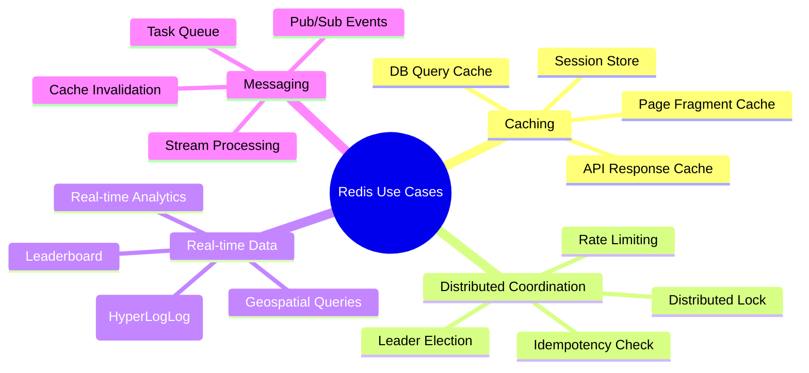

# Redis thường dùng cho use case nào?

## ⚡ Tóm tắt ngắn (30s)
* **Caching**: Use case phổ biến nhất — cache DB queries, API responses, session data để giảm latency từ ~50ms xuống ~1ms.
* **Rate Limiting**: Sliding window counter cho API rate limiting, dùng `INCR` + TTL hoặc Sorted Set.
* **Distributed Lock**: `SETNX` / Redisson cho mutual exclusion across instances (payment, inventory).
* **Pub/Sub & Messaging**: Event notification, cache invalidation, lightweight message broker.
* **Ranking/Leaderboard**: Sorted Set cho real-time ranking với `ZADD`/`ZRANK` — O(log N).
* **Ngoài ra**: Session store, geospatial queries, real-time analytics (HyperLogLog), task queue, feature flags.

---

## 🔍 Chi tiết bản chất thực chiến

### Tổng quan Use Cases



### 1. Caching — Giảm DB load

Đây là 80% lý do Redis được sử dụng. Cache-aside pattern: app check Redis trước, miss thì query DB rồi cache lại.

### 2. Distributed Lock — Đảm bảo mutual exclusion

Khi chạy multiple instances, `synchronized` không hoạt động cross-JVM. Redis lock đảm bảo chỉ 1 instance xử lý tại 1 thời điểm.

### 3. Rate Limiting — Bảo vệ API

Đếm số request per user/IP trong sliding window. Vượt threshold thì reject với HTTP 429.

### 4. Leaderboard — Real-time ranking

Sorted Set cho phép thêm/update score và query rank trong O(log N) — perfect cho gaming, e-commerce top sellers.

### 5. Session Store — Stateless application

Lưu session vào Redis thay vì JVM memory → bất kỳ instance nào cũng đọc được → horizontal scaling dễ dàng.

---

## 💻 Code thực chiến: BAD vs GOOD

### ❌ BAD: Dùng synchronized thay vì distributed lock

```java
@Service
public class PaymentService {
    // ❌ synchronized chỉ lock trong 1 JVM
    // 3 instances chạy đồng thời → 3 threads cùng xử lý 1 payment
    public synchronized void processPayment(String orderId, BigDecimal amount) {
        Order order = orderRepo.findById(orderId);
        if (order.getStatus() == OrderStatus.PENDING) {
            paymentGateway.charge(amount);
            order.setStatus(OrderStatus.PAID);
            orderRepo.save(order);
        }
        // ❌ Instance 2 cũng vào synchronized block CỦA NÓ
        // → Double charge!
    }
}
```

---

### ✅ GOOD: Distributed Lock với Redisson

```java
@Service
@Slf4j
public class PaymentService {
    @Autowired private RedissonClient redisson;
    @Autowired private OrderRepository orderRepo;

    public void processPayment(String orderId, BigDecimal amount) {
        // ✅ Distributed lock — chỉ 1 instance xử lý 1 order
        RLock lock = redisson.getLock("payment:lock:" + orderId);
        try {
            if (lock.tryLock(5, 30, TimeUnit.SECONDS)) {
                try {
                    Order order = orderRepo.findById(orderId)
                        .orElseThrow();
                    if (order.getStatus() == OrderStatus.PENDING) {
                        paymentGateway.charge(amount);
                        order.setStatus(OrderStatus.PAID);
                        orderRepo.save(order);
                    }
                } finally {
                    lock.unlock();
                }
            } else {
                throw new BusinessException("Payment is being processed");
            }
        } catch (InterruptedException e) {
            Thread.currentThread().interrupt();
            throw new SystemException("Lock interrupted", e);
        }
    }
}
```

---

### ✅ GOOD: Rate Limiting với Sliding Window

```java
@Component
@Slf4j
public class RateLimiter {
    @Autowired private StringRedisTemplate redis;

    /**
     * Sliding Window Rate Limiter dùng Sorted Set.
     * Mỗi request = 1 member với score = timestamp.
     * Đếm members trong window → so sánh với limit.
     */
    public boolean isAllowed(String clientId, int maxRequests, int windowSeconds) {
        String key = "rate:" + clientId;
        long now = System.currentTimeMillis();
        long windowStart = now - (windowSeconds * 1000L);

        // ✅ Lua script đảm bảo atomicity
        String luaScript = """
            -- Remove entries outside window
            redis.call('ZREMRANGEBYSCORE', KEYS[1], '0', ARGV[1])
            -- Count current entries
            local count = redis.call('ZCARD', KEYS[1])
            if count < tonumber(ARGV[2]) then
                -- Add new entry
                redis.call('ZADD', KEYS[1], ARGV[3], ARGV[3] .. ':' .. math.random())
                redis.call('EXPIRE', KEYS[1], ARGV[4])
                return 1
            end
            return 0
            """;

        Long result = redis.execute(new DefaultRedisScript<>(luaScript, Long.class),
            List.of(key),
            String.valueOf(windowStart),
            String.valueOf(maxRequests),
            String.valueOf(now),
            String.valueOf(windowSeconds));

        return result != null && result == 1;
    }
}

// ✅ Sử dụng trong Filter/Interceptor
@Component
public class RateLimitInterceptor implements HandlerInterceptor {
    @Autowired private RateLimiter rateLimiter;

    @Override
    public boolean preHandle(HttpServletRequest req, HttpServletResponse resp,
            Object handler) throws Exception {
        String clientIp = req.getRemoteAddr();
        if (!rateLimiter.isAllowed(clientIp, 100, 60)) { // 100 req/min
            resp.setStatus(HttpStatus.TOO_MANY_REQUESTS.value());
            resp.getWriter().write("Rate limit exceeded");
            return false;
        }
        return true;
    }
}
```

---

### ✅ GOOD: Real-time Leaderboard với Sorted Set

```java
@Service
public class LeaderboardService {
    @Autowired private StringRedisTemplate redis;
    private static final String LEADERBOARD_KEY = "game:leaderboard";

    // ✅ O(log N) — thêm/update score
    public void updateScore(String playerId, double score) {
        redis.opsForZSet().add(LEADERBOARD_KEY, playerId, score);
    }

    // ✅ O(log N) — lấy rank hiện tại (0-indexed, đảo ngược)
    public Long getRank(String playerId) {
        return redis.opsForZSet().reverseRank(LEADERBOARD_KEY, playerId);
    }

    // ✅ O(log N + M) — top N players
    public List<LeaderboardEntry> getTopPlayers(int topN) {
        Set<ZSetOperations.TypedTuple<String>> topSet =
            redis.opsForZSet().reverseRangeWithScores(
                LEADERBOARD_KEY, 0, topN - 1);

        return topSet.stream()
            .map(tuple -> new LeaderboardEntry(
                tuple.getValue(), tuple.getScore(),
                redis.opsForZSet().reverseRank(LEADERBOARD_KEY, tuple.getValue())))
            .toList();
    }

    // ✅ Increment score atomically
    public Double incrementScore(String playerId, double delta) {
        return redis.opsForZSet().incrementScore(
            LEADERBOARD_KEY, playerId, delta);
    }
}
```

---

## 📊 Bảng tổng hợp Redis Use Cases

| Use Case | Data Structure | Key Operations | Complexity | Ví dụ thực tế |
| :--- | :--- | :--- | :--- | :--- |
| **Caching** | String / Hash | GET, SET, EXPIRE | O(1) | Product detail, API response |
| **Distributed Lock** | String | SETNX, DEL | O(1) | Payment processing |
| **Rate Limiting** | Sorted Set / String | ZADD, ZCARD, INCR | O(log N) | API throttling |
| **Leaderboard** | Sorted Set | ZADD, ZRANK, ZRANGE | O(log N) | Game ranking |
| **Session Store** | Hash | HSET, HGET, EXPIRE | O(1) | User session |
| **Pub/Sub** | Channel | PUBLISH, SUBSCRIBE | O(N+M) | Cache invalidation |
| **Task Queue** | List / Stream | LPUSH, BRPOP, XADD | O(1) | Background jobs |
| **Geospatial** | Geo (Sorted Set) | GEOADD, GEORADIUS | O(log N) | Nearby stores |
| **Unique Count** | HyperLogLog | PFADD, PFCOUNT | O(1) | Daily active users |
| **Bitmap Flags** | Bitmap | SETBIT, BITCOUNT | O(1) | Feature flags, attendance |

---

## ⚠️ Common Gotchas & Questions follow-up

### 1. Redis là single-threaded, liệu có bottleneck?
* Redis 6.0+ dùng I/O threads cho network nhưng command execution vẫn single-threaded
* Single-thread = **no lock contention** → thực tế throughput 100K-300K ops/s trên 1 node
* Nếu cần hơn → Redis Cluster (sharding across nodes)

### 2. Khi nào KHÔNG nên dùng Redis?
* **Large objects** (> 1MB): Redis tối ưu cho small values. Large blob → S3/MinIO
* **Complex queries**: JOIN, aggregation → vẫn cần RDBMS
* **Durable primary storage**: Redis persistence (RDB/AOF) không thay thế DB, dữ liệu quan trọng phải lưu DB

### 3. Redis vs Memcached cho caching?
* Redis: Rich data structures, persistence, pub/sub, Lua scripting
* Memcached: Đơn giản hơn, multi-threaded, tốt cho pure key-value cache
* **90% cases chọn Redis** vì versatility — Memcached chỉ khi cần extreme simplicity

### 4. Distributed Lock với Redis không phải 100% safe
* Martin Kleppmann đã chỉ ra Redlock có vấn đề khi clock drift, GC pause
* **Production recommendation**: Dùng Redis lock cho "advisory lock" (best effort), dùng DB/ZooKeeper lock cho critical section (payment, inventory)

### 5. Redis Stream vs Kafka cho messaging
* Redis Stream: Lightweight, < 10K msg/s, simple consumer groups
* Kafka: Heavy-duty, millions msg/s, persistent, exactly-once delivery
* Dùng Redis Stream cho internal event notification, Kafka cho inter-service messaging
