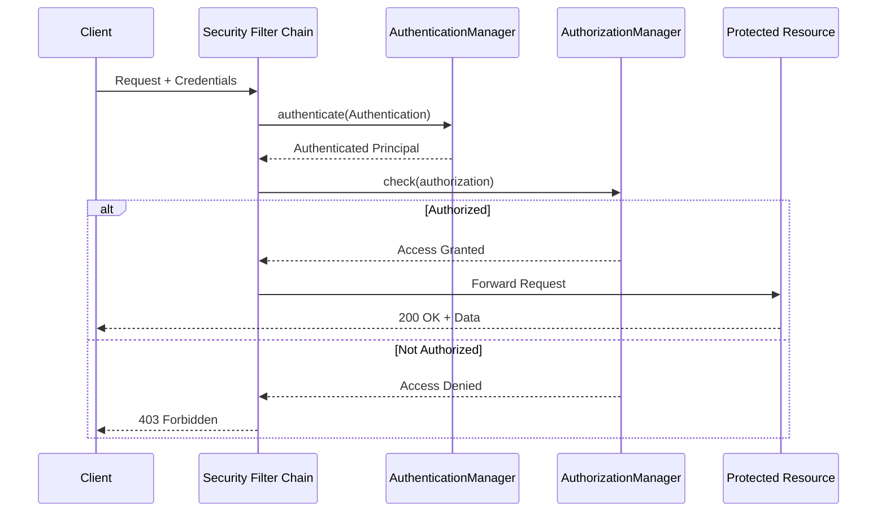

# Authentication và Authorization khác nhau thế nào?

## ⚡ Tóm tắt ngắn (30s)
* **Authentication (AuthN)** = Xác thực "Bạn là ai?" — verify danh tính user qua credentials (username/password, token, biometrics)
* **Authorization (AuthZ)** = Phân quyền "Bạn được làm gì?" — kiểm tra quyền truy cập resource sau khi đã xác thực
* Luôn xảy ra theo thứ tự: Authentication trước → Authorization sau
* Trong Spring Security: `AuthenticationManager` xử lý AuthN, `AccessDecisionManager` / `AuthorizationManager` xử lý AuthZ
* Thực tế production: AuthN thường delegate cho Identity Provider (Keycloak, Auth0), AuthZ có thể dùng RBAC, ABAC, hoặc Policy Engine

---

## 🔍 Chi tiết bản chất thực chiến

### Bản chất của Authentication
Authentication trả lời câu hỏi **"Bạn là ai?"**. Quá trình này xác minh danh tính user bằng cách so sánh credentials mà user cung cấp với dữ liệu đã lưu trữ.

Các phương thức phổ biến:
- **Knowledge factor**: password, PIN, security question
- **Possession factor**: OTP qua SMS, hardware token, authenticator app
- **Inherence factor**: fingerprint, face recognition, voice
- **Multi-Factor Authentication (MFA)**: kết hợp ≥ 2 factor trên

### Bản chất của Authorization
Authorization trả lời câu hỏi **"Bạn được phép làm gì?"**. Xảy ra **sau** khi authentication thành công, quyết định user có được truy cập resource cụ thể hay không.

Các mô hình phổ biến:
- **RBAC (Role-Based Access Control)**: gán quyền theo role (ADMIN, USER, MANAGER)
- **ABAC (Attribute-Based Access Control)**: quyết định dựa trên attribute (department, time, location)
- **ACL (Access Control List)**: danh sách quyền chi tiết cho từng resource
- **Policy-Based**: dùng policy engine (OPA, Casbin)

### Flow trong Spring Security



---

## 💻 Code thực chiến: BAD vs GOOD

### ❌ BAD: Trộn lẫn Authentication và Authorization logic
```java
@RestController
public class OrderController {

    @PostMapping("/orders/{id}/cancel")
    public ResponseEntity<?> cancelOrder(@PathVariable Long id,
                                          HttpServletRequest request) {
        // ❌ Tự parse token, tự check role — trộn lẫn AuthN + AuthZ
        String token = request.getHeader("Authorization");
        if (token == null) {
            return ResponseEntity.status(401).body("Not authenticated");
        }

        // ❌ Hardcode role check trong controller
        String role = extractRoleFromToken(token);
        if (!"ADMIN".equals(role) && !"MANAGER".equals(role)) {
            return ResponseEntity.status(403).body("Not authorized");
        }

        // ❌ Không check ownership — MANAGER cancel order của người khác
        orderService.cancel(id);
        return ResponseEntity.ok().build();
    }
}
```

---

### ✅ GOOD: Tách biệt rõ ràng AuthN và AuthZ với Spring Security
```java
// 1. Security Config — AuthN configuration
@Configuration
@EnableMethodSecurity
public class SecurityConfig {

    @Bean
    public SecurityFilterChain filterChain(HttpSecurity http) throws Exception {
        http
            // Authentication: delegate cho JWT filter
            .oauth2ResourceServer(oauth2 -> oauth2
                .jwt(jwt -> jwt.jwtAuthenticationConverter(jwtAuthConverter()))
            )
            // Authorization: URL-level rules
            .authorizeHttpRequests(auth -> auth
                .requestMatchers("/public/**").permitAll()
                .requestMatchers("/admin/**").hasRole("ADMIN")
                .anyRequest().authenticated()
            );
        return http.build();
    }
}

// 2. Controller — AuthZ via method security
@RestController
@RequestMapping("/orders")
public class OrderController {

    @PostMapping("/{id}/cancel")
    @PreAuthorize("hasRole('ADMIN') or @orderSecurity.isOwner(#id, authentication)")
    public ResponseEntity<?> cancelOrder(@PathVariable Long id) {
        // ✅ AuthN đã xong ở filter layer
        // ✅ AuthZ tách ra annotation — dễ test, dễ audit
        orderService.cancel(id);
        return ResponseEntity.ok().build();
    }
}

// 3. Custom Authorization logic — ABAC style
@Component("orderSecurity")
public class OrderSecurityEvaluator {

    private final OrderRepository orderRepository;

    public boolean isOwner(Long orderId, Authentication auth) {
        // ✅ Fine-grained authorization: check ownership
        Order order = orderRepository.findById(orderId).orElse(null);
        return order != null && order.getUserId().equals(auth.getName());
    }
}
```

---

## 📊 Bảng so sánh Authentication vs Authorization

| Tiêu chí | Authentication (AuthN) | Authorization (AuthZ) |
| :--- | :--- | :--- |
| **Câu hỏi** | Bạn là ai? | Bạn được làm gì? |
| **Thứ tự** | Xảy ra trước | Xảy ra sau AuthN |
| **Thất bại** | HTTP 401 Unauthorized | HTTP 403 Forbidden |
| **Cơ chế** | Password, Token, MFA, SSO | RBAC, ABAC, ACL, Policy |
| **Spring Security** | `AuthenticationManager` | `AuthorizationManager` |
| **Annotation** | — | `@PreAuthorize`, `@Secured` |
| **Có thể thay đổi?** | User không tự đổi identity | Admin có thể đổi quyền user |
| **Visible cho user?** | Có (login form, MFA prompt) | Thường không (backend check) |
| **Dữ liệu** | Credentials store (DB, LDAP) | Policy store, role mapping |

---

## ⚠️ Common Gotchas & Questions follow-up

### 1. HTTP 401 vs 403 — nhiều dev dùng sai
* **401 Unauthorized** thực chất nghĩa là **Unauthenticated** — chưa xác thực
* **403 Forbidden** mới là **Unauthorized** — đã xác thực nhưng không có quyền
* Naming trong HTTP spec gây nhầm lẫn, cần hiểu đúng bản chất

### 2. Tại sao không nên hardcode role check trong code?
* Mỗi lần thêm/sửa role phải deploy lại code
* Production nên dùng external policy engine (OPA, Keycloak Authorization Services)
* `@PreAuthorize` SpEL expression linh hoạt hơn `@Secured` nhưng vẫn nằm trong code

### 3. Authentication session vs stateless token
* **Session-based**: server lưu state → khó scale horizontally
* **Token-based (JWT)**: stateless → dễ scale nhưng khó revoke
* Production thường dùng **JWT + short expiry + refresh token rotation**

### 4. Interviewer có thể hỏi thêm
* "Làm sao implement ABAC trong Spring Security?" → Custom `PermissionEvaluator`
* "So sánh RBAC vs ABAC?" → RBAC đơn giản nhưng thiếu context, ABAC linh hoạt nhưng phức tạp
* "Làm sao audit authorization decisions?" → `AuthorizationEventPublisher` + logging filter
