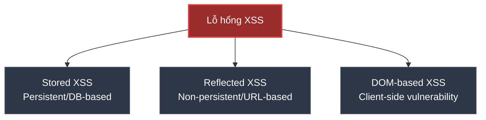
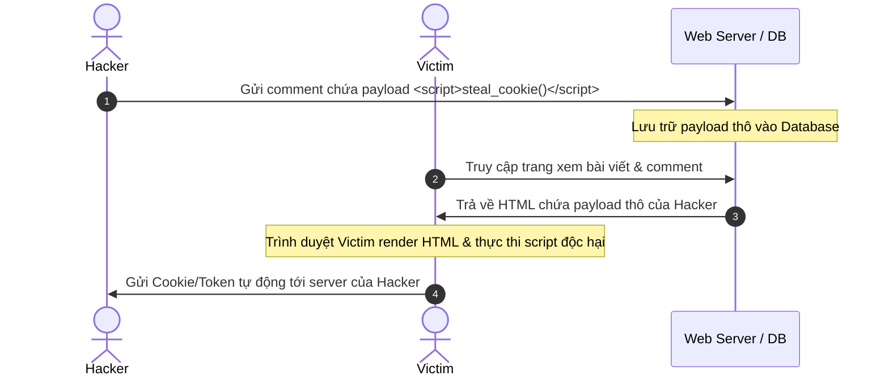

# XSS (Cross-Site Scripting) là gì?

## ⚡ Tóm tắt ngắn (30s)
* **Cross-Site Scripting (XSS)** là lỗ hổng bảo mật cho phép kẻ tấn công **tiêm (inject) các đoạn mã script độc hại** (thường là JavaScript) vào trang web tin cậy để thực thi trên trình duyệt của người dùng khác.
* **Hậu quả**: Chiếm đoạt session cookie (Session Hijacking), đánh cắp JWT/nhạy cảm lưu ở LocalStorage, chuyển hướng người dùng (Redirection), ghi lại phím bấm (Keylogging) hoặc thay đổi giao diện (Defacement).
* **Phân loại**: Gồm 3 loại chính: **Stored XSS** (lưu vào DB), **Reflected XSS** (phản xạ qua URL/Request), và **DOM-based XSS** (lỗi hoàn toàn ở Client-side JS).
* **Giải pháp**: 
  1. Luôn **Sanitize** (lọc) dữ liệu đầu vào.
  2. Luôn **Context-aware Encode** (mã hóa) dữ liệu đầu ra trước khi render.
  3. Sử dụng cookie với cờ **`HttpOnly`** để bảo vệ Session ID.
  4. Cấu hình chính sách bảo mật **Content Security Policy (CSP)**.

---

## 🔍 Chi tiết bản chất thực chiến

### 1. Phân loại các dạng tấn công XSS



#### A. Stored XSS (Persistent XSS)
Kịch bản nguy hiểm nhất. Kẻ tấn công gửi mã độc thông qua các form nhập liệu (ví dụ: comment bài viết, cập nhật profile). Dữ liệu này được lưu trực tiếp vào cơ sở dữ liệu (Database). Mỗi khi bất kỳ người dùng nào truy cập vào trang web load dữ liệu này lên, mã độc sẽ tự động thực thi trong trình duyệt của họ.

#### B. Reflected XSS (Non-Persistent XSS)
Mã độc đi kèm ngay trong chính yêu cầu (thường qua Query Parameter của URL hoặc Form dữ liệu gửi lên). Server nhận request, không sanitize mà chèn trực tiếp mã độc đó vào trang HTML trả về. Nạn nhân bị lừa click vào một đường link chứa mã độc được định dạng sẵn.

#### C. DOM-Based XSS
Khác với Stored và Reflected XSS, lỗ hổng DOM-based xảy ra **hoàn toàn ở phía Client-side (Trình duyệt)**. Server không hề biết hay tham gia vào việc render mã độc này. Client-side JavaScript đọc dữ liệu từ một nguồn không an toàn (ví dụ: `location.search` hoặc `location.hash`), sau đó ghi trực tiếp vào DOM bằng các phương thức unsafe như `element.innerHTML`, `document.write()`, hoặc `eval()`.

---

## 🎨 Sơ đồ luồng hoạt động (Stored XSS)



---

## 💻 Code thực chiến: Xử lý XSS trong Spring Boot & Java

### ❌ BAD (Lưu dữ liệu thô và hiển thị trực tiếp không kiểm soát)
Giả sử ta nhận nội dung bình luận của người dùng và lưu thô vào database. Khi dùng JSP hoặc các công nghệ template không tự động escape, mã độc sẽ chạy.

```java
// Controller nhận input thô và lưu trực tiếp
@PostMapping("/comments")
public String addComment(@RequestParam("content") String content, Model model) {
    // ❌ BAD: Không kiểm tra hay làm sạch input, lưu trực tiếp vào DB
    commentRepository.save(new Comment(content)); 
    return "redirect:/posts";
}
```

Nếu trang HTML render sử dụng logic unsafe như `th:utext` (Thymeleaf - Unescaped Text) hoặc in trực tiếp trong React (`dangerouslySetInnerHTML`) hay InnerHTML:
```html
<!-- Thymeleaf - Unsafe render -->
<div th:utext="${comment.content}"></div> <!-- ❌ Trình duyệt sẽ thực thi mã script bên trong! -->
```

---

### ✅ GOOD (Làm sạch đầu vào bằng thư viện JSoup và mã hóa đầu ra)

#### 1. Sanitize (Làm sạch) dữ liệu đầu vào sử dụng thư viện Jsoup:
Thư viện `Jsoup` cung cấp cơ chế lọc cực mạnh sử dụng cơ chế whitelist (chỉ cho phép các tag an toàn như `<b>`, `<i>`, `p` và loại bỏ `<script>`, `onload`, `onerror`).

```java
import org.jsoup.Jsoup;
import org.jsoup.safety.Safelist;

@Service
public class CommentService {
    
    public Comment sanitizeAndSave(String rawContent) {
        // ✅ Chỉ cho phép các thẻ định dạng văn bản cơ bản, loại bỏ hoàn toàn các thẻ script, style và event attributes
        String safeContent = Jsoup.clean(rawContent, Safelist.basicWithImages());
        
        Comment comment = new Comment();
        comment.setContent(safeContent);
        return commentRepository.save(comment);
    }
}
```

#### 2. Encode (Mã hóa) dữ liệu đầu ra an toàn
Trong Thymeleaf, luôn sử dụng `th:text` thay vì `th:utext`. `th:text` sẽ tự động chuyển đổi các ký tự nguy hiểm thành thực thể HTML (HTML Entities).
```html
<!-- ✅ Tự động chuyển <script> thành &lt;script&gt; giúp hiển thị text an toàn mà không thực thi mã -->
<div th:text="${comment.content}"></div> 
```

#### 3. Sử dụng Cookie HttpOnly cho Session ID / JWT
Nếu lưu Token/Session ở cookie, luôn set thuộc tính `HttpOnly` và `Secure`.
```java
ResponseCookie cookie = ResponseCookie.from("accessToken", token)
    .httpOnly(true)    // ✅ Ngăn chặn hoàn toàn JavaScript (document.cookie) truy cập
    .secure(true)      // ✅ Chỉ gửi cookie qua giao thức HTTPS
    .path("/")
    .maxAge(3600)
    .build();
```

---

## 📊 So sánh 3 biến thể XSS

| Tiêu chí | Stored XSS | Reflected XSS | DOM-based XSS |
| :--- | :--- | :--- | :--- |
| **Nơi lưu trữ mã độc** | Database, File System của Server | Không lưu trữ (nằm ngay trong link/URL) | Không lưu trữ (nằm trong client-side URL fragment/hash) |
| **Phân tích ở Server** | Mã độc được xử lý & lưu ở Server | Mã độc được gửi lên Server rồi trả về | Server hoàn toàn không nhận diện được (ví dụ phần `#` trong URL) |
| **Tầm ảnh hưởng** | **Rất rộng** (Tất cả user xem dữ liệu đó đều bị) | **Hẹp** (Chỉ người dùng bấm vào link chứa mã độc) | **Hẹp** (Chỉ người dùng bấm vào link chứa mã độc) |
| **Phát hiện bởi WAF** | Dễ phát hiện qua logs hoặc DB scanning | Dễ phát hiện khi phân tích HTTP Request | Khó phát hiện ở tầng mạng / Web Application Firewall |

---

## ⚠️ Common Gotchas & Questions follow-up

### 1. "Dùng `HttpOnly` Cookie thì đã an toàn 100% trước XSS chưa?"
* **Trả lời**: **Chưa**. HttpOnly chỉ bảo vệ được Cookie đó không bị hacker đánh cắp thông qua câu lệnh `document.cookie`.
* Tuy nhiên, XSS payload vẫn có thể chạy trên trình duyệt của nạn nhân và thực hiện các hành vi phá hoại khác:
  * Tự động gửi request giả mạo từ chính trình duyệt của nạn nhân lên Server (XHR/Fetch) để thực hiện giao dịch, đổi mật khẩu (vì trình duyệt vẫn tự động đính kèm HttpOnly Cookie).
  * Đánh cắp các token nhạy cảm khác đang lưu ở **LocalStorage** hoặc **SessionStorage** (những nơi không có thuộc tính HttpOnly bảo vệ).
  * Chụp lại màn hình hoặc keylogger trên giao diện web.

### 2. "Content Security Policy (CSP) giúp ích gì trong việc chống XSS?"
* CSP là một HTTP Header bảo mật (`Content-Security-Policy`) chỉ định rõ cho trình duyệt biết các nguồn tài nguyên nào (JS, CSS, Image, Connection...) là **hợp lệ để tải và thực thi**.
* Ví dụ cấu hình CSP an toàn:
  ```http
  Content-Security-Policy: default-src 'self'; script-src 'self' https://trusted-cdn.com;
  ```
* Cơ chế bảo vệ:
  * Trình duyệt sẽ **ngăn chặn mọi script inline** trực tiếp dạng `<script>alert(1)</script>` hoặc các thuộc tính event inline như ``.
  * Trình duyệt sẽ từ chối thực thi hoặc load các script được kéo từ server lạ ngoài các domain khai báo trong whitelist.

### 3. "Tôi nên chọn làm sạch (Sanitize) hay mã hóa (Encode)?"
* **Luật tối thượng**:
  * Nếu input là văn bản thuần túy (Plain Text): Hãy **Encode ở đầu ra**. Không cần sanitize đầu vào (để giữ nguyên bản giá trị người dùng nhập, đề phòng sau này dùng ở ngữ cảnh khác như xuất file PDF, Excel).
  * Nếu input yêu cầu là Rich Text / HTML (ví dụ: bài đăng blog chứa định dạng đậm nhạt, ảnh): Bắt buộc phải **Sanitize ở đầu vào** sử dụng thư viện chuyên dụng (`Jsoup` hoặc `OWASP Java HTML Sanitizer`) trước khi lưu vào Database, và hiển thị an toàn ở đầu ra.
