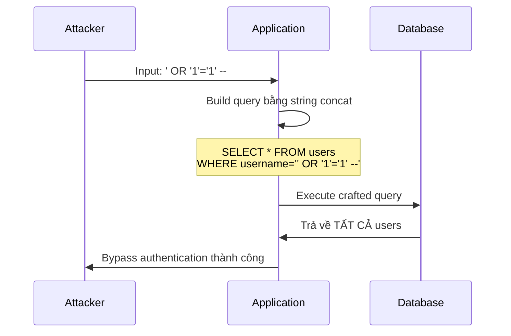
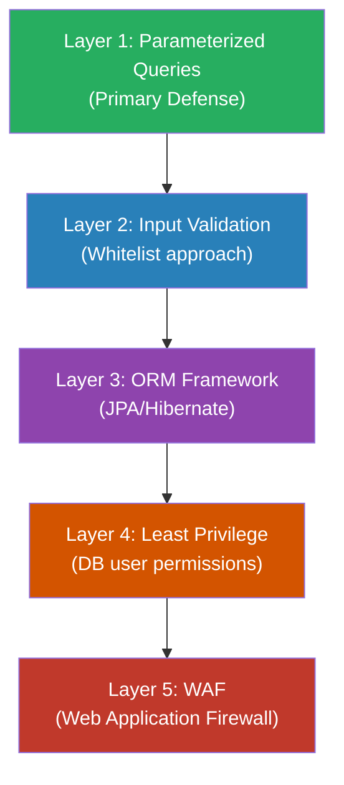

# SQL Injection là gì? Cách phòng tránh?

## ⚡ Tóm tắt ngắn (30s)
* SQL Injection là kỹ thuật tấn công chèn mã SQL độc hại vào input của ứng dụng, khai thác lỗ hổng khi query được xây dựng bằng string concatenation
* Hậu quả: đọc/sửa/xóa toàn bộ database, bypass authentication, thậm chí RCE (Remote Code Execution)
* Phòng tránh chính: **Parameterized Queries / Prepared Statements** — KHÔNG BAO GIỜ dùng string concatenation
* Các lớp phòng thủ bổ sung: Input validation, ORM (JPA/Hibernate), Stored Procedures, WAF, Least Privilege DB user

---

## 🔍 Chi tiết bản chất thực chiến

### SQL Injection hoạt động như thế nào?

Khi ứng dụng nối chuỗi trực tiếp user input vào câu SQL, attacker có thể "thoát" khỏi context dữ liệu và chèn thêm logic SQL.



### Các loại SQL Injection phổ biến

#### 1. Classic (In-band) SQL Injection
Attacker thấy kết quả trực tiếp trên response. Ví dụ: UNION-based injection để đọc bảng khác.

#### 2. Blind SQL Injection
Không thấy kết quả trực tiếp, nhưng suy ra thông tin qua:
- **Boolean-based**: thay đổi điều kiện true/false, quan sát response khác nhau
- **Time-based**: dùng `SLEEP()` / `WAITFOR DELAY`, đo response time

#### 3. Second-Order SQL Injection
Payload được lưu vào DB trước (ví dụ: đăng ký username chứa SQL), sau đó trigger khi ứng dụng đọc và dùng giá trị đó trong query khác — rất khó phát hiện.

### Chiến lược phòng tránh theo lớp (Defense in Depth)



---

## 💻 Code thực chiến: BAD vs GOOD

### ❌ BAD: String concatenation — cổng mở cho SQL Injection

```java
@Repository
public class UserRepository {

    @Autowired
    private JdbcTemplate jdbcTemplate;

    // ❌ EXTREMELY DANGEROUS — String concatenation
    public User findByUsername(String username) {
        String sql = "SELECT * FROM users WHERE username = '" + username + "'";
        // Input: admin' OR '1'='1' --
        // Query thành: SELECT * FROM users WHERE username = 'admin' OR '1'='1' --'
        // → Trả về TẤT CẢ users, bypass authentication
        return jdbcTemplate.queryForObject(sql, new UserRowMapper());
    }

    // ❌ DANGEROUS — Dùng String.format cũng không an toàn
    public List<User> searchUsers(String keyword) {
        String sql = String.format(
            "SELECT * FROM users WHERE name LIKE '%%%s%%'", keyword
        );
        // Input: %'; DROP TABLE users; --
        // → SQL Injection + xóa bảng users
        return jdbcTemplate.query(sql, new UserRowMapper());
    }

    // ❌ DANGEROUS — Native query với concatenation trong JPA
    @PersistenceContext
    private EntityManager em;

    public List<User> findByRole(String role) {
        String jpql = "SELECT u FROM User u WHERE u.role = '" + role + "'";
        return em.createQuery(jpql, User.class).getResultList();
    }
}
```

---

### ✅ GOOD: Parameterized Queries + Defense in Depth

```java
@Repository
public class UserRepository {

    @Autowired
    private JdbcTemplate jdbcTemplate;

    // ✅ Parameterized Query với JdbcTemplate — placeholder ?
    public User findByUsername(String username) {
        String sql = "SELECT * FROM users WHERE username = ?";
        // DB engine tách biệt hoàn toàn DATA và CODE
        // Input bất kỳ đều chỉ là giá trị, không thể inject SQL
        return jdbcTemplate.queryForObject(sql, new UserRowMapper(), username);
    }

    // ✅ Named parameters với NamedParameterJdbcTemplate
    @Autowired
    private NamedParameterJdbcTemplate namedJdbc;

    public List<User> searchUsers(String keyword) {
        String sql = "SELECT * FROM users WHERE name LIKE :keyword";
        MapSqlParameterSource params = new MapSqlParameterSource();
        params.addValue("keyword", "%" + keyword + "%");
        return namedJdbc.query(sql, params, new UserRowMapper());
    }

    // ✅ JPA với named parameter — an toàn
    @PersistenceContext
    private EntityManager em;

    public List<User> findByRole(String role) {
        return em.createQuery("SELECT u FROM User u WHERE u.role = :role", User.class)
                 .setParameter("role", role)
                 .getResultList();
    }
}

// ✅ Spring Data JPA — inherently safe (auto-parameterized)
public interface UserJpaRepository extends JpaRepository<User, Long> {

    // Derived query — tự động parameterized
    List<User> findByUsernameAndStatus(String username, String status);

    // @Query annotation — dùng :param placeholder
    @Query("SELECT u FROM User u WHERE u.email = :email")
    Optional<User> findByEmail(@Param("email") String email);

    // Native query — vẫn phải dùng parameter binding
    @Query(value = "SELECT * FROM users WHERE role = :role", nativeQuery = true)
    List<User> findByRoleNative(@Param("role") String role);
}

// ✅ Input Validation layer — whitelist approach
@RestController
public class UserController {

    @GetMapping("/users")
    public List<User> getUsers(
        @RequestParam @Pattern(regexp = "^[a-zA-Z_]+$") String sortBy,
        @RequestParam @Pattern(regexp = "^(ASC|DESC)$") String direction
    ) {
        // Column name và direction KHÔNG thể parameterize
        // → PHẢI whitelist validation
        List<String> allowedColumns = List.of("username", "email", "created_at");
        if (!allowedColumns.contains(sortBy)) {
            throw new BadRequestException("Invalid sort column");
        }
        return userService.findAll(sortBy, direction);
    }
}
```

---

## 📊 Bảng so sánh các phương pháp phòng tránh

| Tiêu chí | Parameterized Query | ORM (JPA/Hibernate) | Stored Procedure | Input Validation | WAF |
| :--- | :--- | :--- | :--- | :--- | :--- |
| **Hiệu quả** | ⭐⭐⭐⭐⭐ | ⭐⭐⭐⭐ | ⭐⭐⭐⭐ | ⭐⭐⭐ | ⭐⭐ |
| **Vai trò** | Primary defense | Framework-level | DB-level | Supplementary | Perimeter |
| **Có thể bypass?** | Không (nếu dùng đúng) | Có nếu dùng native query sai | Có nếu dùng dynamic SQL | Có nếu blacklist | Có, nhiều kỹ thuật bypass |
| **Hạn chế** | Không parameterize được column/table name | N+1, complex query khó | Vendor lock-in | Không thể thay thế parameterized query | False positives, performance |
| **Nên dùng** | LUÔN LUÔN | Mặc định trong Spring | Khi cần | Bổ sung | Bổ sung |

---

## ⚠️ Common Gotchas & Questions follow-up

### 1. Column name / ORDER BY không thể parameterize
* **Problem**: `ORDER BY ?` không hoạt động — DB engine coi `?` là giá trị string, không phải identifier
* **Hậu quả**: Developer dùng concatenation cho dynamic sorting → mở cửa SQL Injection
* **Solution**: Whitelist validation — chỉ cho phép các column name đã định sẵn

### 2. LIKE query với wildcard
* **Problem**: User input `%` hoặc `_` trong LIKE clause có thể gây performance issue (full table scan)
* **Solution**: Escape wildcard characters trước khi truyền vào parameter: `keyword.replace("%", "\\%").replace("_", "\\_")`

### 3. ORM không phải viên đạn bạc
* **Problem**: JPA `createQuery()` với string concatenation vẫn bị SQL Injection y hệt JDBC
* **Hậu quả**: Developer lầm tưởng "dùng Hibernate là an toàn"
* **Solution**: LUÔN dùng parameter binding (`:paramName` hoặc `?1`), tránh concatenation trong JPQL/HQL

### 4. Batch operations và IN clause
* **Problem**: Xây dựng `WHERE id IN (1, 2, 3)` bằng concatenation
* **Solution**: Dùng `NamedParameterJdbcTemplate` với `MapSqlParameterSource.addValue("ids", listOfIds)` — tự động expand

### 5. Second-Order Injection
* **Problem**: Data đã stored trong DB được dùng trong query khác mà không parameterize
* **Hậu quả**: Khó phát hiện vì payload inject ở bước 1, trigger ở bước 2
* **Solution**: Treat ALL data as untrusted — kể cả data đọc từ DB. Luôn parameterize mọi query

### 6. Interview follow-up: "Prepared Statement ngăn SQL Injection bằng cách nào?"
* DB engine **compile query plan trước** khi nhận parameter values
* Parameter values được gửi riêng, KHÔNG BAO GIỜ được interpret như SQL code
* Khác biệt cốt lõi: tách biệt **code** (SQL structure) và **data** (user input) ở tầng protocol
