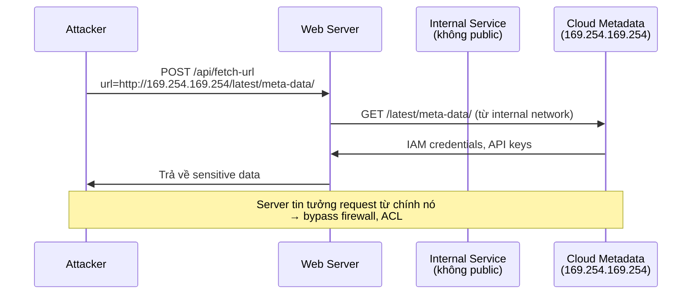
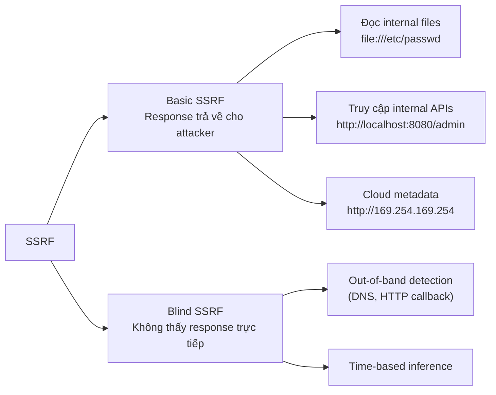

# SSRF là gì?

## ⚡ Tóm tắt ngắn (30s)
* **SSRF (Server-Side Request Forgery)** là lỗ hổng khi attacker lừa server thực hiện HTTP request đến URL do attacker kiểm soát
* Server trở thành "proxy" — attacker truy cập được internal services, cloud metadata, admin panels mà từ bên ngoài không thể reach
* SSRF nằm trong **OWASP Top 10 (2021)** — đặc biệt nguy hiểm trong môi trường cloud (AWS/GCP metadata endpoint)
* Phòng tránh: **Whitelist URL/domain**, validate & parse URL cẩn thận, block private IP ranges, dùng network segmentation

---

## 🔍 Chi tiết bản chất thực chiến

### SSRF hoạt động như thế nào?



### Tại sao SSRF nguy hiểm đặc biệt trong Cloud?

Hầu hết cloud providers (AWS, GCP, Azure) expose **metadata endpoint** tại `169.254.169.254`. Endpoint này chỉ accessible từ bên trong instance và chứa:
- IAM role credentials (access key, secret key, session token)
- Instance identity documents
- User data scripts (có thể chứa secrets)

**Capital One breach (2019)** — SSRF trên WAF → đọc AWS metadata → lấy IAM credentials → truy cập S3 → leak 100 triệu records.

### Các loại SSRF



### Attack vectors phổ biến

| Vector | Ví dụ URL | Mục đích |
| :--- | :--- | :--- |
| Cloud metadata | `http://169.254.169.254/latest/meta-data/iam/` | Lấy IAM credentials |
| Internal services | `http://localhost:6379/` | Truy cập Redis không auth |
| Internal APIs | `http://internal-admin:8080/api/users` | Đọc admin endpoints |
| File protocol | `file:///etc/passwd` | Đọc local files |
| DNS rebinding | `http://attacker-domain.com` (resolve → 127.0.0.1) | Bypass IP validation |

---

## 💻 Code thực chiến: BAD vs GOOD

### ❌ BAD: Endpoint nhận URL từ user mà không validate

```java
@RestController
public class WebhookController {

    @Autowired
    private RestTemplate restTemplate;

    // ❌ DANGEROUS — Không validate URL, attacker control hoàn toàn
    @PostMapping("/api/fetch-preview")
    public ResponseEntity<String> fetchPreview(@RequestParam String url) {
        // Attacker gửi: url=http://169.254.169.254/latest/meta-data/iam/security-credentials/
        // Server sẽ request đến AWS metadata → trả về IAM credentials
        String response = restTemplate.getForObject(url, String.class);
        return ResponseEntity.ok(response);
    }

    // ❌ DANGEROUS — Webhook URL do user cung cấp
    @PostMapping("/api/webhooks")
    public ResponseEntity<Void> registerWebhook(@RequestBody WebhookRequest req) {
        // Lưu URL rồi server gọi đến URL đó khi có event
        // Attacker đăng ký webhook url = http://localhost:9200/_cat/indices
        // → Server scan Elasticsearch nội bộ
        webhookService.save(req.getCallbackUrl());
        return ResponseEntity.ok().build();
    }

    // ❌ DANGEROUS — Image/PDF fetcher
    @PostMapping("/api/import-avatar")
    public ResponseEntity<byte[]> importAvatar(@RequestParam String imageUrl) {
        // Attacker: imageUrl=http://internal-service:8080/admin/export-all-users
        byte[] image = restTemplate.getForObject(imageUrl, byte[].class);
        return ResponseEntity.ok(image);
    }
}
```

---

### ✅ GOOD: URL validation + Allowlist + Network controls

```java
@Service
public class SafeUrlFetcher {

    private static final Set<String> ALLOWED_DOMAINS = Set.of(
        "api.example.com", "cdn.example.com", "images.example.com"
    );

    private static final Set<String> ALLOWED_SCHEMES = Set.of("http", "https");

    // ✅ Validate URL trước khi fetch
    public String fetchUrl(String rawUrl) {
        URI uri = validateAndParseUrl(rawUrl);
        
        // Dùng HttpClient với timeout và redirect disabled
        HttpClient client = HttpClient.newBuilder()
            .connectTimeout(Duration.ofSeconds(5))
            .followRedirects(HttpClient.Redirect.NEVER) // ✅ Block redirects
            .build();

        HttpRequest request = HttpRequest.newBuilder()
            .uri(uri)
            .timeout(Duration.ofSeconds(10))
            .build();

        HttpResponse<String> response = client.send(request,
            HttpResponse.BodyHandlers.ofString());
        return response.body();
    }

    private URI validateAndParseUrl(String rawUrl) {
        URI uri;
        try {
            uri = new URI(rawUrl).normalize();
        } catch (URISyntaxException e) {
            throw new InvalidUrlException("Malformed URL");
        }

        // ✅ Step 1: Validate scheme — chỉ cho phép http/https
        if (!ALLOWED_SCHEMES.contains(uri.getScheme())) {
            throw new InvalidUrlException("Blocked scheme: " + uri.getScheme());
        }

        // ✅ Step 2: Validate host — whitelist domains
        String host = uri.getHost();
        if (host == null || !ALLOWED_DOMAINS.contains(host.toLowerCase())) {
            throw new InvalidUrlException("Domain not in allowlist: " + host);
        }

        // ✅ Step 3: Resolve DNS và check IP TRƯỚC khi request
        InetAddress resolved = InetAddress.getByName(host);
        if (isPrivateOrReservedIp(resolved)) {
            throw new InvalidUrlException("Resolved to private/reserved IP");
        }

        return uri;
    }

    // ✅ Block tất cả private/reserved IP ranges
    private boolean isPrivateOrReservedIp(InetAddress addr) {
        return addr.isLoopbackAddress()           // 127.0.0.0/8
            || addr.isLinkLocalAddress()           // 169.254.0.0/16 (cloud metadata!)
            || addr.isSiteLocalAddress()           // 10.0.0.0/8, 172.16.0.0/12, 192.168.0.0/16
            || addr.isAnyLocalAddress()            // 0.0.0.0
            || addr.isMulticastAddress();          // 224.0.0.0/4
    }
}

// ✅ Spring Security — restrict outbound ở infrastructure level
@Configuration
public class WebhookSecurityConfig {

    @Bean
    public RestTemplate securedRestTemplate() {
        SimpleClientHttpRequestFactory factory = new SimpleClientHttpRequestFactory();
        factory.setConnectTimeout(5000);
        factory.setReadTimeout(10000);
        // Trong production: dùng proxy server cho outbound requests
        // factory.setProxy(new Proxy(Proxy.Type.HTTP, 
        //     new InetSocketAddress("egress-proxy", 3128)));
        return new RestTemplate(factory);
    }
}
```

---

## 📊 Bảng so sánh các biện pháp phòng tránh SSRF

| Tiêu chí | URL Allowlist | IP Blocklist | DNS Resolution Check | Egress Proxy | IMDSv2 (AWS) |
| :--- | :--- | :--- | :--- | :--- | :--- |
| **Hiệu quả** | ⭐⭐⭐⭐⭐ | ⭐⭐⭐ | ⭐⭐⭐⭐ | ⭐⭐⭐⭐⭐ | ⭐⭐⭐⭐ |
| **Bypass được?** | Khó nếu strict | DNS rebinding | TOCTOU race | Khó | Giảm thiểu rủi ro |
| **Complexity** | Thấp | Trung bình | Trung bình | Cao | Thấp (config) |
| **Hạn chế** | Inflexible nếu cần dynamic URLs | Incomplete coverage | Race condition | Infrastructure cost | Chỉ bảo vệ metadata |
| **Nên dùng khi** | Biết trước domains | Bổ sung allowlist | Luôn luôn | High-security env | Mọi AWS deployment |

---

## ⚠️ Common Gotchas & Questions follow-up

### 1. DNS Rebinding Attack
* **Problem**: Attacker sở hữu domain, lần resolve đầu trả IP public (pass validation), lần sau trả `127.0.0.1`
* **Hậu quả**: Bypass IP validation hoàn toàn
* **Solution**: Resolve DNS một lần, pin IP address, dùng IP đó cho request thực tế (không để HTTP client resolve lại)

### 2. Redirect-based SSRF
* **Problem**: URL hợp lệ nhưng server trả 302 redirect đến `http://169.254.169.254/`
* **Hậu quả**: Bypass domain allowlist vì redirect được follow tự động
* **Solution**: Disable auto-redirect (`followRedirects(NEVER)`), validate từng hop nếu cần redirect

### 3. URL Parser Inconsistency
* **Problem**: `http://example.com@169.254.169.254/` — URL parser đọc host là `example.com` nhưng HTTP client request đến `169.254.169.254`
* **Solution**: Dùng cùng một URL parser, normalize URL, validate sau khi parse

### 4. Cloud Metadata Protection
* **Problem**: AWS IMDSv1 cho phép simple GET request lấy credentials
* **Solution**: Bật **IMDSv2** — yêu cầu PUT request lấy token trước, SSRF thông thường chỉ dùng GET nên bị block

### 5. Interview follow-up: "SSRF khác gì CSRF?"
* **SSRF**: Server bị lừa gửi request → server là nạn nhân thực hiện request
* **CSRF**: User's browser bị lừa gửi request → user là nạn nhân, browser gửi request kèm cookies
* Cả hai đều là "request forgery" nhưng khác nhau về **ai** thực hiện request

### 6. Blind SSRF — phát hiện như thế nào?
* Attacker dùng **out-of-band** channels: Burp Collaborator, webhook.site
* Server không trả response nhưng attacker thấy DNS query hoặc HTTP hit tại controlled endpoint
* Vẫn nguy hiểm: có thể port scan internal network, trigger actions trên internal services
