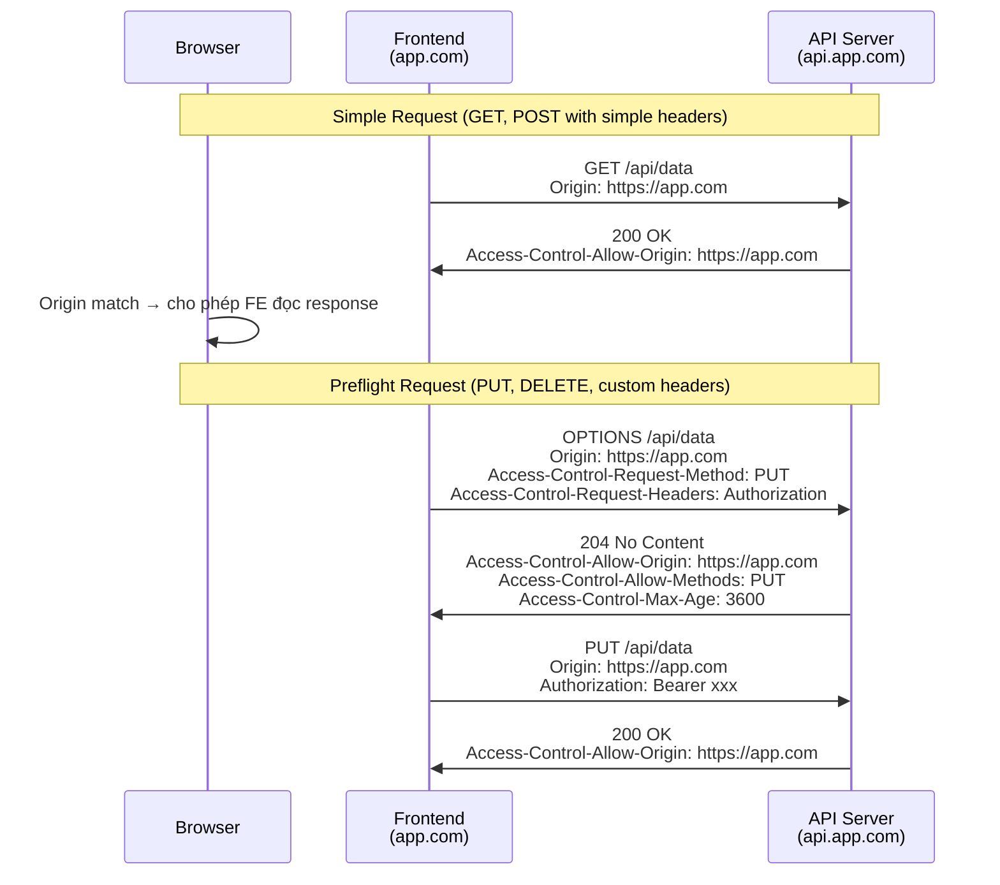

# CORS là gì?

## ⚡ Tóm tắt ngắn (30s)
* **CORS (Cross-Origin Resource Sharing)** là cơ chế bảo mật trên browser, cho phép server khai báo những origin nào được phép truy cập tài nguyên của mình
* Mặc định browser áp dụng **Same-Origin Policy (SOP)** — block mọi cross-origin request. CORS là cách "nới lỏng" SOP có kiểm soát
* CORS hoạt động qua HTTP headers (`Access-Control-Allow-Origin`, `Access-Control-Allow-Methods`, ...)
* Với request phức tạp (PUT, DELETE, custom headers), browser gửi **Preflight request (OPTIONS)** trước để hỏi server có cho phép không
* Trong Spring Boot: config qua `@CrossOrigin`, `WebMvcConfigurer`, hoặc `CorsFilter`

---

## 🔍 Chi tiết bản chất thực chiến

### Same-Origin Policy (SOP) — nền tảng

Hai URL được coi là **same origin** khi cùng 3 thành phần: **scheme + host + port**.

| URL A | URL B | Same Origin? |
| :--- | :--- | :--- |
| `https://app.com` | `https://app.com/api` | ✅ Có |
| `https://app.com` | `http://app.com` | ❌ Khác scheme |
| `https://app.com` | `https://api.app.com` | ❌ Khác host |
| `https://app.com` | `https://app.com:8080` | ❌ Khác port |

### CORS Flow — Simple vs Preflight Request



### Khi nào cần Preflight?

**Simple Request** (KHÔNG cần preflight) khi thỏa tất cả:
- Method: `GET`, `HEAD`, `POST`
- Headers chỉ có: `Accept`, `Content-Type` (với giá trị `application/x-www-form-urlencoded`, `multipart/form-data`, `text/plain`), `Content-Language`, `Accept-Language`

**Mọi trường hợp khác** → Preflight:
- Method: `PUT`, `DELETE`, `PATCH`
- Custom headers: `Authorization`, `X-Request-Id`
- `Content-Type: application/json`

---

## 💻 Code thực chiến: BAD vs GOOD

### ❌ BAD: Cấu hình CORS quá lỏng hoặc sai

```java
@Configuration
public class CorsConfig implements WebMvcConfigurer {

    @Override
    public void addCorsMappings(CorsRegistry registry) {
        // ❌ DANGEROUS — cho phép MỌI origin
        registry.addMapping("/**")
            .allowedOrigins("*")              // Mọi website đều gọi được API
            .allowedMethods("*")              // Mọi HTTP method
            .allowedHeaders("*")              // Mọi header
            .allowCredentials(true);          // ❌ LỖI: không thể dùng "*" với credentials=true
        // Browser sẽ BLOCK vì spec cấm wildcard + credentials
    }
}

// ❌ BAD — Mirror Origin (reflect bất kỳ origin nào)
@Component
public class BadCorsFilter extends OncePerRequestFilter {
    @Override
    protected void doFilterInternal(HttpServletRequest req,
            HttpServletResponse res, FilterChain chain) {
        // Lấy Origin từ request và reflect lại → tương đương allow all
        String origin = req.getHeader("Origin");
        res.setHeader("Access-Control-Allow-Origin", origin);
        res.setHeader("Access-Control-Allow-Credentials", "true");
        // ❌ Attacker tạo website evil.com → gọi API kèm cookies user
        // → giống CSRF nhưng còn ĐỌC ĐƯỢC response data
        chain.doFilter(req, res);
    }
}
```

---

### ✅ GOOD: CORS configuration đúng cách trong Spring Boot

```java
@Configuration
public class CorsSecurityConfig implements WebMvcConfigurer {

    // ✅ Explicit whitelist origins
    @Override
    public void addCorsMappings(CorsRegistry registry) {
        registry.addMapping("/api/**")
            .allowedOrigins(
                "https://app.example.com",
                "https://admin.example.com"
            )
            .allowedMethods("GET", "POST", "PUT", "DELETE")
            .allowedHeaders("Authorization", "Content-Type", "X-Request-Id")
            .exposedHeaders("X-Total-Count", "X-Page-Number")
            .allowCredentials(true)
            .maxAge(3600); // ✅ Cache preflight 1 giờ — giảm OPTIONS requests
    }
}

// ✅ Kết hợp với Spring Security
@Configuration
@EnableWebSecurity
public class SecurityConfig {

    @Bean
    public SecurityFilterChain filterChain(HttpSecurity http) throws Exception {
        http
            .cors(cors -> cors.configurationSource(corsConfigSource()))
            .csrf(csrf -> csrf.disable()) // API stateless thường disable CSRF
            .authorizeHttpRequests(auth -> auth
                .requestMatchers("/api/public/**").permitAll()
                .anyRequest().authenticated()
            );
        return http.build();
    }

    @Bean
    public CorsConfigurationSource corsConfigSource() {
        CorsConfiguration config = new CorsConfiguration();

        // ✅ Explicit origins — KHÔNG dùng "*"
        config.setAllowedOrigins(List.of(
            "https://app.example.com",
            "https://admin.example.com"
        ));

        // ✅ Hoặc dùng pattern cho subdomain
        config.setAllowedOriginPatterns(List.of(
            "https://*.example.com"
        ));

        config.setAllowedMethods(List.of("GET", "POST", "PUT", "DELETE", "OPTIONS"));
        config.setAllowedHeaders(List.of("Authorization", "Content-Type"));
        config.setExposedHeaders(List.of("X-Total-Count"));
        config.setAllowCredentials(true);
        config.setMaxAge(3600L);

        UrlBasedCorsConfigurationSource source = new UrlBasedCorsConfigurationSource();
        source.registerCorsConfiguration("/api/**", config);
        return source;
    }
}

// ✅ Per-controller CORS cho specific endpoints
@RestController
@RequestMapping("/api/public")
@CrossOrigin(origins = "https://app.example.com", maxAge = 3600)
public class PublicApiController {

    @GetMapping("/health")
    public Map<String, String> health() {
        return Map.of("status", "UP");
    }
}
```

---

## 📊 Bảng so sánh các cách cấu hình CORS trong Spring

| Tiêu chí | `@CrossOrigin` | `WebMvcConfigurer` | `CorsFilter` (Security) |
| :--- | :--- | :--- | :--- |
| **Scope** | Per controller/method | Global | Global (Security chain) |
| **Ưu tiên** | Cao nhất (override global) | Trung bình | Thấp nhất |
| **Khi dùng Spring Security** | Có thể bị bỏ qua | Cần `.cors()` enable | ✅ Recommended |
| **Flexibility** | Thấp | Trung bình | Cao |
| **Best for** | Public endpoints đơn giản | Ứng dụng không dùng Security | Production với Spring Security |

---

## ⚠️ Common Gotchas & Questions follow-up

### 1. CORS không phải security mechanism phía server
* **Problem**: Developer nghĩ CORS "bảo vệ API" — sai. CORS chỉ được **browser** enforce
* **Hậu quả**: curl, Postman, server-to-server calls hoàn toàn bypass CORS
* **Solution**: CORS bảo vệ **user's browser** khỏi bị website khác lạm dụng. API vẫn cần auth (JWT, API key)

### 2. Spring Security override WebMvcConfigurer CORS
* **Problem**: Config CORS qua `WebMvcConfigurer` nhưng Spring Security filter chạy trước → block OPTIONS preflight (401)
* **Hậu quả**: Preflight thất bại → browser block actual request
* **Solution**: Phải enable `.cors()` trong `SecurityFilterChain` và cung cấp `CorsConfigurationSource` bean

### 3. `allowCredentials(true)` không dùng được với wildcard `*`
* **Problem**: Spec W3C cấm `Access-Control-Allow-Origin: *` kèm `credentials: true`
* **Hậu quả**: Browser block response
* **Solution**: Phải list explicit origins, hoặc dùng `allowedOriginPatterns("https://*.example.com")`

### 4. Exposed Headers bị bỏ quên
* **Problem**: Server trả custom header (`X-Total-Count` cho pagination) nhưng JS đọc không được
* **Hậu quả**: `response.headers.get("X-Total-Count")` trả `null`
* **Solution**: Phải khai báo trong `exposedHeaders()` — mặc định browser chỉ expose 6 CORS-safelisted headers

### 5. Preflight caching — maxAge quan trọng cho performance
* **Problem**: Mỗi AJAX call đều trigger OPTIONS preflight → double latency
* **Hậu quả**: API response time tăng gấp đôi cho mọi non-simple request
* **Solution**: Set `maxAge(3600)` — browser cache preflight result, chỉ gửi OPTIONS 1 lần/giờ

### 6. Interview follow-up: "CORS khác gì CSP (Content-Security-Policy)?"
* **CORS**: Server A cho phép origin B đọc response của mình (cross-origin READ)
* **CSP**: Server A khai báo browser chỉ load resources từ nguồn được phép (script, style, image)
* CORS kiểm soát **ai được đọc data**, CSP kiểm soát **data từ đâu được load**
