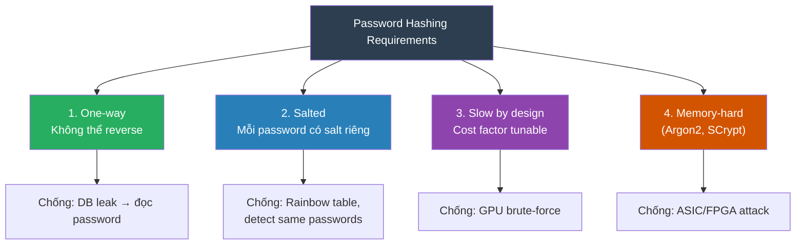

# Password nên hash như thế nào?

## ⚡ Tóm tắt ngắn (30s)
* **KHÔNG BAO GIỜ** lưu plain text hoặc mã hóa (encrypt) password — phải dùng **one-way hash**
* Dùng **password-specific hashing algorithm**: BCrypt, SCrypt, hoặc Argon2 — KHÔNG dùng MD5, SHA-1, SHA-256
* Điểm khác biệt cốt lõi: BCrypt/Argon2 có **cost factor** — cố tình chậm để chống brute-force
* Spring Security mặc định dùng `BCryptPasswordEncoder` — production-ready, auto-generate salt
* Trend hiện tại: **Argon2id** được OWASP khuyến nghị là lựa chọn tối ưu nhất (2024+)

---

## 🔍 Chi tiết bản chất thực chiến

### Tại sao KHÔNG dùng MD5/SHA cho password?

| Đặc điểm | MD5/SHA-256 | BCrypt/Argon2 |
| :--- | :--- | :--- |
| **Tốc độ** | Cực nhanh (~10 tỷ hash/giây trên GPU) | Cố tình chậm (~10 hash/giây) |
| **Mục đích thiết kế** | Data integrity, checksums | Password storage |
| **Salt tích hợp** | ❌ Không | ✅ Có |
| **Cost factor** | ❌ Không | ✅ Có (tunable) |
| **Brute-force resistance** | ❌ Rất yếu | ✅ Rất mạnh |

### Password hashing nên đạt tiêu chí gì?



### Cấu trúc BCrypt hash string

```
$2a$12$LJ3m4ys3Lg2UH.YXaOQBpeDNGsP5RV1h4Mv8rZCEv3RdFWt9E.IQa
 │  │  └──── Salt (22 chars) + Hash (31 chars) = 53 chars base64
 │  └─── Cost factor (2^12 = 4096 iterations)
 └── Algorithm version (2a = BCrypt)
```

Salt được **embed trong hash string** → không cần lưu riêng.

---

## 💻 Code thực chiến: BAD vs GOOD

### ❌ BAD: Các cách hash password sai

```java
@Service
public class BadAuthService {

    // ❌ TERRIBLE — Lưu plain text
    public void register_v1(String username, String password) {
        userRepo.save(new User(username, password));
        // DB bị leak → tất cả password bị lộ ngay lập tức
    }

    // ❌ BAD — Encrypt password (AES, RSA)
    public void register_v2(String username, String password) {
        String encrypted = AES.encrypt(password, secretKey);
        userRepo.save(new User(username, encrypted));
        // secretKey bị lộ → decrypt TẤT CẢ passwords
        // Encryption là reversible, password cần irreversible (hash)
    }

    // ❌ BAD — MD5 / SHA-256 (fast hash, no salt)
    public void register_v3(String username, String password) {
        String hashed = DigestUtils.sha256Hex(password);
        userRepo.save(new User(username, hashed));
        // GPU crack: ~10 tỷ SHA-256/giây
        // Rainbow table: "password123" luôn cho cùng hash
    }

    // ❌ BAD — MD5 + static salt
    public void register_v4(String username, String password) {
        String salt = "myAppSecret2024";  // Same salt cho mọi user
        String hashed = DigestUtils.md5Hex(salt + password);
        userRepo.save(new User(username, hashed));
        // Nếu 2 user cùng password → cùng hash → attacker biết
        // Salt lộ → build rainbow table mới cho salt đó
    }
}
```

---

### ✅ GOOD: BCrypt / Argon2 với Spring Security

```java
// ✅ Spring Security Configuration — BCrypt (default, solid choice)
@Configuration
public class PasswordConfig {

    @Bean
    public PasswordEncoder passwordEncoder() {
        // BCrypt với strength 12 (2^12 = 4096 rounds)
        // Mỗi hash mất ~250ms — đủ chậm cho brute-force, đủ nhanh cho UX
        return new BCryptPasswordEncoder(12);
    }

    // ✅ BEST — Argon2 (OWASP recommended)
    // @Bean
    // public PasswordEncoder passwordEncoder() {
    //     return new Argon2PasswordEncoder(
    //         16,    // salt length
    //         32,    // hash length
    //         1,     // parallelism
    //         65536, // memory cost (64 MB)
    //         3      // iterations
    //     );
    // }

    // ✅ DelegatingPasswordEncoder — upgrade algorithm không break existing users
    @Bean
    public PasswordEncoder flexiblePasswordEncoder() {
        Map<String, PasswordEncoder> encoders = Map.of(
            "bcrypt", new BCryptPasswordEncoder(12),
            "argon2", new Argon2PasswordEncoder(16, 32, 1, 65536, 3),
            "scrypt", SCryptPasswordEncoder.defaultsForSpringSecurity_v5_8()
        );
        DelegatingPasswordEncoder delegating = 
            new DelegatingPasswordEncoder("argon2", encoders);
        // New passwords → Argon2
        // Old passwords (BCrypt) → vẫn verify được
        // Hash format: {argon2}$argon2id$v=19$m=65536,t=3,p=1$...
        return delegating;
    }
}

// ✅ Service sử dụng PasswordEncoder
@Service
public class AuthService {

    @Autowired
    private PasswordEncoder passwordEncoder;

    @Autowired
    private UserRepository userRepo;

    public void register(String username, String rawPassword) {
        // ✅ Hash tự động generate unique salt
        String hashedPassword = passwordEncoder.encode(rawPassword);
        // Output: $2a$12$LJ3m4ys3Lg2UH.YXaOQBpe...
        // Mỗi lần encode cùng password → hash KHÁC NHAU (random salt)
        
        User user = new User(username, hashedPassword);
        userRepo.save(user);
    }

    public boolean authenticate(String username, String rawPassword) {
        User user = userRepo.findByUsername(username)
            .orElseThrow(() -> {
                // ✅ Timing attack prevention: hash password dù user không tồn tại
                passwordEncoder.encode(rawPassword);
                return new AuthException("Invalid credentials");
            });

        // ✅ matches() tự extract salt từ stored hash rồi so sánh
        return passwordEncoder.matches(rawPassword, user.getPasswordHash());
    }

    // ✅ Password upgrade: re-hash khi user login nếu dùng algorithm cũ
    public void upgradePasswordIfNeeded(User user, String rawPassword) {
        if (passwordEncoder.upgradeEncoding(user.getPasswordHash())) {
            String newHash = passwordEncoder.encode(rawPassword);
            user.setPasswordHash(newHash);
            userRepo.save(user);
        }
    }
}
```

---

## 📊 Bảng so sánh các Password Hashing Algorithm

| Tiêu chí | BCrypt | SCrypt | Argon2id |
| :--- | :--- | :--- | :--- |
| **Năm ra đời** | 1999 | 2009 | 2015 (winner PHC) |
| **CPU-hard** | ✅ | ✅ | ✅ |
| **Memory-hard** | ❌ | ✅ | ✅ |
| **Chống GPU/ASIC** | Trung bình | Tốt | Tốt nhất |
| **OWASP recommend** | ✅ Acceptable | ✅ Acceptable | ✅ **Primary choice** |
| **Spring Security support** | `BCryptPasswordEncoder` | `SCryptPasswordEncoder` | `Argon2PasswordEncoder` |
| **Tunable params** | Cost (rounds) | CPU, memory, parallelism | Time, memory, parallelism |
| **Max password length** | 72 bytes | Unlimited | Unlimited |
| **Maturity** | ⭐⭐⭐⭐⭐ | ⭐⭐⭐⭐ | ⭐⭐⭐⭐ |

---

## ⚠️ Common Gotchas & Questions follow-up

### 1. BCrypt 72-byte limit
* **Problem**: BCrypt chỉ xử lý 72 bytes đầu tiên của password, phần còn lại bị bỏ qua
* **Hậu quả**: Hai password dài hơn 72 bytes, giống nhau ở 72 bytes đầu → hash giống nhau
* **Solution**: Pre-hash với SHA-256 trước khi BCrypt: `bcrypt(sha256(password))`, hoặc chuyển sang Argon2

### 2. Cost factor nên set bao nhiêu?
* **Guideline**: Hash 1 password nên mất **~250ms** trên production server
* BCrypt: strength 12-14 (2024), Argon2: memory 64MB, iterations 3
* **Quan trọng**: Benchmark trên chính production hardware, tăng cost factor theo thời gian

### 3. Timing Attack khi authenticate
* **Problem**: Trả về "user not found" nhanh hơn "wrong password" → attacker biết username tồn tại
* **Solution**: Luôn hash password dù user không tồn tại, dùng constant-time comparison

### 4. Password Migration Strategy
* **Problem**: Hệ thống cũ dùng MD5, muốn chuyển sang BCrypt nhưng không biết plain password
* **Solution**: Wrap strategy — `bcrypt(md5_hash)`. Khi user login: verify `bcrypt(md5(input))`, sau đó re-hash thành `bcrypt(input)` thuần

### 5. Pepper — thêm một lớp bảo vệ
* **Pepper**: Secret key được thêm vào password TRƯỚC khi hash, lưu ở application config (không trong DB)
* **Khác Salt**: Salt lưu cùng hash trong DB, Pepper lưu riêng → DB leak không đủ để crack
* **Implementation**: `bcrypt(hmac_sha256(password, pepper))`, rotate pepper định kỳ

### 6. Interview follow-up: "Hash khác gì Encrypt?"
* **Hash**: One-way, không thể reverse, output fixed-length. Dùng cho password
* **Encrypt**: Two-way, có key để decrypt. Dùng cho data cần đọc lại (credit card, PII)
* Password PHẢI hash vì không ai (kể cả admin) cần biết plain text password
