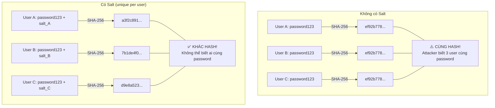
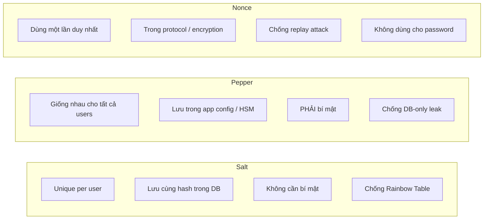

# Salt là gì?

## ⚡ Tóm tắt ngắn (30s)
* **Salt** là một chuỗi **random, unique** được thêm vào password TRƯỚC khi hash, đảm bảo cùng password cho ra hash khác nhau
* Mục đích chính: chống **Rainbow Table attack** và ngăn phát hiện 2 user dùng cùng password
* Salt phải: **unique per-user**, **cryptographically random**, đủ dài (≥16 bytes), lưu cùng hash (KHÔNG cần bí mật)
* BCrypt, SCrypt, Argon2 tự động generate và embed salt — developer KHÔNG cần quản lý thủ công
* Salt KHÔNG phải secret — nó chỉ cần unique. Cái cần secret là **Pepper** (khái niệm khác)

---

## 🔍 Chi tiết bản chất thực chiến

### Vấn đề khi hash KHÔNG có salt



### Rainbow Table Attack — Salt giải quyết gì?

**Rainbow Table**: Bảng pre-computed chứa hàng tỷ cặp `(plaintext → hash)`. Attacker:
1. Leak database → lấy được hashed passwords
2. Tra cứu hash trong Rainbow Table → tìm được plaintext

**Với Salt**: Mỗi password có salt riêng → attacker phải build Rainbow Table riêng cho TỪNG salt → chi phí storage và computation tăng gấp N lần (N = số users) → infeasible.

### Salt vs Pepper vs Nonce



| Đặc điểm | Salt | Pepper | Nonce |
| :--- | :--- | :--- | :--- |
| **Scope** | Per-user | Per-application | Per-operation |
| **Stored** | Cùng hash (DB) | App config / HSM | Không lưu |
| **Secret?** | ❌ Không cần | ✅ Bắt buộc | N/A |
| **Purpose** | Uniqueness | Extra secret layer | Prevent replay |

---

## 💻 Code thực chiến: BAD vs GOOD

### ❌ BAD: Sử dụng salt sai cách

```java
@Service
public class BadPasswordService {

    // ❌ BAD — Không dùng salt
    public String hashPassword_v1(String password) {
        MessageDigest md = MessageDigest.getInstance("SHA-256");
        byte[] hash = md.digest(password.getBytes(StandardCharsets.UTF_8));
        return Base64.getEncoder().encodeToString(hash);
        // "password123" LUÔN cho cùng hash → Rainbow Table dễ dàng crack
    }

    // ❌ BAD — Static salt (giống nhau cho mọi user)
    private static final String GLOBAL_SALT = "myAppSalt2024";

    public String hashPassword_v2(String password) {
        String salted = GLOBAL_SALT + password;
        MessageDigest md = MessageDigest.getInstance("SHA-256");
        byte[] hash = md.digest(salted.getBytes(StandardCharsets.UTF_8));
        return Base64.getEncoder().encodeToString(hash);
        // Cùng password → vẫn cùng hash (vì cùng salt)
        // Attacker build 1 Rainbow Table cho salt này → crack all
    }

    // ❌ BAD — Salt ngắn hoặc predictable
    public String hashPassword_v3(String password, long userId) {
        String salt = String.valueOf(userId); // Salt = "1", "2", "3"...
        // Predictable, ngắn, dễ brute-force
        String salted = salt + password;
        return DigestUtils.sha256Hex(salted);
    }

    // ❌ BAD — Tự implement salt + fast hash
    public String hashPassword_v4(String password) {
        byte[] salt = new byte[16];
        new Random().nextBytes(salt); // ❌ java.util.Random KHÔNG cryptographically secure
        String salted = Base64.getEncoder().encodeToString(salt) + password;
        return DigestUtils.sha256Hex(salted);
        // SHA-256 quá nhanh dù có salt → GPU brute-force vẫn hiệu quả
    }
}
```

---

### ✅ GOOD: Salt đúng cách với BCrypt/Argon2 (auto-managed)

```java
@Service
public class GoodPasswordService {

    // ✅ BEST PRACTICE — BCrypt tự quản lý salt
    private final BCryptPasswordEncoder encoder = new BCryptPasswordEncoder(12);

    public String hashPassword(String password) {
        String hash1 = encoder.encode(password);
        String hash2 = encoder.encode(password);
        // hash1 ≠ hash2 — vì BCrypt tự generate random salt mỗi lần
        // Salt được embed trong hash string:
        // $2a$12$[22 chars SALT][31 chars HASH]
        return hash1;
    }

    public boolean verifyPassword(String rawPassword, String storedHash) {
        // BCrypt tự extract salt từ storedHash để verify
        return encoder.matches(rawPassword, storedHash);
    }
}

// ✅ Nếu BẮT BUỘC phải tự manage salt (ví dụ: legacy system)
@Service
public class ManualSaltService {

    public SaltedHash hashWithExplicitSalt(String password) {
        // ✅ Dùng SecureRandom — cryptographically secure
        byte[] salt = new byte[32]; // 256 bits — đủ dài
        SecureRandom secureRandom = new SecureRandom();
        secureRandom.nextBytes(salt);

        // ✅ Dùng PBKDF2 nếu không dùng BCrypt/Argon2
        SecretKeyFactory factory = SecretKeyFactory.getInstance("PBKDF2WithHmacSHA256");
        KeySpec spec = new PBEKeySpec(
            password.toCharArray(),
            salt,
            310_000,  // ✅ OWASP 2024: tối thiểu 600,000 cho SHA-1, 310,000 cho SHA-256
            256       // Output key length in bits
        );
        byte[] hash = factory.generateSecret(spec).getEncoded();

        return new SaltedHash(
            Base64.getEncoder().encodeToString(salt),
            Base64.getEncoder().encodeToString(hash)
        );
    }

    public boolean verify(String password, SaltedHash stored) {
        byte[] salt = Base64.getDecoder().decode(stored.salt());
        SecretKeyFactory factory = SecretKeyFactory.getInstance("PBKDF2WithHmacSHA256");
        KeySpec spec = new PBEKeySpec(password.toCharArray(), salt, 310_000, 256);
        byte[] hash = factory.generateSecret(spec).getEncoded();
        // ✅ Constant-time comparison — chống timing attack
        return MessageDigest.isEqual(hash, Base64.getDecoder().decode(stored.hash()));
    }

    public record SaltedHash(String salt, String hash) {}
}

// ✅ Spring Security Argon2 — salt hoàn toàn tự động
@Configuration
public class PasswordConfig {

    @Bean
    public PasswordEncoder passwordEncoder() {
        // Argon2id: tự generate 16-byte random salt
        // Salt embedded trong output string — zero manual management
        return new Argon2PasswordEncoder(
            16,    // salt length (bytes)
            32,    // hash length (bytes)
            1,     // parallelism
            65536, // memory in KB (64 MB)
            3      // iterations
        );
    }
}
```

---

## 📊 Bảng so sánh: Có Salt vs Không Salt vs Salt sai

| Scenario | Rainbow Table | Cùng password = cùng hash? | GPU Brute-force | Đánh giá |
| :--- | :--- | :--- | :--- | :--- |
| **SHA-256, no salt** | ✅ Dùng được | ✅ Có | Cực nhanh | ❌ Fail |
| **SHA-256 + static salt** | ✅ Build mới cho salt đó | ✅ Có | Cực nhanh | ❌ Fail |
| **SHA-256 + unique salt** | ❌ Không khả thi | ❌ Không | Vẫn nhanh | ⚠️ Chưa đủ |
| **BCrypt (auto salt)** | ❌ Không khả thi | ❌ Không | Rất chậm | ✅ Tốt |
| **Argon2id (auto salt)** | ❌ Không khả thi | ❌ Không | Cực chậm + tốn RAM | ✅ Tốt nhất |

---

## ⚠️ Common Gotchas & Questions follow-up

### 1. "Salt không cần bí mật" — tại sao?
* Salt được lưu cùng hash trong DB — nếu DB leak, attacker có salt
* **Vẫn an toàn** vì mục đích của salt là **uniqueness**, không phải secrecy
* Salt buộc attacker phải brute-force TỪNG user riêng lẻ thay vì attack tất cả cùng lúc
* Nếu muốn thêm secret → dùng **Pepper** (lưu ngoài DB)

### 2. Salt nên dài bao nhiêu?
* **Tối thiểu 16 bytes (128 bits)** — OWASP recommendation
* BCrypt dùng 16 bytes, Argon2 mặc định 16 bytes
* Quá ngắn (< 8 bytes) → collision probability cao → giảm hiệu quả

### 3. java.util.Random vs SecureRandom
* **`Random`**: Pseudo-random, predictable nếu biết seed → KHÔNG dùng cho security
* **`SecureRandom`**: Cryptographically secure, entropy từ OS → BẮT BUỘC dùng cho salt
* Sai lầm phổ biến: dùng `new Random()` hoặc `System.currentTimeMillis()` làm salt

### 4. Tại sao BCrypt tự embed salt trong hash?
* **Tiện lợi**: Chỉ cần 1 column trong DB (`password_hash`), không cần column `salt` riêng
* **An toàn**: Không thể quên lưu salt hoặc lưu sai salt
* **Portable**: Hash string chứa đầy đủ thông tin để verify (algorithm + cost + salt + hash)

### 5. Interview follow-up: "Nếu 2 user cùng password và cùng salt thì sao?"
* Hash sẽ giống nhau → attacker crack 1 là crack cả 2
* Đó là lý do salt PHẢI unique per-user và generated bằng CSPRNG
* Probability collision 2 random 16-byte salts = 1/2^128 ≈ 0 (negligible)

### 6. Salt trong context khác ngoài password
* **CSRF token**: Salt + session ID → unique per-session token
* **Encryption nonce/IV**: Tương tự salt, đảm bảo cùng plaintext → khác ciphertext
* **API key generation**: Random salt component để ensure uniqueness
