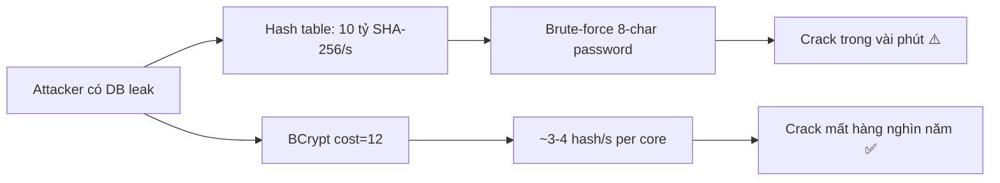
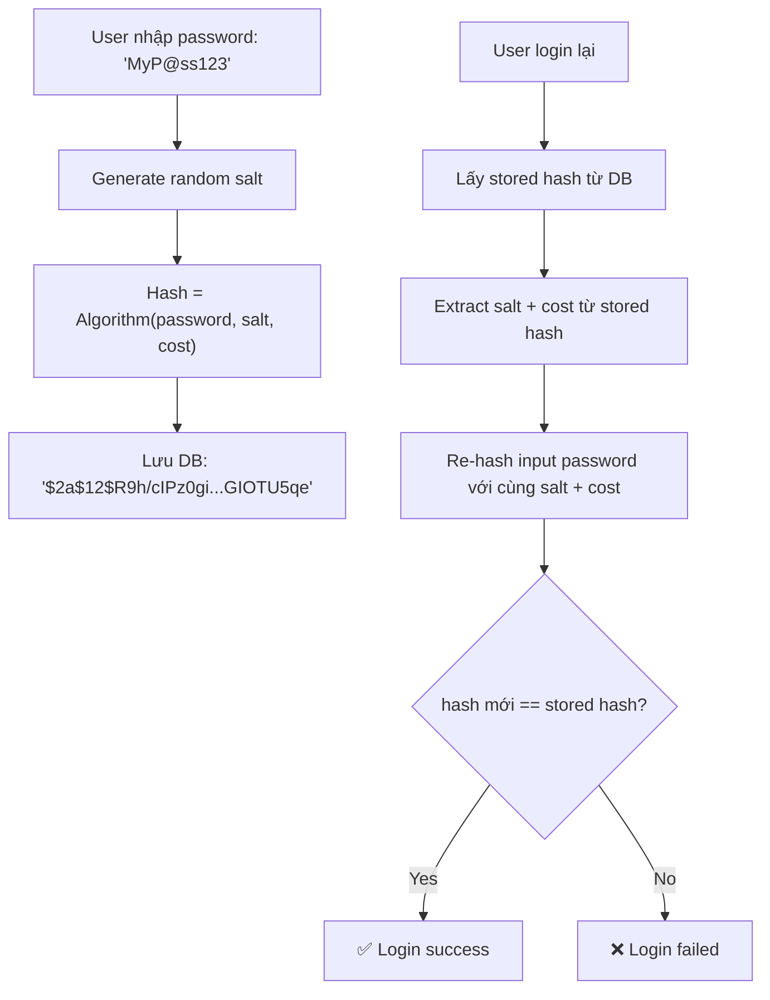

# BCrypt, Argon2 dùng để làm gì?

## ⚡ Tóm tắt ngắn (30s)
* BCrypt và Argon2 là **password hashing algorithms** — dùng để hash mật khẩu trước khi lưu vào database, đảm bảo kể cả khi database bị leak, attacker cũng không thể reverse ra plaintext password
* Khác với MD5/SHA — chúng được thiết kế **intentionally slow** (cost factor tunable) để chống brute-force và rainbow table attacks
* **BCrypt** là standard đã proven qua 25+ năm, **Argon2** (winner of Password Hashing Competition 2015) là thế hệ mới hỗ trợ cả memory-hard để chống GPU/ASIC attacks
* Spring Security mặc định dùng BCrypt, nhưng hỗ trợ cả Argon2 thông qua `DelegatingPasswordEncoder`

---

## 🔍 Chi tiết bản chất thực chiến

### Tại sao không dùng MD5/SHA để hash password?

MD5/SHA được thiết kế để **nhanh** — một GPU hiện đại có thể hash hàng tỷ SHA-256/giây. Điều này hoàn hảo cho checksum file nhưng **thảm họa** cho password:



### BCrypt — Battle-tested Standard

- Dựa trên **Blowfish cipher** với adaptive cost factor
- Output format: `$2a$12$salt22chars...hash31chars...` (60 chars total)
- **Cost factor** (work factor): mỗi lần tăng 1 → thời gian hash **gấp đôi**
- Tự động sinh **random salt** 128-bit → cùng password cho ra hash khác nhau

### Argon2 — Thế hệ mới, Memory-Hard

- 3 biến thể: **Argon2d** (data-dependent), **Argon2i** (data-independent), **Argon2id** (hybrid, recommended)
- Tunable 3 chiều: **time cost**, **memory cost**, **parallelism**
- **Memory-hard**: yêu cầu lượng RAM lớn → GPU/ASIC có hàng nghìn core nhưng ít memory per core → không thể parallelize hiệu quả

### Cơ chế hoạt động chung



---

## 💻 Code thực chiến: BAD vs GOOD

### ❌ BAD: Dùng MD5/SHA hoặc tự implement hashing

```java
@Service
public class BadUserService {
    
    // ❌ MD5 — crackable trong milliseconds
    public String hashPassword(String password) {
        MessageDigest md = MessageDigest.getInstance("MD5");
        byte[] hash = md.digest(password.getBytes());
        return Base64.getEncoder().encodeToString(hash);
    }
    
    // ❌ SHA-256 có salt nhưng vẫn quá nhanh cho brute-force
    public String hashWithSalt(String password, String salt) {
        MessageDigest md = MessageDigest.getInstance("SHA-256");
        md.update(salt.getBytes());
        byte[] hash = md.digest(password.getBytes());
        return Base64.getEncoder().encodeToString(hash);
    }
    
    // ❌ Lưu plaintext — thảm họa bảo mật
    public void saveUser(String username, String password) {
        userRepository.save(new User(username, password)); 
    }
}
```

---

### ✅ GOOD: Dùng Spring Security PasswordEncoder với BCrypt/Argon2

```java
@Configuration
public class SecurityConfig {

    @Bean
    public PasswordEncoder passwordEncoder() {
        // ✅ DelegatingPasswordEncoder — hỗ trợ migrate giữa các algorithm
        // Default: BCrypt, nhưng có thể verify hash từ nhiều algorithm khác
        return PasswordEncoderFactories.createDelegatingPasswordEncoder();
    }
    
    // Hoặc explicit chọn Argon2 cho project mới
    @Bean
    public PasswordEncoder argon2PasswordEncoder() {
        return new Argon2PasswordEncoder(
            16,    // salt length (bytes)
            32,    // hash length (bytes)  
            1,     // parallelism
            65536, // memory cost (KB) — 64MB
            3      // iterations
        );
    }
}

@Service
@RequiredArgsConstructor
public class GoodUserService {

    private final PasswordEncoder passwordEncoder;
    private final UserRepository userRepository;

    // ✅ Hash password trước khi lưu
    public User register(RegisterRequest request) {
        String hashedPassword = passwordEncoder.encode(request.getPassword());
        // Output: {bcrypt}$2a$10$dXJ3SW6G7P50lGmMQ... 
        // hoặc: {argon2}$argon2id$v=19$m=65536,t=3,p=1$...
        
        User user = User.builder()
            .username(request.getUsername())
            .password(hashedPassword)  // ✅ Chỉ lưu hash, KHÔNG BAO GIỜ lưu plaintext
            .build();
        return userRepository.save(user);
    }

    // ✅ Verify password khi login
    public boolean authenticate(String rawPassword, String storedHash) {
        return passwordEncoder.matches(rawPassword, storedHash);
        // Internally: extract salt từ storedHash → re-hash → compare
    }
    
    // ✅ Upgrade hash algorithm transparently
    public void upgradePasswordIfNeeded(User user, String rawPassword) {
        if (passwordEncoder.upgradeEncoding(user.getPassword())) {
            user.setPassword(passwordEncoder.encode(rawPassword));
            userRepository.save(user);
        }
    }
}
```

---

## 📊 Bảng so sánh BCrypt vs Argon2

| Tiêu chí | BCrypt | Argon2id |
| :--- | :--- | :--- |
| **Năm ra đời** | 1999 | 2015 |
| **Chống GPU/ASIC** | Trung bình (CPU-bound only) | Rất tốt (memory-hard) |
| **Tunable parameters** | Cost factor (1 chiều) | Time, Memory, Parallelism (3 chiều) |
| **Max password length** | 72 bytes (cắt ngầm!) | Không giới hạn |
| **OWASP recommendation** | ✅ Accepted | ✅ Preferred cho project mới |
| **Spring Security support** | `BCryptPasswordEncoder` | `Argon2PasswordEncoder` |
| **Maturity / Track record** | 25+ năm battle-tested | ~10 năm, growing adoption |
| **Recommended cost** | Factor 10-12 | m=19456KB, t=2, p=1 (OWASP) |
| **Khi nào chọn** | Legacy system, cần ổn định | Greenfield, cần bảo mật tối đa |

---

## ⚠️ Common Gotchas & Questions follow-up

### 1. BCrypt cắt password ở 72 bytes
* **Problem**: Password dài hơn 72 bytes bị truncate ngầm → 2 password khác nhau nhưng cùng 72 bytes đầu sẽ match
* **Consequence**: User nghĩ password dài hơn thì an toàn hơn, nhưng thực tế không phải
* **Solution**: Pre-hash password bằng SHA-256 trước khi đưa vào BCrypt, hoặc chuyển sang Argon2

### 2. Đừng hardcode cost factor — phải benchmark
* **Problem**: Cost factor quá thấp → dễ brute-force; quá cao → login chậm, DoS risk
* **Solution**: Benchmark trên production hardware, target **~250ms-1s** per hash. Tăng cost theo thời gian khi hardware mạnh hơn

### 3. Password migration strategy
* **Problem**: Đổi algorithm từ MD5/SHA sang BCrypt mà không bắt user đổi password
* **Solution**: Dùng `DelegatingPasswordEncoder` — verify bằng algorithm cũ, re-hash bằng algorithm mới khi user login thành công

### 4. Timing attack khi compare hash
* **Problem**: So sánh string thông thường (`equals()`) sẽ short-circuit → attacker đo thời gian response để đoán từng byte
* **Solution**: Spring Security dùng **constant-time comparison** internally — không tự implement

### 5. Interviewer hỏi thêm: "Salt để làm gì?"
* **Trả lời**: Salt đảm bảo cùng 1 password cho ra hash khác nhau → **chống rainbow table** (precomputed hash lookup). BCrypt/Argon2 tự generate random salt — developer không cần quản lý riêng
