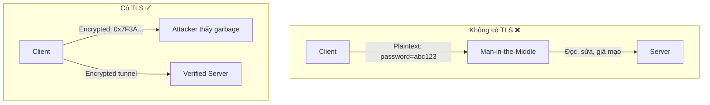
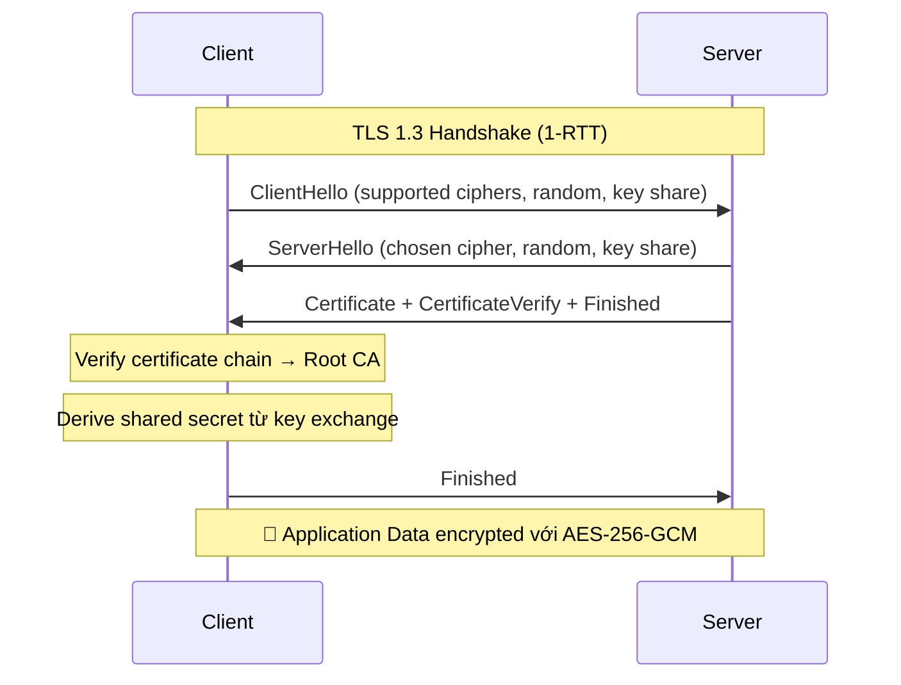

# HTTPS/TLS giải quyết vấn đề gì?

## ⚡ Tóm tắt ngắn (30s)
* HTTPS/TLS giải quyết **3 vấn đề cốt lõi**: **Confidentiality** (mã hóa dữ liệu), **Integrity** (chống tampering), và **Authentication** (xác thực server identity)
* TLS (Transport Layer Security) là protocol mã hóa ở tầng transport — HTTPS = HTTP + TLS
* Bản chất: dùng **asymmetric encryption** (RSA/ECDSA) để trao đổi key ban đầu, sau đó dùng **symmetric encryption** (AES) cho data thực tế — kết hợp ưu điểm cả hai
* Trong microservices, TLS không chỉ dùng cho client→server mà còn **service-to-service** (east-west traffic), đặc biệt khi chạy trên cloud

---

## 🔍 Chi tiết bản chất thực chiến

### 3 vấn đề HTTPS/TLS giải quyết



| Vấn đề | Mô tả | TLS giải quyết bằng |
| :--- | :--- | :--- |
| **Eavesdropping** | Attacker đọc data trên network | Symmetric encryption (AES-256-GCM) |
| **Tampering** | Attacker sửa data giữa đường | MAC (Message Authentication Code) |
| **Impersonation** | Attacker giả mạo server | Certificate + CA chain verification |

### TLS Handshake — Quá trình thiết lập kết nối an toàn



### TLS 1.2 vs TLS 1.3

- **TLS 1.3** loại bỏ các cipher suites yếu (RSA key exchange, CBC mode, SHA-1)
- Handshake **1-RTT** thay vì 2-RTT → nhanh hơn đáng kể
- **0-RTT resumption** cho subsequent connections (có trade-off replay attack)
- **Forward Secrecy bắt buộc** — dùng ephemeral ECDHE keys

---

## 💻 Code thực chiến: BAD vs GOOD

### ❌ BAD: Cấu hình TLS không an toàn

```java
// ❌ Spring Boot cho phép TLS cũ và cipher yếu
// application.yml
server:
  ssl:
    enabled: true
    key-store: classpath:keystore.p12
    key-store-password: changeit          # ❌ Weak password, hardcoded
    protocol: TLS                         # ❌ Cho phép TLS 1.0/1.1 (deprecated)
    # Không restrict cipher suites → accept weak ciphers

// ❌ Disable SSL verification trong RestTemplate — phổ biến trong dev nhưng TUYỆT ĐỐI KHÔNG production
@Bean
public RestTemplate restTemplate() throws Exception {
    TrustManager[] trustAll = new TrustManager[]{
        new X509TrustManager() {
            public void checkClientTrusted(X509Certificate[] certs, String t) {}
            public void checkServerTrusted(X509Certificate[] certs, String t) {} // ❌ Trust mọi thứ
            public X509Certificate[] getAcceptedIssuers() { return null; }
        }
    };
    SSLContext ctx = SSLContext.getInstance("TLS");
    ctx.init(null, trustAll, new SecureRandom()); // ❌ Vô hiệu hóa hoàn toàn TLS verification
    
    HttpComponentsClientHttpRequestFactory factory = 
        new HttpComponentsClientHttpRequestFactory();
    return new RestTemplate(factory);
}
```

---

### ✅ GOOD: Cấu hình TLS hardened + proper certificate handling

```java
// ✅ application.yml — TLS 1.3 only, strong ciphers
server:
  ssl:
    enabled: true
    key-store: ${SSL_KEYSTORE_PATH}            # ✅ Path từ env variable
    key-store-password: ${SSL_KEYSTORE_PASS}   # ✅ Password từ env/vault
    key-store-type: PKCS12
    protocol: TLSv1.3                          # ✅ Chỉ TLS 1.3
    enabled-protocols: TLSv1.3                 # ✅ Disable TLS 1.0/1.1/1.2
    ciphers:                                   # ✅ Chỉ strong cipher suites
      - TLS_AES_256_GCM_SHA384
      - TLS_AES_128_GCM_SHA256
  # ✅ Security headers
  servlet:
    session:
      cookie:
        secure: true                           # ✅ Cookie chỉ gửi qua HTTPS

// ✅ Force HTTPS redirect + HSTS
@Configuration
@EnableWebSecurity
public class SecurityConfig {

    @Bean
    public SecurityFilterChain filterChain(HttpSecurity http) throws Exception {
        http
            .requiresChannel(channel -> 
                channel.anyRequest().requiresSecure()  // ✅ Redirect HTTP → HTTPS
            )
            .headers(headers -> headers
                .httpStrictTransportSecurity(hsts -> hsts
                    .includeSubDomains(true)
                    .maxAgeInSeconds(31536000)  // ✅ HSTS 1 year
                    .preload(true)
                )
            );
        return http.build();
    }
}

// ✅ WebClient với proper TLS trust store
@Configuration
public class WebClientConfig {

    @Bean
    public WebClient secureWebClient() throws Exception {
        SslContext sslContext = SslContextBuilder.forClient()
            .trustManager(new File("/etc/ssl/certs/ca-bundle.crt"))  // ✅ Explicit trust store
            .protocols("TLSv1.3")
            .build();

        HttpClient httpClient = HttpClient.create()
            .secure(spec -> spec.sslContext(sslContext));

        return WebClient.builder()
            .clientConnector(new ReactorClientHttpConnector(httpClient))
            .build();
    }
}
```

---

## 📊 Bảng so sánh TLS versions

| Tiêu chí | TLS 1.0/1.1 | TLS 1.2 | TLS 1.3 |
| :--- | :--- | :--- | :--- |
| **Status** | ❌ Deprecated (RFC 8996) | ✅ Acceptable | ✅ Recommended |
| **Handshake RTT** | 2-RTT | 2-RTT | 1-RTT (0-RTT resumption) |
| **Forward Secrecy** | Optional | Optional | Bắt buộc (ECDHE only) |
| **Known vulnerabilities** | POODLE, BEAST, CRIME | Misconfiguration risks | Không có known attacks |
| **Key exchange** | RSA, DHE, ECDHE | RSA, DHE, ECDHE | ECDHE only |
| **Cipher mode** | CBC, Stream | CBC, GCM, CCM | AEAD only (GCM, ChaCha20) |
| **Java support** | Java 6+ | Java 7+ | Java 11+ |

---

## ⚠️ Common Gotchas & Questions follow-up

### 1. HTTPS không có nghĩa là "an toàn hoàn toàn"
* **Problem**: HTTPS chỉ mã hóa transport — attacker vẫn có thể thấy **SNI** (domain bạn đang truy cập), DNS queries, packet sizes
* **Consequence**: Metadata leakage vẫn tiết lộ thông tin
* **Solution**: Kết hợp DNS-over-HTTPS (DoH), ECH (Encrypted Client Hello) cho TLS 1.3

### 2. Certificate pinning — khi nào cần?
* **Problem**: CA bị compromise → attacker có thể issue fake certificate cho domain của bạn
* **Solution**: **Certificate pinning** cho mobile apps hoặc service-to-service. Tuy nhiên, cần rotation strategy cẩn thận — pin sai = service outage

### 3. TLS termination ở đâu trong microservices?
* **Option 1**: Terminate tại **Load Balancer/API Gateway** → internal traffic plaintext (nhanh hơn nhưng kém secure)
* **Option 2**: **End-to-end TLS** + mTLS giữa services → overhead nhưng zero-trust compliant
* **Thực tế**: Hầu hết dùng **service mesh** (Istio/Linkerd) tự động handle mTLS cho east-west traffic

### 4. Let's Encrypt & Auto-renewal
* **Problem**: Certificate hết hạn → service downtime
* **Solution**: Dùng **cert-manager** (Kubernetes) hoặc **Certbot** tự động renew. Let's Encrypt cert có hạn 90 ngày — phải automate

### 5. Interviewer hỏi thêm: "TLS có ảnh hưởng performance không?"
* **Trả lời**: TLS 1.3 handshake chỉ tốn 1-RTT (~1-2ms thêm). Session resumption (0-RTT) gần như miễn phí. Encryption overhead (AES-NI hardware acceleration) < 5% CPU trên modern hardware — trade-off hoàn toàn xứng đáng
