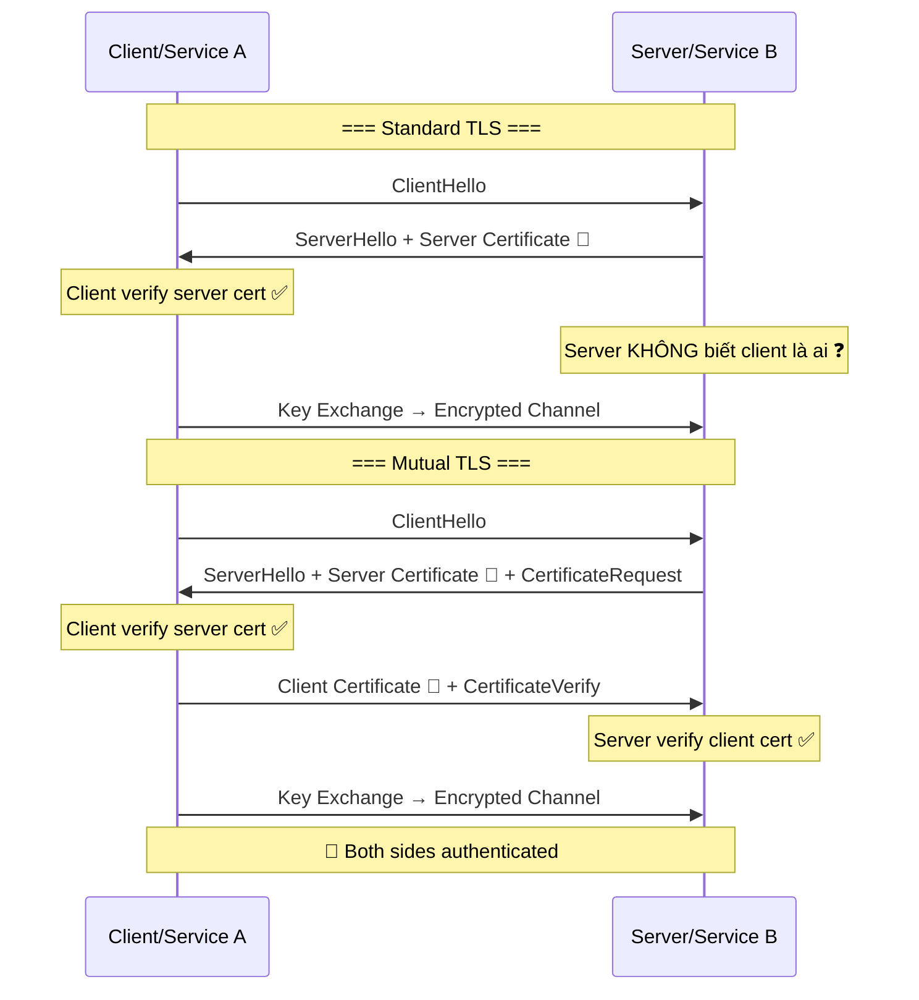
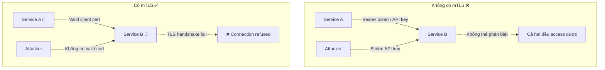

# mTLS là gì?

## ⚡ Tóm tắt ngắn (30s)
* **mTLS** (Mutual TLS) = TLS thông thường + **client cũng phải present certificate** để server xác thực ngược lại → hai chiều thay vì một chiều
* TLS thường: chỉ client verify server ("Tôi có đang nói chuyện đúng server không?"). mTLS: **cả hai bên verify lẫn nhau** ("Tôi biết bạn là ai, và bạn cũng biết tôi là ai")
* Use case chính: **service-to-service authentication** trong microservices, Zero Trust Architecture, API authentication thay thế API key
* Trong production, thường triển khai qua **service mesh** (Istio/Linkerd) để tự động manage certificate — không hardcode trong application

---

## 🔍 Chi tiết bản chất thực chiến

### TLS vs mTLS — Sự khác biệt cốt lõi



### Tại sao cần mTLS trong Microservices?



### Khi nào dùng mTLS?
1. **Service-to-service** trong microservices (Zero Trust: "never trust, always verify")
2. **B2B API integration** — partner phải prove identity bằng certificate
3. **IoT devices** authenticate với cloud backend
4. **Internal services** truy cập database, message broker
5. **Thay thế VPN** — identity-based access thay vì network-based

---

## 💻 Code thực chiến: BAD vs GOOD

### ❌ BAD: Service-to-service auth bằng shared API key

```java
// ❌ Shared secret dễ bị leak, không có identity, không auto-rotate
@RestController
public class OrderController {

    @GetMapping("/internal/orders")
    public List<Order> getOrders(@RequestHeader("X-API-Key") String apiKey) {
        // ❌ Hardcoded API key comparison
        if (!"super-secret-key-123".equals(apiKey)) {
            throw new ResponseStatusException(HttpStatus.UNAUTHORIZED);
        }
        // ❌ Không biết chính xác SERVICE NÀO đang gọi
        // ❌ API key bị log, bị leak qua header → attacker dùng được
        // ❌ Rotate key = downtime cho tất cả services
        return orderService.findAll();
    }
}

// ❌ Client side — API key hardcoded
@Service
public class OrderClient {
    private final RestTemplate restTemplate;
    
    public List<Order> getOrders() {
        HttpHeaders headers = new HttpHeaders();
        headers.set("X-API-Key", "super-secret-key-123"); // ❌ Hardcoded
        // Nếu key bị commit vào Git → game over
        return restTemplate.exchange("/internal/orders", GET, 
            new HttpEntity<>(headers), new ParameterizedTypeReference<>(){}).getBody();
    }
}
```

---

### ✅ GOOD: Spring Boot mTLS configuration

```yaml
# ✅ Server side — application.yml (Service B)
server:
  ssl:
    enabled: true
    key-store: classpath:server-keystore.p12
    key-store-password: ${KEYSTORE_PASSWORD}
    key-store-type: PKCS12
    # ✅ Đây là phần quan trọng: yêu cầu client certificate
    client-auth: need              # need = bắt buộc, want = optional
    trust-store: classpath:server-truststore.p12   # ✅ Chứa CA cert để verify client
    trust-store-password: ${TRUSTSTORE_PASSWORD}
    protocol: TLSv1.3
```

```java
// ✅ Server side — Extract client identity từ certificate
@RestController
public class OrderController {

    @GetMapping("/internal/orders")
    public List<Order> getOrders(HttpServletRequest request) {
        // ✅ Client certificate đã được TLS layer verify trước khi vào đây
        X509Certificate[] certs = (X509Certificate[]) 
            request.getAttribute("javax.servlet.request.X509Certificate");
        
        if (certs != null && certs.length > 0) {
            String clientCN = certs[0].getSubjectX500Principal().getName();
            // ✅ Biết chính xác service nào đang gọi: "CN=payment-service"
            log.info("Request from authenticated service: {}", clientCN);
            
            // ✅ Có thể implement fine-grained authorization dựa trên client identity
            if (!authorizedServices.contains(clientCN)) {
                throw new ResponseStatusException(HttpStatus.FORBIDDEN);
            }
        }
        return orderService.findAll();
    }
}

// ✅ Spring Security — auto-extract certificate principal
@Configuration
@EnableWebSecurity
public class MtlsSecurityConfig {

    @Bean
    public SecurityFilterChain filterChain(HttpSecurity http) throws Exception {
        http
            .x509(x509 -> x509
                .subjectPrincipalRegex("CN=(.*?)(?:,|$)")  // ✅ Extract CN as principal
                .userDetailsService(serviceUserDetailsService())
            )
            .authorizeHttpRequests(auth -> auth
                .requestMatchers("/internal/**").authenticated()
                .anyRequest().denyAll()
            );
        return http.build();
    }
}

// ✅ Client side — WebClient với client certificate
@Configuration
public class MtlsWebClientConfig {

    @Bean
    public WebClient mtlsWebClient(
            @Value("${client.ssl.key-store}") String keyStore,
            @Value("${client.ssl.key-store-password}") String keyStorePass,
            @Value("${client.ssl.trust-store}") String trustStore,
            @Value("${client.ssl.trust-store-password}") String trustStorePass
    ) throws Exception {
        
        KeyStore ks = KeyStore.getInstance("PKCS12");
        ks.load(new FileInputStream(keyStore), keyStorePass.toCharArray());
        
        KeyManagerFactory kmf = KeyManagerFactory.getInstance(KeyManagerFactory.getDefaultAlgorithm());
        kmf.init(ks, keyStorePass.toCharArray());

        KeyStore ts = KeyStore.getInstance("PKCS12");
        ts.load(new FileInputStream(trustStore), trustStorePass.toCharArray());
        
        TrustManagerFactory tmf = TrustManagerFactory.getInstance(TrustManagerFactory.getDefaultAlgorithm());
        tmf.init(ts);

        SslContext sslContext = SslContextBuilder.forClient()
            .keyManager(kmf)       // ✅ Client certificate
            .trustManager(tmf)     // ✅ Server certificate verification
            .protocols("TLSv1.3")
            .build();

        HttpClient httpClient = HttpClient.create()
            .secure(spec -> spec.sslContext(sslContext));

        return WebClient.builder()
            .clientConnector(new ReactorClientHttpConnector(httpClient))
            .build();
    }
}
```

---

## 📊 Bảng so sánh Authentication Methods cho Service-to-Service

| Tiêu chí | API Key | JWT/OAuth2 | mTLS |
| :--- | :--- | :--- | :--- |
| **Identity verification** | Weak (shared secret) | Medium (token-based) | Strong (certificate-based) |
| **Encryption** | Cần HTTPS riêng | Cần HTTPS riêng | Built-in (TLS) |
| **Key/Cert rotation** | Manual, disruptive | Token có expiry | Auto-rotate qua CA |
| **Replay attack** | Vulnerable | Mitigated (expiry) | Not applicable |
| **Performance overhead** | Thấp | Medium (token validation) | Cao (TLS handshake) |
| **Implementation complexity** | Thấp | Medium | Cao (tự manage) / Thấp (service mesh) |
| **Zero Trust compatible** | ❌ | ⚠️ Partial | ✅ Full |
| **Best for** | Simple internal APIs | User-facing APIs | Service mesh, high-security |

---

## ⚠️ Common Gotchas & Questions follow-up

### 1. Certificate management là pain point lớn nhất
* **Problem**: Mỗi service cần unique key pair + certificate → quản lý hàng trăm certificates, rotation, revocation
* **Solution**: Dùng **service mesh** (Istio tự động inject sidecar proxy + issue/rotate certs qua internal CA), hoặc **cert-manager** + **Vault PKI**

### 2. mTLS không thay thế authorization
* **Problem**: mTLS chỉ xác thực "bạn là service A" — KHÔNG nói "service A có quyền gọi API này không"
* **Solution**: Kết hợp mTLS (authentication) + **OPA/Istio Authorization Policy** (authorization) cho fine-grained access control

### 3. Debugging mTLS rất khó
* **Problem**: Khi TLS handshake fail → error message thường rất generic ("Connection reset", "SSL handshake failed")
* **Solution**: Enable TLS debug logging (`-Djavax.net.debug=ssl,handshake`), dùng `openssl s_client` để test manually

### 4. Service mesh vs Application-level mTLS
* **Istio/Linkerd approach**: Sidecar proxy xử lý mTLS transparent → application code không cần thay đổi
* **Application approach**: Spring Boot config như trên → more control nhưng more work
* **Production recommendation**: Service mesh cho Kubernetes, application-level cho non-K8s environments

### 5. Interviewer hỏi thêm: "mTLS có ảnh hưởng latency không?"
* **Trả lời**: TLS handshake thêm ~1-2ms per new connection. Với connection pooling và TLS session resumption → gần như negligible. Service mesh sidecar thêm ~1ms latency — acceptable cho hầu hết use cases
