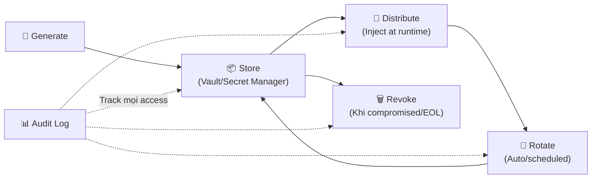
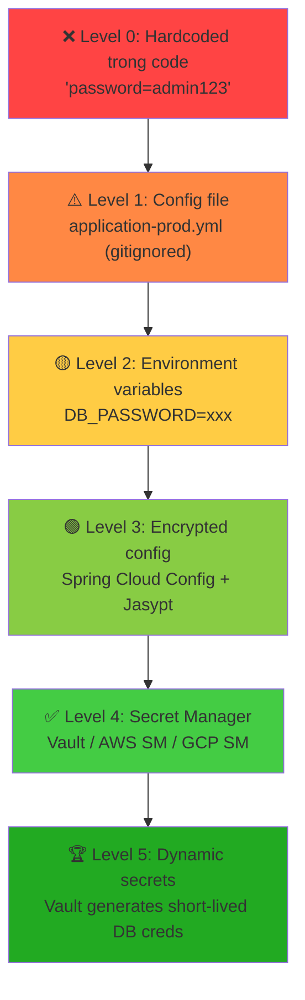

# Secret nên quản lý thế nào?

## ⚡ Tóm tắt ngắn (30s)
* **Secret** (passwords, API keys, certificates, tokens) **KHÔNG BAO GIỜ** được hardcode trong source code, config files, hoặc Docker images
* Nguyên tắc vàng: **externalize + encrypt + rotate + audit** — tách secret ra khỏi code, mã hóa at-rest, tự động xoay vòng, và log mọi access
* 3 tier phổ biến: **Environment variables** (đơn giản, dev/staging) → **Encrypted config** (Spring Cloud Config + encrypt) → **Secret Manager** (HashiCorp Vault, AWS Secrets Manager — production)
* Trong Spring Boot ecosystem: dùng **Spring Cloud Vault** hoặc **AWS/GCP Secret Manager SDK** để inject secrets at runtime, KHÔNG lưu trong `application.yml`

---

## 🔍 Chi tiết bản chất thực chiến

### Secret Lifecycle — Vòng đời quản lý secret



### Hierarchy of Secret Management (từ tệ đến tốt)



### Các loại secret cần quản lý
1. **Database credentials** — username/password cho PostgreSQL, MySQL, MongoDB
2. **API keys** — third-party service keys (Stripe, SendGrid, Twilio)
3. **JWT signing keys** — private key cho token signing
4. **TLS certificates** — private key cho HTTPS/mTLS
5. **Encryption keys** — AES keys cho data encryption at-rest
6. **SSH keys** — cho deployment, CI/CD pipeline access
7. **OAuth client secrets** — cho OIDC/OAuth2 flows

---

## 💻 Code thực chiến: BAD vs GOOD

### ❌ BAD: Secrets hardcoded và commit vào Git

```java
// ❌ application.yml — checked into Git
spring:
  datasource:
    url: jdbc:postgresql://prod-db:5432/myapp
    username: admin
    password: SuperSecret123!              # ❌ Plaintext password trong Git
    
jwt:
  secret: myJwtSecretKeyThatIsVeryLong123  # ❌ JWT key trong code

third-party:
  stripe-api-key: sk_live_abc123def456     # ❌ Production API key

// ❌ Hardcoded trong Java code
@Service
public class BadPaymentService {
    // ❌ Secret trong constant — bất kỳ ai có access repo đều thấy
    private static final String STRIPE_KEY = "sk_live_abc123def456";
    
    // ❌ Dùng .env file rồi commit luôn .env vào Git
    // ❌ Để secret trong Docker image layer — extract được bằng docker history
    // ❌ Truyền secret qua command line args — visible qua ps aux
}
```

---

### ✅ GOOD: Multi-layer secret management

```yaml
# ✅ application.yml — KHÔNG có secret nào, chỉ có placeholders
spring:
  datasource:
    url: jdbc:postgresql://${DB_HOST}:5432/${DB_NAME}
    username: ${DB_USERNAME}
    password: ${DB_PASSWORD}      # ✅ Inject từ env/vault at runtime
  
  # ✅ Spring Cloud Vault integration
  cloud:
    vault:
      uri: https://vault.internal:8200
      authentication: KUBERNETES   # ✅ K8s service account auth — no password needed
      kv:
        enabled: true
        backend: secret
        application-name: order-service
```

```java
// ✅ Option 1: Spring Cloud Vault — auto-inject secrets as properties
@Configuration
public class VaultConfig {
    // Spring Cloud Vault tự động map Vault KV secrets → Spring properties
    // Vault path: secret/order-service → spring.datasource.password
    // Không cần code gì thêm — chỉ cần dependency + config
}

// ✅ Option 2: AWS Secrets Manager với Spring Boot
@Configuration
public class AwsSecretsConfig {

    @Bean
    public DataSource dataSource(SecretsManagerClient secretsClient) {
        // ✅ Fetch secret at runtime — không lưu trong config
        GetSecretValueResponse response = secretsClient.getSecretValue(
            GetSecretValueRequest.builder()
                .secretId("prod/order-service/db-credentials")
                .build()
        );
        
        JsonNode secrets = new ObjectMapper()
            .readTree(response.secretString());
        
        return DataSourceBuilder.create()
            .url(secrets.get("url").asText())
            .username(secrets.get("username").asText())
            .password(secrets.get("password").asText())
            .build();
    }
}

// ✅ Option 3: Vault Dynamic Secrets — short-lived database credentials
@Service
@RequiredArgsConstructor
public class DynamicDbCredentialService {
    
    private final VaultTemplate vaultTemplate;

    // ✅ Vault tạo DB credential tạm thời với TTL
    // Mỗi service instance nhận credential riêng → revoke được từng instance
    public DatabaseCredentials getDynamicCredentials() {
        VaultResponse response = vaultTemplate.read("database/creds/order-service-role");
        
        String username = (String) response.getData().get("username");  // v-order-svc-abc123
        String password = (String) response.getData().get("password");  // auto-generated
        int leaseDuration = response.getLeaseDuration();  // 3600s = 1 hour
        
        log.info("Dynamic DB creds issued, TTL: {}s, lease: {}", 
            leaseDuration, response.getLeaseId());
        
        return new DatabaseCredentials(username, password, leaseDuration);
        // ✅ Credential tự hết hạn sau 1 hour → nếu bị leak, damage limited
    }
}

// ✅ Secret rotation listener — handle credential refresh
@Component
public class SecretRotationHandler {

    @EventListener
    public void onSecretRotation(SecretLeaseExpiredEvent event) {
        log.warn("Secret lease expired: {}. Refreshing...", event.getSource());
        // ✅ Auto-renew hoặc request new credentials
    }
    
    // ✅ Cho Kubernetes: mount secret as volume → watch file changes
    @Scheduled(fixedDelay = 60000)
    public void checkSecretFileUpdates() {
        // Watch /var/run/secrets/ for changes
        // Reload credentials khi file thay đổi
    }
}
```

---

## 📊 Bảng so sánh Secret Management Solutions

| Tiêu chí | Env Variables | Spring Cloud Config (Encrypted) | HashiCorp Vault | AWS Secrets Manager |
| :--- | :--- | :--- | :--- | :--- |
| **Security level** | Thấp | Medium | Cao | Cao |
| **Dynamic secrets** | ❌ | ❌ | ✅ | ⚠️ Lambda rotation |
| **Auto rotation** | ❌ Manual | ❌ Manual | ✅ Built-in | ✅ Built-in |
| **Audit logging** | ❌ | ⚠️ Basic | ✅ Full | ✅ CloudTrail |
| **Access control** | OS-level | Spring Security | Fine-grained policies | IAM policies |
| **Encryption at-rest** | ❌ | ✅ (Jasypt/KMS) | ✅ (Shamir/Auto-unseal) | ✅ (KMS) |
| **K8s integration** | ConfigMap/Secret | Config Server | CSI Driver, Injector | ASCP |
| **Cost** | Free | Free | Free (OSS) / $$ (Enterprise) | Pay-per-API-call |
| **Best for** | Dev/local | Small teams | Large orgs, multi-cloud | AWS-native |

---

## ⚠️ Common Gotchas & Questions follow-up

### 1. Git history vẫn chứa secret đã commit
* **Problem**: `git rm` chỉ xóa file khỏi HEAD — secret vẫn nằm trong history
* **Consequence**: Attacker clone repo → `git log -p` → tìm thấy mọi secret từng commit
* **Solution**: Dùng `git-filter-repo` hoặc `BFG Repo-Cleaner` để purge history. **Nhưng quan trọng nhất: ROTATE secret ngay lập tức** — assume nó đã bị compromised

### 2. Kubernetes Secret không encrypt by default
* **Problem**: K8s Secrets chỉ base64-encoded, KHÔNG encrypted — `kubectl get secret -o yaml` → decode ngay
* **Solution**: Enable **encryption at rest** cho etcd, hoặc dùng **Sealed Secrets** / **External Secrets Operator** + Vault

### 3. Environment variables cũng không an toàn hoàn toàn
* **Problem**: Env vars visible qua `/proc/PID/environ`, `docker inspect`, crash dumps
* **Solution**: Dùng env vars cho reference/pointer tới secret store, KHÔNG chứa secret value trực tiếp

### 4. Secret sprawl — khi secret nằm rải rác
* **Problem**: Team A dùng Vault, Team B dùng env vars, Team C dùng encrypted config → không ai biết đủ secret ở đâu
* **Solution**: Enforce single source of truth + automated scanning (GitGuardian, TruffleHog, gitleaks) trong CI/CD

### 5. Interviewer hỏi thêm: "Làm sao detect secret đã bị leak?"
* **Trả lời**: Implement **secret scanning** trong CI pipeline (gitleaks, detect-secrets), **honeytokens** (fake credentials that trigger alert khi dùng), **audit logs** từ Vault/Secret Manager monitor access patterns bất thường
