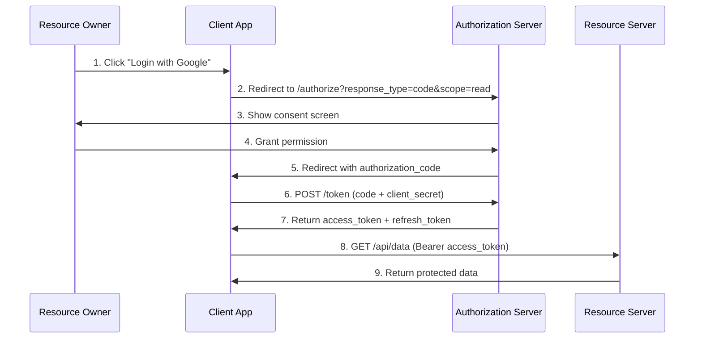

# OAuth2 là gì?

## ⚡ Tóm tắt ngắn (30s)
* OAuth2 là **authorization framework** (RFC 6749) cho phép ứng dụng bên thứ 3 truy cập resource của user **mà không cần biết password** của user
* Giải quyết bài toán **delegated authorization** — user ủy quyền cho app truy cập data của mình trên một service khác
* Có 4 grant types chính: Authorization Code (phổ biến nhất), Client Credentials (machine-to-machine), PKCE (SPA/mobile), Device Code (smart TV)
* Implicit và Password grant đã bị **deprecated** trong OAuth 2.1
* Spring Security hỗ trợ đầy đủ cả OAuth2 Client, Resource Server, và Authorization Server

---

## 🔍 Chi tiết bản chất thực chiến

### Tại sao cần OAuth2?
Trước OAuth2, nếu app A muốn truy cập data của user trên service B, user phải **đưa password service B cho app A**. Điều này cực kỳ nguy hiểm:
- App A có toàn quyền truy cập account trên service B
- Không thể revoke quyền mà không đổi password
- Không giới hạn được scope truy cập

OAuth2 giải quyết bằng cách phát hành **access token có giới hạn scope và thời gian** thay vì chia sẻ password.

### 4 Vai trò trong OAuth2

| Vai trò | Mô tả | Ví dụ thực tế |
| :--- | :--- | :--- |
| **Resource Owner** | User sở hữu data | Người dùng GitHub |
| **Client** | App muốn truy cập data | CI/CD tool, web app |
| **Authorization Server** | Phát hành token | Keycloak, Auth0, Google |
| **Resource Server** | Nơi chứa data được bảo vệ | GitHub API |

### Authorization Code Flow (phổ biến nhất)



### Client Credentials Flow (Machine-to-Machine)
Dùng khi **không có user** — service gọi service khác:
- Microservice A gọi Microservice B
- Cron job truy cập API
- Backend service sync data

---

## 💻 Code thực chiến: BAD vs GOOD

### ❌ BAD: Tự implement OAuth2 flow bằng tay
```java
@RestController
public class AuthController {

    // ❌ Tự gọi token endpoint bằng RestTemplate
    @GetMapping("/callback")
    public ResponseEntity<?> handleCallback(@RequestParam String code) {
        RestTemplate restTemplate = new RestTemplate();

        // ❌ Hardcode credentials
        MultiValueMap<String, String> params = new LinkedMultiValueMap<>();
        params.add("grant_type", "authorization_code");
        params.add("code", code);
        params.add("client_id", "my-client-id");
        params.add("client_secret", "super-secret-123"); // ❌ Secret trong code
        params.add("redirect_uri", "http://localhost:8080/callback");

        // ❌ Không validate state parameter → CSRF attack
        // ❌ Không validate token signature
        // ❌ Không handle token refresh
        ResponseEntity<Map> response = restTemplate.postForEntity(
            "https://auth.example.com/token", params, Map.class);

        String accessToken = (String) response.getBody().get("access_token");
        return ResponseEntity.ok(Map.of("token", accessToken));
    }
}
```

---

### ✅ GOOD: Sử dụng Spring Security OAuth2 đúng cách
```java
// 1. application.yml — OAuth2 Client config
// spring:
//   security:
//     oauth2:
//       client:
//         registration:
//           google:
//             client-id: ${GOOGLE_CLIENT_ID}
//             client-secret: ${GOOGLE_CLIENT_SECRET}
//             scope: openid, profile, email
//       resourceserver:
//         jwt:
//           issuer-uri: https://accounts.google.com

// 2. Security Config — OAuth2 Login + Resource Server
@Configuration
@EnableMethodSecurity
public class SecurityConfig {

    @Bean
    public SecurityFilterChain filterChain(HttpSecurity http) throws Exception {
        http
            .authorizeHttpRequests(auth -> auth
                .requestMatchers("/public/**").permitAll()
                .requestMatchers("/api/**").authenticated()
            )
            // ✅ OAuth2 Login — Spring handles entire flow
            .oauth2Login(oauth2 -> oauth2
                .userInfoEndpoint(info -> info
                    .userService(customOAuth2UserService())
                )
            )
            // ✅ Resource Server — validate JWT tokens
            .oauth2ResourceServer(rs -> rs
                .jwt(jwt -> jwt
                    .jwtAuthenticationConverter(jwtAuthConverter())
                )
            );
        return http.build();
    }

    // ✅ Map JWT claims to Spring Security authorities
    @Bean
    public JwtAuthenticationConverter jwtAuthConverter() {
        JwtGrantedAuthoritiesConverter grantedAuthoritiesConverter =
            new JwtGrantedAuthoritiesConverter();
        grantedAuthoritiesConverter.setAuthoritiesClaimName("roles");
        grantedAuthoritiesConverter.setAuthorityPrefix("ROLE_");

        JwtAuthenticationConverter converter = new JwtAuthenticationConverter();
        converter.setJwtGrantedAuthoritiesConverter(grantedAuthoritiesConverter);
        return converter;
    }
}

// 3. Machine-to-Machine: Client Credentials với WebClient
@Configuration
public class WebClientConfig {

    @Bean
    public WebClient webClient(
            OAuth2AuthorizedClientManager authorizedClientManager) {
        // ✅ Tự động lấy và refresh token cho service-to-service calls
        ServletOAuth2AuthorizedClientExchangeFilterFunction oauth2 =
            new ServletOAuth2AuthorizedClientExchangeFilterFunction(
                authorizedClientManager);
        oauth2.setDefaultClientRegistrationId("internal-service");

        return WebClient.builder()
            .apply(oauth2.oauth2Configuration())
            .build();
    }
}
```

---

## 📊 Bảng so sánh các Grant Types

| Tiêu chí | Authorization Code + PKCE | Client Credentials | Device Code |
| :--- | :--- | :--- | :--- |
| **Use case** | Web/Mobile app có user | Service-to-service | Smart TV, CLI |
| **Có user?** | ✅ Có | ❌ Không | ✅ Có |
| **Client secret** | Optional (PKCE) | ✅ Bắt buộc | ❌ Không |
| **Refresh token** | ✅ Có | ❌ Thường không | ✅ Có |
| **Browser redirect** | ✅ Cần | ❌ Không | ❌ Không |
| **Security level** | Cao nhất | Cao (server-side) | Trung bình |
| **Spring support** | `oauth2Login()` | `clientCredentials()` | Custom |

---

## ⚠️ Common Gotchas & Questions follow-up

### 1. OAuth2 KHÔNG phải authentication protocol
* OAuth2 chỉ là **authorization framework** — nó cho phép truy cập resource
* Để làm authentication cần **OpenID Connect (OIDC)** — layer bên trên OAuth2
* Nhiều dev nhầm lẫn vì "Login with Google" dùng OAuth2 nhưng thực ra là OIDC

### 2. Implicit flow và Password grant đã bị deprecated
* **Implicit**: token trả về trong URL fragment → dễ leak qua browser history, referrer
* **Password grant**: client biết password user → vi phạm nguyên tắc OAuth2
* OAuth 2.1 (RFC đang draft) chính thức loại bỏ cả hai
* Thay thế bằng **Authorization Code + PKCE** cho mọi public client

### 3. Token storage — lỗ hổng phổ biến
* **LocalStorage**: dễ bị XSS attack → **KHÔNG nên** lưu access token
* **Cookie (HttpOnly, Secure, SameSite)**: an toàn hơn nhưng cần CSRF protection
* **BFF pattern (Backend for Frontend)**: token chỉ ở server, frontend dùng session

### 4. Scope vs Role
* **Scope** = giới hạn quyền của **client app** (read, write, admin)
* **Role** = quyền của **user** (ADMIN, USER, MANAGER)
* Một request phải thỏa mãn **cả scope lẫn role** mới được truy cập

### 5. Câu hỏi follow-up thường gặp
* "PKCE hoạt động thế nào?" → code_verifier + code_challenge ngăn authorization code interception
* "Làm sao revoke token?" → Token introspection endpoint hoặc blacklist
* "OAuth2 vs API Key?" → OAuth2 có scope, expiry, rotation; API Key là static secret
