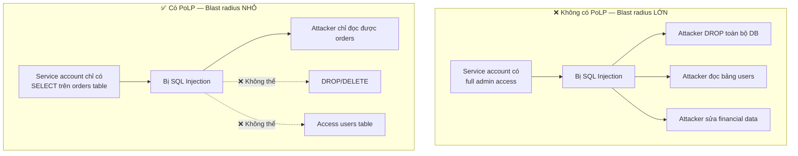
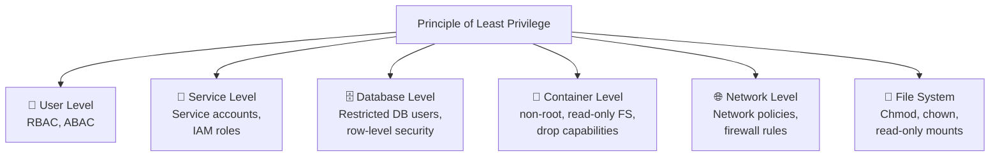

# Principle of Least Privilege là gì?

## ⚡ Tóm tắt ngắn (30s)
* **Principle of Least Privilege (PoLP)** = mỗi user, service, process chỉ được cấp **quyền tối thiểu cần thiết** để hoàn thành công việc — không hơn, không kém
* Mục tiêu: **giảm blast radius** — nếu một component bị compromise, attacker chỉ truy cập được phạm vi nhỏ nhất có thể
* Áp dụng ở **mọi layer**: database user permissions, API authorization, IAM roles, file system, container security, network policies
* Trong Java/Spring Boot: kết hợp **role-based (RBAC)** + **attribute-based (ABAC)** access control, method-level security, và database user với restricted permissions

---

## 🔍 Chi tiết bản chất thực chiến

### Tại sao Least Privilege quan trọng?



### PoLP áp dụng ở mọi layer



### RBAC vs ABAC vs ReBAC

| Model | Mô tả | Ví dụ |
| :--- | :--- | :--- |
| **RBAC** (Role-Based) | Quyền gán theo role | ADMIN, MANAGER, USER |
| **ABAC** (Attribute-Based) | Quyền dựa trên attributes | department=finance AND level>=5 |
| **ReBAC** (Relationship-Based) | Quyền dựa trên relationship | owner, member, viewer (Google Docs style) |

---

## 💻 Code thực chiến: BAD vs GOOD

### ❌ BAD: Mọi người đều có quyền admin

```java
// ❌ Database: service dùng root account
spring:
  datasource:
    username: root                    # ❌ Root có quyền DROP DATABASE
    password: ${DB_ROOT_PASSWORD}

// ❌ API: chỉ check authenticated, không phân quyền
@RestController
@RequestMapping("/api")
public class BadController {

    // ❌ Mọi authenticated user đều access được mọi endpoint
    @GetMapping("/users")
    public List<User> getAllUsers() {
        return userRepository.findAll();  // ❌ Trả về MỌI user, kể cả data người khác
    }

    @DeleteMapping("/users/{id}")
    public void deleteUser(@PathVariable Long id) {
        userRepository.deleteById(id);    // ❌ Ai cũng xóa được bất kỳ user nào
    }
    
    // ❌ Admin endpoint không có authorization check
    @PostMapping("/admin/config")
    public void updateConfig(@RequestBody Config config) {
        configService.update(config);     // ❌ Bất kỳ user nào cũng gọi được
    }
}

// ❌ Service account trong K8s có ClusterAdmin role
// ❌ Docker container chạy as root
// ❌ IAM user có AdministratorAccess policy
```

---

### ✅ GOOD: Fine-grained access control ở mọi layer

```sql
-- ✅ Database: Tạo restricted user cho mỗi service
CREATE USER order_service_user WITH PASSWORD '${generated}';

-- ✅ Chỉ SELECT, INSERT, UPDATE trên tables cần thiết — KHÔNG có DROP, DELETE, ALTER
GRANT SELECT, INSERT, UPDATE ON orders TO order_service_user;
GRANT SELECT ON products TO order_service_user;  -- Read-only cho reference data
-- ❌ KHÔNG grant quyền trên users, payments, admin tables

-- ✅ Row-Level Security: user chỉ thấy data của mình
ALTER TABLE orders ENABLE ROW LEVEL SECURITY;
CREATE POLICY order_tenant_isolation ON orders
    USING (tenant_id = current_setting('app.current_tenant')::bigint);
```

```java
// ✅ Spring Security: Role-based + Method-level authorization
@Configuration
@EnableWebSecurity
@EnableMethodSecurity  // ✅ Enable @PreAuthorize, @PostAuthorize
public class SecurityConfig {

    @Bean
    public SecurityFilterChain filterChain(HttpSecurity http) throws Exception {
        http.authorizeHttpRequests(auth -> auth
            // ✅ URL-level: mỗi path chỉ cho phép role cần thiết
            .requestMatchers("/api/admin/**").hasRole("ADMIN")
            .requestMatchers("/api/reports/**").hasAnyRole("ADMIN", "MANAGER")
            .requestMatchers("/api/orders/**").hasAnyRole("ADMIN", "MANAGER", "USER")
            .requestMatchers("/api/public/**").permitAll()
            .anyRequest().denyAll()  // ✅ Default deny — chỉ cho phép explicit
        );
        return http.build();
    }
}

@RestController
@RequestMapping("/api/orders")
@RequiredArgsConstructor
public class OrderController {

    private final OrderService orderService;

    // ✅ Method-level security: chỉ ADMIN hoặc MANAGER xem tất cả orders
    @GetMapping
    @PreAuthorize("hasAnyRole('ADMIN', 'MANAGER')")
    public Page<OrderDto> getAllOrders(Pageable pageable) {
        return orderService.findAll(pageable);
    }

    // ✅ Object-level security: user chỉ xem order của chính mình
    @GetMapping("/{id}")
    @PostAuthorize("returnObject.customerId == authentication.principal.id " +
                   "or hasRole('ADMIN')")
    public OrderDto getOrder(@PathVariable Long id) {
        return orderService.findById(id);
    }

    // ✅ ABAC: kết hợp nhiều attributes
    @DeleteMapping("/{id}")
    @PreAuthorize("@orderSecurityService.canDelete(#id, authentication)")
    public void deleteOrder(@PathVariable Long id) {
        orderService.delete(id);
    }
}

// ✅ Custom authorization logic — ABAC style
@Service
public class OrderSecurityService {

    public boolean canDelete(Long orderId, Authentication auth) {
        UserPrincipal user = (UserPrincipal) auth.getPrincipal();
        Order order = orderRepository.findById(orderId).orElseThrow();
        
        // ✅ Chỉ ADMIN xóa, hoặc owner xóa order PENDING của chính mình
        if (user.hasRole("ADMIN")) return true;
        return order.getCustomerId().equals(user.getId()) 
            && order.getStatus() == OrderStatus.PENDING;
    }
}

// ✅ Service-to-service: mỗi service có scope riêng
@RestController
public class InternalOrderController {

    // ✅ OAuth2 scope-based: payment-service chỉ có scope "orders:read"
    @GetMapping("/internal/orders/{id}")
    @PreAuthorize("hasAuthority('SCOPE_orders:read')")
    public OrderDto getOrderInternal(@PathVariable Long id) {
        return orderService.findById(id);
    }

    // ✅ Chỉ fulfillment-service có scope "orders:update-status"
    @PatchMapping("/internal/orders/{id}/status")
    @PreAuthorize("hasAuthority('SCOPE_orders:update-status')")
    public void updateStatus(@PathVariable Long id, @RequestBody StatusUpdate update) {
        orderService.updateStatus(id, update);
    }
}
```

```yaml
# ✅ Kubernetes: Restricted service account
apiVersion: rbac.authorization.k8s.io/v1
kind: Role
metadata:
  name: order-service-role
rules:
  - apiGroups: [""]
    resources: ["configmaps"]
    resourceNames: ["order-service-config"]  # ✅ Chỉ access config của chính mình
    verbs: ["get", "watch"]                  # ✅ Read-only
  # ❌ KHÔNG có quyền trên secrets, pods, deployments

---
# ✅ Container: non-root, minimal capabilities
apiVersion: v1
kind: Pod
spec:
  securityContext:
    runAsNonRoot: true            # ✅ Không chạy as root
    runAsUser: 1000
    fsGroup: 1000
  containers:
    - name: order-service
      securityContext:
        allowPrivilegeEscalation: false  # ✅ Không cho escalate
        readOnlyRootFilesystem: true     # ✅ FS read-only
        capabilities:
          drop: ["ALL"]                   # ✅ Drop mọi Linux capabilities
```

---

## 📊 Bảng so sánh Authorization Approaches

| Tiêu chí | URL-based (HttpSecurity) | Method-level (@PreAuthorize) | Object-level (@PostAuthorize) | Custom ABAC |
| :--- | :--- | :--- | :--- | :--- |
| **Granularity** | Coarse (URL pattern) | Medium (method) | Fine (object field) | Very fine |
| **Performance** | Tốt nhất | Tốt | Thêm 1 query | Depends on logic |
| **Flexibility** | Thấp | Medium | Medium | Cao nhất |
| **Maintainability** | Dễ | Dễ | Medium | Cần test kỹ |
| **Khi nào dùng** | Default deny, public paths | Role-based methods | Owner-only access | Complex business rules |

---

## ⚠️ Common Gotchas & Questions follow-up

### 1. Default Deny vs Default Allow
* **Problem**: Nhiều team cấu hình `anyRequest().permitAll()` rồi thêm restriction từng endpoint → dễ quên endpoint mới
* **Solution**: Luôn dùng `anyRequest().denyAll()` hoặc `anyRequest().authenticated()` cuối cùng → endpoint mới mặc định bị block cho đến khi explicitly configured

### 2. Privilege Creep — quyền tích lũy theo thời gian
* **Problem**: User đổi team/role nhưng quyền cũ không bị thu hồi → dần dần có quá nhiều quyền
* **Solution**: **Access review định kỳ** (quarterly), **time-bound access** (just-in-time access qua Vault/PIM), **automated deprovisioning** khi user đổi role

### 3. Break-glass procedure
* **Problem**: PoLP quá strict → khi có incident, team không có quyền access cần thiết để debug
* **Solution**: Implement **break-glass accounts** với elevated privileges, nhưng: (1) require MFA, (2) auto-expire sau 1-4 hours, (3) trigger alert + audit log, (4) require post-incident review

### 4. Service account over-permissioning trên cloud
* **Problem**: Developer tạo IAM role với `*` permission vì "dễ" → một Lambda bị exploit = toàn bộ AWS account bị compromise
* **Solution**: Dùng **IAM Access Analyzer** để detect unused permissions, **AWS SCPs** để restrict ở organization level, **Terraform/IaC** review cho IAM changes

### 5. Interviewer hỏi thêm: "Làm sao balance giữa security và developer productivity?"
* **Trả lời**: (1) **Automate permission provisioning** — self-service portal với approval workflow, (2) **Pre-built role templates** cho common use cases, (3) **Staging environments** có relaxed permissions, (4) **Just-in-time access** — developer request elevated access khi cần, tự revoke sau N hours
