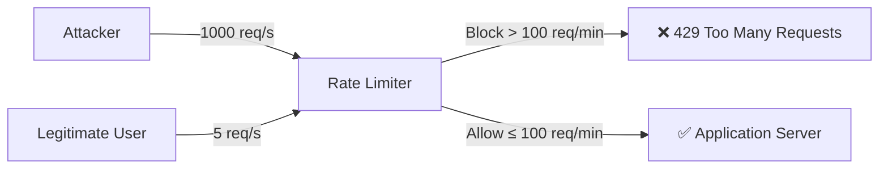
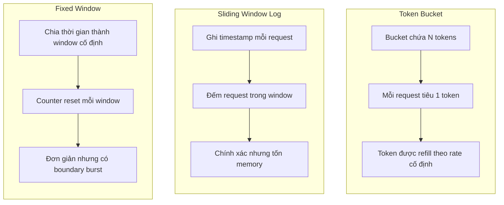

# Rate limiting giúp chống gì?

## ⚡ Tóm tắt ngắn (30s)
* Rate limiting giới hạn số request mà client gửi đến server trong một khoảng thời gian, giúp **chống DDoS, brute-force, credential stuffing, API abuse, và resource exhaustion**
* Các thuật toán phổ biến: **Token Bucket, Sliding Window, Fixed Window, Leaky Bucket** — mỗi loại có trade-off riêng về memory và accuracy
* Trong production, rate limiting được áp dụng ở **nhiều tầng**: API Gateway (Kong, Nginx), Application layer (Spring Filter/Interceptor), và thậm chí Database layer
* Cần phân biệt rate limiting theo **IP, User, API key, endpoint** để tránh block nhầm legitimate traffic

---

## 🔍 Chi tiết bản chất thực chiến

### Rate Limiting chống lại những gì?



| Threat | Mô tả | Rate Limiting giúp |
|:---|:---|:---|
| **DDoS** | Tấn công từ chối dịch vụ bằng lượng request khổng lồ | Giới hạn throughput, giữ server sống |
| **Brute-force** | Thử hàng triệu password cho 1 account | Giới hạn login attempt per user/IP |
| **Credential Stuffing** | Dùng leaked credentials để thử đăng nhập | Phát hiện pattern bất thường |
| **API Abuse** | Crawl data, spam endpoint | Giới hạn quota per API key |
| **Resource Exhaustion** | Request nặng (search, report) gây quá tải | Bảo vệ expensive endpoints |
| **Enumeration** | Brute-force tìm user/email tồn tại | Giảm tốc độ probe |

### Các thuật toán Rate Limiting



### Multi-layer Rate Limiting trong Production

Trong hệ thống thực tế, rate limiting cần áp dụng ở nhiều tầng:

1. **Edge/CDN Layer** (Cloudflare, AWS WAF): Chặn DDoS trước khi traffic đến infra
2. **API Gateway** (Kong, Nginx, Spring Cloud Gateway): Rate limit per API key/route
3. **Application Layer** (Spring Filter): Business-specific limiting (login, OTP)
4. **Database Layer**: Connection pool limit, query timeout

---

## 💻 Code thực chiến: BAD vs GOOD

### ❌ BAD: Rate limiting tự implement naive, không distributed

```java
// ❌ In-memory counter - KHÔNG hoạt động khi scale nhiều instance
@Component
public class NaiveRateLimiter {
    // Mỗi instance có counter riêng → attacker bypass bằng round-robin
    private final Map<String, AtomicInteger> counters = new ConcurrentHashMap<>();
    private final Map<String, Long> timestamps = new ConcurrentHashMap<>();

    public boolean isAllowed(String clientIp) {
        long now = System.currentTimeMillis();
        timestamps.putIfAbsent(clientIp, now);
        counters.putIfAbsent(clientIp, new AtomicInteger(0));

        // ❌ Race condition giữa check và increment
        // ❌ Không cleanup → memory leak
        // ❌ Fixed window boundary burst problem
        if (now - timestamps.get(clientIp) > 60000) {
            counters.get(clientIp).set(0);
            timestamps.put(clientIp, now);
        }
        return counters.get(clientIp).incrementAndGet() <= 100;
    }
}
```

---

### ✅ GOOD: Distributed Rate Limiting với Redis + Bucket4j

```java
// ✅ Distributed rate limiting với Redis backend
@Configuration
public class RateLimitConfig {

    @Bean
    public ProxyManager<String> proxyManager(LettuceBasedProxyManager.LettuceBasedProxyManagerBuilder<String> builder) {
        return builder.build();
    }
}

@Component
@RequiredArgsConstructor
public class RateLimitFilter extends OncePerRequestFilter {

    private final ProxyManager<String> proxyManager;

    // ✅ Cấu hình rate limit theo endpoint sensitivity
    private static final Map<String, BandwidthConfig> ENDPOINT_LIMITS = Map.of(
        "/api/auth/login", new BandwidthConfig(5, Duration.ofMinutes(1)),    // Login: 5/min
        "/api/auth/otp", new BandwidthConfig(3, Duration.ofMinutes(5)),      // OTP: 3/5min
        "/api/search", new BandwidthConfig(30, Duration.ofMinutes(1)),       // Search: 30/min
        "DEFAULT", new BandwidthConfig(100, Duration.ofMinutes(1))           // Default: 100/min
    );

    @Override
    protected void doFilterInternal(HttpServletRequest request,
                                     HttpServletResponse response,
                                     FilterChain chain) throws ServletException, IOException {

        String clientKey = resolveClientKey(request);
        String endpoint = request.getRequestURI();
        BandwidthConfig config = ENDPOINT_LIMITS.getOrDefault(endpoint,
                                    ENDPOINT_LIMITS.get("DEFAULT"));

        // ✅ Token Bucket algorithm - distributed qua Redis
        BucketConfiguration bucketConfig = BucketConfiguration.builder()
            .addLimit(Bandwidth.builder()
                .capacity(config.capacity())
                .refillGreedy(config.capacity(), config.period())
                .build())
            .build();

        Bucket bucket = proxyManager.builder()
            .build(clientKey + ":" + endpoint, () -> bucketConfig);

        ConsumptionProbe probe = bucket.tryConsumeAndReturnRemaining(1);

        if (probe.isConsumed()) {
            // ✅ Thêm rate limit headers theo RFC draft
            response.setHeader("X-RateLimit-Remaining",
                String.valueOf(probe.getRemainingTokens()));
            response.setHeader("X-RateLimit-Limit",
                String.valueOf(config.capacity()));
            chain.doFilter(request, response);
        } else {
            // ✅ Trả 429 với Retry-After header
            long waitSeconds = probe.getNanosToWaitForRefill() / 1_000_000_000;
            response.setHeader("Retry-After", String.valueOf(waitSeconds));
            response.setStatus(HttpStatus.TOO_MANY_REQUESTS.value());
            response.getWriter().write("""
                {"error": "Too many requests", "retryAfter": %d}
                """.formatted(waitSeconds));
        }
    }

    // ✅ Multi-factor key: User > API Key > IP (tránh NAT false positive)
    private String resolveClientKey(HttpServletRequest request) {
        Authentication auth = SecurityContextHolder.getContext().getAuthentication();
        if (auth != null && auth.isAuthenticated()) {
            return "user:" + auth.getName();
        }
        String apiKey = request.getHeader("X-API-Key");
        if (apiKey != null) {
            return "apikey:" + apiKey;
        }
        // Fallback to IP (xử lý proxy)
        String xff = request.getHeader("X-Forwarded-For");
        String ip = (xff != null) ? xff.split(",")[0].trim() : request.getRemoteAddr();
        return "ip:" + ip;
    }

    record BandwidthConfig(long capacity, Duration period) {}
}
```

---

## 📊 Bảng so sánh thuật toán Rate Limiting

| Tiêu chí | Token Bucket | Sliding Window Log | Fixed Window | Leaky Bucket |
|:---|:---|:---|:---|:---|
| **Accuracy** | Cao | Rất cao | Trung bình (boundary burst) | Cao |
| **Memory** | O(1) per key | O(N) per key | O(1) per key | O(1) per key |
| **Burst handling** | Cho phép burst ngắn | Không burst | Burst ở biên window | Smooth output |
| **Implementation** | Trung bình | Phức tạp | Đơn giản nhất | Trung bình |
| **Use case** | API general | Payment, OTP | Simple counter | Streaming, queue |
| **Distributed** | Dễ (Redis INCR) | Khó (sorted set) | Dễ (Redis INCR) | Trung bình |

---

## ⚠️ Common Gotchas & Questions follow-up

### 1. Rate limiting by IP không đủ khi có NAT/Proxy
* **Problem**: Nhiều user hợp lệ ở sau cùng 1 corporate proxy → cùng IP → bị block chung
* **Consequence**: Block nhầm legitimate traffic, ảnh hưởng business
* **Solution**: Combine IP + User-Agent + fingerprint, hoặc ưu tiên rate limit theo authenticated user/API key

### 2. Boundary burst với Fixed Window
* **Problem**: User gửi 100 request ở cuối window 1, rồi 100 request ở đầu window 2 → 200 request trong 1 giây
* **Solution**: Dùng Sliding Window Counter (hybrid) — tính weighted count từ previous + current window

### 3. Rate limit response không nên leak thông tin
* **Problem**: Trả về chính xác "remaining: 0" cho login endpoint → attacker biết chính xác limit
* **Solution**: Với sensitive endpoint, trả generic 429 không kèm chi tiết. Chỉ trả headers cho public API

### 4. Distributed rate limiting consistency
* **Problem**: Redis cluster có eventual consistency → có thể over-allow trong vài ms
* **Consequence**: Trong hệ thống payment, vài request thừa có thể gây duplicate charge
* **Solution**: Dùng Redis Lua script atomic, hoặc chấp nhận approximate limiting cho non-critical endpoints

### 5. Interviewer hỏi thêm: "Rate limiting vs Throttling vs Circuit Breaker?"
* **Rate Limiting**: Giới hạn client → bảo vệ server khỏi abuse
* **Throttling**: Server chủ động giảm tốc → graceful degradation
* **Circuit Breaker**: Ngắt kết nối tới downstream service bị lỗi → bảo vệ caller
