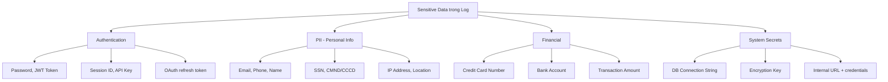

# Sensitive data trong log cần xử lý ra sao?

## ⚡ Tóm tắt ngắn (30s)
* **KHÔNG BAO GIỜ** log sensitive data: password, credit card, SSN, token, PII (email, phone, address) — vi phạm GDPR/PCI-DSS có thể phạt hàng triệu USD
* Áp dụng **masking/redaction** tại source: dùng custom Logback layout, Jackson serializer, hoặc pattern-based filter để tự động che dữ liệu nhạy cảm
* **Defense in depth**: Mask ở application layer + restrict log access (RBAC) + encrypt log at rest + retention policy (xóa sau 30-90 ngày)
* Structured logging (JSON) giúp dễ dàng áp dụng field-level masking hơn free-text log

---

## 🔍 Chi tiết bản chất thực chiến

### Các loại Sensitive Data thường vô tình xuất hiện trong Log



### Tại sao Log Leak nguy hiểm?

1. **Log thường ít được bảo vệ**: Dev có quyền đọc log → đọc được PII
2. **Log được ship sang third-party**: ELK, Datadog, Splunk — mở rộng attack surface
3. **Log retention dài**: Dữ liệu nhạy cảm tồn tại hàng tháng/năm
4. **Compliance violations**: GDPR (€20M fine), PCI-DSS (mất quyền xử lý payment), HIPAA

### Chiến lược xử lý — Multi-layer Defense

| Layer | Kỹ thuật | Mục đích |
|:---|:---|:---|
| **Code** | `@Masked` annotation, toString() override | Prevent logging sensitive fields |
| **Logger** | Logback PatternLayout filter | Catch-all regex masking |
| **Serialization** | Jackson `@JsonIgnore`, custom serializer | API response + log serialization |
| **Infrastructure** | Log pipeline filter (Fluentd, Logstash) | Last resort masking |
| **Access** | RBAC on log systems | Limit who can read logs |
| **Retention** | Auto-delete policy | Minimize exposure window |

---

## 💻 Code thực chiến: BAD vs GOOD

### ❌ BAD: Log trực tiếp sensitive data

```java
// ❌ Log toàn bộ request/response không filter
@RestController
@Slf4j
public class UserController {

    @PostMapping("/api/register")
    public ResponseEntity<?> register(@RequestBody UserRegistrationDto dto) {
        // ❌ Log password dạng plain text
        log.info("Registration request: {}", dto);
        // Output: Registration request: UserRegistrationDto(email=john@gmail.com,
        //         password=MySecret123!, phone=0901234567, ssn=123-45-6789)

        // ❌ Log credit card number
        log.info("Processing payment for card: {}", dto.getCreditCard());
        // Output: Processing payment for card: 4111111111111111

        // ❌ Log JWT token
        log.debug("User token: {}", jwtToken);
        // Output: User token: eyJhbGciOiJIUzI1NiIsInR5cCI6IkpXVCJ9...

        // ❌ Exception message chứa sensitive data
        try {
            userService.create(dto);
        } catch (Exception e) {
            // Stack trace có thể chứa connection string, query params
            log.error("Failed to create user: {}", dto, e);
        }
        return ResponseEntity.ok().build();
    }
}

// ❌ toString() mặc định expose tất cả fields
@Data  // Lombok @Data tạo toString() với ALL fields
public class UserRegistrationDto {
    private String email;
    private String password;     // ❌ Sẽ xuất hiện trong log
    private String phone;
    private String creditCard;   // ❌ PCI-DSS violation
}
```

---

### ✅ GOOD: Multi-layer masking strategy

```java
// ✅ Layer 1: DTO với controlled toString() và custom annotation
@Data
public class UserRegistrationDto {
    private String email;

    @Masked  // Custom annotation
    private String password;

    @Masked(showLast = 4)
    private String phone;

    @Masked(showLast = 4, maskChar = 'X')
    private String creditCard;

    // ✅ Override toString() để KHÔNG BAO GIỜ log sensitive fields
    @Override
    public String toString() {
        return "UserRegistrationDto{email='%s', password='***', phone='***%s', creditCard='XXXX-%s'}"
            .formatted(
                maskEmail(email),
                phone != null ? phone.substring(phone.length() - 4) : "",
                creditCard != null ? creditCard.substring(creditCard.length() - 4) : ""
            );
    }

    private String maskEmail(String email) {
        if (email == null) return null;
        int atIdx = email.indexOf('@');
        if (atIdx <= 2) return "***" + email.substring(atIdx);
        return email.substring(0, 2) + "***" + email.substring(atIdx);
    }
}

// ✅ Custom Masking Annotation
@Retention(RetentionPolicy.RUNTIME)
@Target(ElementType.FIELD)
public @interface Masked {
    int showLast() default 0;
    char maskChar() default '*';
}
```

```java
// ✅ Layer 2: Logback Pattern Masking Layout — catch-all safety net
public class MaskingPatternLayout extends PatternLayout {

    // ✅ Regex patterns cho sensitive data phổ biến
    private static final List<PatternReplacer> PATTERNS = List.of(
        // Credit card numbers (13-19 digits)
        new PatternReplacer(
            Pattern.compile("\\b(\\d{4})\\d{8,12}(\\d{4})\\b"),
            "$1****$2"),
        // SSN / CMND
        new PatternReplacer(
            Pattern.compile("\\b\\d{3}-\\d{2}-\\d{4}\\b"),
            "***-**-****"),
        // Email
        new PatternReplacer(
            Pattern.compile("([a-zA-Z0-9._%+-]{2})[a-zA-Z0-9._%+-]*(@[a-zA-Z0-9.-]+)"),
            "$1***$2"),
        // JWT tokens
        new PatternReplacer(
            Pattern.compile("eyJ[a-zA-Z0-9_-]*\\.eyJ[a-zA-Z0-9_-]*\\.[a-zA-Z0-9_-]*"),
            "[REDACTED_JWT]"),
        // Password fields in JSON
        new PatternReplacer(
            Pattern.compile("\"password\"\\s*:\\s*\"[^\"]*\""),
            "\"password\":\"[REDACTED]\""),
        // Bearer tokens
        new PatternReplacer(
            Pattern.compile("Bearer\\s+[a-zA-Z0-9._-]+"),
            "Bearer [REDACTED]")
    );

    @Override
    public String doLayout(ILoggingEvent event) {
        String message = super.doLayout(event);
        for (PatternReplacer replacer : PATTERNS) {
            message = replacer.mask(message);
        }
        return message;
    }

    record PatternReplacer(Pattern pattern, String replacement) {
        String mask(String input) {
            return pattern.matcher(input).replaceAll(replacement);
        }
    }
}
```

```xml
<!-- ✅ logback-spring.xml configuration -->
<configuration>
    <appender name="CONSOLE" class="ch.qos.logback.core.ConsoleAppender">
        <layout class="com.example.logging.MaskingPatternLayout">
            <pattern>%d{yyyy-MM-dd HH:mm:ss} [%thread] %-5level %logger{36} - %msg%n</pattern>
        </layout>
    </appender>
    <root level="INFO">
        <appender-ref ref="CONSOLE"/>
    </root>
</configuration>
```

```java
// ✅ Layer 3: Jackson Serializer cho structured logging
public class MaskedSerializer extends JsonSerializer<String> {
    @Override
    public void serialize(String value, JsonGenerator gen,
                          SerializerProvider provider) throws IOException {
        if (value == null || value.length() <= 4) {
            gen.writeString("****");
        } else {
            gen.writeString("****" + value.substring(value.length() - 4));
        }
    }
}

// Sử dụng trên DTO cho JSON structured logging
public class AuditLogEntry {
    private String action;
    private String userId;

    @JsonSerialize(using = MaskedSerializer.class)
    private String ipAddress;

    @JsonIgnore  // ✅ Không bao giờ xuất hiện trong JSON log
    private String sessionToken;
}
```

---

## 📊 Bảng so sánh kỹ thuật Masking

| Tiêu chí | toString Override | Logback Layout | Jackson Serializer | Log Pipeline |
|:---|:---|:---|:---|:---|
| **Scope** | Per class | Global, all logs | JSON output | Infrastructure |
| **Performance** | ✅ Tốt | ⚠️ Regex overhead | ✅ Tốt | ✅ Off-app |
| **Reliability** | ⚠️ Dev phải nhớ | ✅ Catch-all | ⚠️ Chỉ JSON | ✅ Catch-all |
| **Maintainability** | ⚠️ Mỗi class | ✅ Central config | ✅ Annotation | ⚠️ Separate team |
| **Best for** | Domain objects | Safety net | API response log | Last resort |

---

## ⚠️ Common Gotchas & Questions follow-up

### 1. Exception stack traces chứa sensitive data
* **Problem**: SQL exception log ra full query với user data: `INSERT INTO users (email, password) VALUES ('john@email.com', 'secret')`
* **Solution**: Wrap exceptions, custom error handler strip sensitive info trước khi log. Dùng parameterized queries (prepared statements)

### 2. Third-party library log sensitive data
* **Problem**: HTTP client library (RestTemplate, OkHttp) log full request/response body ở DEBUG level
* **Solution**: Set log level cho third-party packages ở WARN/ERROR trong production. Dùng Logback filter chặn specific loggers

### 3. Spring Actuator expose sensitive info
* **Problem**: `/actuator/env` hiển thị tất cả environment variables kể cả secrets
* **Solution**: `management.endpoint.env.keys-to-sanitize=password,secret,key,token,credential`

### 4. Log aggregation service bị compromise
* **Problem**: ELK stack bị hack → toàn bộ PII trong log bị leak
* **Solution**: Encrypt log at rest, TLS in transit, RBAC trên Kibana, mask TRƯỚC khi ship log

### 5. Interviewer hỏi thêm: "GDPR Right to Erasure — log chứa PII thì xóa thế nào?"
* Nếu đã mask tại source → không có PII trong log → không cần xóa
* Nếu chưa mask → phải có retention policy tự động xóa, hoặc dùng pseudonymization (map user → random ID)
