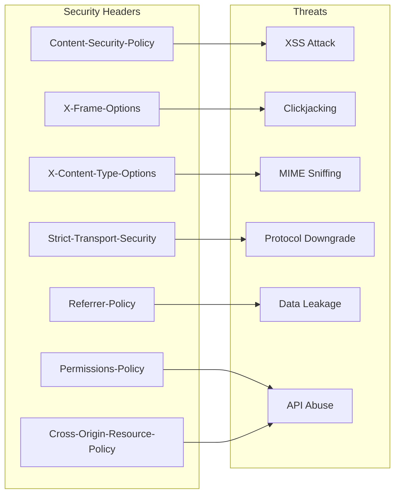

# Security headers phổ biến

## ⚡ Tóm tắt ngắn (30s)
* Security headers là **tuyến phòng thủ đầu tiên** trên browser, chống **XSS, Clickjacking, MIME sniffing, Protocol downgrade, Data injection**
* Headers quan trọng nhất: **Content-Security-Policy (CSP), Strict-Transport-Security (HSTS), X-Content-Type-Options, X-Frame-Options, Permissions-Policy**
* Spring Security **tự động thêm** một số headers cơ bản, nhưng CSP và HSTS cần **cấu hình thủ công** cho production
* Kiểm tra bằng **securityheaders.com** — mục tiêu đạt **A+** grade

---

## 🔍 Chi tiết bản chất thực chiến

### Tổng quan Security Headers và mối đe dọa chúng chống lại



### Chi tiết từng Header quan trọng

#### 1. Content-Security-Policy (CSP) — Chống XSS
Kiểm soát nguồn nào được phép load resource (script, style, image, font...). Đây là **header quan trọng nhất** để chống XSS.

#### 2. Strict-Transport-Security (HSTS) — Chống downgrade HTTPS→HTTP
Bắt buộc browser luôn dùng HTTPS. Sau khi nhận header, browser sẽ **tự động upgrade** HTTP → HTTPS trong `max-age` giây.

#### 3. X-Content-Type-Options: nosniff — Chống MIME confusion
Ngăn browser "đoán" content type. Ví dụ: file `.txt` chứa JavaScript sẽ KHÔNG được execute.

#### 4. X-Frame-Options — Chống Clickjacking
Kiểm soát trang có được nhúng trong `<iframe>` không. `DENY` = không bao giờ, `SAMEORIGIN` = chỉ cùng domain.

#### 5. Referrer-Policy — Kiểm soát thông tin rò rỉ qua Referer header
Ngăn URL nhạy cảm (chứa token, session) bị gửi sang domain khác.

#### 6. Permissions-Policy (trước đây là Feature-Policy)
Kiểm soát browser features (camera, microphone, geolocation) mà page được phép sử dụng.

---

## 💻 Code thực chiến: BAD vs GOOD

### ❌ BAD: Không cấu hình security headers hoặc disable hết

```java
// ❌ Disable toàn bộ security headers vì "nó gây lỗi frontend"
@Configuration
@EnableWebSecurity
public class SecurityConfig {

    @Bean
    public SecurityFilterChain filterChain(HttpSecurity http) throws Exception {
        return http
            // ❌ Disable tất cả headers
            .headers(headers -> headers.disable())
            // ❌ Disable CSRF vì "dùng REST API"
            .csrf(csrf -> csrf.disable())
            // ❌ Cho phép mọi origin
            .cors(cors -> cors.configurationSource(request -> {
                CorsConfiguration config = new CorsConfiguration();
                config.addAllowedOrigin("*");        // ❌ Wildcard origin
                config.addAllowedMethod("*");
                config.addAllowedHeader("*");
                config.setAllowCredentials(true);     // ❌ Conflict với wildcard
                return config;
            }))
            .build();
    }
}
// Response headers: NOTHING → browser có 0 protection
```

---

### ✅ GOOD: Production-grade security headers với Spring Security

```java
@Configuration
@EnableWebSecurity
public class SecurityHeadersConfig {

    @Bean
    public SecurityFilterChain filterChain(HttpSecurity http) throws Exception {
        return http
            .headers(headers -> headers
                // ✅ 1. Content-Security-Policy — Chống XSS
                .contentSecurityPolicy(csp -> csp
                    .policyDirectives(String.join("; ",
                        "default-src 'self'",                    // Chỉ load từ cùng origin
                        "script-src 'self' 'nonce-{random}'",   // Script cần nonce
                        "style-src 'self' 'unsafe-inline'",     // Style cho phép inline (trade-off)
                        "img-src 'self' data: https://cdn.example.com",
                        "font-src 'self' https://fonts.gstatic.com",
                        "connect-src 'self' https://api.example.com",
                        "frame-ancestors 'none'",                // = X-Frame-Options DENY
                        "base-uri 'self'",                       // Chống <base> tag injection
                        "form-action 'self'",                    // Form chỉ submit về cùng origin
                        "upgrade-insecure-requests"              // Auto upgrade HTTP → HTTPS
                    ))
                )

                // ✅ 2. Strict-Transport-Security (HSTS)
                .httpStrictTransportSecurity(hsts -> hsts
                    .includeSubDomains(true)    // Apply cho subdomain
                    .maxAgeInSeconds(31536000)  // 1 năm
                    .preload(true)              // Đăng ký HSTS preload list
                )

                // ✅ 3. X-Content-Type-Options
                .contentTypeOptions(Customizer.withDefaults()) // nosniff

                // ✅ 4. X-Frame-Options
                .frameOptions(frame -> frame.deny())

                // ✅ 5. Referrer-Policy
                .referrerPolicy(referrer -> referrer
                    .policy(ReferrerPolicyHeaderWriter.ReferrerPolicy
                        .STRICT_ORIGIN_WHEN_CROSS_ORIGIN))

                // ✅ 6. Permissions-Policy
                .permissionsPolicy(permissions -> permissions
                    .policy(String.join(", ",
                        "camera=()",           // Không cho phép camera
                        "microphone=()",       // Không cho phép microphone
                        "geolocation=(self)",  // Chỉ cùng origin
                        "payment=(self)"       // Payment chỉ cùng origin
                    ))
                )

                // ✅ 7. Cache-Control cho sensitive pages
                .cacheControl(Customizer.withDefaults())
            )

            // ✅ CORS cấu hình chặt chẽ
            .cors(cors -> cors.configurationSource(corsConfigSource()))

            .build();
    }

    private CorsConfigurationSource corsConfigSource() {
        CorsConfiguration config = new CorsConfiguration();
        // ✅ Whitelist cụ thể, KHÔNG dùng wildcard
        config.setAllowedOrigins(List.of(
            "https://app.example.com",
            "https://admin.example.com"
        ));
        config.setAllowedMethods(List.of("GET", "POST", "PUT", "DELETE"));
        config.setAllowedHeaders(List.of("Authorization", "Content-Type", "X-Request-ID"));
        config.setExposedHeaders(List.of("X-RateLimit-Remaining"));
        config.setAllowCredentials(true);
        config.setMaxAge(3600L);

        UrlBasedCorsConfigurationSource source = new UrlBasedCorsConfigurationSource();
        source.registerCorsConfiguration("/api/**", config);
        return source;
    }
}
```

```java
// ✅ Custom filter thêm headers mà Spring Security không hỗ trợ trực tiếp
@Component
@Order(Ordered.HIGHEST_PRECEDENCE)
public class AdditionalSecurityHeadersFilter extends OncePerRequestFilter {

    @Override
    protected void doFilterInternal(HttpServletRequest request,
                                     HttpServletResponse response,
                                     FilterChain chain) throws ServletException, IOException {
        // ✅ Cross-Origin headers cho API
        response.setHeader("Cross-Origin-Opener-Policy", "same-origin");
        response.setHeader("Cross-Origin-Resource-Policy", "same-origin");
        response.setHeader("Cross-Origin-Embedder-Policy", "require-corp");

        // ✅ Xóa header leak thông tin server
        response.setHeader("Server", "");              // Ẩn server type
        response.setHeader("X-Powered-By", "");        // Ẩn technology stack

        // ✅ API-specific: không cache response chứa sensitive data
        if (request.getRequestURI().startsWith("/api/")) {
            response.setHeader("Cache-Control", "no-store, no-cache, must-revalidate");
            response.setHeader("Pragma", "no-cache");
        }

        chain.doFilter(request, response);
    }
}
```

---

## 📊 Bảng so sánh Security Headers

| Header | Chống | Giá trị khuyến nghị | Spring Security Default |
|:---|:---|:---|:---|
| **CSP** | XSS, Injection | `default-src 'self'` + whitelist | ❌ Không có |
| **HSTS** | Protocol downgrade | `max-age=31536000; includeSubDomains; preload` | ❌ Không có (cần HTTPS) |
| **X-Content-Type-Options** | MIME sniffing | `nosniff` | ✅ Có sẵn |
| **X-Frame-Options** | Clickjacking | `DENY` hoặc `SAMEORIGIN` | ✅ Có sẵn |
| **Referrer-Policy** | URL data leak | `strict-origin-when-cross-origin` | ❌ Không có |
| **Permissions-Policy** | Feature abuse | `camera=(), microphone=()` | ❌ Không có |
| **X-XSS-Protection** | Reflected XSS | `0` (deprecated, dùng CSP thay) | ✅ Có sẵn |
| **Cache-Control** | Cached sensitive data | `no-store` cho sensitive endpoint | ✅ Có sẵn |

---

## ⚠️ Common Gotchas & Questions follow-up

### 1. CSP quá strict → break frontend
* **Problem**: `default-src 'self'` chặn inline script, Google Analytics, CDN fonts → trang trắng
* **Solution**: Bắt đầu với **CSP Report-Only** mode, thu thập violations, rồi mới enforce. Dùng `nonce` cho inline scripts

### 2. HSTS preload không thể undo
* **Problem**: Đăng ký HSTS preload → browser hardcode HTTPS → nếu cần quay về HTTP thì không thể
* **Solution**: Test kỹ trước khi bật `preload`. Bắt đầu với `max-age` ngắn (1 ngày), tăng dần lên 1 năm

### 3. X-Frame-Options vs CSP frame-ancestors
* **Problem**: Cả hai đều chống Clickjacking, dùng cái nào?
* **Solution**: Dùng CSP `frame-ancestors` (linh hoạt hơn, hỗ trợ multiple origins). Giữ X-Frame-Options cho backward compatibility

### 4. Server header leak thông tin
* **Problem**: `Server: Apache/2.4.51 (Ubuntu)` → attacker biết chính xác version → tìm CVE
* **Solution**: Xóa hoặc set generic value. Trong Spring Boot: `server.server-header=` (empty)

### 5. Interviewer hỏi thêm: "Kiểm tra security headers thế nào?"
* **Công cụ**: securityheaders.com, Mozilla Observatory, OWASP ZAP
* **CI/CD**: Tích hợp security header check vào pipeline, fail build nếu thiếu headers quan trọng
* **Monitoring**: Log CSP violations endpoint (`report-uri`) để phát hiện XSS attempts
