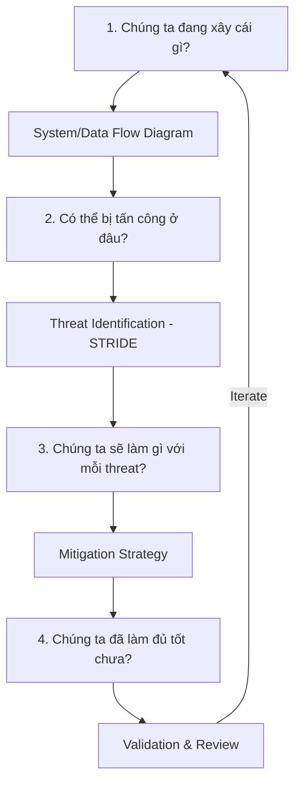
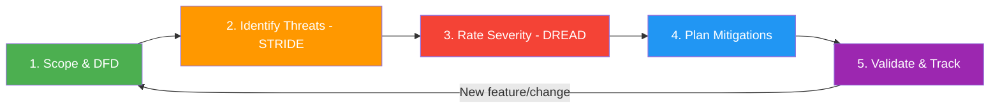
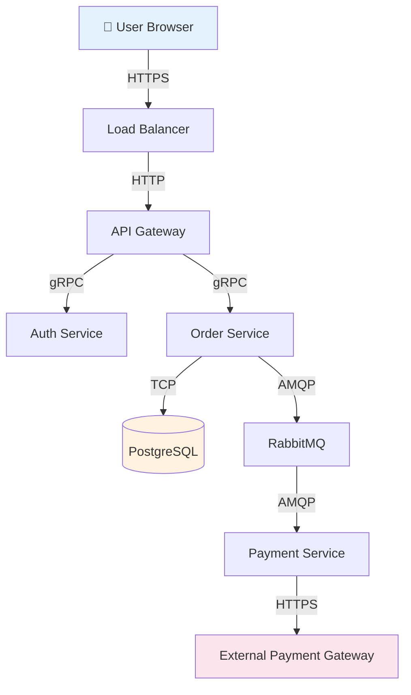

# Threat modeling là gì?

## ⚡ Tóm tắt ngắn (30s)
* Threat modeling là **quy trình có hệ thống** để xác định, phân loại, và ưu tiên các mối đe dọa bảo mật **TRƯỚC KHI** code — "shift-left security"
* Framework phổ biến nhất: **STRIDE** (Spoofing, Tampering, Repudiation, Information Disclosure, Denial of Service, Elevation of Privilege) của Microsoft
* Output là **danh sách threats được ưu tiên** + **mitigation plan** — giúp team biết nên secure cái gì trước
* Trong practice, threat modeling diễn ra khi **thiết kế feature mới, thay đổi architecture, hoặc security review** — không phải chỉ làm 1 lần

---

## 🔍 Chi tiết bản chất thực chiến

### Threat Modeling trả lời 4 câu hỏi cốt lõi



### STRIDE Framework — Chi tiết

| Threat | Mô tả | Ví dụ thực tế | Security Property vi phạm |
|:---|:---|:---|:---|
| **S**poofing | Giả mạo danh tính | Fake JWT token, session hijacking | Authentication |
| **T**ampering | Sửa đổi dữ liệu | Modify request body, SQL injection | Integrity |
| **R**epudiation | Chối bỏ hành động | User chối "tôi không chuyển tiền" | Non-repudiation |
| **I**nformation Disclosure | Lộ thông tin | Error message chứa stack trace, log PII | Confidentiality |
| **D**enial of Service | Từ chối dịch vụ | DDoS, resource exhaustion | Availability |
| **E**levation of Privilege | Leo thang quyền | Regular user access admin API, IDOR | Authorization |

### Quy trình Threat Modeling thực tế



### Data Flow Diagram (DFD) — Bước đầu tiên



Mỗi **đường kết nối** và **trust boundary** (ranh giới tin cậy) là nơi cần phân tích threat.

---

## 💻 Code thực chiến: BAD vs GOOD

### ❌ BAD: Không threat model → miss critical vulnerabilities

```java
// ❌ Feature "Transfer Money" được code mà không threat modeling
// Developer chỉ nghĩ về happy path

@RestController
public class TransferController {

    // ❌ STRIDE Analysis nếu đã làm sẽ phát hiện:

    // Spoofing: Không verify sender identity đủ mạnh
    // Tampering: Không validate amount, negative amount?
    // Repudiation: Không audit log ai chuyển cho ai bao nhiêu
    // Info Disclosure: Error trả về balance người khác
    // DoS: Không rate limit → spam transfer
    // EoP: IDOR — đổi fromAccountId → chuyển tiền từ tài khoản khác

    @PostMapping("/api/transfer")
    public ResponseEntity<?> transfer(@RequestBody TransferRequest req) {
        // ❌ Không check fromAccountId thuộc về authenticated user
        Account from = accountRepo.findById(req.getFromAccountId());
        Account to = accountRepo.findById(req.getToAccountId());

        // ❌ Không validate amount > 0, không check daily limit
        from.setBalance(from.getBalance() - req.getAmount());
        to.setBalance(to.getBalance() + req.getAmount());

        // ❌ Không audit log → user có thể chối transaction
        accountRepo.save(from);
        accountRepo.save(to);

        return ResponseEntity.ok("Transfer successful");
    }
}
```

---

### ✅ GOOD: Threat-modeled Transfer với mitigations cho mọi STRIDE category

```java
// ✅ Sau khi threat modeling, mỗi STRIDE threat đều có mitigation

@RestController
@RequiredArgsConstructor
@Slf4j
public class TransferController {

    private final TransferService transferService;
    private final AuditLogService auditLog;

    @PostMapping("/api/transfer")
    @PreAuthorize("hasRole('USER')")  // ✅ [E] Elevation of Privilege: Role-based access
    @RateLimited(limit = 5, window = "1m")  // ✅ [D] DoS: Rate limiting
    public ResponseEntity<?> transfer(
            @Valid @RequestBody TransferRequest req,  // ✅ [T] Tampering: Input validation
            @AuthenticationPrincipal UserDetails user) {

        // ✅ [S] Spoofing: Verify account ownership
        if (!accountService.isOwner(req.getFromAccountId(), user.getUsername())) {
            auditLog.logSuspiciousActivity(user.getUsername(),
                "TRANSFER_UNAUTHORIZED_ACCOUNT", req.getFromAccountId());
            throw new ForbiddenException("Account does not belong to you");
        }

        TransferResult result = transferService.execute(req, user.getUsername());

        // ✅ [R] Repudiation: Immutable audit log
        auditLog.logTransaction(AuditEntry.builder()
            .actor(user.getUsername())
            .action("MONEY_TRANSFER")
            .fromAccount(req.getFromAccountId())
            .toAccount(req.getToAccountId())
            .amount(req.getAmount())
            .timestamp(Instant.now())
            .transactionId(result.getTransactionId())
            .ipAddress(request.getRemoteAddr())
            .build());

        // ✅ [I] Information Disclosure: Không trả về balance, chỉ trả status
        return ResponseEntity.ok(new TransferResponse(
            result.getTransactionId(),
            "COMPLETED",
            result.getTimestamp()
        ));
    }
}

// ✅ [T] Tampering: Strict input validation
public record TransferRequest(
    @NotNull UUID fromAccountId,
    @NotNull UUID toAccountId,
    @Positive @DecimalMax("50000.00")  // Daily limit
    BigDecimal amount,
    @NotBlank @Size(max = 200)
    String description
) {
    // ✅ Custom validation: không tự chuyển cho mình
    @AssertTrue(message = "Cannot transfer to same account")
    boolean isValidTransfer() {
        return !fromAccountId.equals(toAccountId);
    }
}

// ✅ Service layer với business security rules
@Service
@Transactional
@RequiredArgsConstructor
public class TransferService {

    // ✅ [D] DoS: Check daily transfer limit
    public TransferResult execute(TransferRequest req, String username) {
        BigDecimal dailyTotal = transactionRepo
            .sumTodayTransfers(req.fromAccountId());

        if (dailyTotal.add(req.amount()).compareTo(DAILY_LIMIT) > 0) {
            throw new DailyLimitExceededException();
        }

        // ✅ [T] Tampering: Optimistic locking chống race condition
        Account from = accountRepo.findByIdWithLock(req.fromAccountId());
        if (from.getBalance().compareTo(req.amount()) < 0) {
            throw new InsufficientFundsException();
        }

        // ✅ Idempotency key chống double-submit
        // ... execute transfer with idempotency check
    }
}
```

---

## 📊 Bảng so sánh Threat Modeling Frameworks

| Tiêu chí | STRIDE | DREAD | PASTA | LINDDUN |
|:---|:---|:---|:---|:---|
| **Focus** | Threat categories | Risk scoring | Attack simulation | Privacy threats |
| **Developed by** | Microsoft | Microsoft | VerSprite | KU Leuven |
| **Complexity** | Trung bình | Thấp | Cao | Trung bình |
| **Best for** | General software | Prioritization | Complex systems | GDPR compliance |
| **Output** | Threat list | Risk score (1-10) | Attack trees | Privacy impact |
| **Team needed** | Dev + Security | Security lead | Security team | Privacy + Legal |

### DREAD Scoring cho Prioritization

| Factor | Câu hỏi | Score 1-10 |
|:---|:---|:---|
| **D**amage | Thiệt hại nếu bị exploit? | 1 (thấp) → 10 (data breach) |
| **R**eproducibility | Dễ tái tạo attack? | 1 (khó) → 10 (luôn thành công) |
| **E**xploitability | Cần skill gì để exploit? | 1 (expert) → 10 (script kiddie) |
| **A**ffected Users | Bao nhiêu user bị ảnh hưởng? | 1 (1 user) → 10 (tất cả) |
| **D**iscoverability | Dễ phát hiện vulnerability? | 1 (ẩn) → 10 (public) |

---

## ⚠️ Common Gotchas & Questions follow-up

### 1. Threat modeling chỉ làm 1 lần rồi quên
* **Problem**: Threat model lúc đầu dự án, sau đó thêm 50 features không cập nhật
* **Consequence**: Threats mới không được identify, security gaps tích lũy
* **Solution**: Threat model là **living document** — review khi có architecture change, new integration, hoặc mỗi sprint planning

### 2. Over-engineering security cho low-risk features
* **Problem**: Dành 2 tuần threat model cho trang "About Us"
* **Solution**: Dùng DREAD scoring để prioritize. Focus vào **trust boundaries, sensitive data flows, external integrations**

### 3. Chỉ developer làm threat modeling
* **Problem**: Dev thường có bias — "code của mình an toàn"
* **Solution**: Cross-functional team: Dev + Security Engineer + QA + Product Owner. Adversarial thinking — "nếu tôi là attacker..."

### 4. Không track mitigations
* **Problem**: Tìm ra 20 threats nhưng không ai implement mitigations
* **Solution**: Mỗi threat tạo ticket trong Jira với severity, assignee, deadline. Track trong security dashboard

### 5. Interviewer hỏi thêm: "Threat modeling cho microservices khác gì monolith?"
* **Microservices**: Nhiều trust boundaries hơn (service-to-service), network attack surface lớn hơn, mỗi service có DB riêng → nhiều điểm cần secure hơn
* **Focus**: mTLS giữa services, API Gateway security, service mesh (Istio), secret management across services
* **Tool**: OWASP Threat Dragon, Microsoft Threat Modeling Tool, IriusRisk
