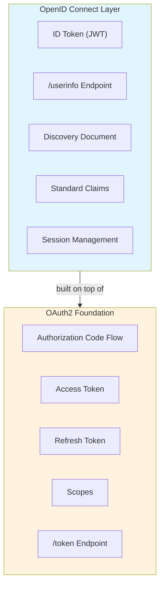

# OpenID Connect khác OAuth2 thế nào?

## ⚡ Tóm tắt ngắn (30s)
* **OAuth2** = Authorization framework — cho phép app truy cập resource thay user, **không định nghĩa cách xác thực user**
* **OpenID Connect (OIDC)** = Authentication layer **xây trên OAuth2** — thêm ID Token để xác định danh tính user
* Khác biệt cốt lõi: OAuth2 trả về **access token** (để truy cập API), OIDC trả thêm **ID token** (chứa thông tin user)
* OIDC thêm standardized endpoints: `/userinfo`, discovery (`/.well-known/openid-configuration`)
* Trong Spring Security: `oauth2Login()` = OIDC, `oauth2ResourceServer()` = OAuth2 Resource Server

---

## 🔍 Chi tiết bản chất thực chiến

### Tại sao OAuth2 không đủ cho Authentication?
OAuth2 thiết kế để **ủy quyền truy cập resource**, không phải để xác định "user này là ai". Access token trong OAuth2:
- Dành cho **Resource Server** đọc, không phải cho Client
- Không bắt buộc chứa thông tin user (subject, email, name)
- Format không chuẩn hóa — mỗi provider implement khác nhau

Nhiều công ty từng "hack" OAuth2 để làm authentication bằng cách gọi `/userinfo` endpoint sau khi có access token. Nhưng cách này không chuẩn và có lỗ hổng bảo mật (confused deputy problem).

### OIDC giải quyết bằng cách thêm gì?



### ID Token — thành phần quan trọng nhất của OIDC
ID Token là một **JWT** chứa các claims chuẩn hóa về user:

```json
{
  "iss": "https://accounts.google.com",
  "sub": "1234567890",
  "aud": "my-client-id",
  "exp": 1716422400,
  "iat": 1716418800,
  "nonce": "abc123",
  "name": "Nguyễn Văn A",
  "email": "nguyenvana@gmail.com",
  "email_verified": true,
  "picture": "https://example.com/avatar.jpg"
}
```

### OIDC Scopes chuẩn hóa

| Scope | Claims được trả về |
| :--- | :--- |
| `openid` | `sub` (bắt buộc để kích hoạt OIDC) |
| `profile` | `name`, `family_name`, `given_name`, `picture`, `locale` |
| `email` | `email`, `email_verified` |
| `address` | `address` (structured) |
| `phone` | `phone_number`, `phone_number_verified` |

---

## 💻 Code thực chiến: BAD vs GOOD

### ❌ BAD: Dùng OAuth2 access token để authenticate user
```java
@Configuration
public class SecurityConfig {

    @Bean
    public SecurityFilterChain filterChain(HttpSecurity http) throws Exception {
        http
            // ❌ Chỉ dùng OAuth2 Resource Server — không có OIDC
            .oauth2ResourceServer(rs -> rs.jwt(Customizer.withDefaults()));
        return http.build();
    }
}

@RestController
public class ProfileController {

    // ❌ Dùng access token rồi gọi userinfo endpoint thủ công
    @GetMapping("/profile")
    public ResponseEntity<?> getProfile(
            @RequestHeader("Authorization") String token) {
        // ❌ Gọi thêm 1 HTTP request cho mỗi request
        RestTemplate rest = new RestTemplate();
        rest.getInterceptors().add((req, body, exec) -> {
            req.getHeaders().set("Authorization", token);
            return exec.execute(req, body);
        });

        // ❌ Không validate nonce → replay attack
        // ❌ Không check audience → confused deputy attack
        Map<String, Object> userInfo = rest.getForObject(
            "https://auth.example.com/userinfo", Map.class);

        return ResponseEntity.ok(userInfo);
    }
}
```

---

### ✅ GOOD: Sử dụng OIDC đúng cách với Spring Security
```java
// application.yml
// spring:
//   security:
//     oauth2:
//       client:
//         registration:
//           keycloak:
//             client-id: ${OIDC_CLIENT_ID}
//             client-secret: ${OIDC_CLIENT_SECRET}
//             scope: openid, profile, email
//         provider:
//           keycloak:
//             issuer-uri: https://keycloak.example.com/realms/myrealm

@Configuration
@EnableMethodSecurity
public class SecurityConfig {

    @Bean
    public SecurityFilterChain filterChain(HttpSecurity http) throws Exception {
        http
            .authorizeHttpRequests(auth -> auth
                .requestMatchers("/public/**").permitAll()
                .anyRequest().authenticated()
            )
            // ✅ OIDC Login — Spring tự validate ID Token
            .oauth2Login(oauth2 -> oauth2
                .userInfoEndpoint(info -> info
                    .oidcUserService(customOidcUserService())
                )
            );
        return http.build();
    }

    // ✅ Custom OIDC User Service — map claims → domain user
    @Bean
    public OAuth2UserService<OidcUserRequest, OidcUser> customOidcUserService() {
        OidcUserService delegate = new OidcUserService();

        return userRequest -> {
            OidcUser oidcUser = delegate.loadUser(userRequest);

            // ✅ ID Token đã được validate (signature, iss, aud, exp, nonce)
            OidcIdToken idToken = oidcUser.getIdToken();
            String email = idToken.getEmail();
            String subject = idToken.getSubject();

            // ✅ Sync user vào local DB nếu chưa có
            User localUser = userService.findOrCreateByOidc(subject, email);

            // ✅ Map local roles thành Spring Security authorities
            Set<GrantedAuthority> authorities = localUser.getRoles().stream()
                .map(role -> new SimpleGrantedAuthority("ROLE_" + role))
                .collect(Collectors.toSet());

            return new DefaultOidcUser(authorities, idToken, oidcUser.getUserInfo());
        };
    }
}

// ✅ Controller sử dụng OIDC user info trực tiếp
@RestController
public class ProfileController {

    @GetMapping("/profile")
    public ResponseEntity<?> getProfile(
            @AuthenticationPrincipal OidcUser oidcUser) {
        // ✅ Thông tin user đã có sẵn từ ID Token — không cần gọi thêm API
        return ResponseEntity.ok(Map.of(
            "sub", oidcUser.getSubject(),
            "name", oidcUser.getFullName(),
            "email", oidcUser.getEmail(),
            "roles", oidcUser.getAuthorities()
        ));
    }
}
```

---

## 📊 Bảng so sánh OAuth2 vs OIDC

| Tiêu chí | OAuth2 | OpenID Connect (OIDC) |
| :--- | :--- | :--- |
| **Mục đích** | Authorization (ủy quyền) | Authentication (xác thực danh tính) |
| **Token chính** | Access Token | ID Token (JWT) + Access Token |
| **User identity** | Không chuẩn hóa | Claims chuẩn hóa (sub, email, name) |
| **Discovery** | Không có | `/.well-known/openid-configuration` |
| **Scope bắt buộc** | Không quy định | `openid` |
| **UserInfo endpoint** | Không chuẩn hóa | `/userinfo` (chuẩn hóa) |
| **Session management** | Không có | Front/Back-channel logout |
| **Spec** | RFC 6749 | OpenID Foundation spec |
| **Spring Security** | `oauth2ResourceServer()` | `oauth2Login()` |

---

## ⚠️ Common Gotchas & Questions follow-up

### 1. "Login with Google" là OAuth2 hay OIDC?
* Thực chất là **OIDC** — vì có `scope=openid` và trả về ID Token
* Nhiều người gọi nhầm là "OAuth2 login" vì OIDC xây trên OAuth2
* Nếu chỉ dùng OAuth2 thuần, bạn chỉ có access token, không biết user là ai

### 2. ID Token vs Access Token — dùng ở đâu?
* **ID Token**: Client app đọc để biết user identity → **KHÔNG gửi đến Resource Server**
* **Access Token**: gửi đến Resource Server để truy cập API → **Client không nên đọc**
* Lỗi phổ biến: gửi ID Token trong header `Authorization: Bearer` đến API

### 3. Nonce parameter chống replay attack
* Client tạo random `nonce`, gửi trong authorization request
* Authorization Server embed `nonce` vào ID Token
* Client verify `nonce` trong ID Token khớp với giá trị đã gửi
* Spring Security tự handle nonce validation

### 4. Discovery Document — tự động cấu hình
* URL: `https://issuer/.well-known/openid-configuration`
* Chứa tất cả endpoints: authorize, token, userinfo, jwks_uri
* Spring Security chỉ cần `issuer-uri` là tự discover mọi thứ

### 5. Câu hỏi follow-up
* "OIDC có những flow nào?" → Authorization Code, Implicit (deprecated), Hybrid
* "Làm sao implement logout với OIDC?" → RP-Initiated Logout, Back-channel Logout
* "OIDC vs SAML?" → OIDC dùng JSON/JWT (modern), SAML dùng XML (enterprise legacy)
