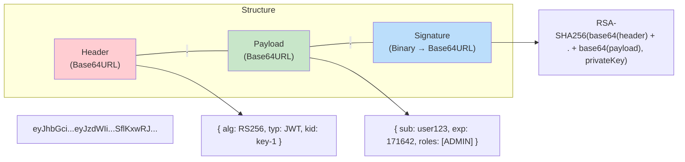

# JWT gồm những phần nào?

## ⚡ Tóm tắt ngắn (30s)
* JWT (JSON Web Token) gồm **3 phần** ngăn cách bởi dấu chấm: `Header.Payload.Signature`
* **Header**: chứa algorithm (RS256, HS256) và token type
* **Payload**: chứa claims — dữ liệu thực (sub, exp, iat, custom claims)
* **Signature**: đảm bảo token không bị tamper — `HMAC(header+payload, secret)` hoặc `RSA(header+payload, privateKey)`
* JWT **KHÔNG mã hóa** payload (chỉ Base64URL encode) → **KHÔNG lưu sensitive data** trong payload
* Production nên dùng **RS256 (asymmetric)** thay vì HS256 (symmetric) để Resource Server verify mà không cần biết secret

---

## 🔍 Chi tiết bản chất thực chiến

### Cấu trúc JWT



### 1. Header — Metadata về token
```json
{
  "alg": "RS256",
  "typ": "JWT",
  "kid": "key-2024-05"
}
```
- **alg**: Algorithm dùng để sign (RS256, ES256, HS256)
- **typ**: Loại token, luôn là "JWT"
- **kid**: Key ID — dùng khi Authorization Server có nhiều signing keys (key rotation)

### 2. Payload — Claims (dữ liệu)
```json
{
  "iss": "https://auth.example.com",
  "sub": "user-uuid-123",
  "aud": "my-api",
  "exp": 1716422400,
  "iat": 1716418800,
  "nbf": 1716418800,
  "jti": "unique-token-id-abc",
  "roles": ["ADMIN", "USER"],
  "tenant_id": "company-xyz"
}
```

**Registered Claims (chuẩn RFC 7519):**
| Claim | Ý nghĩa | Quan trọng? |
| :--- | :--- | :--- |
| `iss` | Issuer — ai phát hành token | ✅ Phải validate |
| `sub` | Subject — user ID | ✅ Định danh user |
| `aud` | Audience — token dành cho ai | ✅ Phải validate |
| `exp` | Expiration — hết hạn khi nào | ✅ Phải validate |
| `iat` | Issued At — phát hành khi nào | Informational |
| `nbf` | Not Before — chưa có hiệu lực trước | Optional |
| `jti` | JWT ID — unique identifier | Dùng cho revocation |

**Custom Claims**: `roles`, `tenant_id`, `permissions` — tuỳ business cần gì.

### 3. Signature — Đảm bảo tính toàn vẹn
```
RSASHA256(
  base64UrlEncode(header) + "." + base64UrlEncode(payload),
  privateKey
)
```
- Chỉ Authorization Server có private key → chỉ nó mới tạo được valid signature
- Resource Server dùng **public key** (từ JWKS endpoint) để verify
- Nếu payload bị sửa 1 ký tự → signature không khớp → token bị reject

---

## 💻 Code thực chiến: BAD vs GOOD

### ❌ BAD: Parse JWT thủ công và thiếu validation
```java
@Component
public class JwtTokenProvider {

    // ❌ Dùng HS256 với secret yếu
    private String secret = "mysecret123";

    public String getUserId(String token) {
        // ❌ Chỉ decode payload, KHÔNG verify signature
        String[] parts = token.split("\\.");
        String payload = new String(Base64.getUrlDecoder().decode(parts[1]));
        JSONObject json = new JSONObject(payload);

        // ❌ Không check expiration
        // ❌ Không check issuer
        // ❌ Không check audience
        return json.getString("sub");
    }

    public String createToken(String userId) {
        // ❌ Lưu sensitive data trong payload
        return Jwts.builder()
            .setSubject(userId)
            .claim("password", user.getPassword())  // ❌ NEVER!
            .claim("ssn", user.getSsn())             // ❌ NEVER!
            .setExpiration(new Date(System.currentTimeMillis()
                + 86400000 * 30)) // ❌ 30 ngày — quá dài
            .signWith(SignatureAlgorithm.HS256, secret) // ❌ Weak secret
            .compact();
    }
}
```

---

### ✅ GOOD: JWT handling chuẩn với Spring Security
```java
// 1. application.yml — Resource Server config
// spring:
//   security:
//     oauth2:
//       resourceserver:
//         jwt:
//           issuer-uri: https://keycloak.example.com/realms/myrealm
//           # Spring tự fetch JWKS từ issuer-uri/.well-known/...

// 2. Security Config — JWT validation tự động
@Configuration
@EnableMethodSecurity
public class SecurityConfig {

    @Bean
    public SecurityFilterChain filterChain(HttpSecurity http) throws Exception {
        http
            .authorizeHttpRequests(auth -> auth
                .requestMatchers("/public/**").permitAll()
                .anyRequest().authenticated()
            )
            .oauth2ResourceServer(rs -> rs
                .jwt(jwt -> jwt
                    .jwtAuthenticationConverter(jwtAuthConverter())
                    // ✅ Spring tự validate: signature, exp, iss, aud
                )
            );
        return http.build();
    }

    // ✅ Custom JWT decoder với đầy đủ validation
    @Bean
    public JwtDecoder jwtDecoder() {
        NimbusJwtDecoder decoder = NimbusJwtDecoder
            .withJwkSetUri("https://keycloak.example.com/realms/myrealm/protocol/openid-connect/certs")
            .build();

        // ✅ Validate issuer và audience
        OAuth2TokenValidator<Jwt> issuerValidator =
            JwtValidators.createDefaultWithIssuer(
                "https://keycloak.example.com/realms/myrealm");

        OAuth2TokenValidator<Jwt> audienceValidator = token -> {
            if (!token.getAudience().contains("my-api")) {
                return OAuth2TokenValidatorResult.failure(
                    new OAuth2Error("invalid_audience", "Invalid audience", null));
            }
            return OAuth2TokenValidatorResult.success();
        };

        // ✅ Kết hợp nhiều validators
        decoder.setJwtValidator(new DelegatingOAuth2TokenValidator<>(
            issuerValidator, audienceValidator));

        return decoder;
    }

    // ✅ Map JWT claims sang Spring Security authorities
    @Bean
    public JwtAuthenticationConverter jwtAuthConverter() {
        JwtGrantedAuthoritiesConverter authoritiesConverter =
            new JwtGrantedAuthoritiesConverter();
        // ✅ Keycloak lưu roles trong realm_access.roles
        authoritiesConverter.setAuthoritiesClaimName("realm_access.roles");
        authoritiesConverter.setAuthorityPrefix("ROLE_");

        JwtAuthenticationConverter converter = new JwtAuthenticationConverter();
        converter.setJwtGrantedAuthoritiesConverter(authoritiesConverter);
        converter.setPrincipalClaimName("preferred_username");
        return converter;
    }
}

// 3. Controller — access JWT claims an toàn
@RestController
@RequestMapping("/api")
public class ApiController {

    @GetMapping("/me")
    public ResponseEntity<?> getCurrentUser(@AuthenticationPrincipal Jwt jwt) {
        // ✅ JWT đã được verify đầy đủ tại filter layer
        return ResponseEntity.ok(Map.of(
            "userId", jwt.getSubject(),
            "email", jwt.getClaimAsString("email"),
            "issuedAt", jwt.getIssuedAt(),
            "expiresAt", jwt.getExpiresAt()
        ));
    }
}
```

---

## 📊 Bảng so sánh HS256 vs RS256

| Tiêu chí | HS256 (Symmetric) | RS256 (Asymmetric) |
| :--- | :--- | :--- |
| **Key** | Shared secret | Private key + Public key |
| **Sign** | Secret key | Private key |
| **Verify** | Cùng secret key | Public key (JWKS) |
| **Bảo mật** | Resource Server biết secret → có thể tạo token giả | Resource Server chỉ có public key → chỉ verify được |
| **Key rotation** | Phải đổi secret ở tất cả services | Chỉ đổi ở Auth Server, public key tự distribute |
| **Microservices** | ❌ Không phù hợp | ✅ Lý tưởng |
| **Performance** | Nhanh hơn | Chậm hơn (nhưng không đáng kể) |
| **Use case** | Monolith, internal | Production, distributed |

---

## ⚠️ Common Gotchas & Questions follow-up

### 1. JWT KHÔNG được mã hóa — ai cũng đọc được payload
* Base64URL encode ≠ encryption — chỉ cần `base64url_decode()` là đọc được
* **KHÔNG BAO GIỜ** lưu password, PII, sensitive data trong JWT payload
* Nếu cần encrypt → dùng **JWE (JSON Web Encryption)**, nhưng hiếm khi cần

### 2. JWT không thể revoke — đây là trade-off lớn nhất
* JWT là **stateless** → server không lưu state → không thể "xóa" token
* Giải pháp: **short expiry** (5-15 phút) + **refresh token rotation**
* Hoặc dùng **token blacklist** (Redis) nhưng mất tính stateless

### 3. "none" algorithm attack
* Attacker sửa header thành `"alg": "none"`, bỏ signature
* Server nếu accept `alg=none` → bypass authentication hoàn toàn
* Spring Security mặc định **reject** `alg=none` — nhưng custom implementation có thể bị

### 4. Key rotation với kid
* Không nên dùng 1 signing key mãi mãi → cần rotate định kỳ
* Header chứa `kid` (key ID) → Resource Server biết dùng key nào để verify
* JWKS endpoint trả về danh sách public keys → support rotation seamless

### 5. Câu hỏi follow-up
* "JWT vs opaque token?" → JWT = self-contained (lớn), opaque = reference token (nhỏ, cần introspection)
* "Token size concern?" → JWT có thể lên hàng KB → ảnh hưởng bandwidth, cookie size limit 4KB
* "Nested JWT là gì?" → JWT được sign rồi encrypt (JWS inside JWE) — rất hiếm dùng
