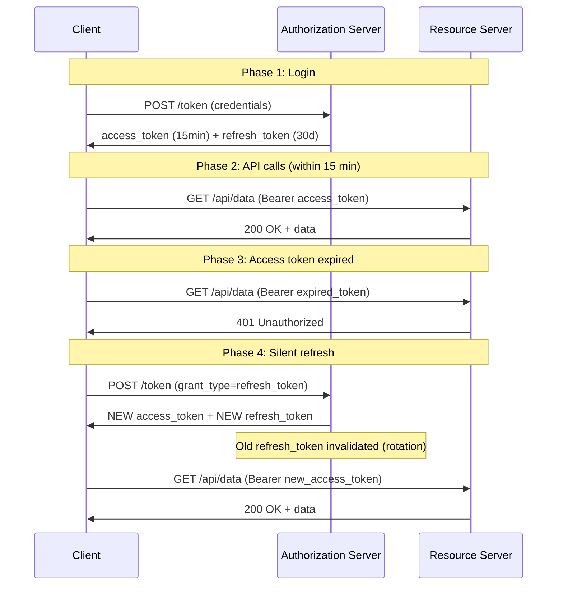
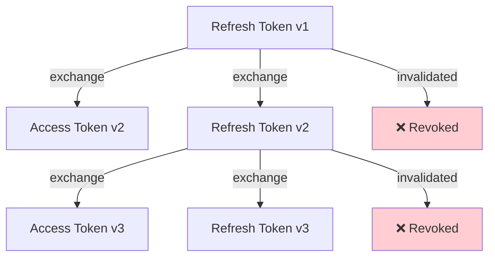

# Access token và refresh token khác nhau thế nào?

## ⚡ Tóm tắt ngắn (30s)
* **Access Token**: "vé vào cửa" ngắn hạn (5-15 phút), gửi kèm mỗi API request để truy cập resource
* **Refresh Token**: "thẻ gia hạn" dài hạn (7-30 ngày), dùng để **lấy access token mới** khi access token hết hạn mà **không cần user login lại**
* Access token gửi đến **Resource Server**, refresh token chỉ gửi đến **Authorization Server**
* Access token thường là **JWT** (self-contained), refresh token thường là **opaque string** (reference token)
* Production pattern: **Access Token ngắn hạn + Refresh Token Rotation** — balance giữa security và UX

---

## 🔍 Chi tiết bản chất thực chiến

### Tại sao cần 2 loại token?
Nếu chỉ dùng 1 access token dài hạn (VD: 30 ngày):
- Token bị leak → attacker có **30 ngày** để exploit
- Không thể revoke vì JWT là stateless
- Rủi ro bảo mật rất cao

Nếu chỉ dùng access token ngắn hạn (VD: 5 phút):
- User phải login lại **mỗi 5 phút** → UX tệ
- Không thể dùng được trong thực tế

**Giải pháp**: Kết hợp cả hai — access token ngắn hạn cho security, refresh token để duy trì session.

### Token Lifecycle Flow



### Refresh Token Rotation — Best Practice
Mỗi lần dùng refresh token → Authorization Server phát hành **cặp token mới** và **vô hiệu hóa refresh token cũ**:



Nếu attacker dùng refresh token cũ (đã bị revoke) → Authorization Server phát hiện **token reuse** → **revoke toàn bộ token family** → user phải login lại.

---

## 💻 Code thực chiến: BAD vs GOOD

### ❌ BAD: Dùng access token dài hạn, không có refresh mechanism
```java
@Component
public class TokenProvider {

    // ❌ Access token 30 ngày — quá dài, nếu leak là thảm họa
    private static final long EXPIRATION = 30 * 24 * 60 * 60 * 1000L;

    public String createToken(String userId) {
        return Jwts.builder()
            .setSubject(userId)
            .setExpiration(new Date(System.currentTimeMillis() + EXPIRATION))
            .signWith(SignatureAlgorithm.HS256, "weak-secret")
            .compact();
        // ❌ Không có refresh token → user phải login lại sau 30 ngày
        // ❌ Không thể revoke → nếu token leak, phải đợi 30 ngày expire
    }
}

@RestController
public class AuthController {

    // ❌ Lưu refresh token trong response body → frontend lưu localStorage
    @PostMapping("/login")
    public ResponseEntity<?> login(@RequestBody LoginRequest request) {
        String token = tokenProvider.createToken(request.getUsername());
        // ❌ Chỉ trả 1 token, không phân biệt access/refresh
        return ResponseEntity.ok(Map.of("token", token));
    }
}
```

---

### ✅ GOOD: Implement đầy đủ access/refresh token với rotation
```java
// 1. Token Service — tạo và quản lý token pair
@Service
@RequiredArgsConstructor
public class TokenService {

    private final JwtEncoder jwtEncoder;
    private final RefreshTokenRepository refreshTokenRepo;

    // ✅ Access token ngắn hạn
    private static final Duration ACCESS_TOKEN_TTL = Duration.ofMinutes(15);
    // ✅ Refresh token dài hạn
    private static final Duration REFRESH_TOKEN_TTL = Duration.ofDays(30);

    public TokenPair createTokenPair(UserDetails user) {
        String accessToken = createAccessToken(user);
        String refreshToken = createRefreshToken(user);
        return new TokenPair(accessToken, refreshToken);
    }

    private String createAccessToken(UserDetails user) {
        Instant now = Instant.now();
        JwtClaimsSet claims = JwtClaimsSet.builder()
            .issuer("https://api.example.com")
            .subject(user.getUsername())
            .audience(List.of("my-api"))
            .issuedAt(now)
            .expiresAt(now.plus(ACCESS_TOKEN_TTL))
            .claim("roles", user.getAuthorities().stream()
                .map(GrantedAuthority::getAuthority).toList())
            .build();

        return jwtEncoder.encode(JwtEncoderParameters.from(claims))
            .getTokenValue();
    }

    private String createRefreshToken(UserDetails user) {
        // ✅ Opaque token — không decode được, phải lookup DB
        String tokenValue = UUID.randomUUID().toString();

        RefreshToken entity = RefreshToken.builder()
            .token(tokenValue)
            .userId(user.getUsername())
            .expiresAt(Instant.now().plus(REFRESH_TOKEN_TTL))
            .revoked(false)
            .family(UUID.randomUUID().toString()) // ✅ Token family cho rotation
            .build();

        refreshTokenRepo.save(entity);
        return tokenValue;
    }

    // ✅ Refresh Token Rotation
    @Transactional
    public TokenPair refreshTokens(String refreshTokenValue) {
        RefreshToken storedToken = refreshTokenRepo
            .findByToken(refreshTokenValue)
            .orElseThrow(() -> new InvalidTokenException("Invalid refresh token"));

        // ✅ Check if token was already used (reuse detection)
        if (storedToken.isRevoked()) {
            // Token reuse detected! Revoke entire family
            refreshTokenRepo.revokeAllByFamily(storedToken.getFamily());
            throw new TokenReuseException(
                "Refresh token reuse detected — all sessions revoked");
        }

        // ✅ Check expiration
        if (storedToken.getExpiresAt().isBefore(Instant.now())) {
            throw new InvalidTokenException("Refresh token expired");
        }

        // ✅ Revoke old refresh token
        storedToken.setRevoked(true);
        refreshTokenRepo.save(storedToken);

        // ✅ Issue new token pair (same family)
        UserDetails user = userDetailsService
            .loadUserByUsername(storedToken.getUserId());
        String newAccessToken = createAccessToken(user);

        RefreshToken newRefreshToken = RefreshToken.builder()
            .token(UUID.randomUUID().toString())
            .userId(user.getUsername())
            .expiresAt(Instant.now().plus(REFRESH_TOKEN_TTL))
            .revoked(false)
            .family(storedToken.getFamily()) // ✅ Same family
            .build();
        refreshTokenRepo.save(newRefreshToken);

        return new TokenPair(newAccessToken, newRefreshToken.getToken());
    }
}

// 2. Auth Controller — token endpoints
@RestController
@RequestMapping("/auth")
@RequiredArgsConstructor
public class AuthController {

    private final TokenService tokenService;
    private final AuthenticationManager authenticationManager;

    @PostMapping("/login")
    public ResponseEntity<?> login(@RequestBody @Valid LoginRequest request) {
        Authentication auth = authenticationManager.authenticate(
            new UsernamePasswordAuthenticationToken(
                request.getUsername(), request.getPassword()));

        TokenPair tokens = tokenService.createTokenPair(
            (UserDetails) auth.getPrincipal());

        // ✅ Refresh token trong HttpOnly cookie — không accessible bởi JS
        ResponseCookie cookie = ResponseCookie
            .from("refresh_token", tokens.refreshToken())
            .httpOnly(true)
            .secure(true)
            .sameSite("Strict")
            .path("/auth/refresh")  // ✅ Chỉ gửi đến refresh endpoint
            .maxAge(Duration.ofDays(30))
            .build();

        return ResponseEntity.ok()
            .header(HttpHeaders.SET_COOKIE, cookie.toString())
            .body(Map.of("access_token", tokens.accessToken()));
    }

    @PostMapping("/refresh")
    public ResponseEntity<?> refresh(
            @CookieValue("refresh_token") String refreshToken) {
        TokenPair newTokens = tokenService.refreshTokens(refreshToken);

        ResponseCookie cookie = ResponseCookie
            .from("refresh_token", newTokens.refreshToken())
            .httpOnly(true).secure(true).sameSite("Strict")
            .path("/auth/refresh").maxAge(Duration.ofDays(30))
            .build();

        return ResponseEntity.ok()
            .header(HttpHeaders.SET_COOKIE, cookie.toString())
            .body(Map.of("access_token", newTokens.accessToken()));
    }

    @PostMapping("/logout")
    public ResponseEntity<?> logout(
            @CookieValue("refresh_token") String refreshToken) {
        // ✅ Revoke refresh token family
        tokenService.revokeTokenFamily(refreshToken);

        ResponseCookie cookie = ResponseCookie
            .from("refresh_token", "")
            .httpOnly(true).secure(true).maxAge(0).path("/auth/refresh")
            .build();

        return ResponseEntity.ok()
            .header(HttpHeaders.SET_COOKIE, cookie.toString())
            .body(Map.of("message", "Logged out"));
    }
}
```

---

## 📊 Bảng so sánh Access Token vs Refresh Token

| Tiêu chí | Access Token | Refresh Token |
| :--- | :--- | :--- |
| **Mục đích** | Truy cập resource | Lấy access token mới |
| **Gửi đến** | Resource Server | Authorization Server only |
| **Lifetime** | Ngắn (5-15 phút) | Dài (7-30 ngày) |
| **Format** | JWT (self-contained) | Opaque string (DB lookup) |
| **Lưu trữ** | Memory / short-lived cookie | HttpOnly Secure cookie |
| **Revocable?** | Khó (stateless JWT) | Dễ (server-side state) |
| **Leak impact** | Thấp (hết hạn nhanh) | Cao (cần rotation + detection) |
| **Frequency** | Mỗi API request | Chỉ khi access token hết hạn |
| **Scope** | Full API access | Chỉ dùng ở `/token` endpoint |

---

## ⚠️ Common Gotchas & Questions follow-up

### 1. Refresh token lưu ở đâu trên client?
* **HttpOnly + Secure + SameSite cookie**: an toàn nhất — JS không access được
* **localStorage**: ❌ dễ bị XSS → KHÔNG nên lưu refresh token
* **In-memory**: mất khi refresh page → UX kém
* **BFF pattern**: refresh token chỉ ở backend, frontend dùng session cookie

### 2. Sliding window vs absolute expiration
* **Absolute**: refresh token hết hạn cố định (30 ngày kể từ login)
* **Sliding window**: mỗi lần refresh → reset TTL (luôn còn 30 ngày nếu active)
* **Hybrid**: sliding window nhưng có absolute max (VD: tối đa 90 ngày)

### 3. Token reuse detection — tại sao cần token family?
* Nếu attacker steal refresh token cũ và dùng lại → server phát hiện reuse
* Revoke **toàn bộ family** → cả attacker lẫn legitimate user phải login lại
* User thấy bị logout bất thường → biết account có thể bị compromise

### 4. Access token nên chứa gì?
* **Nên**: `sub`, `roles`, `permissions`, `tenant_id` — giảm DB lookup
* **Không nên**: email, phone, PII — vì JWT payload ai cũng đọc được
* **Trade-off**: nhiều claims = token lớn = tốn bandwidth

### 5. Câu hỏi follow-up
* "Tại sao không dùng access token dài hạn + blacklist?" → mất tính stateless, mỗi request phải check blacklist (thêm latency)
* "Refresh token rotation có nhược điểm gì?" → Race condition khi multiple tabs cùng refresh → cần xử lý concurrent refresh
* "Làm sao handle khi cả access + refresh đều hết hạn?" → User phải re-authenticate (login lại)
