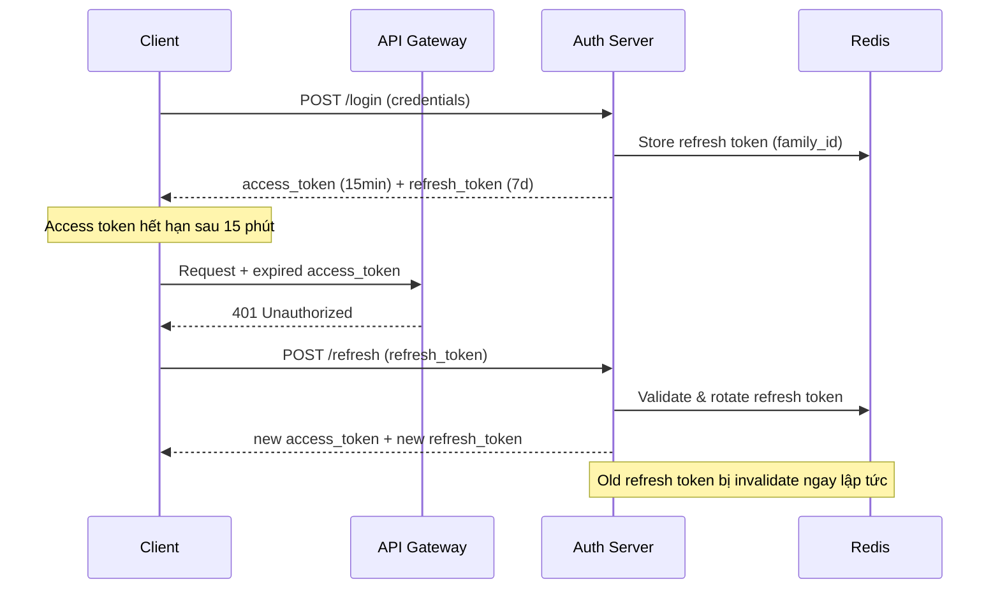

# Token expiration nên thiết kế ra sao?

## ⚡ Tóm tắt ngắn (30s)
* Token expiration cần **balance giữa security và UX** — access token ngắn (15-30 phút), refresh token dài hơn (7-30 ngày)
* Dùng **dual-token strategy**: access token stateless (JWT) + refresh token stateful (lưu DB/Redis)
* Refresh token phải hỗ trợ **rotation** — mỗi lần dùng refresh thì invalidate token cũ, cấp token mới
* Sliding expiration cho session-critical apps, absolute expiration cho high-security apps (banking)
* Production cần có **token family tracking** để detect token theft qua refresh token reuse

---

## 🔍 Chi tiết bản chất thực chiến

### Tại sao không dùng 1 token duy nhất?
Nếu chỉ có 1 token với thời gian dài → bị đánh cắp sẽ gây thiệt hại lớn. Nếu token ngắn → user phải login liên tục, UX tệ. **Dual-token** giải quyết cả hai vấn đề.

### Kiến trúc Token Expiration



### Các chiến lược expiration phổ biến

**1. Fixed Expiration** — Token hết hạn sau thời gian cố định kể từ lúc issue. Dùng cho banking, healthcare.

**2. Sliding Expiration** — Token được "gia hạn" mỗi lần user active. Dùng cho social media, e-commerce.

**3. Absolute + Sliding kết hợp** — Sliding nhưng có ceiling. Ví dụ: refresh mỗi 15 phút nhưng tối đa 8 tiếng (1 ngày làm việc).

### Token Family & Reuse Detection
Khi refresh token bị đánh cắp và attacker dùng trước user → user dùng old refresh token → server detect **reuse** → invalidate toàn bộ token family → force re-login.

---

## 💻 Code thực chiến: BAD vs GOOD

### ❌ BAD: Token không có chiến lược rotation, expiration quá dài
```java
@Service
public class BadTokenService {

    // ❌ Access token sống 24 giờ — quá dài, bị steal là xong
    private static final long ACCESS_TOKEN_EXPIRY = 24 * 60 * 60 * 1000;

    public String generateToken(UserDetails user) {
        return Jwts.builder()
                .setSubject(user.getUsername())
                .setIssuedAt(new Date())
                .setExpiration(new Date(System.currentTimeMillis() + ACCESS_TOKEN_EXPIRY))
                .signWith(SignatureAlgorithm.HS256, "weak-secret") // ❌ Weak secret
                .compact();
    }

    // ❌ Không có refresh token — user phải login lại khi hết hạn
    // ❌ Không có token rotation
    // ❌ Không track token family để detect theft
}
```

---

### ✅ GOOD: Dual-token với rotation và family tracking
```java
@Service
@RequiredArgsConstructor
public class TokenService {

    private final RedisTemplate<String, RefreshTokenData> redisTemplate;

    // ✅ Access token ngắn — giảm attack window
    private static final Duration ACCESS_TOKEN_TTL = Duration.ofMinutes(15);
    // ✅ Refresh token hợp lý
    private static final Duration REFRESH_TOKEN_TTL = Duration.ofDays(7);

    @Value("${jwt.signing-key}")
    private String signingKey; // ✅ Externalized, rotatable

    public TokenPair generateTokenPair(UserDetails user) {
        String accessToken = buildAccessToken(user);
        String refreshToken = UUID.randomUUID().toString();
        String familyId = UUID.randomUUID().toString();

        // ✅ Lưu refresh token vào Redis với family tracking
        RefreshTokenData data = RefreshTokenData.builder()
                .userId(user.getUsername())
                .familyId(familyId)
                .used(false)
                .build();

        redisTemplate.opsForValue()
                .set("refresh:" + refreshToken, data, REFRESH_TOKEN_TTL);

        return new TokenPair(accessToken, refreshToken);
    }

    public TokenPair refreshTokenPair(String oldRefreshToken) {
        String key = "refresh:" + oldRefreshToken;
        RefreshTokenData data = redisTemplate.opsForValue().get(key);

        if (data == null) {
            throw new InvalidTokenException("Refresh token not found or expired");
        }

        // ✅ Reuse detection — nếu token đã dùng rồi → bị steal
        if (data.isUsed()) {
            // Invalidate TOÀN BỘ family
            invalidateTokenFamily(data.getFamilyId());
            throw new TokenTheftException("Token reuse detected! Family revoked.");
        }

        // ✅ Mark old token as used (không xóa để detect reuse)
        data.setUsed(true);
        redisTemplate.opsForValue().set(key, data, Duration.ofMinutes(5));

        // ✅ Issue new token pair với cùng family
        String newRefreshToken = UUID.randomUUID().toString();
        RefreshTokenData newData = RefreshTokenData.builder()
                .userId(data.getUserId())
                .familyId(data.getFamilyId()) // Giữ nguyên family
                .used(false)
                .build();

        redisTemplate.opsForValue()
                .set("refresh:" + newRefreshToken, newData, REFRESH_TOKEN_TTL);

        UserDetails user = loadUser(data.getUserId());
        return new TokenPair(buildAccessToken(user), newRefreshToken);
    }

    private void invalidateTokenFamily(String familyId) {
        // Scan và xóa tất cả token thuộc family này
        // Production: dùng Redis SET để track family members
        Set<String> keys = redisTemplate.keys("refresh:*");
        if (keys != null) {
            keys.stream()
                .filter(k -> {
                    RefreshTokenData d = redisTemplate.opsForValue().get(k);
                    return d != null && familyId.equals(d.getFamilyId());
                })
                .forEach(redisTemplate::delete);
        }
    }

    private String buildAccessToken(UserDetails user) {
        return Jwts.builder()
                .setSubject(user.getUsername())
                .claim("roles", user.getAuthorities())
                .setIssuedAt(new Date())
                .setExpiration(Date.from(
                    Instant.now().plus(ACCESS_TOKEN_TTL)))
                .signWith(Keys.hmacShaKeyFor(signingKey.getBytes()),
                          SignatureAlgorithm.HS512)  // ✅ Strong algorithm
                .compact();
    }
}
```

---

## 📊 Bảng so sánh chiến lược Expiration

| Tiêu chí | Short-lived only | Long-lived only | Dual Token (Recommended) |
| :--- | :--- | :--- | :--- |
| **Security** | ✅ Cao | ❌ Rủi ro lớn | ✅ Cao |
| **UX** | ❌ Login liên tục | ✅ Mượt | ✅ Mượt |
| **Theft impact** | Thấp (15 min) | Rất cao | Thấp + detectable |
| **Server state** | Stateless | Stateless | Hybrid (refresh stateful) |
| **Complexity** | Thấp | Thấp | Trung bình |
| **Phù hợp** | Internal API | Không nên dùng | Mọi production app |

---

## ⚠️ Common Gotchas & Questions follow-up

### 1. Access token 15 phút có quá ngắn không?
* 15 phút là **industry standard** (OAuth 2.0 recommendation). Google, Auth0, Okta đều dùng 5-60 phút
* Nếu UX quan trọng hơn → tăng lên 30 phút. Banking → giảm xuống 5 phút
* Frontend tự động gọi refresh trước khi token hết hạn (proactive refresh)

### 2. Refresh token nên lưu ở đâu phía client?
* **Web app**: `httpOnly` + `secure` + `SameSite=Strict` cookie — KHÔNG lưu localStorage
* **Mobile app**: Secure storage (Keychain iOS, Keystore Android)
* **SPA**: BFF pattern (Backend-for-Frontend) giữ refresh token server-side

### 3. Clock skew giữa các server có ảnh hưởng không?
* Có! Nếu server A issue token lúc 10:00, server B có clock chậm 2 phút → token "chưa valid"
* Giải pháp: thêm `clockSkewSeconds` vào JWT parser (thường 30-60 giây), hoặc dùng NTP sync

### 4. Token expiration cho microservices internal?
* Service-to-service thường dùng **short-lived token** (5 phút) + **auto-renew** qua service mesh
* Hoặc dùng **mTLS** thay vì token hoàn toàn cho internal communication

### 5. Khi deploy multiple instance, refresh token rotation có race condition không?
* Có! 2 request đồng thời dùng cùng refresh token → 1 thành công, 1 bị coi là reuse → false positive theft detection
* Giải pháp: dùng Redis lock hoặc thêm **grace period** (vài giây) cho old refresh token
