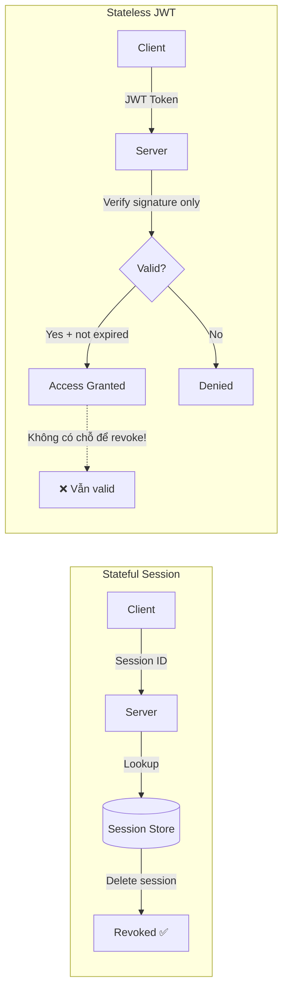

# JWT revoke khó ở điểm nào?

## ⚡ Tóm tắt ngắn (30s)
* JWT là **stateless** — server không lưu trạng thái → không có chỗ nào để "xóa" hay "vô hiệu hóa" token
* Bản chất JWT tự chứa thông tin (self-contained), một khi đã ký và phát đi → nó valid cho đến khi **hết hạn**
* Các giải pháp revoke đều **trade-off statelessness**: blacklist (Redis), token versioning, short-lived + refresh rotation
* Production phải chấp nhận: **JWT không thể truly stateless nếu cần revoke** — đây là architectural trade-off cơ bản
* Giải pháp phổ biến nhất: access token rất ngắn (5-15 min) + refresh token revocable (stateful)

---

## 🔍 Chi tiết bản chất thực chiến

### Tại sao JWT khó revoke?



JWT được thiết kế theo triết lý: **"Server không cần nhớ gì cả"**. Mỗi request mang đầy đủ thông tin (user, roles, expiry) trong token. Server chỉ verify signature → done. Không database lookup, không session store.

**Vấn đề phát sinh khi:**
- User logout → token vẫn valid
- User bị ban/deactivate → token vẫn valid
- User đổi password → old token vẫn valid
- Token bị steal → không thể invalidate ngay
- User thay đổi role/permission → old token vẫn có role cũ

### Các giải pháp và trade-off

**1. Token Blacklist (Redis/DB)** — Lưu danh sách token đã revoke. Mỗi request phải check blacklist → mất đi tính stateless.

**2. Short-lived Access Token** — Token chỉ sống 5-15 phút. Chấp nhận "revoke gap" — token vẫn valid trong window ngắn.

**3. Token Versioning** — Lưu version number per user trong DB. Mỗi lần revoke → tăng version. JWT chứa version → server check.

**4. Event-driven Propagation** — Broadcast revoke event qua message queue → tất cả service instance cache lại.

---

## 💻 Code thực chiến: BAD vs GOOD

### ❌ BAD: Không có cơ chế revoke, chỉ rely vào expiration
```java
@Component
public class BadJwtFilter extends OncePerRequestFilter {

    @Override
    protected void doFilterInternal(HttpServletRequest request,
                                     HttpServletResponse response,
                                     FilterChain chain) throws ServletException, IOException {
        String token = extractToken(request);

        if (token != null) {
            // ❌ Chỉ verify signature + expiration
            // Không check blacklist, không check user status
            Claims claims = Jwts.parserBuilder()
                    .setSigningKey(key)
                    .build()
                    .parseClaimsJws(token)
                    .getBody();

            // ❌ User đã bị ban nhưng token vẫn valid
            // ❌ User đã logout nhưng token vẫn hoạt động
            // ❌ Token bị steal → không cách nào invalidate
            UsernamePasswordAuthenticationToken auth =
                new UsernamePasswordAuthenticationToken(
                    claims.getSubject(), null, extractRoles(claims));
            SecurityContextHolder.getContext().setAuthentication(auth);
        }
        chain.doFilter(request, response);
    }
}
```

---

### ✅ GOOD: Multi-layer revocation strategy
```java
// === Layer 1: Token Blacklist Service ===
@Service
@RequiredArgsConstructor
public class TokenBlacklistService {

    private final RedisTemplate<String, String> redisTemplate;

    /**
     * Blacklist token với TTL = remaining lifetime của token
     * → Tự cleanup, không cần cronjob xóa expired entries
     */
    public void blacklist(String jti, Instant expiration) {
        Duration ttl = Duration.between(Instant.now(), expiration);
        if (ttl.isPositive()) {
            redisTemplate.opsForValue()
                    .set("blacklist:" + jti, "revoked", ttl);
        }
    }

    public boolean isBlacklisted(String jti) {
        return Boolean.TRUE.equals(
                redisTemplate.hasKey("blacklist:" + jti));
    }
}

// === Layer 2: User Token Version (for "revoke all") ===
@Service
@RequiredArgsConstructor
public class UserTokenVersionService {

    private final RedisTemplate<String, Integer> redisTemplate;

    // Gọi khi: change password, ban user, revoke all sessions
    public void incrementVersion(String userId) {
        redisTemplate.opsForValue().increment("token_ver:" + userId);
    }

    public int getCurrentVersion(String userId) {
        Integer ver = redisTemplate.opsForValue().get("token_ver:" + userId);
        return ver != null ? ver : 0;
    }
}

// === Layer 3: Enhanced JWT Filter ===
@Component
@RequiredArgsConstructor
public class SecureJwtFilter extends OncePerRequestFilter {

    private final TokenBlacklistService blacklistService;
    private final UserTokenVersionService versionService;
    private final Key signingKey;

    @Override
    protected void doFilterInternal(HttpServletRequest request,
                                     HttpServletResponse response,
                                     FilterChain chain) throws ServletException, IOException {
        String token = extractToken(request);

        if (token != null) {
            try {
                Claims claims = Jwts.parserBuilder()
                        .setSigningKey(signingKey)
                        .build()
                        .parseClaimsJws(token)
                        .getBody();

                String jti = claims.getId(); // ✅ Unique token ID

                // ✅ Check 1: Token có bị blacklist không? (single token revoke)
                if (blacklistService.isBlacklisted(jti)) {
                    response.setStatus(401);
                    return;
                }

                // ✅ Check 2: Token version có còn valid không? (revoke all)
                int tokenVersion = claims.get("ver", Integer.class);
                int currentVersion = versionService
                        .getCurrentVersion(claims.getSubject());
                if (tokenVersion < currentVersion) {
                    response.setStatus(401);
                    return;
                }

                setAuthentication(claims);
            } catch (ExpiredJwtException | SignatureException e) {
                response.setStatus(401);
                return;
            }
        }
        chain.doFilter(request, response);
    }
}

// === Logout & Revoke Endpoints ===
@RestController
@RequiredArgsConstructor
@RequestMapping("/api/auth")
public class AuthController {

    private final TokenBlacklistService blacklistService;
    private final UserTokenVersionService versionService;

    // ✅ Logout: blacklist single access token
    @PostMapping("/logout")
    public ResponseEntity<Void> logout(@AuthenticationPrincipal Jwt jwt) {
        blacklistService.blacklist(
                jwt.getId(),
                jwt.getExpiration().toInstant());
        return ResponseEntity.ok().build();
    }

    // ✅ Revoke all sessions (e.g., password change)
    @PostMapping("/revoke-all")
    public ResponseEntity<Void> revokeAll(@AuthenticationPrincipal Jwt jwt) {
        versionService.incrementVersion(jwt.getSubject());
        return ResponseEntity.ok().build();
    }
}
```

---

## 📊 Bảng so sánh các giải pháp Revoke JWT

| Tiêu chí | Blacklist (Redis) | Short-lived Token | Token Versioning | Event-driven |
| :--- | :--- | :--- | :--- | :--- |
| **Revoke ngay lập tức** | ✅ Có | ❌ Phải chờ hết hạn | ✅ Có | ✅ Gần ngay |
| **Stateless** | ❌ Không | ✅ Có | ❌ Không | Partial |
| **Performance** | ~1ms (Redis) | Không overhead | ~1ms (Redis) | Phụ thuộc propagation |
| **Granularity** | Per-token | Không | Per-user | Per-token/user |
| **Complexity** | Thấp | Thấp | Trung bình | Cao |
| **Use case** | Logout đơn lẻ | API stateless | Password change | Microservices |

---

## ⚠️ Common Gotchas & Questions follow-up

### 1. Blacklist có phải "giết chết" ý nghĩa stateless của JWT không?
* Đúng! Nhưng trong production, **pure stateless JWT gần như không tồn tại** nếu cần revoke
* Trade-off hợp lý: blacklist chỉ lưu `jti` + TTL ngắn → overhead rất nhỏ so với full session store
* Blacklist chỉ chứa ~vài nghìn entry (token bị revoke trong 15 phút) vs session store chứa **triệu** entries

### 2. Nếu Redis die thì sao?
* **Fail-open**: Cho pass → security risk (token đã revoke vẫn valid)
* **Fail-closed**: Block all → availability risk (không ai dùng được)
* Giải pháp: Redis Cluster/Sentinel + local in-memory cache làm fallback (Caffeine cache 30s TTL)

### 3. Signing key bị lộ thì xử lý thế nào?
* Rotate signing key ngay lập tức → tất cả token cũ đều invalid
* Dùng **asymmetric keys** (RS256/ES256) — chỉ public key ở resource server → lộ public key không ảnh hưởng
* Implement **JWKS endpoint** với key rotation support (`kid` header)

### 4. Opaque token vs JWT — khi nào nên chọn cái nào?
* **Opaque token**: Luôn stateful, revoke dễ, nhưng mỗi request phải call auth server → latency
* **JWT**: Stateless verify, performance tốt, nhưng revoke khó
* **Hybrid** (phổ biến nhất): JWT cho access token + opaque cho refresh token

### 5. Trong microservices, mỗi service đều phải check blacklist?
* Nếu dùng **API Gateway pattern**: chỉ gateway check blacklist → downstream service trust gateway
* Nếu **zero-trust**: mỗi service tự check → cần shared Redis hoặc event-driven blacklist sync
