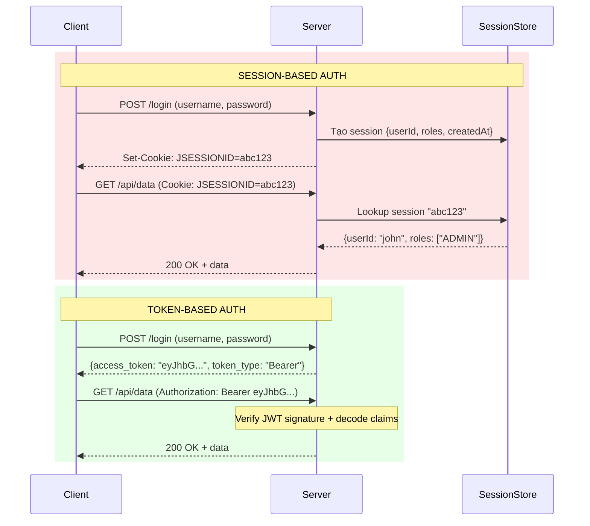

# Session-based auth và token-based auth khác nhau thế nào?

## ⚡ Tóm tắt ngắn (30s)
* **Session-based**: Server lưu trạng thái (stateful) — tạo session ID, lưu vào memory/DB, client gửi cookie mỗi request
* **Token-based**: Client giữ token chứa đầy đủ thông tin (stateless) — server chỉ verify signature, không lưu gì
* Session phù hợp **monolith + SSR**, token phù hợp **microservices + SPA/mobile**
* Production thường dùng **hybrid**: token-based cho API + session cho admin dashboard
* Trade-off cốt lõi: **scalability vs simplicity** — session đơn giản nhưng khó scale, token scale tốt nhưng revoke khó

---

## 🔍 Chi tiết bản chất thực chiến

### Luồng hoạt động so sánh



### Session-based Auth — Chi tiết
Server tạo một **session object** và lưu vào store (in-memory, Redis, database). Client chỉ giữ **session ID** (thường qua cookie). Mỗi request, server dùng session ID để lookup thông tin user.

**Ưu điểm:**
- Revoke dễ dàng — xóa session khỏi store là xong
- Server kiểm soát hoàn toàn — có thể thay đổi data bất kỳ lúc nào
- Đơn giản, battle-tested, mọi framework đều hỗ trợ tốt

**Nhược điểm:**
- Stateful → khó horizontal scale (cần sticky session hoặc shared session store)
- CSRF vulnerability (cookie tự động gửi theo request)
- Cross-domain khó (cookie restriction)

### Token-based Auth — Chi tiết
Server ký (sign) một token chứa claims (user info, roles, expiry). Client lưu token và gửi qua `Authorization` header. Server verify signature mà **không cần lookup** bất kỳ store nào.

**Ưu điểm:**
- Stateless → horizontal scale tự nhiên
- Cross-domain/Cross-origin hoạt động tốt
- Mobile-friendly (không phụ thuộc cookie)
- Microservices: token truyền qua các service mà không cần shared session

**Nhược điểm:**
- Revoke khó (xem câu JWT revoke)
- Token size lớn hơn session ID (JWT thường 800+ bytes vs session ID 32 bytes)
- Sensitive data trong token có thể bị decode (Base64, không encrypt)

---

## 💻 Code thực chiến: BAD vs GOOD

### ❌ BAD: Session-based không handle distributed environment
```java
@Configuration
@EnableWebSecurity
public class BadSessionConfig {

    @Bean
    public SecurityFilterChain filterChain(HttpSecurity http) throws Exception {
        http
            .formLogin(form -> form
                .loginPage("/login")
                .defaultSuccessUrl("/dashboard"))
            .sessionManagement(session -> session
                // ❌ Default: in-memory session store
                // Deploy 2 instance → user login ở instance A,
                // request tiếp theo route sang instance B → mất session → 401
                .sessionCreationPolicy(SessionCreationPolicy.IF_REQUIRED)
                // ❌ Không giới hạn concurrent sessions
                // → User login từ 100 device, tạo 100 sessions
            );
        return http.build();
    }

    // ❌ Không có session store shared giữa các instance
    // ❌ Không có session timeout hợp lý
    // ❌ Không fixation protection
}
```

---

### ✅ GOOD: Session-based với Spring Session + Redis (production-ready)
```java
// === build.gradle ===
// implementation 'org.springframework.session:spring-session-data-redis'

@Configuration
@EnableRedisHttpSession(maxInactiveIntervalInSeconds = 1800) // 30 min
@EnableWebSecurity
public class SessionSecurityConfig {

    @Bean
    public SecurityFilterChain filterChain(HttpSecurity http) throws Exception {
        http
            .formLogin(form -> form
                .loginPage("/login")
                .defaultSuccessUrl("/dashboard"))
            .sessionManagement(session -> session
                .sessionCreationPolicy(SessionCreationPolicy.IF_REQUIRED)
                // ✅ Giới hạn concurrent sessions
                .maximumSessions(3)
                .maxSessionsPreventsLogin(false) // Kick session cũ nhất
                .expiredUrl("/login?expired"))
            // ✅ Session fixation protection
            .sessionManagement(session -> session
                .sessionFixation().changeSessionId())
            // ✅ CSRF protection cho session-based
            .csrf(csrf -> csrf
                .csrfTokenRepository(
                    CookieCsrfTokenRepository.withHttpOnlyFalse()));
        return http.build();
    }

    @Bean
    public CookieSerializer cookieSerializer() {
        DefaultCookieSerializer serializer = new DefaultCookieSerializer();
        serializer.setCookieName("SESSION");
        serializer.setUseHttpOnlyCookie(true);  // ✅ Chống XSS
        serializer.setUseSecureCookie(true);    // ✅ HTTPS only
        serializer.setSameSite("Strict");       // ✅ Chống CSRF
        return serializer;
    }
}
```

### ✅ GOOD: Token-based với JWT (production-ready)
```java
@Configuration
@EnableWebSecurity
public class JwtSecurityConfig {

    @Bean
    public SecurityFilterChain filterChain(HttpSecurity http) throws Exception {
        http
            // ✅ Stateless — không tạo session
            .sessionManagement(session -> session
                .sessionCreationPolicy(SessionCreationPolicy.STATELESS))
            // ✅ Không cần CSRF cho stateless token-based auth
            .csrf(csrf -> csrf.disable())
            // ✅ JWT resource server support
            .oauth2ResourceServer(oauth2 -> oauth2
                .jwt(jwt -> jwt
                    .decoder(jwtDecoder())
                    .jwtAuthenticationConverter(jwtAuthConverter())))
            .authorizeHttpRequests(auth -> auth
                .requestMatchers("/api/auth/**").permitAll()
                .requestMatchers("/api/admin/**").hasRole("ADMIN")
                .anyRequest().authenticated());
        return http.build();
    }

    @Bean
    public JwtDecoder jwtDecoder() {
        // ✅ Dùng asymmetric key — public key verify, private key sign
        return NimbusJwtDecoder
                .withPublicKey(rsaPublicKey())
                .build();
    }

    @Bean
    public JwtAuthenticationConverter jwtAuthConverter() {
        JwtGrantedAuthoritiesConverter converter =
                new JwtGrantedAuthoritiesConverter();
        converter.setAuthoritiesClaimName("roles");
        converter.setAuthorityPrefix("ROLE_");

        JwtAuthenticationConverter authConverter =
                new JwtAuthenticationConverter();
        authConverter.setJwtGrantedAuthoritiesConverter(converter);
        return authConverter;
    }
}
```

---

## 📊 Bảng so sánh Session-based vs Token-based

| Tiêu chí | Session-based | Token-based (JWT) |
| :--- | :--- | :--- |
| **State** | Stateful (server lưu) | Stateless (client giữ) |
| **Storage** | Server-side (Redis/DB) | Client-side (cookie/localStorage) |
| **Scalability** | Cần shared store | Scale tự nhiên |
| **Revocation** | ✅ Dễ (xóa session) | ❌ Khó (cần blacklist) |
| **CSRF risk** | ✅ Có (cookie auto-send) | ❌ Không (nếu dùng header) |
| **XSS risk** | Thấp (httpOnly cookie) | Cao nếu lưu localStorage |
| **Mobile support** | ❌ Cookie phức tạp | ✅ Native support |
| **Cross-domain** | ❌ Khó | ✅ Dễ (CORS header) |
| **Payload size** | Nhỏ (~32 bytes ID) | Lớn (~800+ bytes) |
| **Microservices** | ❌ Cần shared store | ✅ Truyền token giữa services |
| **Best for** | Monolith, SSR, Admin | API, SPA, Mobile, Microservices |

---

## ⚠️ Common Gotchas & Questions follow-up

### 1. "Stateless" JWT có thật sự stateless trong production?
* Nếu cần revoke → phải có blacklist → **không còn stateless**
* Nếu cần check user status (banned?) → phải query DB → **không còn stateless**
* Reality: JWT giúp **giảm** state lookup, không **loại bỏ** hoàn toàn

### 2. Session-based auth có thể scale được không?
* Có! Dùng **Spring Session + Redis Cluster** → millions sessions, sub-ms lookup
* Netflix, Amazon từng dùng session-based + Redis trước khi migrate sang token
* Vấn đề là **operational complexity** chứ không phải impossible

### 3. Khi nào nên dùng hybrid approach?
* **Admin dashboard** (SSR): session-based — cần instant revoke khi ban admin
* **Public API**: token-based — mobile/SPA clients, cross-domain
* **Internal microservice**: mTLS hoặc short-lived JWT — service-to-service trust

### 4. JWT token lưu ở đâu phía client là an toàn nhất?
* ❌ `localStorage` → XSS attack đọc được
* ❌ `sessionStorage` → XSS + mất khi đóng tab
* ✅ `httpOnly Secure cookie` → chống XSS, nhưng cần CSRF protection
* ✅ **BFF pattern**: token chỉ ở server, client dùng session cookie với BFF

### 5. OAuth 2.0 dùng session hay token?
* OAuth 2.0 dùng **token-based** (access token + refresh token)
* Nhưng authorization code flow ban đầu có thể dùng session (redirect flow)
* OpenID Connect thêm **ID Token** (JWT) cho authentication trên nền OAuth 2.0
