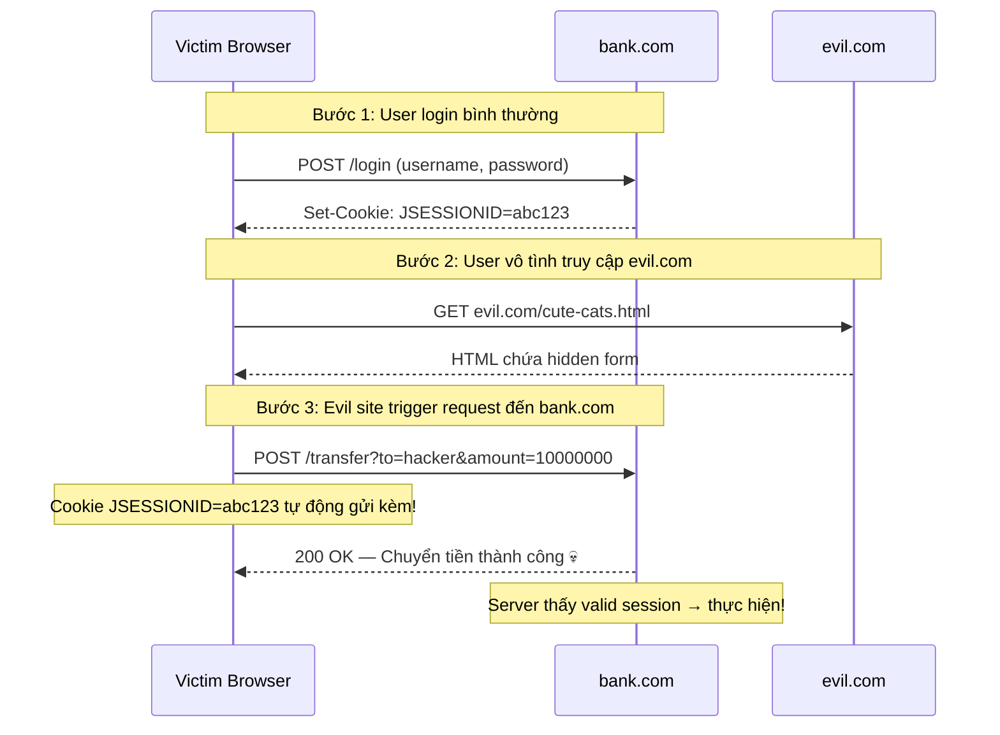

# CSRF là gì?

## ⚡ Tóm tắt ngắn (30s)
* **CSRF (Cross-Site Request Forgery)** — attacker lừa user thực hiện request không mong muốn trên site mà user đã login
* Exploit cơ chế **cookie tự động gửi theo request** — browser tự gắn cookie khi gửi request đến domain đó
* Chỉ ảnh hưởng **session-based auth** (cookie-based) — token-based auth dùng `Authorization` header thì miễn nhiễm
* Phòng chống: **CSRF token** (synchronizer token pattern), **SameSite cookie**, **double submit cookie**
* Spring Security **bật CSRF protection mặc định** — tắt nó đi mà không hiểu là tạo lỗ hổng nghiêm trọng

---

## 🔍 Chi tiết bản chất thực chiến

### Cách CSRF attack hoạt động



### Tại sao CSRF nguy hiểm?

**Cookie mechanism**: Browser **tự động** gắn cookie của domain vào mọi request gửi đến domain đó, bất kể request xuất phát từ đâu. Đây là feature, không phải bug — nhưng CSRF exploit chính feature này.

**Attacker KHÔNG cần:**
- Biết password của victim
- Đánh cắp session/cookie
- Inject code vào bank.com

**Attacker CHỈ CẦN:**
- Victim đang login bank.com (có valid session)
- Lừa victim mở một trang web chứa malicious form/request

### Các dạng CSRF attack phổ biến

**1. Hidden Form Submit:**
```html
<!-- evil.com -->
<form action="https://bank.com/transfer" method="POST" id="csrf-form">
    <input type="hidden" name="to" value="hacker-account"/>
    <input type="hidden" name="amount" value="10000000"/>
</form>
<script>document.getElementById('csrf-form').submit();</script>
```

**2. Image Tag (GET-based):**
```html

```

**3. XMLHttpRequest (limited by CORS):**
```javascript
// Bị CORS chặn response, nhưng request VẪN ĐƯỢC GỬI
fetch('https://bank.com/transfer', {
    method: 'POST',
    credentials: 'include', // Gửi cookie kèm
    body: 'to=hacker&amount=10000000'
});
```

---

## 💻 Code thực chiến: BAD vs GOOD

### ❌ BAD: Tắt CSRF mà không hiểu hậu quả
```java
@Configuration
@EnableWebSecurity
public class BadSecurityConfig {

    @Bean
    public SecurityFilterChain filterChain(HttpSecurity http) throws Exception {
        http
            // ❌ Tắt CSRF vì "nó gây lỗi 403 khi submit form"
            // Đây là lỗi cực kỳ phổ biến của junior dev
            .csrf(csrf -> csrf.disable())
            .formLogin(form -> form.defaultSuccessUrl("/dashboard"))
            .sessionManagement(session -> session
                .sessionCreationPolicy(SessionCreationPolicy.IF_REQUIRED));
            // ❌ Dùng session-based auth + tắt CSRF = lỗ hổng nghiêm trọng

        return http.build();
    }

    // ❌ Endpoint thay đổi state dùng GET method
    @GetMapping("/api/delete-account/{id}")
    public ResponseEntity<Void> deleteAccount(@PathVariable Long id) {
        // Attacker chỉ cần: 
        accountService.delete(id);
        return ResponseEntity.ok().build();
    }
}
```

---

### ✅ GOOD: CSRF protection đúng cách với Spring Security
```java
@Configuration
@EnableWebSecurity
public class SecureConfig {

    @Bean
    public SecurityFilterChain filterChain(HttpSecurity http) throws Exception {
        http
            .csrf(csrf -> csrf
                // ✅ Dùng CookieCsrfTokenRepository cho SPA frontend
                .csrfTokenRepository(CookieCsrfTokenRepository.withHttpOnlyFalse())
                // ✅ Bỏ qua CSRF cho public API endpoints (stateless JWT)
                .ignoringRequestMatchers("/api/public/**", "/api/webhook/**")
                // ✅ Custom handler cho CSRF failure
                .accessDeniedHandler((req, res, ex) -> {
                    res.setStatus(403);
                    res.getWriter().write("{\"error\":\"CSRF token missing or invalid\"}");
                }))
            .formLogin(form -> form.defaultSuccessUrl("/dashboard"))
            .sessionManagement(session -> session
                .sessionCreationPolicy(SessionCreationPolicy.IF_REQUIRED));

        return http.build();
    }
}

// ✅ Controller luôn dùng đúng HTTP method
@RestController
@RequestMapping("/api/account")
public class AccountController {

    // ✅ GET chỉ để đọc — an toàn, không thay đổi state
    @GetMapping("/{id}")
    public ResponseEntity<AccountDto> getAccount(@PathVariable Long id) {
        return ResponseEntity.ok(accountService.findById(id));
    }

    // ✅ POST/PUT/DELETE cho state-changing operations
    // Spring Security tự động validate CSRF token cho non-GET requests
    @DeleteMapping("/{id}")
    public ResponseEntity<Void> deleteAccount(@PathVariable Long id) {
        accountService.delete(id);
        return ResponseEntity.ok().build();
    }
}
```

### ✅ GOOD: Frontend gửi CSRF token
```java
// === Thymeleaf (SSR) — Tự động inject CSRF token ===
/*
<form th:action="@{/transfer}" method="post">
    <!-- Spring tự thêm hidden input: -->
    <!-- <input type="hidden" name="_csrf" value="token-value"/> -->
    <input type="text" name="to"/>
    <input type="number" name="amount"/>
    <button type="submit">Transfer</button>
</form>
*/

// === SPA (React/Angular) — Đọc CSRF cookie, gửi qua header ===
/*
// Cookie "XSRF-TOKEN" được set bởi CookieCsrfTokenRepository
// Frontend đọc cookie và gửi lại qua header "X-XSRF-TOKEN"

// Axios auto-handles:
axios.defaults.xsrfCookieName = 'XSRF-TOKEN';
axios.defaults.xsrfHeaderName = 'X-XSRF-TOKEN';

// Angular HttpClient tự xử lý — không cần config gì thêm
*/

// === Custom CSRF Token Filter cho advanced use cases ===
@Component
public class CsrfTokenResponseFilter extends OncePerRequestFilter {

    @Override
    protected void doFilterInternal(HttpServletRequest request,
                                     HttpServletResponse response,
                                     FilterChain chain) throws ServletException, IOException {
        // ✅ Đảm bảo CSRF token được load sẵn cho mọi request
        CsrfToken csrfToken = (CsrfToken) request.getAttribute("_csrf");
        if (csrfToken != null) {
            // Force token generation (lazy by default in Spring 6)
            csrfToken.getToken();
        }
        chain.doFilter(request, response);
    }
}
```

---

## 📊 Bảng so sánh các phương pháp chống CSRF

| Phương pháp | Cách hoạt động | Ưu điểm | Nhược điểm |
| :--- | :--- | :--- | :--- |
| **Synchronizer Token** | Server generate token, client gửi lại mỗi request | Standard, mạnh nhất | Cần server state |
| **Double Submit Cookie** | Set CSRF cookie + client gửi lại qua header | Stateless | Cookie có thể bị override (subdomain) |
| **SameSite Cookie** | Cookie chỉ gửi khi request same-origin | Đơn giản, không code thêm | Không phải browser nào cũng support cũ |
| **Custom Header** | Yêu cầu custom header (X-Requested-With) | Đơn giản | CORS preflight có thể bypass |
| **Origin/Referer Check** | Server check Origin header | Không cần token | Header có thể bị strip bởi proxy |

---

## ⚠️ Common Gotchas & Questions follow-up

### 1. Tại sao REST API stateless (JWT) không cần CSRF protection?
* CSRF exploit **cookie auto-send**. JWT gửi qua `Authorization: Bearer` header — browser **không** tự thêm header
* Attacker không thể tạo request từ evil.com mà có `Authorization` header của victim
* **Exception**: Nếu JWT được lưu trong cookie (thay vì header) → VẪN CẦN CSRF protection!

### 2. SameSite cookie có thay thế CSRF token không?
* `SameSite=Strict`: Chặn hoàn toàn cross-site request → an toàn nhưng UX kém (link từ email không mang cookie)
* `SameSite=Lax`: Cho phép GET cross-site → vẫn cần đảm bảo GET không thay đổi state
* Best practice: Dùng **cả SameSite + CSRF token** — defense in depth

### 3. CSRF vs XSS — khác nhau thế nào?
* **CSRF**: Lừa browser gửi request **hợp lệ** từ site khác. Attacker **không** đọc được response
* **XSS**: Inject script **chạy trong context** của target site. Attacker **đọc được** mọi thứ
* XSS có thể **bypass** CSRF protection (đọc CSRF token từ DOM) → XSS nguy hiểm hơn

### 4. Spring Security 6 thay đổi gì về CSRF?
* CSRF token **lazy generation** — chỉ generate khi `getToken()` được gọi
* `CsrfTokenRequestAttributeHandler` thay thế cách xử lý cũ
* Cần thêm filter để ensure token được load cho SPA (xem code ở trên)

### 5. Login endpoint có cần CSRF protection không?
* **Có!** Nếu không → attacker có thể CSRF login victim vào tài khoản attacker → victim nhập sensitive data → attacker đọc
* Gọi là **Login CSRF** — ít người biết nhưng real vulnerability
* Spring Security mặc định bảo vệ cả login endpoint
