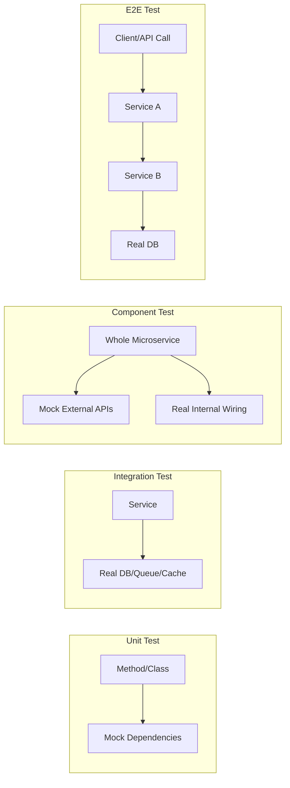

# Unit test, integration test, component test, end-to-end test khác nhau thế nào?

## ⚡ Tóm tắt ngắn (30s)
* **Unit test**: test một đơn vị logic nhỏ nhất (method/class), mock hết dependency, chạy cực nhanh (ms)
* **Integration test**: test sự tương tác giữa 2+ component thật (service + DB, service + API), cần infrastructure thật hoặc container
* **Component test**: test một module/microservice hoàn chỉnh trong isolation, mock external services nhưng dùng real internal wiring
* **End-to-end test**: test toàn bộ hệ thống từ UI/API đến DB, giống user thật sử dụng, chạy chậm nhất nhưng confidence cao nhất
* Trong thực tế, ranh giới giữa các loại test không cứng nhắc — điều quan trọng là **hiểu mục đích** và **trade-off** của từng loại

---

## 🔍 Chi tiết bản chất thực chiến

### Phân loại theo scope và mục đích



### Unit Test — Nền tảng vững chắc
Unit test kiểm tra **logic nghiệp vụ thuần túy** trong một class/method. Mọi dependency đều được mock. Mục tiêu: đảm bảo từng viên gạch đều chắc trước khi xây tường.

### Integration Test — Kiểm tra kết nối
Integration test đảm bảo các component **giao tiếp đúng** với nhau. Ví dụ: JPA repository thực sự lưu được vào DB, message producer gửi đúng format lên Kafka.

### Component Test — Kiểm tra module hoàn chỉnh
Component test (hay còn gọi **service test** trong microservice) boot cả Spring context, dùng real bean wiring, nhưng mock external dependency (3rd-party API, other microservices). Rất phổ biến với `@SpringBootTest` + WireMock.

### End-to-End Test — Góc nhìn người dùng
E2E test chạy toàn bộ hệ thống thật. Trong microservice, thường dùng Docker Compose hoặc Kubernetes test environment. Chạy chậm, flaky, nhưng cho **confidence cao nhất**.

---

## 💻 Code thực chiến: Các loại test trong Spring Boot

### ❌ BAD: Gộp tất cả vào integration test, không phân tầng

```java
// BAD: Boot toàn bộ Spring context chỉ để test business logic đơn giản
@SpringBootTest // nặng nề, chạy 10-30s chỉ để test 1 method
@AutoConfigureMockMvc
class OrderServiceTest {
    @Autowired
    private OrderService orderService;

    @Test
    void shouldCalculateDiscount() {
        // Logic thuần túy nhưng phải đợi Spring boot context
        Order order = new Order(100.0);
        double result = orderService.calculateDiscount(order, 10);
        assertEquals(90.0, result);
    }
}
```

---

### ✅ GOOD: Phân tầng test rõ ràng

```java
// ========== 1. UNIT TEST — chạy trong ~5ms ==========
class OrderServiceUnitTest {
    // Mock tất cả dependency
    private final OrderRepository orderRepo = mock(OrderRepository.class);
    private final InventoryClient inventoryClient = mock(InventoryClient.class);
    private final OrderService service = new OrderService(orderRepo, inventoryClient);

    @Test
    void shouldApplyDiscountCorrectly() {
        Order order = new Order(100.0);
        double result = service.calculateDiscount(order, 10);
        assertEquals(90.0, result);
    }

    @Test
    void shouldRejectNegativeDiscount() {
        assertThrows(InvalidDiscountException.class,
            () -> service.calculateDiscount(new Order(100.0), -5));
    }
}

// ========== 2. INTEGRATION TEST — test với DB thật ==========
@DataJpaTest // chỉ load JPA slice, không load toàn bộ context
@Testcontainers
class OrderRepositoryIntegrationTest {
    @Container
    static PostgreSQLContainer<?> pg = new PostgreSQLContainer<>("postgres:15");

    @DynamicPropertySource
    static void dbProps(DynamicPropertyRegistry registry) {
        registry.add("spring.datasource.url", pg::getJdbcUrl);
        registry.add("spring.datasource.username", pg::getUsername);
        registry.add("spring.datasource.password", pg::getPassword);
    }

    @Autowired
    private OrderRepository orderRepository;

    @Test
    void shouldPersistAndFindOrder() {
        Order order = new Order("ORD-001", 250.0, OrderStatus.CREATED);
        orderRepository.save(order);

        Optional<Order> found = orderRepository.findByOrderCode("ORD-001");
        assertThat(found).isPresent()
            .hasValueSatisfying(o -> assertThat(o.getAmount()).isEqualTo(250.0));
    }
}

// ========== 3. COMPONENT TEST — test microservice hoàn chỉnh ==========
@SpringBootTest(webEnvironment = SpringBootTest.WebEnvironment.RANDOM_PORT)
@Testcontainers
@AutoConfigureWireMock(port = 0) // mock external inventory service
class OrderComponentTest {
    @Container
    static PostgreSQLContainer<?> pg = new PostgreSQLContainer<>("postgres:15");

    @Autowired
    private TestRestTemplate restTemplate;

    @Test
    void shouldCreateOrderEndToEnd() {
        // Stub external inventory service
        stubFor(get(urlPathEqualTo("/api/inventory/SKU-001"))
            .willReturn(okJson("{\"available\": true, \"quantity\": 50}")));

        // Call our service's REST API
        CreateOrderRequest request = new CreateOrderRequest("SKU-001", 2);
        ResponseEntity<OrderResponse> response = restTemplate
            .postForEntity("/api/orders", request, OrderResponse.class);

        assertThat(response.getStatusCode()).isEqualTo(HttpStatus.CREATED);
        assertThat(response.getBody().getStatus()).isEqualTo("CREATED");
    }
}

// ========== 4. E2E TEST — test cross-service (thường dùng Karate/RestAssured) ==========
// Thường chạy trên staging environment với Docker Compose
class OrderE2ETest {
    @Test
    void shouldCompleteFullOrderFlow() {
        // Gọi API thật qua gateway
        given()
            .baseUri("http://localhost:8080")
            .body(new CreateOrderRequest("SKU-001", 2))
            .contentType(ContentType.JSON)
        .when()
            .post("/api/orders")
        .then()
            .statusCode(201)
            .body("status", equalTo("CREATED"));

        // Verify payment service processed (polling hoặc wait)
        await().atMost(Duration.ofSeconds(10)).until(() ->
            given().baseUri("http://localhost:8080")
                .get("/api/orders/{id}/status", orderId)
                .then().extract().path("status").equals("PAID")
        );
    }
}
```

---

## 📊 Bảng so sánh các loại test

| Tiêu chí | Unit Test | Integration Test | Component Test | E2E Test |
| :--- | :--- | :--- | :--- | :--- |
| **Scope** | 1 class/method | 2+ component | 1 service hoàn chỉnh | Toàn hệ thống |
| **Dependencies** | Tất cả mock | Một số thật (DB, MQ) | External mock, internal real | Tất cả thật |
| **Tốc độ** | ~5ms | ~1-5s | ~5-30s | ~30s-5min |
| **Confidence** | Logic đúng | Kết nối đúng | Service hoạt động đúng | Hệ thống đúng |
| **Flakiness** | Gần 0% | Thấp | Trung bình | Cao |
| **Annotation** | Không cần Spring | `@DataJpaTest`, Slice | `@SpringBootTest` | External framework |
| **Tỉ lệ nên có** | 70% | 20% | ~8% | ~2% |
| **Ai viết** | Dev | Dev | Dev/QA | QA/DevOps |

---

## ⚠️ Common Gotchas & Questions follow-up

### 1. "Component test khác integration test chỗ nào?"
* **Integration test** focus vào **ranh giới kỹ thuật** (code ↔ DB, code ↔ MQ)
* **Component test** focus vào **business behavior** của cả module — boot full service, gọi API, verify kết quả
* Nhiều team dùng 2 thuật ngữ này thay thế nhau — quan trọng là hiểu **scope** và **mục đích**

### 2. "@SpringBootTest vs @DataJpaTest vs @WebMvcTest"
* `@SpringBootTest`: load full context → component test
* `@DataJpaTest`: chỉ load JPA slice → integration test cho repository
* `@WebMvcTest`: chỉ load web layer → unit test cho controller
* Dùng đúng slice test giúp **giảm thời gian chạy 5-10x**

### 3. "E2E test hay bị flaky, xử lý sao?"
* Dùng **retry mechanism** (JUnit `@RepeatedTest` hoặc CI retry)
* Tránh hard-coded `Thread.sleep()` — dùng **polling/await** (Awaitility)
* Quarantine flaky test — track và fix riêng, đừng để ảnh hưởng pipeline
* Giữ số lượng E2E test **ít nhất có thể** — chỉ cover critical user journey

### 4. "Testcontainers có phải integration test không?"
* Testcontainers là **tool**, không phải loại test
* Dùng Testcontainers cho integration test (DB thật) hoặc component test (DB + full service)
* Ưu điểm: reproducible, isolated, chạy trên CI dễ dàng
* Nhược điểm: cần Docker, chậm hơn H2 in-memory
