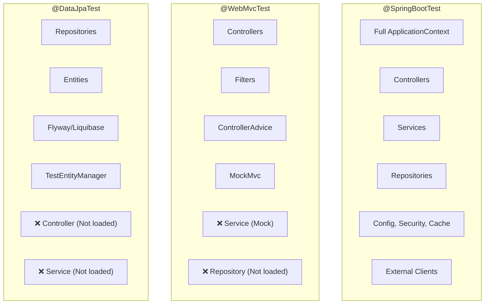

# Spring Boot test annotation phổ biến: @SpringBootTest, @WebMvcTest, @DataJpaTest

## ⚡ Tóm tắt ngắn (30s)
* **`@SpringBootTest`**: Load **toàn bộ** ApplicationContext → dùng cho integration test, test end-to-end flow
* **`@WebMvcTest`**: Chỉ load **Web layer** (Controller, Filter, ControllerAdvice) → test API endpoint mà không cần DB, Service thật
* **`@DataJpaTest`**: Chỉ load **JPA layer** (Repository, Entity, Flyway) → test query logic trên DB thật/H2
* **Nguyên tắc**: Dùng annotation **hẹp nhất có thể** → test nhanh hơn, focused hơn, dễ debug hơn
* Các annotation này là **test slice** — Spring Boot chỉ load phần cần thiết thay vì toàn bộ application

---

## 🔍 Chi tiết bản chất thực chiến

### Test Slice Architecture



### Bao nhiêu bean được load?

| Annotation | Beans loaded | Startup time | Use case |
| :--- | :--- | :--- | :--- |
| `@SpringBootTest` | **Tất cả** (~200-500 beans) | 5-15s | Integration test |
| `@WebMvcTest` | **~20-30 beans** (web only) | 1-3s | Controller test |
| `@DataJpaTest` | **~30-50 beans** (JPA only) | 2-4s | Repository test |
| `@JsonTest` | **~10 beans** | <1s | Serialization test |
| `@RestClientTest` | **~15 beans** | 1-2s | REST client test |

---

## 💻 Code thực chiến: BAD vs GOOD

### ❌ BAD: Dùng @SpringBootTest cho mọi thứ

```java
// ❌ Load TOÀN BỘ context chỉ để test 1 controller method
// Startup 10s, cần database connection, cần Redis, cần Kafka...
@SpringBootTest(webEnvironment = SpringBootTest.WebEnvironment.RANDOM_PORT)
class OrderControllerTest {

    @Autowired
    private TestRestTemplate restTemplate;

    @MockBean
    private OrderService orderService; // Mock service nhưng vẫn load toàn bộ context

    @Test
    void shouldReturnOrder() {
        when(orderService.getById(1L))
                .thenReturn(new OrderDto(1L, "ORD-001", BigDecimal.TEN));

        // ❌ Tốn 10s startup chỉ để test 1 endpoint
        // ❌ Nếu có 50 controller tests → 50 * 10s = 500s chỉ riêng startup
        ResponseEntity<OrderDto> response = restTemplate
                .getForEntity("/api/orders/1", OrderDto.class);

        assertThat(response.getStatusCode()).isEqualTo(HttpStatus.OK);
    }
}
```

---

### ✅ GOOD: @WebMvcTest — chỉ test Web layer

```java
@WebMvcTest(OrderController.class) // ✅ Chỉ load OrderController + web components
class OrderControllerTest {

    @Autowired
    private MockMvc mockMvc; // ✅ Không cần server thật, test qua MockMvc

    @MockBean
    private OrderService orderService; // ✅ Mock service — không cần DB

    @Test
    void shouldReturnOrderById() throws Exception {
        // Arrange
        OrderDto order = new OrderDto(1L, "ORD-001", new BigDecimal("99.99"));
        when(orderService.getById(1L)).thenReturn(order);

        // Act & Assert — ✅ Startup ~1s, test request/response mapping
        mockMvc.perform(get("/api/orders/1")
                        .accept(MediaType.APPLICATION_JSON))
                .andExpect(status().isOk())
                .andExpect(jsonPath("$.id").value(1))
                .andExpect(jsonPath("$.orderNumber").value("ORD-001"))
                .andExpect(jsonPath("$.amount").value(99.99));
    }

    @Test
    void shouldReturn400ForInvalidRequest() throws Exception {
        // ✅ Test validation logic — @Valid annotations
        mockMvc.perform(post("/api/orders")
                        .contentType(MediaType.APPLICATION_JSON)
                        .content("""
                            {
                                "userId": null,
                                "items": []
                            }
                            """))
                .andExpect(status().isBadRequest())
                .andExpect(jsonPath("$.errors").isArray());
    }

    @Test
    void shouldReturn404WhenOrderNotFound() throws Exception {
        // ✅ Test exception handling — @ControllerAdvice
        when(orderService.getById(999L))
                .thenThrow(new OrderNotFoundException(999L));

        mockMvc.perform(get("/api/orders/999"))
                .andExpect(status().isNotFound())
                .andExpect(jsonPath("$.message").value("Order not found: 999"));
    }
}
```

---

### ✅ GOOD: @DataJpaTest — test repository queries

```java
@DataJpaTest // ✅ Chỉ load JPA components + embedded DB (hoặc Testcontainers)
@AutoConfigureTestDatabase(replace = AutoConfigureTestDatabase.Replace.NONE)
@Testcontainers
class OrderRepositoryTest {

    @Container
    @ServiceConnection
    static PostgreSQLContainer<?> postgres =
            new PostgreSQLContainer<>("postgres:16-alpine");

    @Autowired
    private OrderRepository orderRepository;

    @Autowired
    private TestEntityManager entityManager; // ✅ JPA helper cho test

    @Test
    void shouldFindOrdersByStatus() {
        // Arrange — insert test data
        entityManager.persist(Order.builder()
                .orderNumber("ORD-001").status(OrderStatus.PENDING).build());
        entityManager.persist(Order.builder()
                .orderNumber("ORD-002").status(OrderStatus.COMPLETED).build());
        entityManager.persist(Order.builder()
                .orderNumber("ORD-003").status(OrderStatus.PENDING).build());
        entityManager.flush();

        // Act — ✅ Test query logic trên PostgreSQL thật
        List<Order> pendingOrders = orderRepository.findByStatus(OrderStatus.PENDING);

        // Assert
        assertThat(pendingOrders).hasSize(2);
        assertThat(pendingOrders).extracting(Order::getOrderNumber)
                .containsExactlyInAnyOrder("ORD-001", "ORD-003");
    }

    @Test
    void shouldCalculateTotalRevenue() {
        // ✅ Test native query / aggregation — cần DB thật
        entityManager.persist(Order.builder()
                .amount(new BigDecimal("100.00")).status(OrderStatus.COMPLETED).build());
        entityManager.persist(Order.builder()
                .amount(new BigDecimal("250.50")).status(OrderStatus.COMPLETED).build());
        entityManager.flush();

        BigDecimal total = orderRepository.calculateTotalRevenue(OrderStatus.COMPLETED);

        assertThat(total).isEqualByComparingTo("350.50");
    }
}
```

---

### ✅ GOOD: @SpringBootTest — chỉ khi cần full integration

```java
@SpringBootTest(webEnvironment = SpringBootTest.WebEnvironment.RANDOM_PORT)
@Testcontainers
class OrderFlowIntegrationTest {

    @Container
    @ServiceConnection
    static PostgreSQLContainer<?> postgres =
            new PostgreSQLContainer<>("postgres:16-alpine");

    @Autowired
    private TestRestTemplate restTemplate;

    // ✅ Dùng @SpringBootTest khi cần test TOÀN BỘ flow:
    // Controller → Service → Repository → DB
    @Test
    void shouldCreateAndRetrieveOrder() {
        // Create order
        CreateOrderRequest request = new CreateOrderRequest(1L,
                List.of(new OrderItem("ITEM-001", 2)));

        ResponseEntity<OrderDto> createResponse = restTemplate
                .postForEntity("/api/orders", request, OrderDto.class);

        assertThat(createResponse.getStatusCode()).isEqualTo(HttpStatus.CREATED);
        Long orderId = createResponse.getBody().getId();

        // Retrieve order — verify full persistence flow
        ResponseEntity<OrderDto> getResponse = restTemplate
                .getForEntity("/api/orders/" + orderId, OrderDto.class);

        assertThat(getResponse.getStatusCode()).isEqualTo(HttpStatus.OK);
        assertThat(getResponse.getBody().getOrderNumber()).isNotBlank();
    }
}
```

---

## 📊 Bảng so sánh chi tiết các annotation

| Tiêu chí | @SpringBootTest | @WebMvcTest | @DataJpaTest |
| :--- | :--- | :--- | :--- |
| **Load scope** | Full context | Web layer only | JPA layer only |
| **Controllers** | ✅ | ✅ (specified) | ❌ |
| **Services** | ✅ | ❌ (need @MockBean) | ❌ |
| **Repositories** | ✅ | ❌ | ✅ |
| **Security filters** | ✅ | ✅ | ❌ |
| **MockMvc** | Need @AutoConfigureMockMvc | ✅ Auto-configured | ❌ |
| **TestEntityManager** | ❌ | ❌ | ✅ Auto-configured |
| **@Transactional** | ❌ (manual) | N/A | ✅ (auto-rollback) |
| **Embedded DB** | ❌ (manual) | N/A | ✅ (default H2) |
| **Startup time** | 5-15s | 1-3s | 2-4s |
| **Best for** | Integration test | Controller + validation | Query + repository |

---

## ⚠️ Common Gotchas & Questions follow-up

### 1. "@WebMvcTest không load Security config — test 401?"
* `@WebMvcTest` **CÓ** load Security auto-configuration → request bị 401 nếu không config
* **Solution**: Thêm `@WithMockUser` hoặc `@AutoConfigureMockMvc(addFilters = false)` để skip security
* Hoặc `@Import(SecurityConfig.class)` để load security config cụ thể

### 2. "@DataJpaTest tự rollback — data không thấy?"
* `@DataJpaTest` mặc định `@Transactional` → **auto-rollback** sau mỗi test method
* Nếu cần verify data persist thật: thêm `@Commit` hoặc `@Rollback(false)`
* **Best practice**: Để auto-rollback mặc định → test isolation

### 3. "Context caching — tại sao test thứ 2 nhanh hơn?"
* Spring Boot **cache ApplicationContext** giữa các test class có cùng configuration
* Test class cùng annotation + cùng config → **reuse context** → không restart
* `@MockBean` **phá cache** — mỗi combination MockBean khác nhau tạo context mới
* **Tip**: Group test classes có cùng MockBean setup để tối ưu context caching

### 4. "Có annotation nào khác không?"
* `@JsonTest`: Test JSON serialization/deserialization (ObjectMapper)
* `@RestClientTest`: Test RestTemplate/WebClient với MockRestServiceServer
* `@WebFluxTest`: Tương tự `@WebMvcTest` nhưng cho WebFlux reactive
* `@JdbcTest`: Test JDBC queries (không JPA, thuần SQL)
* `@JooqTest`: Test jOOQ queries

### 5. "Khi nào dùng @MockBean vs @Mock?"
* `@MockBean`: Thay thế bean trong **Spring ApplicationContext** → dùng trong `@WebMvcTest`, `@SpringBootTest`
* `@Mock` (Mockito): Tạo mock **ngoài Spring context** → dùng trong unit test thuần (`@ExtendWith(MockitoExtension.class)`)
* **Rule**: Nếu test có `@...Test` annotation (Spring) → `@MockBean`. Nếu unit test thuần → `@Mock`
