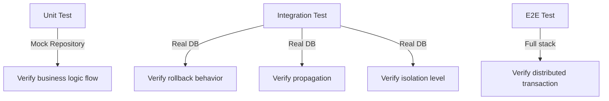

# Làm sao test transaction logic?

## ⚡ Tóm tắt ngắn (30s)
* Transaction logic cần test ở **2 tầng**: unit test verify logic nghiệp vụ (mock repository), integration test verify transaction boundary thực sự (rollback, propagation)
* Dùng **@DataJpaTest** hoặc **@SpringBootTest** với **embedded DB** (H2/Testcontainers) để test rollback khi exception xảy ra
* Quan trọng nhất: test **rollback scenario** — đảm bảo khi step 2 fail thì step 1 cũng rollback
* Cẩn thận với **@Transactional trên test class** — nó auto-rollback mọi thứ, che giấu bug propagation thực tế

---

## 🔍 Chi tiết bản chất thực chiến

### Tại sao test transaction logic khó?
Transaction logic khác biệt so với logic thuần túy vì nó phụ thuộc vào **infrastructure**: database, connection pool, transaction manager. Unit test thuần không thể verify rollback thật sự — cần integration test với DB thật (hoặc embedded).

### Chiến lược test theo tầng



### Các scenario cần test
1. **Happy path**: tất cả operations thành công, data persist đúng
2. **Rollback on exception**: khi RuntimeException xảy ra giữa chừng, tất cả changes đều rollback
3. **Checked exception**: mặc định Spring **không rollback** cho checked exception — phải verify
4. **Propagation**: `REQUIRES_NEW` tạo transaction mới, `MANDATORY` yêu cầu có sẵn transaction
5. **Read-only transaction**: verify không cho phép write operations

---

## 💻 Code thực chiến: BAD vs GOOD

### ❌ BAD: Test @Transactional trên test class che giấu bug

```java
@SpringBootTest
@Transactional // ⚠️ Auto-rollback mọi test — che giấu bug rollback thực tế!
class OrderServiceTest {

    @Autowired
    private OrderService orderService;
    @Autowired
    private OrderRepository orderRepository;
    @Autowired
    private PaymentRepository paymentRepository;

    @Test
    void testCreateOrder_shouldRollbackOnPaymentFailure() {
        // Test này LUÔN PASS vì @Transactional trên class auto-rollback
        // Không thể verify rằng service thực sự rollback khi exception xảy ra
        assertThrows(PaymentException.class, () ->
            orderService.createOrderWithPayment(new OrderRequest("item1", -100))
        );

        // Check này vô nghĩa — data đã bị rollback bởi test framework
        assertEquals(0, orderRepository.count());
    }
}
```

---

### ✅ GOOD: Test rollback thực sự không dùng @Transactional trên test

```java
@SpringBootTest
// KHÔNG có @Transactional ở đây — để transaction behavior tự nhiên
class OrderServiceTransactionTest {

    @Autowired
    private OrderService orderService;
    @Autowired
    private OrderRepository orderRepository;
    @Autowired
    private PaymentRepository paymentRepository;

    @AfterEach
    void cleanup() {
        paymentRepository.deleteAll();
        orderRepository.deleteAll();
    }

    // ✅ Test 1: Happy path — data persist thành công
    @Test
    void createOrder_success_shouldPersistBothOrderAndPayment() {
        OrderRequest request = new OrderRequest("laptop", 1500);

        OrderResult result = orderService.createOrderWithPayment(request);

        assertNotNull(result.getOrderId());
        assertEquals(1, orderRepository.count());
        assertEquals(1, paymentRepository.count());
        
        Order savedOrder = orderRepository.findById(result.getOrderId()).orElseThrow();
        assertEquals("laptop", savedOrder.getItemName());
    }

    // ✅ Test 2: Rollback scenario — cả order và payment đều rollback
    @Test
    void createOrder_paymentFails_shouldRollbackOrder() {
        OrderRequest request = new OrderRequest("laptop", -100); // trigger payment failure

        assertThrows(PaymentException.class, () ->
            orderService.createOrderWithPayment(request)
        );

        // Verify THỰC SỰ rollback — không có data nào persist
        assertEquals(0, orderRepository.count(), "Order should be rolled back");
        assertEquals(0, paymentRepository.count(), "Payment should be rolled back");
    }

    // ✅ Test 3: Checked exception KHÔNG rollback (default Spring behavior)
    @Test
    void createOrder_checkedExceptionThrown_shouldNotRollback() {
        OrderRequest request = new OrderRequest("laptop", 1500);
        // Giả sử service throw checked exception SAU khi save

        try {
            orderService.createOrderWithNotification(request); // throws NotificationException (checked)
        } catch (NotificationException e) {
            // expected
        }

        // ⚠️ Spring mặc định KHÔNG rollback cho checked exception
        assertEquals(1, orderRepository.count(), "Order should NOT be rolled back for checked exception");
    }

    // ✅ Test 4: REQUIRES_NEW propagation — inner transaction commit độc lập
    @Test
    void auditLog_withRequiresNew_shouldPersistEvenIfOuterRollbacks() {
        assertThrows(PaymentException.class, () ->
            orderService.createOrderWithAuditLog(new OrderRequest("laptop", -100))
        );

        // Order rollback, nhưng audit log vẫn persist (REQUIRES_NEW)
        assertEquals(0, orderRepository.count());
        assertTrue(auditLogRepository.count() > 0, 
            "Audit log with REQUIRES_NEW should persist even when outer tx rollbacks");
    }
}
```

### ✅ Service code tương ứng

```java
@Service
@RequiredArgsConstructor
public class OrderService {

    private final OrderRepository orderRepository;
    private final PaymentRepository paymentRepository;
    private final AuditLogService auditLogService;

    @Transactional // rollbackFor = RuntimeException.class (default)
    public OrderResult createOrderWithPayment(OrderRequest request) {
        Order order = orderRepository.save(new Order(request.getItemName()));
        
        // Nếu payment fail → RuntimeException → rollback cả order
        paymentRepository.save(new Payment(order.getId(), request.getAmount()));
        
        return new OrderResult(order.getId());
    }

    @Transactional(propagation = Propagation.REQUIRES_NEW)
    public void saveAuditLog(String action, String detail) {
        auditLogRepository.save(new AuditLog(action, detail));
    }
}
```

---

## 📊 Bảng so sánh chiến lược test Transaction

| Tiêu chí | Unit Test (Mock) | @DataJpaTest (H2) | @SpringBootTest (Testcontainers) |
| :--- | :--- | :--- | :--- |
| Tốc độ | ⚡ Rất nhanh | 🔶 Nhanh | 🐢 Chậm |
| Verify rollback thật | ❌ Không thể | ✅ Có | ✅ Có (chính xác nhất) |
| Verify propagation | ❌ Không thể | ✅ Có | ✅ Có |
| Verify isolation level | ❌ Không thể | ⚠️ H2 khác behavior | ✅ Giống production |
| DB-specific behavior | ❌ N/A | ⚠️ H2 != PostgreSQL | ✅ Chính xác |
| CI/CD friendly | ✅ | ✅ | ⚠️ Cần Docker |

---

## ⚠️ Common Gotchas & Questions follow-up

### 1. @Transactional trên test class auto-rollback
* **Problem**: Spring test framework đặt `@Transactional` trên test method → tự động rollback sau mỗi test
* **Consequence**: Không thể verify rollback behavior thực sự của service — test LUÔN PASS dù service thiếu `@Transactional`
* **Solution**: Bỏ `@Transactional` trên test class, dùng `@AfterEach` cleanup thủ công

### 2. Self-invocation bypass proxy
* **Problem**: Gọi method `@Transactional` từ method khác trong cùng class → bypass AOP proxy → không có transaction
* **Consequence**: Data inconsistency, không rollback
* **Solution**: Tách method ra service riêng, hoặc inject `self` qua `ApplicationContext`

### 3. Checked exception không rollback
* **Problem**: Mặc định Spring chỉ rollback cho `RuntimeException` và `Error`
* **Consequence**: Checked exception throw nhưng data vẫn commit
* **Solution**: Dùng `@Transactional(rollbackFor = Exception.class)` để rollback cho mọi exception

### 4. H2 vs Production DB behavior khác nhau
* **Problem**: H2 xử lý isolation level, locking, constraint khác PostgreSQL/MySQL
* **Consequence**: Test pass trên H2 nhưng fail trên production
* **Solution**: Dùng **Testcontainers** để chạy đúng DB engine production

### 5. LazyInitializationException trong test
* **Problem**: Access lazy-loaded collection ngoài transaction boundary
* **Consequence**: `LazyInitializationException` chỉ xảy ra khi KHÔNG có `@Transactional` trên test
* **Solution**: Dùng `@EntityGraph` hoặc `JOIN FETCH` trong query, hoặc test trong transaction scope đúng cách
